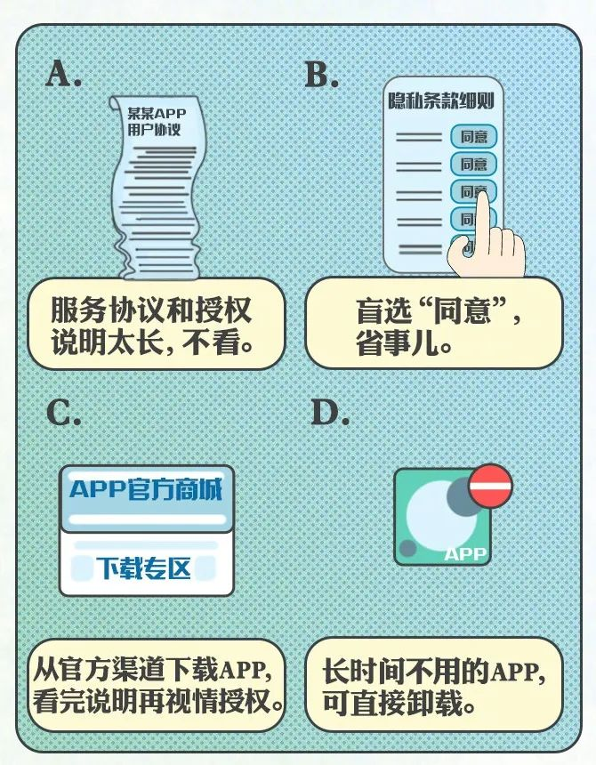
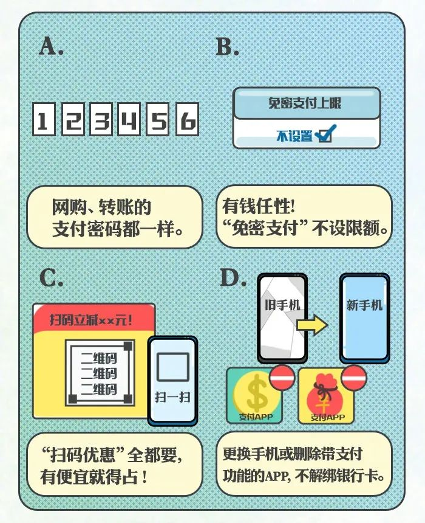
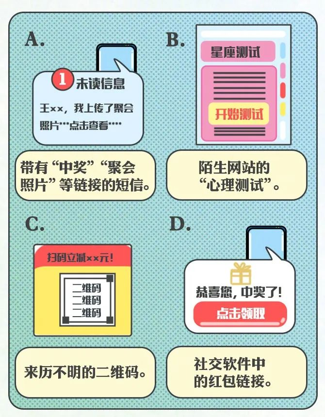
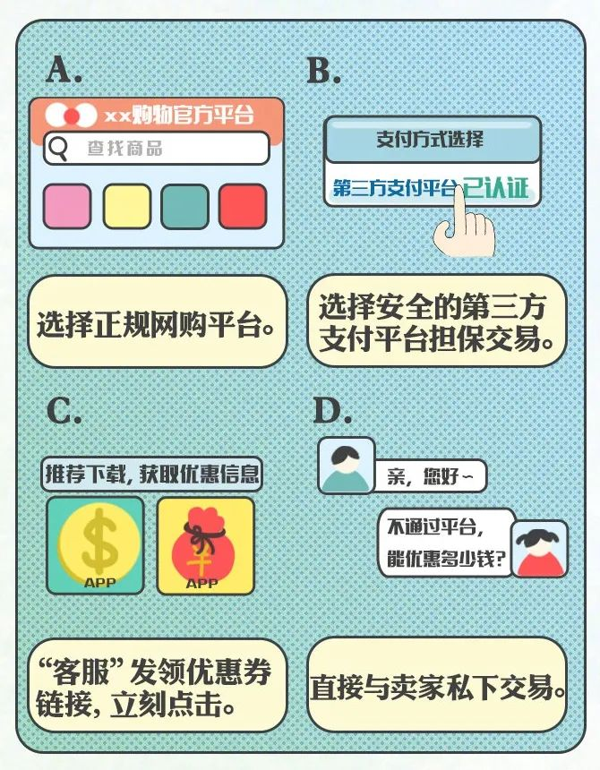
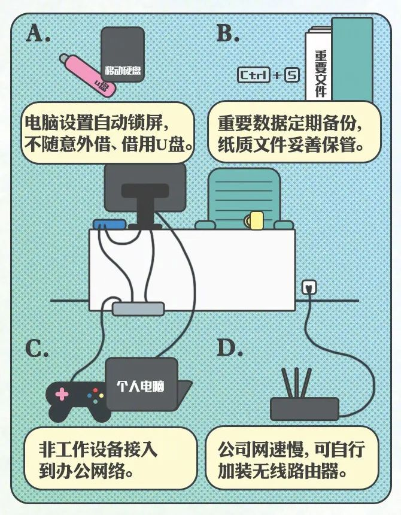
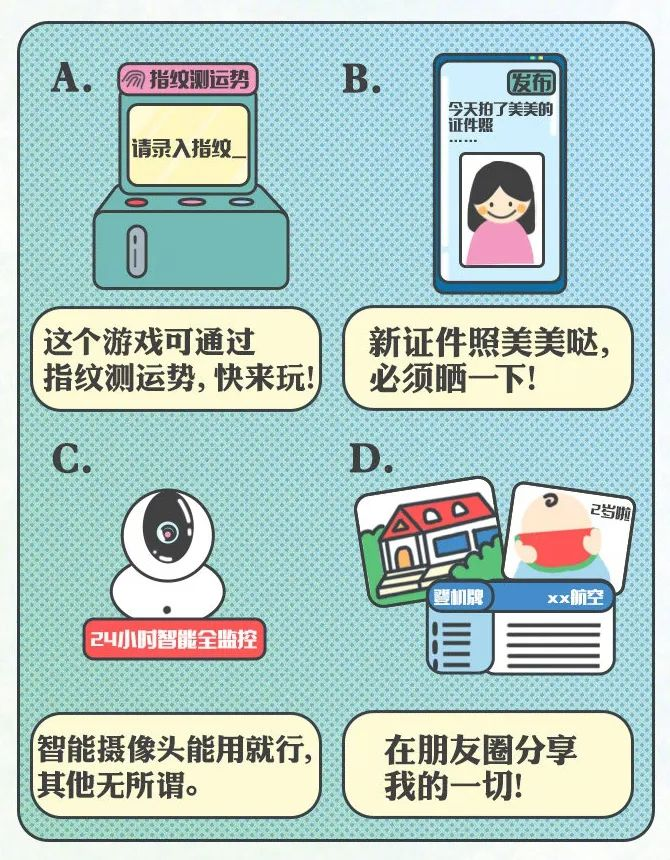

## 试题

1、《中华人民共和国网络安全法》自___日起开始实施。

A.2016年1月7日

B.2016年11月7日

C.2017年5月1日

**D.2017年6月1日**

2、2021年网络安全宣传周是第几届国家网络安全宣传周？

A.第五届

B.第六届

C.第七届

**D.第八届**

3、2021年网络安全宣传周的宣传主题是？

A.共建网络安全，共享网络文明

**B.网络安全为人民，网络安全靠人民**

C.增强防范意识，提高网络安全知识

D.网络安全人人有责

4、中央网络安全和信息化领导小组的组长是？

**A.习近平**

B.李克强

C.刘云山

D.周小川

5、2021年网络安全宣传周的开幕时间是哪天？

**A.10月11日**

B.10月12日

C.10月13日

D.10月14日

6、《网络安全法》立法的主要目的是？

A.维护网络空间主权和国家安全、社会公共利益

**B.保障网络安全**

C.保护公民、法人和其他组织的合法权益

D.促进经济社会化信息化健康发展

7、2021年网络安全宣传周在哪个城市举办？

A.北京

**B.西安**

C.上海

D.杭州

8、首届国家网络安全宣传周启动仪式是什么时候？

A.2014年8月15日

B.2014年9月10日

C.2014年10月1日

**D.2014年11月24日**

9、国家（ ）负责统筹协调网络安全工作和相关监督管理工作。

A.公安部门

**B.网信部门**

C.工业和信息化部门

D.通讯管理部门

10、下列关于计算机木马的说法错误的是？

A.Word文档也会感染木马

B.尽量访问知名网站能减少感染木马的概率

C.杀毒软件对防治木马病毒泛滥有重要作用

**D.只要不访问互联网，就能避免受到木马侵害**

11、对于青少年而言，日常上网过程中，下列选项中存在安全风险的行为是？

A.将电脑开机密码设置成复杂的15位密码

**B.安装盗版的操作系统**

C.在QQ聊天过程中不点击任何不明链接

D.避免在不同网站使用相同用户名和口令

12、下列关于密码安全的描述，不正确的是？

A.容易被记住的密码不一定不安全

**B.超过12位的密码很安全**

C.密码定期更换

D.密码中使用的字符种类越多越不易被猜中

13、计算机病毒是计算机系统中一类隐藏在（ ）上蓄意破坏的捣乱程序。

A.内存

B.U盘

**C.存储介质**

D.网络

14、首届国家网络安全宣传周是在什么地方举行？

A.北京

B.上海

C.武汉

**D.南昌**

15、任何组织和个人未经电子信息接受者同意或者请求，或者电子信息接受者明确表示拒绝的，不得向其固定电话、移动电话或者个人电子邮箱发送（ ）。

A.短信

B.邮件

**C.商业广告**

D.彩信

16、下列密码中，最安全的是？

A.跟用户名相同的密码

B.身份证后6位作为密码

C.重复的8位数密码

**D.10位的综合型密码**

17、电脑中安装哪种软件，可以减少病毒、特洛伊木马程序和蠕虫的侵害？

A.VPN软件

**B.杀毒软件**

C.备份软件

D.安全风险预测软件

18、对于人肉搜索，应持有什么样的态度？

A.主动参加

B.关注进程

C.积极转发

**D.不转发，不参与**

19、注册或者浏览社交类网站时，不恰当的做法是？

A.尽量不要填写过于详细的个人资料

B.不要轻易加社交网站好友

C.充分利用社交网站的安全机制

**D.信任他人转载的信息**

20、我们在日常生活和工作中，为什么需要定期修改电脑、邮箱、网站的各类密码？

A.遵循国家的安全法律

B.降低电脑受损的几率

C.确保不会忘掉密码

**D.确保个人数据和隐私安全**

## 试题

1、用手机时如何安全使用公共WiFi？

A、免费且没密码，不蹭白不蹭

B、直接用，“买买买”、刷微博无压力

C、关闭自动链接，使用软件检测后使用

D、不用，有流量就是人性！

正确答案：C、D

防御宝典

手机开启自动连接WiFi，会增加误连钓鱼WiFi的几率。公共网络环境下，尽量不使用来源不明的WiFi，不网购或登录社交网络，尽量使用手机自带的移动数据流量。

网络安全周2021/10/11-17

2、安装APP时，要求用户授予权限，咋办？

A、服务协议和授权说明太长，不看

B、盲选“同意”，省事儿

C、从官方渠道下载APP，看完说明再视情授权

D、长时间不用的APP，可直接卸载

正确答案：C

防御宝典

安装或首次打开APP时，需认真阅读其要求的权限，仅授予必要的权限，后续需要时可通过系统设置手动开启。APP卸载前，切记注销账户、清除数据。

网络安全周2021/10/11-17

3、使用移动支付时，哪些是不良习惯?

A、网购、转载的支付密码都一样

B、有钱任性！“免密支付”不设限额

C、“扫码优惠”全都要，有便宜就得占！

D、更换手机或删除带支付功能的APP，不解绑银行卡

正确答案：A、B、C、D

防御宝典

给手机设置解锁和支付密码。不扫描没有安全保障的二维码。开通免密支付或自动扣款等业务前仔细阅读相关条款。手机遗失或账号被盗，应及时采取措施（如修改密码等），并向支付平台反映，同时做好证据留存。

网络安全周2021/10/11-17

4、下列哪些内容可能藏有病毒?

A、带有“中奖”“聚会照片”等链接的短信

B、陌生网站的“心理测试”

C、来历不明的二维码

D、社交软件中的红包链接

正确答案：A、B、C、D

防御宝典

短信内容涉及网址的，如不确定短信发送者，尽量不点。不轻易点击社交软件中不明来源的链接，不扫描没有安全保障的二维码。如发现异常，要紧急冻结或挂失手机上涉及到财产的账户，并将手机交由专 业人员维护。

网络安全周2021/10/11-17

5、在网上“买买买”，怎样做才安全?

A、选择正规网购平台

B、选择安全的第三方支付平台担保交易

C、“客服”发领优惠券链接，立刻点击

D、直接与卖家私下交易

正确答案：A、B

防御宝典

到知名、权威的网站购物，使用平台提供的交流系统进行沟通和交易，切忌直接与卖家私下交易。注意商家的信誉、评价，不贪小便宜，不轻信低价推销广告，不点陌生链接。

网络安全周2021/10/11-17

6、工作中，下列哪些行为是正确的？

A、电脑设置自动锁屏，不随意外借、借用Ｕ盘

B、重要数据定期备份，纸质文件妥善保管

C、非工作设备接入到办公网络

D、公司网速慢，可自行加装无线路由器

正确答案：A、B

防御宝典

非工作设备接入办公网络后，可访问共享资源，可能会造成巨大损失，非工作设备还可能携带病毒等有害内容。擅自增加网络设备及节点，极易被他人利用，造成内网被入侵。收到可疑邮件，点击之前，可直接向本人核实。

网络安全周2021/10/11-17

7、下列哪些行为可能泄露个人敏感信息?

A、这个游戏可通过指纹测运势，快来玩！

B、新证件照美美哒，必须晒一下！

C、智能摄像头能用就行，其他无所谓

D、在朋友圈分享我的一切！

正确答案：A、B、C、D

防御宝典

不向陌生人提供指纹，不在不可信的设备上录入指纹。要在正规渠道选购智能摄像头，经常查看摄像头是否有被转动、操作过的痕迹以及是否有人同时登录软件，安装时要避免其正对私密区域。尽量不晒包含个人信息的照片。

## 试题一

1. 网络空间的竞争，归根结底是（）的竞争。
   - A、制度
   - B、技术
   - C、人才（正确答案）
   - D、投入

2. 某同学的以下行为中不属于侵犯知识产权的是（）。
   - A、把自己从音像店购买的《美妙生活》原版 CD 转录，然后传给同学试听
   - B、将购买的正版游戏上网到网盘中，供网友下载使用
   - C、下载了网络上的一个具有试用期限的软件，安装使用（正确答案）
   - D、把从微软公司购买的原版 Windows7 系统光盘复制了一份备份，并提供给同学

3. 好友的 QQ 突然发来一个网站链接要求投票，最合理的做法是（）。
   - A、因为是其好友信息，直接打开链接投票
   - B、可能是好友 QQ 被盗，发来的是恶意链接，先通过手机跟朋友确认链接无异常后，再酌情考虑是否投票（正确答案）
   - C、不参与任何投票。
   - D、把好友加入黑名单

4. 收到团队的安全提示：您的账号在 16:46 尝试在另一个设备登录。登录设备：XX 品牌 XX 型号。这时我们应该怎么做（）。
   - A、有可能是误报，不用理睬
   - B、确认是否是自己的设备登录，如果不是，则尽快修改密码（正确答案）
   - C、自己的密码足够复杂，不可能被破解，坚决不修改密码
   - D、拨打 110 报警，让警察来解决

5. 小强接到电话，对方称他的快递没有及时领取，请联系 XXXX 电话，小强拨打该电话后提供自己的私人信息后，对方告知小强并没有快递。过了一个月之后，小强的多个账号都无法登录。在这个事件当中，请问小强最有可能遇到了什么情况?（）
   - A、快递信息错误而已，小强网站账号丢失与快递这件事情无关
   - B、小强遭到了社会工程学诈骗，得到小强的信息从而反推出各种网站的账号密码（正确答案）
   - C、小强遭到了电话诈骗，想欺骗小强财产
   - D、小强的多个网站账号使用了弱口令，所以被盗。

6. 注册或者浏览社交类网站时，不恰当的做法是：（）
   - A、尽量不要填写过于详细的个人资料
   - B、不要轻易加社交网站好友
   - C、充分利用社交网站的安全机制
   - D、信任他人转载的信息（正确答案）

7. 在某电子商务网站购物时，卖家突然说交易出现异常，并推荐处理异常的客服人员。以下最恰当的做法是?
   - A、直接和推荐的客服人员联系
   - B、如果对方是信用比较好的卖家，可以相信
   - C、通过电子商务官网上寻找正规的客服电话或联系方式，并进行核实（正确答案）
   - D、如果对方是经常交易的老卖家，可以相信

8. 你收到一条 10086 发来的短信，短信内容是这样的：尊敬的用户，您好。您的手机号码实名制认证不通过，请到 XXXX 网站进行实名制验证，否则您的手机号码将会在 24 小时之内被停机。请问，这可能是遇到了什么情况?
   - A、手机号码没有实名制认证
   - B、实名制信息与本人信息不对称，没有被审核通过
   - C、手机号码之前被其他人使用过
   - D、伪基站诈骗（正确答案）

9. 刘同学喜欢玩网络游戏。某天他正玩游戏，突然弹出一个窗口，提示：特大优惠!1 元可购买 10000 元游戏币!点击链接后，在此网站输入银行卡账号和密码，网上支付后发现自己银行卡里的钱都没了。结合本实例，对发生问题的原因描述正确的是?（）
   - A、电脑被植入木马
   - B、用钱买游戏币
   - C、轻信网上的类似特大优惠的欺骗链接，并透露了自己的银行卡号、密码等私密信息导致银行卡被盗刷（正确答案）
   - D、使用网银进行交易

10. 李同学浏览网页时弹出新版游戏，免费玩，点击就送大礼包的广告，李同学点了之后发现是个网页游戏，提示：请安装插件，请问，这种情况李同学应该怎么办最合适?（）
    - A、为了领取大礼包，安装插件之后玩游戏
    - B、网页游戏一般是不需要安装插件的，这种情况骗局的可能性非常大，不建议打开(正确答案)
    - C、询问朋友是否玩过这个游戏，朋友如果说玩过，那应该没事。
    - D、先将操作系统做备份，如果安装插件之后有异常，大不了恢复系统

11. 对于青少年而言，日常上网过程中，存在安全风险的行为是?
    - A、将电脑开机密码设置成复杂的 15 位强密码
    - B、安装盗版的操作系统(正确答案)
    - C、在 QQ 聊天过程中不点击任何不明链接
    - D、避免在不同网站使用相同的用户名和口令

12. 青少年在使用网络中，正确的行为是（）。
    - A、把网络作为生活的全部
    - B、善于运用网络帮助学习和工作，学会抵御网络上的不良诱惑(正确答案)
    - C、利用网络技术窃取别人的信息。
    - D、沉迷网络游戏

13. 家明在网上购买 iPhone 4，结果收到4个水果。家明自觉受骗，联系电商，电商客服告诉家明，可能是订单有误，让家明重新下单，店家将给家明 2 个 iPhone。如果家明报警，店家也无任何法律责任，因为家明已经在签收单上签字了。为维护自身合法权益，家明应该怎么做?
    - A、为了买到 iPhone，再次交钱下单
    - B、拉黑网店，再也不来这里买了
    - C、向网站管理人员申诉，向网警报案(正确答案)
    - D、和网店理论，索要货款

14. 随着网络时代的来临，网络购物进入我们每一个人的生活，快捷便利，价格低廉。网购时应该注意（）
    - A、网络购物不安全，远离网购
    - B、在标有网上销售经营许可证号码和工商行政管理机关标志的大型购物网站网购更有保障(正确答案)
    - C、不管什么网站，只要卖的便宜就好
    - D、查看购物评价再决定 

15. 信息安全的主要目的是为了保证信息的（）
    - A、完整性、机密性、可用性(正确答案)
    - B、安全性、可用性、机密性
    - C、完整性、安全性、机密性
    - D、可用性、传播性、整体性

16. 赵女士的一个正在国外进修的朋友，晚上用 QQ 联系赵女士，聊了些近况并谈及国外信用卡的便利，问该女士用的什么信用卡，并好奇地让其发信用卡正反面的照片给他，要比较下国内外信用卡的差别。该女士有点犹豫，就拨通了朋友的电话，结果朋友说 QQ 被盗了。那么不法分子为什么要信用卡的正反面照片呢?
    - A、对比国内外信用卡的区别
    - B、复制该信用卡卡片
    - C、可获得卡号、有效期和 CVV（末三位数）该三项信息已可以进行网络支付(正确答案)
    - D、收藏不同图案的信用卡图片

17. 你的 QQ 好友给你在 QQ 留言，说他最近通过网络兼职赚了不少钱，让你也去一个网站注册申请兼职。但你打开该网站后发现注册需要提交手机号码并发送验证短信。以下做法中最合理的是?（）
    - A、提交手机号码并且发送验证短信
    - B、在 QQ 上询问朋友事情的具体情况
    - C、不予理会，提交手机号码泄露个人隐私，发送验证短信可能会被诈骗高额话费
    - D、多手段核实事情真实性之后，再决定是否提交手机号码和发送验证码(正确答案)

18. 当前网络中的鉴别技术正在快速发展，以前我们主要通过账号密码的方式验证用户身份，现在我们会用到 U 盾识别、指纹识别、面部识别、虹膜识别等多种鉴别方式。请问下列哪种说法是正确的？
    - A、面部识别依靠每个人的脸型作为鉴别依据，面部识别无法伪造
    - B、指纹识别相对传统的密码识别更加安全
    - C、使用多种鉴别方式比单一的鉴别方式相对安全(正确答案)
    - D、U 盾由于具有实体唯一性，被银行广泛使用，使用 U 盾没有安全风险

19. 电脑中安装哪种软件，可以减少病毒、特洛伊木马程序和蠕虫的侵害?（）
    - A、VPN 软件
    - B、杀毒软件(正确答案)
    - C、备份软件
    - D、安全风险预测软件

20. "短信轰炸机" 软件会对我们的手机造成怎样的危害（）
    - A、短时内大量收到垃圾短信，造成手机死机(正确答案)
    - B、会使手机发送带有恶意链接的短信
    - C、会损害手机中的 SIM 卡
    - D、会大量发送垃圾短信，永久损害手机的短信收发功能

21. iPhone 手机"越狱"是指：
    - A、带着手机逃出去
    - B、通过不正常手段获得苹果手机操作系统的最高权限(正确答案)
    - C、对操作系统升级
    - D、修补苹果手机的漏洞

22. 位置信息和个人隐私之间的关系，以下说法正确的是：
    - A、我就是普通人，位置隐私不重要，可随意查看
    - B、位置隐私太危险，不使用苹果手机，以及所有有位置服务的电子产品
    - C、需要平衡位置服务和隐私的关系，认真学习软件的使用方法，确保位置信息不泄露(正确答案)
    - D、通过网络搜集别人的位置信息，可以研究行为规律

23. 关于适度玩网络游戏的相关安全建议，以下哪项是最不妥当的行为：
    - A、选择网络游戏运营商时，要选择合法正规的运营商
    - B、保留有关凭证，如充值记录、协议内容、网上转账记录等，以便日后维权使用
    - C、在网吧玩游戏的时候，登录网银购买游戏币(正确答案)
    - D、不要轻易购买大金额的网游道具

24. 家明发现某网站可以观看"XX 魔盗团 2"，但是必须下载专用播放器，家明应该怎么做?
    - A、安装播放器观看
    - B、打开杀毒软件，扫描后再安装
    - C、先安装，看完电影后再杀毒
    - D、不安装，等待正规视频网站上线后再看(正确答案)

25. 张同学发现安全软件提醒自己的电脑有系统漏洞，如果你是张同学，最恰当的做法是?
    - A、立即更新补丁，修复漏洞(正确答案)
    - B、不与理睬，继续使用电脑
    - C、暂时搁置，一天之后再提醒修复漏洞
    - D、重启电脑

26. 对于人肉搜索，应持有什么样的态度? 
    - A、主动参加
    - B、关注进程
    - C、积极转发
    - D、不转发，不参与(正确答案)

27. 发现个人电脑感染病毒，断开网络的目的是：
    - A、影响上网速度
    - B、担心数据被泄露电脑被损坏(正确答案)
    - C、控制病毒向外传播
    - D、防止计算机被病毒进一步感染

28. 提倡文明上网，健康生活，我们不应该有下列哪种行为? 
    - A、在网上对其他网友进行人身攻击(正确答案)
    - B、自觉抵制网上的虚假、低俗内容，让有害信息无处藏身
    - C、浏览合法网站，玩健康网络游戏，并用自己的行动影响周围的朋友
    - D、不信谣，不传谣，不造谣

29. 浏览某些网站时，网站为了辨别用户身份进行 session 跟踪，而储存在本地终端上的数据是：
    - A、收藏夹
    - B、书签
    - C、COOKIE(正确答案)
    - D、https

30. 下列关于密码安全的描述，不正确的是：
    - A、容易被记住的密码不一定不安全
    - B、超过 12 位的密码很安全(正确答案)
    - C、密码定期更换
    - D、密码中使用的字符种类越多越不易被猜中

31. 李欣打算从自己计算机保存的动画中挑选喜欢的发送给表姐欣赏，她应该从扩展名为（）的文件中进行查找。
    - A、.mp3
    - B、.swf(正确答案)
    - C、.txt
    - D、.xls

32. 要安全浏览网页，不应该（）。
    - A、在公用计算机上使用"自动登录"和"记住密码"功能(正确答案)
    - B、禁止开启 ActiveX 控件和 Java 脚本
    - C、定期清理浏览器 Cookies
    - D、定期清理浏览器缓存和上网历史记录

33. 在连接互联网的计算机上（）处理、存储涉及国家秘密和企业秘密信息。
    - A、可以
    - B、严禁(正确答案)
    - C、不确定
    - D、只要网络环境是安全的，就可以

34. 重要数据要及时进行（），以防出现意外情况导致数据丢失。
    - A、杀毒
    - B、加密
    - C、备份(正确答案)
    - D、格式化

35. 下面哪个口令的安全性最高（）
    - A、integrity1234567890
    - B、[email protected],,,d195ds@@SDa(正确答案)
    - C、[email protected]@[email protected]
    - D、ichunqiuadmin123456

36. 属于操作系统自身的安全漏洞的是：（）。
    - A、操作系统自身存在的"后门"(正确答案)
    - B、QQ 木马病毒
    - C、管理员账户设置弱口令
    - D、电脑中防火墙未作任何访问限制

37. Windows 操作系统提供的完成注册表操作的工具是：（）。
    - A、syskey
    - B、msconfig
    - C、ipconfig
    - D、regedit(正确答案)

38. 有一类木马程序，它们主要记录用户在操作计算机时敲击键盘的按键情况，并通过邮件发送到控制者的邮箱。这类木马程序属于：（）。
    - A、破坏型
    - B、密码发送型
    - C、远程访问型
    - D、键盘记录型(正确答案)

39. 在使用网络和计算机时，我们最常用的认证方式是：
    - A、用户名/口令认证(正确答案)
    - B、指纹认证
    - C、CA 认证
    - D、动态口令认证

40. 下列选项中,不属于个人隐私信息的是（）
    - A、恋爱经历
    - B、工作单位(正确答案)
    - C、日记
    - D、身体健康状况

41. 中央网络安全和信息化委员会的主任是（）。
    - A、习近平(正确答案)
    - B、李克强
    - C、刘云山
    - D、周小川

42. 下列说法中，不符合《网络安全法》立法过程特点的是（）。
    - A、全国人大常委会主导
    - B、各部门支持协作
    - C、闭门造车(正确答案)
    - D、社会各方面共同参与

43. 在我国的立法体系结构中，行政法规是由（）发布的。
    - A、全国人大及其常委会
    - B、国务院(正确答案)
    - C、地方人大及其常委会
    - D、地方人民政府

44. 国务院和省、自治区、直辖市人民政府应当统筹规划，加大投入，扶持重点网络安全技术产业和项目，支持（）的研究开发和应用，推广安全可信的网络产品和服务，保护网络技术知识产权，支持企业、研究机构和高等学校等参与国家网络安全技术创新项目。
    - A、安全
    - B、网络
    - C、技术人员
    - D、网络安全技术(正确答案)

45. 国家推进网络安全社会化服务体系建设，鼓励有关企业、机构开展网络安全认证、检测和（）等安全服务。
    - A、安全认证
    - B、检测
    - C、风险评估(正确答案)
    - D、预防

46. 国家鼓励开发网络（）保护和利用技术，促进公共数据资源开放，推动技术创新和经济社会发展。
    - A、数据
    - B、数据安全(正确答案)
    - C、资料
    - D、安全

47. 国家支持创新（）管理方式，运用网络新技术，提升网络安全保护水平。
    - A、网络
    - B、安全
    - C、网络安全(正确答案)
    - D、网络设备

48. 各级人民政府及其有关部门应当组织开展经常性的网络安全宣传教育，并（）有关单位做好网络安全宣传教育工作。
    - A、指导、督促(正确答案)
    - B、指导
    - C、督促
    - D、监督

49. 大众传播媒介应当有针对性地（）进行网络安全宣传教育。
    - A、针对大家
    - B、面向职员
    - C、社会
    - D、面向社会(正确答案)

50. 国家支持企业和高等学校、职业学校等教育培训机构开展网络安全相关教育与培训，采取多种方式培养（），促进网络安全人才交流。
    - A、安全人员
    - B、网络安全人才(正确答案)
    - C、技术人员
    - D、人才

## 试题二

1. 2021 年国家网络安全宣传周的主题是（B）
   - A、共建网络安全，共享网络文明
   - B、网络安全为人民，网络安全靠人民(正确答案)
   - C、我身边的网络安全
   - D、网络安全同担，网络安全共享

2. 2021 国家网络安全宣传周的时间是（C）
   - A、2021 年 10月 1 日-10 月 7 日
   - B、2021 年 10 月 8 日-10 月 14日
   - C、2021 年 10 月 11日-10 月 17日(正确答案)
   - D、2021 年 11月 11日-11 月 17日 

3. 2019年 9 月 16 日，中共中央总书记、国家主席、中央军委主席习近平对国家网络安全宣传周作出重要指示：举办网络安全宣传周、（C），是国家网络安全工作的重要内容。
   - A、促进网络安全产业发展
   - B、推进网络安全技术创新
   - C、提升全民网络安全意识和技能(正确答案)
   - D、培养网络安全人才队伍

4. 2014 年 2 月 27 日，习近平在中央网络安全和信息化领导小组第一次会议上指出：没有（C）就没有国家安全，没有（）就没有现代化。
   - A、经济安全；工业化
   - B、社会安全；法治化
   - C、网络安全；信息化(正确答案)
   - D、科技安全；信息化 

5. 2021 年 8 月 20日通过的《中华人民共和国个人信息保护法》规定，敏感个人信息包括生物识别、宗教信仰、特定身份、医疗健康、金融账户、行踪轨迹等信息，以及（D）的个人信息。
   - A、国家工作人员
   - B、军人
   - C、六十周岁以上老人
   - D、不满十四周岁未成年人(正确答案)

6. 根据《中华人民共和国个人信息保护法》规定，处理敏感个人信息（A）；法律、行政法规规定处理敏感个人信息应当取得书面同意，从起规定。
   - A、应当取得个人的单独同意(正确答案)
   - B、不需要取得个人同意
   - C、只需尽到告知义务
   - D、不需要尽到告知义务

7. 2021年 6 月 10 日正式通过的《中华人民共和国数据安全法》规定：关系国家安全、国民经济命脉、重要民生、重大公共利益等数据属于（D），实行更加严格的管理制度。
   - A、国家一般数据
   - B、国家重要数据
   - C、国家秘密数据
   - D、国家核心数据(正确答案)

8. 2017 年 12月 8日，习近平在中共中央政治局第二次集体学习时强调要推动实施国家（B），加快完善数字基础设施，推进数据资源整合和开放共享，（），加快建设数字中国。
   - A. 大数据战略；促进大数据产业发展
   - B. 大数据战略；保障数据安全(正确答案)
   - C. 信息化战略；促进大数据产业发展
   - D. 信息化战略；保障数据安全 

9. 《中华人民共和国网络安全法》规定，国家（D）负责统筹协调网络安全工作和相关监督管理工作。
   - A、公安部门
   - B、通讯管理部门
   - C、工业和信息化部门
   - D、网信部门(正确答案)

10. 按照谁主管谁负责、属地管理的原则，各级（A）对本地区本部门网络安全工作负主体责任，领导班子主要负责人是第一责任人，主管网络安全的领导班子成员是直接负责人。
    - A、党委（党组）(正确答案)
    - B、主要领导
    - C、分管领导
    - D、具体工作负责人

11. 根据《中华人民共和国网络安全法》规定，关键信息基础设施的运营者采购网络产品和服务，可能影响（B）的，应当通过国家网信部门会同国务院有关部门组织的国家安全审查。
    - A、舆论安全
    - B、国家安全 (正确答案)
    - C、信息安全
    - D、网络安全

12. 《中华人民共和国网络安全法》第五十五条规定，发生网络安全事件，应当立即启动网络安全应急预案，对网络安全事件进行（C），要求网络运营者采取技术措施和其他必要措施，消除安全隐患，防止危害扩大。
    - A、监测和预警
    - B、临时处置
    - C、调查和评估 (正确答案)
    - D、全面追责

13. 关于网络谣言，下列说法错误的是（D）
    - A、理性上网不造谣
    - B、识谣辟谣不信谣
    - C、心有法度不传谣
    - D、爱说什么说什么 (正确答案)

14. 微信收到“微信团队”的安全提示：“您的微信账号在16:46 尝试在另一个设备登录”。这时我们应该怎么做(B)。
    - A、有可能是误报，不用理睬
    - B、确认是否是自己的设备登录，如果不是，则尽快修改密码 (正确答案)
    - C、自己的密码足够复杂，不可能被破解，坚决不修改密码
    - D、拨打 110 报警，让警察来解决

15. 从网站上下载的文件、软件，以下哪个处理措施最正确(B)
    - A、直接打开或使用
    - B、先查杀病毒，再使用 (正确答案)
    - C、下载完成自动安装
    - D、下载之后先做操作系统备份，如有异常恢复系统

16. 为什么需要定期修改电脑、邮箱、网站的各类密码?(D)
    - A、遵循国家的安全法律
    - B、降低电脑受损的几率
    - C、确保不会忘掉密码
    - D、确保个人数据和隐私安全 (正确答案)

17. 没有自拍，也没有视频聊天，但电脑摄像头的灯总是亮着，这是什么原因(A)
    - A、可能中了木马，正在被黑客偷窥 (正确答案)
    - B、电脑坏了
    - C、本来就该亮着
    - D、摄像头坏了

18. 重要数据要及时进行(C)，以防出现意外情况导致数据丢失。
    - A、杀毒
    - B、加密
    - C、备份 (正确答案)
    - D、格式化

19. 注册或者浏览社交类网站时，不恰当的做法是：(D)
    - A、尽量不要填写过于详细的个人资料
    - B、不要轻易加社交网站好友
    - C、充分利用社交网站的安全机制
    - D、信任他人转载的信息 (正确答案)

20. 好友的 QQ 突然发来一个网站链接要求投票，最合理的做法是(B)
     - A、直接打开链接投票
     - B、先联系好友确认投票链接无异常后，再酌情考虑是否投票 (正确答案)
     - C、不参与任何投票
     - D、把好友加入黑名单

21. 某同学的以下行为中不属于侵犯知识产权的是（C）。
    - A、 把自己从音像店购买的《美妙生活》原版 CD 转录，然后传给同学试听
    - B、 将购买的正版游戏上网到网盘中，供网友下载使用
    - C、 下载了网络上的一个具有试用期限的软件，安装使用 (正确答案)
    - D、 把从微软公司购买的原版 Windows 7 系统光盘复制了一份备份，并提供给同学

22. 物联网就是物物相连的网络，物联网的核心和基础仍然是（B），是在其基础上的延伸和扩展的网络。
    - A、 城域网
    - B、 互联网 (正确答案)
    - C、 局域网
    - D、 内部办公网

23. 下列有关隐私权的表述，错误的是（C）。
    - A、 网络时代，隐私权的保护受到较大冲击
    - B、 虽然网络世界不同于现实世界，但也需要保护个人隐私
    - C、 由于网络是虚拟世界，所以在网上不需要保护个人的隐私 (正确答案)
    - D、 可以借助法律来保护网络隐私权

24. 我们常提到的 "在 Windows 操作系统中安装 VMware，运行 Linux 虚拟机" 属于（C）。
    - A、 存储虚拟化
    - B、 内存虚拟化
    - C、 系统虚拟化 (正确答案)
    - D、 网络虚拟化

25. 好友的 QQ 突然发来一个网站链接要求投票，最合理的做法是（B）。
    - A、 因为是其好友信息，直接打开链接投票
    - B、 可能是好友 QQ 被盗，发来的是恶意链接，先通过手机跟朋友确认链接无异常后，再酌情考虑是否投票 (正确答案)
    - C、 不参与任何投票
    - D、 把好友加入黑名单

26. 使用微信时可能存在安全隐患的行为是（A）。
    - A、 允许“回复陌生人自动添加为朋友” (正确答案)
    - B、 取消“允许陌生人查看 10 张照片”功能
    - C、 设置微信独立帐号和密码，不共用其他帐号和密码
    - D、 安装防病毒软件，从官方网站下载正版微信

27. 微信收到“微信团队”的安全提示：“您的微信账号在 16:46 尝试在另一个设备登录。登录设备：XX 品牌XX 型号”。这时我们应该怎么做（B）。
    - A、 有可能是误报，不用理睬
    - B、 确认是否是自己的设备登录，如果不是，则尽快修改密码 (正确答案)
    - C、 自己的密码足够复杂，不可能被破解，坚决不修改密码
    - D、 拨打 110 报警，让警察来解决

28. 小强接到电话，对方称他的快递没有及时领取，请联系 XXXX 电话，小强拨打该电话后提供自己的私人信息后，对方告知小强并没有快递。过了一个月之后，小强的多个账号都无法登录。在这个事件当中，请问小强最有可能遇到了什么情况？（C）。
    - A、 快递信息错误而已，小强网站账号丢失与快递这件事情无关
    - B、 小强遭到了社会工程学诈骗，得到小强的信息从而反推出各种网站的账号密码
    - C、 小强遭到了电话诈骗，想欺骗小强财产 (正确答案)
    - D、 小强的多个网站账号使用了弱口令，所以被盗。

29. 注册或者浏览社交类网站时，不恰当的做法是（D）。
    - A、 尽量不要填写过于详细的个人资料
    - B、 不要轻易加社交网站好友
    - C、 充分利用社交网站的安全机制
    - D、 信任他人转载的信息 (正确答案)

30. 在某电子商务网站购物时，卖家突然说交易出现异常，并推荐处理异常的客服人员。以下最恰当的做法是（C）。
    - A、 直接和推荐的客服人员联系
    - B、 如果对方是信用比较好的卖家，可以相信
    - C、 通过电子商务官网上寻找正规的客服电话或联系方式，并进行核实 (正确答案)
    - D、 如果对方是经常交易的老卖家，可以相信

31. 收到一条 10086 发来的短信，短信内容是这样的：“尊敬的用户，您好。您的手机号码实名制认证不通过，请到 XXXX 网站进行实名制验证，否则您的手机号码将会在 24 小时之内被停机”，这可能是遇到了什么情况？（D）。
    - A、 手机号码没有实名制认证
    - B、 实名制信息与本人信息不对称，没有被审核通过
    - C、 手机号码之前被其他人使用过
    - D、 伪基站诈骗 (正确答案)

32. 刘同学喜欢玩网络游戏。某天他正玩游戏，突然弹出一个窗口，提示：“特大优惠！1元可购买 10000 元游戏币！点击链接后，在此网站输入银行卡账号和密码，网上支付后发现自己银行卡里的钱都没了。结合本实例，对发生问题的原因描述正确的是（C）。
    - A、 电脑被植入木马
    - B、 用钱买游戏币
    - C、 轻信网上的类似“特大优惠”的欺骗链接，并透露了自己的银行卡号、密码等私密信息导致银行卡被盗刷 (正确答案)
    - D、 使用网银进行交易

33. 李同学浏览网页时弹出 “新版游戏，免费玩，点击就送大礼包”的广告，李同学点了之后发现是个网页游戏，提示：“请安装插件”，这种情况李同学应该怎么办最合适？（B）。
    - A、 为了领取大礼包，安装插件之后玩游戏
    - B、 网页游戏一般是不需要安装插件的，这种情况骗局的可能性非常大，不建议打开 (正确答案)
    - C、 询问朋友是否玩过这个游戏，朋友如果说玩过，那应该没事。
    - D、 先将操作系统做备份，如果安装插件之后有异常，大不了恢复系统

34. ATM 机可能遭遇病毒侵袭（B）。
    - A、 所有 ATM 机运行的都是专业操作系统，无法利用公开漏洞进行攻击，非常安全
    - B、 ATM 机可能遭遇病毒侵袭 (正确答案)
    - C、 ATM 机无法被黑客通过网络进行攻击
    - D、 ATM 机只有在进行系统升级时才无法运行，其他时间不会出现蓝屏等问题。

35. 互联网世界中有一个著名的说法：“你永远不知道网络的对面是一个人还是一条狗!”，这段话表明，网络安全中（A）。
    - A、 身份认证的重要性和迫切性 (正确答案)
    - B、 网络上所有的活动都是不可见的
    - C、 网络应用中存在不严肃性
    - D、 计算机网络中不存在真实信息

36. 对于青少年而言，日常上网过程中，存在安全风险的行为是？（B）。
    - A、 将电脑开机密码设置成复杂的 15 位强密码
    - B、 安装盗版的操作系统 (正确答案)
    - C、 在 QQ 聊天过程中不点击任何不明链接
    - D、 避免在不同网站使用相同的用户名和口令

37. 青少年在使用网络中，正确的行为是（B）。
    - A、 把网络作为生活的全部
    - B、 善于运用网络帮助学习和工作，学会抵御网络上的不良诱惑 (正确答案)
    - C、 利用网络技术窃取别人的信息。
    - D、 沉迷网络游戏

38. 我们经常从网站上下载文件、软件，为了确保系统安全，以下哪个处理措施最正确？（B）。
    - A、 直接打开或使用
    - B、 先查杀病毒，再使用 (正确答案)
    - C、 习惯于下载完成自动安装
    - D、 下载之后先做操作系统备份，如有异常恢复系统

39. 我们在日常生活和工作中，为什么需要定期修改电脑、邮箱、网站的各类密码？（D）。
    - A、 遵循国家的安全法律
    - B、 降低电脑受损的几率
    - C、 确保不会忘掉密码
    - D、 确保个人数据和隐私安全 (正确答案)
    
40. 浏览网页时，弹出“最热门的视频聊天室”的页面，遇到这种情况，一般怎么办？（D）。
    - A、 现在网络主播很流行，很多网站都有，可以点开看看
    - B、 安装流行杀毒软件，然后再打开这个页面
    - C、 访问完这个页面之后，全盘做病毒扫描
    - D、 弹出的广告页面，风险太大，不应该去点击 (正确答案)

41. U盘里有重要资料，同事临时借用，如何做更安全？（D）。
    - A、 同事关系较好可以借用
    - B、 删除文件之后再借
    - C、 同事使用 U 盘的过程中，全程查看
    - D、 将 U 盘中的文件备份到电脑之后，使用杀毒软件提供的“文件粉碎”功能将文件粉碎，然后再借给同事 (正确答案)

42. 家明在网上购买 iPhone4，结果收到 4 个水果。家明自觉受骗，联系电商，电商客服告诉家明，可能是订单有误，让家明重新下单，店家将给家明 2 个 iPhone。如果家明报警，店家也无任何法律责任，因为家明已经在签收单上签字了。为维护自身合法权益，家明应该怎么做？（C）。
    - A、 为了买到 iPhone，再次交钱下单
    - B、 拉黑网店，再也不来这里买了
    - C、 向网站管理人员申诉，向网警报案 (正确答案)
    - D、 和网店理论，索要货款

43. 随着网络时代的来临，网络购物进入我们每一个人的生活，快捷便利，价格低廉。网购时应该注意（B）。
    - A、 网络购物不安全，远离网购
    - B、 在标有网上销售经营许可证号码和工商行政管理机关标志的大型购物网站网购更有保障 (正确答案)
    - C、 不管什么网站，只要卖的便宜就好
    - D、 查看购物评价再决定

44. 信息安全的主要目的是为了保证信息的（A）。
    - A、 完整性、机密性、可用性 (正确答案)
    - B、 安全性、可用性、机密性
    - C、 完整性、安全性、机密性
    - D、 可用性、传播性、整体性

## 试题三

1. 没有网络安全就没有（ ）：
   - A. 社会稳定
   - B. 民族团结
   - C. 个人安全
   - D. 国家安全
   **答案：D. 国家安全**

2. 要树立正确的（ ）：
   - A. 社会主义观
   - B. 共产主义观
   - C. 网络安全观
   - D. 国家安全观
   **答案：C. 网络安全观**

3. （ ）是国之重器。要下定决心、保持恒心、找准重心，加速推动信息领域核心技术突破。
   - A. 社会发展
   - B. 国家稳定
   - C. 人民安康
   - D. 核心技术
   **答案：D. 核心技术**

4. （ ）代表着新的生产力和新的发展方向，应该在践行新发展理念上先行一步，围绕建设现代化经济体系、实现高质量发展，加快信息化发展，整体带动和提升新型工业化、城镇化、农业现代化发展。
   - A. 网信事业
   - B. 社会主义事业
   - C. 共产主义事业
   - D. 国家发展事业
   **答案：A. 网信事业**

5. 企业发展要坚持经济效益和社会效益相统一，更好承担起社会责任和道德责任。要运用信息化手段推进政务公开、党务公开，加快推进（ ），构建全流程一体化在线服务平台，更好解决企业和群众反映强烈的办事难、办事慢、办事繁的问题。
   - A. 电子政务
   - B. 流程化服务
   - C. 党政结合
   - D. 数据大集中
   **答案：A. 电子政务**

6. 既要推动联合国框架内的网络治理，也要更好发挥各类非国家行为体的积极作用。要以“（ ）”建设等为契机，加强同沿线国家特别是发展中国家在网络基础设施建设、数字经济、网络安全等方面的合作，建设 21 世纪数字丝绸之路。
   - A. G20 峰会
   - B. 一带一路
   - C. 金砖会晤
   - D. 十九大
   **答案：B. 一带一路**

7. 《中华人民共和国网络安全法》开始实施的时间为（ ）。
   - A. 2018 年 3 月 1 日 
   - B. 2017 年 6 月 1 日 
   - C. 2017 年 8 月 1 日 
   - D. 2016 年 12 月 1 日 
   **答案：C. 2017 年 8 月 1 日**

8. 《中华人民共和国网络安全法》规定网络运营者应当（ ），及时处置系统漏洞、计算机病毒、网络攻击、网络入侵等安全风险。
   - A. 采购安全设备
   - B. 制定网络安全应急预案 
   - C. 制定安全管理制度
   - D. 实施安全服务 
   **答案：B. 制定网络安全应急预案**

9. 违反《中华人民共和国网络安全法》第 27 条规定，从事危害网络安全的活动，或者提供专门用于从事危害网络安全活动的程序、工具，或者为他们从事危害网络安全的活动提供技术支持、广告推广、支付结算等帮助，尚不构成犯罪的，由公安机关没收违法所得，处（ ）日以下拘留，可以并处五万元以上五十万元罚款。
   - A. 五日 
   - B. 七日 
   - C. 十日 
   - D. 十五日 
   **答案：C. 十日**

10. 网络运营者应当为（ ）国家安全机关依法维护国家安全和侦查犯罪的活动提供技术支持和协助。
    - A. 国家网信部门 
    - B. 公安机关 
    - C. 数字办 
    - D. 工信部 
      **答案：B. 公安机关**

11. （ ）负责统筹协调网络安全工作和相关监督管理工作。
    - A. 国家网信部门 
    - B. 公安机关 
    - C. 数字办 
    - D. 工信部 
      **答案：A. 国家网信部门**

12. 关键信息基础设施的运营者应当自行或者委托网络安全服务机构（ ）对其网络的安全性和可能存在的风险检测评估。
    - A. 至少一次 
    - B. 至少每两年一次 
    - C. 至少每半年一次 
    - D. 至少每年一次 
      **答案：B. 至少每两年一次**

13. 因（ ）安全事件，发生突发事件或者生产安全事故的，应当依照《中华人民共和国突发事件应对法》、《中华人民共和国安全生产法》等有关法律、行政法规的规定处置。
    - A. 系统 
    - B. 应用 
    - C. 网络 
    - D. 人为 
      **答案：D. 人为**

14. 当您准备登录电脑系统时，有人在您的旁边看着您，您将如何：
    - A. 在键盘上故意假输入一些字符，以防止被偷看 
    - B. 友好的提示对方避让一下，不要看您的机密 
    - C. 不理会对方，相信对方是友善和正直的 
    - D. 凶狠地示意对方走开，并报告这人可疑 
      **答案：A. 在键盘上故意假输入一些字符，以防止被偷看**

15. 对于社会工程学，以下哪项描述是不正确的？
    - A. 社会工程学是利用人们的心理弱点 
    - B. 社会工程学也是一种欺骗的手段 
    - C. 社会工程学的主要目的是破坏 
    - D. 社会工程学是对人的研究 
      **答案：C. 社会工程学的主要目的是破坏**

16. 社会工程学常被黑客用于（ ）
    - A. 口令获取 
    - B. ARP 攻击 
    - C. TCP 拦截 
    - D. DDOS 攻击 
      **答案：A. 口令获取**

17. 多久更换一次计算机的密码较为安全（ ）
    - A. 一个月或一个月以内 
    - B. 1-3 个月 
    - C. 3-6 个月 
    - D. 半年以上或从不更新 
      **答案：B. 1-3 个月**

18. 通过以下哪两种方式可以有效防止暴力破解：（ ）
    - A．定期更新系统补丁，安装杀毒软件 
    - B．限制密码错误次数，定期更换密码 
    - C．开启系统防火墙，增加密码复杂程度 
    - D．使用加密后的密码存储，开启数据保护模块 
      **答案：B．限制密码错误次数，定期更换密码**

19. 以下哪项不属于防止口令猜测的措施？（ ）
    - A. 严格限定从一个给定的终端进行非法认证的次数 
    - B. 确保口令不在终端上再现 
    - C. 防止用户使用太短的口令 
    - D. 使用机器产生的口令 
      **答案：D. 使用机器产生的口令**

20. 下面那种方式可能导致感染恶意代码？（ ）
    - A．浏览网页 
    - B．收发邮件 
    - C．使用移动存储设备 
    - D．以上都是 
      **答案：D．以上都是**

21. 关于安全更新正确的是：（ ）
    - A．及时安装安全更新 
    - B．更新完毕后及时重启计算机 
    - C．可以从第三方网站下载更新 
    - D．可以关闭自动更新 
      **答案：A．及时安装安全更新**

22. 下面那种方法能有效保证操作系统或邮箱密码安全?（ ）
    - A．使用生日或 ID 号码作为密码 
    - B．记录在某处 
    - C．复杂口令定期更换 
    - D．有规律的长口令 
      **答案：C．复杂口令定期更换**

23. 下列关于个人计算机的访问密码设置要求，描述错误的是（ ）
    - A. 密码要求至少设置 8 位字符长 
    - B. 为便于记忆，可将自己生日作为密码 
    - C. 禁止使用前两次的密码 
    - D. 如果需要访问不在公司控制下的计算机系统，禁止选择在公司内部系统使用的密码作为外部系统的密码 
      **答案：B. 为便于记忆，可将自己生日作为密码**

24. 以下哪种口令不属于弱口令（ ）
    - A. 12345 
    - B. abcdefg 
    - C. AAAAAAAA 
    - D. QW!bydp009877e 
      **答案：D. QW!bydp009877e**

25. 加密技术不能提供下列哪种服务？（ ）
    - A．身份认证 
    - B．访问控制 
    - C．身份认证 
    - D．数据完整性 
      **答案：C．身份认证**

26. 小张发现安全软件提醒自己的电脑有系统漏洞，小张应该（ ）
    - A．不予理睬，继续使用电脑 
    - B．立刻更新补丁，修复电脑
    - C．重启电脑 
    - D．暂时搁置，一天之后在提醒修复漏洞 
      **答案：B．立刻更新补丁，修复电脑**

27. 下列属于感染病毒的症状是：（ ）
    - A．系统访问速度很快 
    - B．网络访问速度很快 
    - C．出现不知名文件 
    - D．C 盘空间变小 
      **答案：C．出现不知名文件**

28. 私自安全下载的软件有多种危害，以下哪种不是私自安全软件而导致的危险？（ ）
    - A．感染病毒 
    - B．手机丢失 
    - C．可能涉及到，导致法律风 
    - D．可能被种下木马 
      **答案：B．手机丢失**

29. 信息安全最大的威胁是？（ ）
    - A．木马病毒、蠕虫病毒等恶意代码 
    - B．信息安全部门不作为 
    - C．人员普遍缺乏安全意识 
    - D．信息安全产品和设备不够先进 
      **答案：C．人员普遍缺乏安全意识**

30. 在大多数情况下，病毒侵入计算机系统以后(
　)。
    - A．病毒程序将立即破坏整个计算机软件系统 
    - B．计算机系统将立即不能执行我们的各项任务 
    - C．病毒程序将迅速损坏计算机的键盘、鼠标等操作部件 
    - D．一般并不立即发作，等到满足某种条件的时候，才会出来活动捣乱、破坏 
      **答案：D．一般并不立即发作，等到满足某种条件的时候，才会出来活动捣乱、破坏**

31. 对防病毒工作的检查不包括以下哪项？（ ）
    - A. 防病毒的安装情况 
    - B. 防病毒制度的执行情况 
    - C. 病毒事件的处理情况 
    - D. 病毒数量增减情况 
      **答案：D. 病毒数量增减情况**

32. 下列不属于计算机病毒感染的特征（ ）
    - A．基本内存不变 
    - B．文件长度增加 
    - C．软件运行速度减慢
    - D．端口异常 
      **答案：A．基本内存不变**

33. 我们经常从网站上下载文件、软件，为了确保系统安全，以下哪个处理措施最正确（ ）
    - A. 直接打开或使用 
    - B. 先查杀病毒，再使用 
    - C. 习惯于下载完成自动安装 
    - D. 下载之后先做操作系统备份，如有异常恢复系统 
      **答案：B. 先查杀病毒，再使用**  

34. 为了更好地防范病毒的发生，以下哪项不是我们应该做的？（ ）
    - A. 设置光驱的自动运行功能 
    - B. 定期对操作系统补丁进行升级 
    - C. 安装公司指定的防病毒系统，定期进行升级 
    - D. 使用注册过的可信的 U 盘 
      **答案：A. 设置光驱的自动运行功能**

35. 当你感觉到你的服务器系统运行速度明显减慢，当你打开任务管理器后发现 CPU 的使用率达到了百分之百，你最有可能认为你受到了哪一种攻击？（ ）
    - A．特洛伊木马
    - B．拒绝服务 
    - C．欺骗
    - D．中间人攻击 
      **答案：B．拒绝服务**

36. 在某电子商务网站购物时，卖家突然说交易出现异常，并推荐处理异常的客服人员。以下最恰当的做法是（ ）
    - A. 直接和推荐的客服人员联系 
    - B. 如果对方是信用比较好的卖家，可以相信 
    - C. 通过电子商务官网上寻找正规的客服电话或联系方式，并进行核实 
    - D. 如果对方是经常交易的老卖家，可以相信 
      **答案：C. 通过电子商务官网上寻找正规的客服电话或联系方式，并进行核实**

37. 信息安全的基本属性是？（ ）
    - A．保密性 
    - B．完整性 
    - C．可用性 
    - D．A,B,C 都是 
      **答案：D．A,B,C 都是**

38. 下面关于使用公共电脑的叙述中错误的是（ ）
    - A．不在未安装杀毒软件的公共电脑上登录个人账户 
    - B．不在网吧等公共电脑上使用网上银行 
    - C．离开电脑前要注销已登录的账户 
    - D．在公共电脑中存放个人资料和账号信息 
      **答案：D．在公共电脑中存放个人资料和账号信息**

39. 小王是某公司的员工，正当他忙于一个紧急工作时，接到一个陌生的电话：“小王您好，我是系统管理员，咱们的系统发现严重漏洞，需要进行紧急升级，请提供您的账户信息”，他应该（ ）
    - A．配合升级工作，立即提供正确的账户信息 
    - B．先忙手头工作，再提供账户信息 
    - C．身份不明确，电话号码认识，直接拒绝 
    - D．事不关己，直接拒绝 
      **答案：C．身份不明确，电话号码认识，直接拒绝**

40. 许多黑客攻击都是利用软件实现中的缓冲区溢出的漏洞，对于这一威胁，最可靠的解决方案是什么？（ ）
    - A. 安装防火墙 
    - B. 安装入侵检测系统 
    - C. 给系统安装最新的补丁 
    - D. 安装防病毒软件 
      **答案：C. 给系统安装最新的补丁**

41. 以下哪项工作不能提高防病毒工作的实施效果？ （ ）
    - A．及时安装系统补丁 
    - B．定期进行漏洞扫描 
    - C．对数据加密保存 
    - D．加强安全设备的监控和管理 
      **答案：C．对数据加密保存**

42. 社交网站安全防护建议错误的选项是：（ ）
    - A. 尽量不要填写过于详细的个人资料 
    - B. 不要轻易加社交网站好友 
    - C. 充分利用社交网站的安全机制 
    - D. 信任他人转载的信息 
      **答案：D. 信任他人转载的信息**

43. “肉鸡”的正确解释是（ ）
    - A. 比较慢的电脑 
    - B. 被黑客控制的电脑 
    - C. 肉食鸡 
    - D. 烤鸡 
      **答案：B. 被黑客控制的电脑**

44. 什么是流氓软件？（ ）
    - A. 那些通过诱骗或和其他程序绑定的方式偷偷安装在你计算机上的危险程序 
    - B. 是蓄意设计的一种软件程序，它旨在干扰计算机操作、记录、毁坏或删除数据，或者自行传播到其他计算机和整个 internet 
    - C. 是一种完全自包含的自复制程序。可以通过网络等方式快速传播，并且完全可以不依赖用户操作，不必通过“宿主”程序或文件 
    - D. 其名字来源于古希腊神话，它是非复制的程序，此程序看上去友好但实际上有其隐含的恶意目的 
      **答案：A. 那些通过诱骗或和其他程序绑定的方式偷偷安装在你计算机上的危险程序**

45. 浏览器存在的安全风险主要包含（ ）
    - A．网络钓鱼，隐私跟踪 
    - B．网络钓鱼，隐私跟踪，数据劫持 
    - C．隐私跟踪，数据劫持，浏览器安全漏洞 
    - D．网络钓鱼，隐私跟踪，数据劫持，浏览器安全漏洞 
      **答案：D．网络钓鱼，隐私跟踪，数据劫持，浏览器安全漏洞**

46. 下面关于我们使用的网络是否安全的正确表述是（ ）
    - A．设置了复杂的密码，网络是安全的 
    - B．安装了防火墙，网络是安全的 
    - C．安装了防火墙和杀毒软件，网络是安全的 
    - D．没有绝对安全的网络，使用者要时刻提高警惕，谨慎操作 
      **答案：D．没有绝对安全的网络，使用者要时刻提高警惕，谨慎操作**

47. 你收到一条 10086 发来的短信，短信内容是这样的：“尊敬的用户，您好。您的手机号码实名认证不通过，请到 XXXX网站进行实名制验证，否则您的手机号码将会在 24 小时之内被停机”，请问，这可能是遇到了什么情况？（ ）
    - A. 手机号码没有实名制认证 
    - B. 实名制消息与本人信息不对称，没有被审核通过 
    - C. 手机号码之前被其他人使用过 
    - D. 伪基站诈骗 
      **答案：B. 实名制消息与本人信息不对称，没有被审核通过**

48. 为了防止邮箱邮件爆满而无法正常使用邮箱，您认为该怎么做？（ ）
    - A. 看完的邮件就立即删除
    - B. 定期删除邮箱的邮件 
    - C. 定期备份邮件并删除 
    - D. 发送附件时压缩附件 
      **答案：C. 定期备份邮件并删除**

49. 用户收到了一封可疑的电子邮件，要求用户提供银行账号及密码，这是属于何种攻击手段？（ ）
    - A. 缓存溢出攻击 
    - B. 钓鱼攻击 
    - C. 暗门攻击 
    - D. DDOS 攻击 
      **答案：B. 钓鱼攻击**

50. 信息安全领域内最关键和最薄弱的环节是（ ）
    - A．技术 
    - B．策略 
    - C．管理制度 
    - D．人 
      **答案：D．人**

51. 造成系统不安全的外部因素不包含（ ）
    - A．黑客攻击 
    - B．没有及时升级系统 
    - C．间谍的渗透入侵 
    - D．DDOS 攻击 
      **答案：B．没有及时升级系统**

52. 在网络规划和设计中，可以通过（ ）划分网络结构，将网络划分成不同的安全域? （ ）
    - A．IPS 
    - B．IDS 
    - C．防火墙 
    - D．防病毒网关 
      **答案：C．防火墙**

53. 小强最有可能遇到了什么情况？
    - A. 快递信息错误而已，小强网站账号丢失与快递这件事情无关 
    - B. 小强遭遇了社会工程学诈骗，得到小强的信息从而反推出各种网站的账号密码 
    - C. 小强遭到了电话诈骗，想欺骗小强财产 
    - D. 小强的多个网站账号使用了弱口令，所以被盗 
      **答案：B. 小强遭遇了社会工程学诈骗，得到小强的信息从而反推出各种网站的账号密码**

54. 互联网世界中有一个著名的说法：“你永远不知道网络的对面是一个人还是一条狗！”，这段话表明，网络安全中（ ）
    - A. 身份认证的重要性和迫切性 
    - B. 网络上所有的活动都是不可见的 
    - C. 网络应用中存在不严肃性 
    - D. 计算机网络中不存在真实信息 
      **答案：A. 身份认证的重要性和迫切性**

55. 为了防御网络监听，最常用的方法是（ ）
    - A. 采用物理传输（非网络）
    - B. 信息加密 
    - C. 无线网 
    - D. 使用专线传输 
      **答案：B. 信息加密**

56. 防止用户被冒名所欺骗的方法是（ ）。
    - A．对信息源发放进行身份验证
    - B．进行数据加密 
    - C．对访问网络的流量进行过滤和保护 
    - D．采用防火墙 
      **答案：A．对信息源发放进行身份验证**

57. 下列不属于系统安全的技术是（ ）
    - A. 防火墙 
    - B. 加密狗 
    - C. 认证 
    - D. 防病毒 
      **答案：D. 防病毒**

58. 哪项没有安全的使用个人电脑？（ ）
    - A．设置操作系统登录密码，并开启系统防火墙 
    - B．安装杀毒软件并及时更新病毒特征库 
    - C．尽量不转借个人电脑 
    - D．在未安装杀毒软件的电脑上登录个人账户 
      **答案：D．在未安装杀毒软件的电脑上登录个人账户**

59. 关于防火墙的描述不正确的是（ ）
    - A．防火墙不能防止内部攻击 
    - B．如果一个公司信息安全制度不明确，拥有再好的防火墙也没有用
    - C．防火墙可以防止伪装成外部信任主机的 IP 地址欺骗 
    - D．防火墙可以防止伪装成内部信任主机的 IP 地址欺骗 
      **答案：A．防火墙不能防止内部攻击**

60. 微信收到“微信团队”的安全提示：“您的微信账号在16：45 尝试在另一个设备登录。登录设备：XX 品牌 XX 型号”。这时我们应该怎么做（ ）
    - A. 有可能是误报，不用理睬 
    - B. 确认是否是自己的设备登录，如果不是，则尽快修改密码 
    - C. 自己的密码足够复杂不可能被破解，坚决不修改密码 
    - D. 拨打 110 报警，让警察来解决 
      **答案：B. 确认是否是自己的设备登录，如果不是，则尽快修改密码**

61. 以下哪种行为最可能会导致敏感信息泄露？（ ）
    - A．打印的敏感文件未及时取走 
    - B．及时清除使用过的移动介质中的数据 
    - C．硬盘维修或报废前进行安全清除 
    - D．信息作废时通过碎纸机碎纸 
      **答案：A．打印的敏感文件未及时取走**

## 试题四

### 单选

1. 防火墙一般都具有网络地址转换功能(Network Address Translation, NAT)，NAT 允许多台计算机使用一个( )连接网络:
   - A、Web浏览器
   - B、IP地址
   - C、代理服务器
   - D、服务器名
   **答案：B、IP地址**

2. 网站的安全协议是 HTTPS 时，该网站浏览时会进行____处理。
   - A、口令验证
   - B、增加访问标记
   - C、身份验证
   - D、加密
   **答案：D、加密**

3. 下列哪个算法属于非对称算法( )。
   - A、SSF33
   - B、DES
   - C、SM3
   - D、M
   **答案：C、SM3**

4. 根据我国《电子签名法》第条的规定，电子签名，是指数据电文中以电子形式所含、所附用于( )，并标明签名人认可其中内容的数据。
   - A、识别签名人
   - B、识别签名人行为能力
   - C、识别签名人权利能力
   - D、识别签名人的具体身份
   **答案：A、识别签名人**

5. 根据我国《电子签名法》的规定，数据电文是以电子、光学、磁或者类似手段( )的信息。
   - A、生成、发送
   - B、生产、接收
   - C、生成、接收、储存
   - D、生成、发送、接收、储存
   **答案：D、生成、发送、接收、储存**

6. 我国《电子签名法》第三条规定：“当事人约定使用电子签名、数据电文的文书，不得仅因为其采用电子签名、数据电文的形式而否认其效力”。这一确认数据电文法律效力的原则是( )。
   - A、公平原则
   - B、歧视性原则
   - C、功能等同原则
   - D、非歧视性原则
   **答案：C、功能等同原则**

7. 《电子签名法》既注意与国际接轨，又兼顾我国国情，下列不属于《电子签名法》所采用的原则或制度是( )。
   - A: 技术中立原则
   - B: 无过错责任原则
   - C: 当事人意思自治原则
   - D: 举证责任倒置原则
   **答案：B: 无过错责任原则**

8. 身份认证的要素不包括( )
   - A: 你拥有什么 (What you have)
   - B: 你知道什么 (What you know)
   - C: 你是什么 (What you are)
   - D: 用户名
   **答案：D: 用户名**

9. 下面不属于网络钓鱼行为的是( )
   - A: 以银行升级为诱饵，欺骗客户点击金融之家进行系统升级
   - B: 黑客利用各种手段，可以将用户的访问引导到假冒的网站上
   - C: 用户在假冒的网站上输入的信用卡号都进入了黑客的银行
   - D: 网购信息泄露，财产损失
   **答案：D**

10. 电子合同的法律依据是《电子签名法》、《合同法》和以下的( )。
    - A: 民事诉讼法
    - B: 刑法
    - C: 会计法
    - D: 公司法
      **答案：A: 民事诉讼法**

11. Morris蠕虫病毒，是利用( )
    - A: 缓冲区溢出漏洞
    - B: 整数溢出漏洞
    - C: 格式化字符串漏洞
    - D: 指针覆盖漏洞
      **答案：A: 缓冲区溢出漏洞**

12. 某网站的流程突然激增，访问该网站响应慢，则该网站最有可能受到的攻击是?( )
    - A: SQL注入攻击
    - B: 特洛伊木马
    - C: 端口扫描
    - D: DOS攻击
      **答案：D: DOS攻击**

13. 个人用户之间利用互联网进行交易的电子商务模式是( )
    - A: BB
    - B: PP
    - C: CC
    - D: OO
      **答案：C: CC**

14. 门禁系统属于( )系统中的一种安防系统。
    - A: 智能强电
    - B: 智能弱电
    - C: 非智能强电
    - D: 非智能弱电
      **答案：B: 智能弱电**

15. 手机发送的短信被让人截获，破坏了信息的( )
    - A: 机密性
    - B: 完整性
    - C: 可用性
    - D: 真实性
      **答案：A: 机密性**

16. 光盘被划伤无法读取数据，破坏了载体的( )
    - A: 机密性
    - B: 完整性
    - C: 可用性
    - D: 真实性
      **答案：C: 可用性**

17. 网络不良与垃圾信息举报受理中心的热线电话是?( )
    - A、1301
    - B、1315
    - C、131
    - D、1110
      **答案：C、131**

18. 根据《中华人民共和国保守国家秘密法》规定，国家秘密包括三个级别，他们是：( )
    - A、一般秘密、秘密、绝密
    - B、秘密、机密、绝密
    - C、秘密、机密、高级机密
    - D、机密、高级机密、绝密
      **答案：B、秘密、机密、绝密**

19. 根据《计算机软件保护条例》，法人或者其他组织的软件著作权，保护期为( )年。
    - A. 100年
    - B. 50年
    - C. 30年
    - D. 10年
      **答案：B、50年**

20. 账户为用户或计算机提供安全凭证，以便用户和计算机能够登录到网络，并拥有响应访问域资源的权利和权限。下列关于账户设置安全，说法错误的是：
    - A、为常用文档添加 everyone 用户
    - B、禁用 guest 账户
    - C、限制用户数量
    - D、删除未用用户
      **答案：A、为常用文档添加 everyone 用户（这会增加潜在的安全风险，应该限制访问权限而不是添加 everyone 用户）**

21. 以下关于数字签名，说法正确的是：
    - A、数字签名能保证机密性
    - B、可以随意复制数字签名
    - C、签名可以被提取出来重复使用，但附加在别的消息后面，验证签名会失败
    - D、修改的数字签名可以被识别
      **答案：D、修改的数字签名可以被识别**

22. 用 ipconfig 命令查看计算机当前的网络配置信息等，如需释放计算机当前获得的 IP 地址，则需要使用的命令是：
    - A、ipconfig
    - B、ipconfig/all
    - C、inconfig/renew
    - D、ipconfig/release
      **答案：D、ipconfig/release**

23. 设置复杂的口令，并安全管理和使用口令，其最终目的是：
    - A、攻击者不能非法获得口令
    - B、规范用户操作行为
    - C、增加攻击者破解口令的难度
    - D、防止攻击者非法获得访问和操作权限
      **答案：D、防止攻击者非法获得访问和操作权限**

24. 信息安全应急响应，是指一个组织为了应对各种安全意外事件的发生所采取的防范措施，既包括预防性措施，也包括事件发生后的应对措施。应急响应管理过程为：
    - A、准备、检测、遏制、根除、恢复和跟踪总结
    - B、准备、检测、遏制、根除、跟踪总结和恢复
    - C、准备、检测、遏制、跟踪总结、恢复和根除
    - D、准备、检测、遏制、恢复、跟踪总结和根除
      **答案：A**

25. 以下操作系统补丁的说法，错误的是：
    - A、按照其影响的大小可分为“高危漏洞”的补丁，软件安全更新的补丁，可选的高危漏洞补丁，其他功能更新补丁，无效补丁
    - B、给操作系统打补丁，不是打得越多越安全
    - C、补丁安装可能失败
    - D、补丁程序向下兼容，比如能安装在 Windows 操作系统的补丁一定可以安装在 Windows_P 系统上
      **答案：D**

26. 数据被破坏的原因不包括哪个方面( )。
    - A、计算机正常关机
    - B、自然灾害
    - C、系统管理员或维护人员误操作
    - D、病毒感染或“黑客”攻击
      **答案：A**

27. 信息安全管理中最关键也是最薄弱的一环是：
    - A、技术
    - B、人
    - C、策略
    - D、管理制度
      **答案：B**

28. 小王毕业后进入A公司，现在需要协助领导完成一项关于网络安全方面的工程的研究，在研究过程中遇到如下问题，请选择正确答案进行解答：计算机网络是地理上分散的多台____遵循约定的通信协议，通过软硬件互联的系统。
    - A.计算机
    - B.主从计算机
    - C.自主计算机
    - D.数字设备
      **答案：C**

29. 大部分网络接口有一个硬件地址，如以太网的硬件地址是一个____位的十六进制数。
    - A.3
    - B.48
    - C.4
    - D.64
      **答案：B**

30. 拒绝服务攻击具有极大的危害，其后果一般是：
    - A.大量木马在网络中传播
    - B.被攻击目标无法正常服务甚至瘫痪
    - C.能远程控制目标主机
    - D.黑客进入被攻击目标进行破坏
      **答案：B**

31. WWW(WorldWideWeb)是由许多互相链接的超文本组成的系统，通过互联网进行访问。WWW服务对应的网络端口号是：
    - A.
    - B.
    - C.79
    - D.80
      **答案：D**

32. 小王是 A 单位信息安全部门的员工，现在需要为单位的电子邮件系统进行相关的加密保护工作，遇到如下问题，请选择正确答案进行解答：电子邮件系统中使用加密算法若按照密钥的类型划分可分为____两种。
    - A.公开密钥加密算法和对称密钥加密算法
    - B.公开密钥加密算法和算法分组密码
    - C.序列密码和分组密码
    - D.序列密码和公开密钥加密算法
      **答案：A**

33. 以下不属于电子邮件安全威胁的是：
    - A.点击未知电子邮件中的附件
    - B.电子邮件群发
    - C.使用公共 wifi 连接无线网络收发邮件
    - D.SWTP 的安全漏洞
      **答案：B（电子邮件群发不是安全威胁，而是一种邮件发送方式）**

34. 关闭 WIFI 的自动连接功能可以防范____。
    - A、所有恶意攻击
    - B、假冒热点攻击
    - C、恶意代码
    - D、拒绝服务攻击
      **答案：B（假冒热点攻击）**

35. 传入我国的第一例计算机病毒是____。
    - A、大麻病毒
    - B、小球病毒
    - C、1575病毒
    - D、M开朗基罗病毒
      **答案：B**

36. 黑客 hacker 源于 20 世纪 60 年代末期的____计算机科学中心。
    - A、哈佛大学
    - B、麻省理工学院
    - C、剑桥大学
    - D、清华大学
      **答案：B**

37. 以下____可能携带病毒或木马。
    - A.二维码
    - B.IP地址
    - C.微信用户名
    - D.微信群
      **答案：A**

38. 造成广泛影响的 1988 年 Morris 蠕虫事件，是____作为其入侵的最初突破点。
    - A、利用操作系统脆弱性
    - B、利用系统后门
    - C、利用邮件系统的脆弱性
    - D、利用缓冲区溢出的脆弱性
      **答案：C**

39. 计算机网络中防火墙，在内网和外网之间构建一道保护屏障。以下关于一般防火墙说法错误的是：
    - A.过滤进、出网络的数据
    - B.管理进、出网络的访问行为
    - C.能有效记录因特网上的活动
    - D.对网络攻击检测和告警
      **答案：C（防火墙通常不主动记录因特网上的活动，而是用于过滤和管理网络流量）**

40. (难)VPN 的加密手段为：
    - A.具有加密功能的防火墙
    - B.具有加密功能的路由器
    - C.VPN 内的各台主机对各自的信息进行相应的加密
    - D.单独的加密设备
      **答案：C（VPN 内的各台主机对各自的信息进行相应的加密）**

### 多选

41. 在中央网络安全和信息化领导小组第一次会议上旗帜鲜明的提出了____。
    - A.没有网络安全就没有现代化
    - B.没有信息化就没有国家安全
    - C.没有网络安全就没有国家安全
    - D.没有信息化就没有现代化
      **答案：C**

42. 2016 年 4 月 19 日，在网络安全和信息化工作座谈会上的讲话提到核心技术从 3 个方面把握。以下哪些是提到的核心技术。( )
    - A.基础技术、通用技术
    - B.非对称技术、“杀手锏”技术
    - C.前沿技术、颠覆性技术
    - D.云计算、大数据技术
      **答案：ABC**

43. 第二届互联网大会于 2015 年 1 月 16 日在浙江乌镇开幕，出席大会开幕式并发表讲话，介绍我国互联网发展情况，并就推进全球互联网治理体系变革提出应坚持哪几项原则?( )。
    - A.尊重网络主权
    - B.维护和平安全
    - C.促进开放合作
    - D.构建良好秩序
      **答案：ABCD**

44. 常用的保护计算机系统的方法有：
    - A、禁用不必要的服务
    - B、安装补丁程序
    - C、安装安全防护产品
    - D、及时备份数据
      **答案：ABCD**

45. 现在的智能设备能直接收集到身体相应信息，比如我们佩戴的手环收集个人健康数据。以下哪些行为可能造成个人信息泄露?( )
    - A、将手环外借他人
    - B、接入陌生网络
    - C、手环电量低
    - D、分享跑步时的路径信息
      **答案：ABD**

46. 越来越多的人习惯于用手机里的支付宝、微信等付账，因为很方便，但这也对个人财产的安全产生了威胁。以下哪些选项可以有效保护我们的个人财产?( )
    - A、使用手机里的支付宝、微信付款输入密码时避免别人看到。
    - B、支付宝、微信支付密码不设置常用密码
    - C、支付宝、微信不设置自动登录。
    - D、不在陌生网络中使用。
      **答案：ABCD**

47. 下列哪些选项可以有效保护我们上传到云平台的数据安全?( )
    - A、上传到云平台中的数据设置密码
    - B、定期整理清除上传到云平台的数据
    - C、在网吧等不确定网络连接安全性的地点使用云平台
    - D、使用免费或者公共场合 WIFI 上传数据到云平台
      **答案：AB**

## 试题五

1. 2021 年国家网络安全宣传周的主题是（B）
   - A、共建网络安全，共享网络文明
   - B、网络安全为人民，网络安全靠人民
   - C、我身边的网络安全
   - D、网络安全同担，网络安全共享

2. 2021 国家网络安全宣传周的时间是（C）
   - A、2021 年 10 月 1 日-10 月 7 日
   - B、2021 年 10 月 8 日-10 月 14 日
   - C、2021 年 10 月 11 日-10 月 17 日
   - D、2021 年 11 月 11 日-11 月 17 日

3. 2019 年 9 月 16 日，中共中央总书记、国家主席、中央军委主席习近平对国家网络安全宣传周作出重要指示：举办网络安全宣传周、（C），是国家网络安全工作的重要内容。
   - A、促进网络安全产业发展
   - B、推进网络安全技术创新
   - C、提升全民网络安全意识和技能
   - D、培养网络安全人才队伍

4. 2014 年 2 月 27 日，习近平在中央网络安全和信息化领导小组第一次会议上指出：没有（C）就没有国家安全，没有（）就没有现代化。
   - A、经济安全；工业化
   - B、社会安全；法治化
   - C、网络安全；信息化
   - D、科技安全；信息化

5. 2021 年 8 月 20 日通过的《中华人民共和国个人信息保护法》规定，敏感个人信息包括生物识别、宗教信仰、特定身份、医疗健康、金融账户、行踪轨迹等信息，以及（D）的个人信息。
   - A、国家工作人员
   - B、军人
   - C、六十周岁以上老人
   - D、不满十四周岁未成年人

6. 根据《中华人民共和国个人信息保护法》规定，处理敏感个人信息（A）；法律、行政法规规定处理敏感个人信息应当取得书面同意，从起规定。
   - A、应当取得个人的单独同意
   - B、不需要取得个人同意
   - C、只需尽到告知义务
   - D、不需要尽到告知义务

7. 2021 年 6 月 10 日正式通过的《中华人民共和国数据安全法》规定：关系国家安全、国民经济命脉、重要民生、重大公共利益等数据属于（D），实行更加严格的管理制度。
   - A、国家一般数据
   - B、国家重要数据
   - C、国家秘密数据
   - D、国家核心数据

8. 2017 年 12 月 8 日，习近平在中共中央政治局第二次集体学习时强调要推动实施国家（B），加快完善数字基础设施，推进数据资源整合和开放共享，（），加快建设数字中国。
   - A. 大数据战略；促进大数据产业发展
   - B. 大数据战略；保障数据安全
   - C. 信息化战略；促进大数据产业发展
   - D. 信息化战略；保障数据安全

9. 《中华人民共和国网络安全法》规定，国家（D）负责统筹协调网络安全工作和相关监督管理工作。
   - A、公安部门
   - B、通讯管理部门
   - C、工业和信息化部门
   - D、网信部门

10. 按照谁主管谁负责、属地管理的原则，各级（A）对本地区本部门网络安全工作负主体责任，领导班子主要负责人是第一责任人，主管网络安全的领导班子成员是直接负责人。
    - A、党委（党组）
    - B、主要领导
    - C、分管领导
    - D、具体工作负责人

11. 根据《中华人民共和国网络安全法》规定，关键信息基础设施的运营者采购网络产品和服务，可能影响（B）的，应当通过国家网信部门会同国务院有关部门组织的国家安全审查。
    - A、舆论安全
    - B、国家安全
    - C、信息安全
    - D、网络安全

12. 《中华人民共和国网络安全法》第五十五条规定，发生网络安全事件，应当立即启动网络安全应急预案，对网络安全事件进行（C），要求网络运营者采取技术措施和其它必要措施，消除安全隐患，防止危害扩大。
    - A、监测和预警
    - B、临时处置
    - C、调查和评估
    - D、全面追责

13. 关于网络谣言，下列说法错误的是（D）
    - A、理性上网不造谣
    - B、识谣辟谣不信谣
    - C、心有法度不传谣
    - D、爱说什么说什么

14. 微信收到“微信团队”的安全提示：“您的微信账号在 16:46 尝试在另一个设备登录”。这时我们应该怎么做(B)。
    - A、有可能是误报，不用理睬
    - B、确认是否是自己的设备登录，如果不是，则尽快修改密码
    - C、自己的密码足够复杂，不可能被破解，坚决不修改密码
    - D、拨打 110 报警，让警察来解决

15. 从网站上下载的文件、软件，以下哪个处理措施最正确(B)
    - A、直接打开或使用
    - B、先查杀病毒，再使用
    - C、下载完成自动安装
    - D、下载之后先做操作系统备份，如有异常恢复系统

16. 为什么需要定期修改电脑、邮箱、网站的各类密码?(D)
    - A、遵循国家的安全法律
    - B、降低电脑受损的几率
    - C、确保不会忘掉密码
    - D、确保个人数据和隐私安全

17. 没有自拍，也没有视频聊天，但电脑摄像头的灯总是亮着，这是什么原因(A)
    - A、可能中了木马，正在被黑客偷窥
    - B、电脑坏了
    - C、本来就该亮着
    - D、摄像头坏了

18. 重要数据要及时进行(C)，以防出现意外情况导致数据丢失。
    - A、杀毒
    - B、加密
    - C、备份
    - D、格式化

19. 注册或者浏览社交类网站时，不恰当的做法是：(D)
    - A、尽量不要填写过于详细的个人资料
    - B、不要轻易加社交网站好友
    - C、充分利用社交网站的安全机制
    - D 、信任他人转载的信息

20. 好友的 QQ 突然发来一个网站链接要求投票，最合理的做法是(B)
    - A、直接打开链接投票
    - B、先联系好友确认投票链接无异常后，再酌情考虑是否投票
    - C、不参与任何投票
    - D、把好友加入黑名单

21. 《中华人民共和国网络安全法》施行时间是（B）。
    - A. 2016 年 11 月 7 日
    - B. 2017 年 6 月 1 日
    - C. 2016 年 12 月 31 日

22. 《网络安全法》规定“采取监测、记录网络运行状态、网络安全事件的技术措施，并按照规定留存相关的网络日志不少于（B）个月。
    - A. 12 个月
    - B. 6 个月
    - C. 3 个月
    - D. 1 个月

23. 可能给系统造成影响或者破坏的人包括（A）。
    - A. 所有网络与信息系统使用者
    - B. 只有黑客
    - C. 只有跨客

24. 以下预防计算机恶意代码侵害措施中错误的是（A）。
    - A. 每天都对计算机硬盘和软件进行格式化
    - B. 不用盗版软件和来历不明的外挂和辅助程序
    - C. 安装安全程序，定期更新

25. 为了防止各种各样的病毒对计算机系统造成危害，可以在计算机上安装防病毒软件，并注意及时（B），以保证能防止和查杀新近出现的病毒。
    - A. 分析
    - B. 升级
    - C. 检查

26. 利用充满诱惑或欺骗性的邮件、链接、文件等引诱打开者给出个人敏感信息的行为属于（C）。
    - A. 网络诈骗
    - B. 网络欺凌
    - C. 网络钓鱼

27. 目前病毒的主流类型是（A）。
    - A. 木马与蠕虫
    - B. 引导区病毒
    - C. 宏病毒

28. 在使用电脑过程中，不属于网络安全防范措施的是（C）。
    - A. 安装防火墙和防病毒软件，并经常升级
    - B. 经常给系统打补丁，堵塞软件漏洞
    - C. 卸载所有软件防病毒

29. 为了防御网络监听，最常用的方法是（B）。
    - A. 采用物理传输（非网络）
    - B. 信息加密
    - C. 无线网
    - D. 使用专线传输

30. 为了保障网络安全，维护网络空间主权和国家安全、（B），保护公民、法人和其他组织的合法权益，促进经济社会信息化健康发展，制定《网络安全法》。
    - A. 国家利益
    - B. 社会公共利益
    - C. 私人企业利益

31. 如何避免“山寨应用”恶意骗取账号密码（A）。
    - A. 通过安全可信的应用商店下载正版应用
    - B. 从手机论坛中下载应用，并直接使用
    - C. 靠肉眼识别应用图标

32. 将通过别人丢弃的废旧硬盘、U 盘等各种介质中获取他人有用信息的行为称为（D）。
    - A：社会工程学
    - B：搭线窃听
    - C：窥探
    - D：垃圾搜索

33. 以下表述正确的是（D）。
    - A：网民享受了网站的免费服务，所以网站当然可以收集网民的任何信息
    - B：网民同意网站收集个人信息，所以网站可以随便使用这些信息了
    - C：收集网民个人信息后，可以转让他人
    - D：网站经网民同意，可以收集网民提供的个人信息，并用于特定／约定用途的服务

34. 经常被用来窃取信息的是（B）。
    - A：蠕虫
    - B：木马
    - C：下载软件
    - D：压缩工具

35. 信息安全领域内最关键和最薄弱的环节是（D）。
    - A：技术
    - B：策略
    - C：管理制度
    - D：人

36. U 盘中有重要敏感资料，同事临时有事借用，正确的做法是（D）?
    - A：助人为乐，借给他用
    - B：删除文件后再借
    - C：同事使用 U 盘过程中，全程查看
    - D：将 U 盘资料备份后，再对文件进行粉碎，然后借给同事

37. 发朋友圈照片时（C）?
    - A：附加说明拍照时间、地点和人名
    - B：尽量发小孩照片，自己照片不要发
    - C：照片敏感信息打码、雾化等模糊处理
    - D：尽量清晰发原图

38. 连接公共 Wifi 时，尽量不要（B）?
    - A：微信聊天
    - B：登录网银转账
    - C：使用百度搜索图片
    - D：下载电影

39. 小区里有扫码领礼品活动，出于保护隐私的角度，合理的做法是（D）？
    - A：问清楚活动的具体内容再扫码
    - B：直接扫码领礼品
    - C：看看礼品价值再决定是否扫码
    - D：不参与

40. 收到快递后，包装盒较好的处理方式是（C）？
    - A：直接丢入可回收垃圾桶
    - B：直接卖给废品回收站
    - C：撕下收货人信息标签后，再妥善处理
    - D：撕下寄件标签后丢入垃圾桶

41. 防火墙一般都具有网络地址转换功能 (Network Address Translation, NAT)，NAT 允许多台计算机使用一个 ( ) 连接网络：
    - A、Web 浏览器
    - B、IP 地址
    - C、代理服务器
    - D、服务器名
      **答案：B**

42. 以下数字签名，说法正确的是：
    - A、数字签名能保证机密性
    - B、可以随意复制数字签名
    - C、签名可以被提取出来重复使用，但附加在别的消息后面，验证签名会失败
    - D、修改的数字签名可以被识别
      **答案：D**

43. 下列哪个算法属于非对称算法 ( )。
    - A、SSF33
    - B、DES
    - C、SM3
    - D、M
      **答案：D**

44. 根据我国《电子签名法》第几条的规定，电子签名，是指数据电文中以电子形式所含、所附用于 ( )，并标明签名人认可其中内容的数据。
    - A、识别签名人
    - B、识别签名人行为能力
    - C、识别签名人权利能力
    - D、识别签名人的具体身份
      **答案：A**

45. 根据我国《电子签名法》的规定，数据电文是以电子、光学、磁或者类似手段 ( ) 的信息。
    - A、生成、发送
    - B、生产、接收
    - C、生成、接收、储存
    - D、生成、发送、接收、储存
      **答案：D**

46. 我国《电子签名法》第三条规定：“当事人约定使用电子签名、数据电文的文书，不得仅因为其采用电子签名、数据电文的形式而否认其效力”。这一确认数据电文法律效力的原则是( ) 。
    - A、公平原则
    - B、歧视性原则
    - C、功能等同原则
    - D、非歧视性原则
      **答案：C**

47. 《电子签名法》既注意与国际接轨，又兼顾我国国情，下列不属于《电子签名法》所采用的原则或制度是 ( ) 。
    - A: 技术中立原则
    - B: 无过错责任原则
    - C: 当事人意思自治原则
    - D: 举证责任倒置原则
      **答案：B**

48. 身份认证的要素不包括 ( )
    - A: 你拥有什么 (What you have)
    - B: 你知道什么 (What you know)
    - C: 你是什么 (What you are)
    - D: 用户名
      **答案：D**

49. 下面不属于网络钓鱼行为的是 ( )
    - A: 以银行升级为诱饵，欺骗客户点击金融之家进行系统升级
    - B: 黑客利用各种手段，可以将用户的访问引导到假冒的网站上
    - C: 用户在假冒的网站上输入的信用卡号都进入了黑客的银行
    - D: 网购信息泄露，财产损失
      **答案：D**

50. 电子合同的法律依据是《电子签名法》、《合同法》和以下的 ( )
    - A: 民事诉讼法
    - B: 刑法
    - C: 会计法
    - D: 公司法
      **答案 :A**

51. Morris 蠕虫病毒，是利用 ( )
    - A: 缓冲区溢出漏洞
    - B: 整数溢出漏洞
    - C: 格式化字符串漏洞
    - D: 指针覆盖漏洞
      **答案 :A**

52. 某网站的流程突然激增，访问该网站响应慢，则该网站最有可能受到的攻击是 ?( )
    - A: SQL 注入攻击
    - B: 特洛伊木马
    - C: 端口扫描
    - D: DOS 攻击
      **答案 :D**

53. 个人用户之间利用互联网进行交易的电子商务模式是 ( )
    - A: BB
    - B: PP
    - C: CC
    - D: OO
      **答案 :C**

54. 门禁系统属于 ( ) 系统中的一种安防系统。
    - A: 智能强电
    - B: 智能弱电
    - C: 非智能强电
    - D: 非智能弱电
      **答案 :B**

55. 手机发送的短信被让人截获，破坏了信息的 ( )
    - A: 机密性
    - B: 完整性
    - C: 可用性
    - D: 真实性
      **答案 :A**

56. 光盘被划伤无法读取数据，破坏了载体的 ( )
    - A: 机密性
    - B: 完整性
    - C: 可用性
    - D: 真实性
      **答案 :C**

57. 网络不良与垃圾信息举报受理中心的热线电话是 ?( )
    - A: 1301
    - B: 1315
    - C: 131
    - D: 1110
      **答案 :C**

58. 根据《中华人民共和国保守国家秘密法》规定，国家秘密包括三个级别，它们是：
    - A: 一般秘密、秘密、绝密
    - B: 秘密、机密、绝密
    - C: 秘密、机密、高级机密
    - D: 机密、高级机密、绝密
      **答案：B**

59. 根据《计算机软件保护条例》，法人或者其他组织的软件著作权，保护期为 ( ) 年。
    - A: 100 年
    - B: 50 年
    - C: 30 年
    - D: 10 年
      **答案：B**

60. 账户为用户或计算机提供安全凭证，以便用户和计算机能够登录到网络，并拥有响应访问域资源的权利和权限。下列账户设置安全，说法错误的是：
    - A: 为常用文档添加 everyone 用户
    - B: 禁用 guest 账户
    - C: 限制用户数量
    - D: 删除未用用户
      **答案：A**

## 试题六

### 判断

1、没有强大的网络安全产业，国家网络安全就缺乏支撑；没有强大的网络安全企业，就形成不了强大的网络安全产业。（对）
2、网络信息技术是全球研发最集中、创新最活跃、应用最广泛、辐射带动作用最大的技术创新领域，是全球技术创新的竞争高地。（对）
3、党员领导干部要自觉学网、懂网、用网，不断提高对互联网规律的把握能力、对网络舆论的引导能力、对信息化发展的驾驭能力、对网络安全的保障能力。（对）
4、“得人者兴，失人者崩”。网络空间的竞争，归根结底是人才竞争。建设网络强国，没有一支优秀的人才队伍，没有人才创造力迸发、活力涌流，是难以成功的。念好了人才经，才能事半功倍。（对）
5、网信事业代表着新的生产力和新的发展方向，应该在践行新发展理念上先行一步。（对）
6、必须旗帜鲜明、毫不动摇坚持党管互联网，加强党中央对网信工作的集中统一领导，确保网信事业始终沿着正确方向前进。（对）
7、《数据安全法》中所称数据，特指以电子方式对信息的记录。（错）
8、各地区、各部门对本地区、本部门工作中收集和产生的数据及数据安全负责。（对）
9、根据《网络安全法》的规定，网络运营者开展经营和服务活动，必须遵守法律、行政法规，尊重社会公德，遵守商业道德，诚实信用，履行网络安全保护义务，接受政府和社会的监督，承担社会责任。（对）
10、《儿童个人信息网络保护规定》中所称儿童，是指不满十六周岁的未成年人。（错）
11、网络钓鱼属于社会工程学攻击形式。（对）
12、使用微博时，接收带有广告、测试等性质的微博要有警惕之心，不要贪图小便宜随意点击来历不明的链接。（对）
13、朋友圈看到了很博眼球的信息后第一时间转发。（错）
14、手机银行的 APP 要定期进行体检，确定不是山寨 APP。（对）
15、浏览网页时，弹出“最热门的视频聊天室”的页面，先点击进去看看再说。（错）

### 单选

1. 网信事业要发展，必须贯彻以 ( ) 为中心的发展思想。
   - A. 政治
   - B. 经济
   - C. 科技
   - D. 人民
   **答案：D**

2. 《数据安全法》开始施行的时间是 ( )。
   - A. 2017 年 6 月 1 日
   - B. 2021 年 6 月 1 日
   - C. 2021 年 9 月 1 日
   - D. 2022 年 9 月 1 日
   **答案：C**

3. 国家建立 ( )，对影响或者可能影响国家安全的数据处理活动进行国家安全审查。
   - A. 数据安全分级制度
   - B. 数据等级保护制度
   - C. 数据安全审查制度
   - D. 数据安全执法检查
   **答案：C**

4. 根据《网络安全法》的规定， ( ) 负责统筹协调网络安全工作和相关监督管理工作。
   - A. 公安部
   - B. 国家网信部门
   - C. 国家安全部
   - D. 工信部
   **答案：B**

5. ( ) 是事关国家安全和国家发展、事关广大人民群众工作生活的重大战略问题，要从国际国内大势触发，总体布局，统筹各方，创新发展，努力把我国建设成为网络强国。
   - A. GDP 总量
   - B. 网络信息产业
   - C. 网络信息核心技术
   - D. 网络安全和信息化
   **答案：D**

6. 网络安全审查办公室设在 ( )，负责制定网络安全审查相关制度规范，组织网络安全审查。
   - A. 国家安全部
   - B. 工信部
   - C. 国家互联网信息办公室
   - D. 公安部
   **答案解析：C**

7. 国家支持网络运营者之间在网络安全信息 ( )、( )、和( ) 等方面进行合作，提高网络运营者的安全保障能力。
   - A. 发布 收集 分析 事故处理
   - B. 收集 分析 通报 应急处置
   - C. 收集 分析 管理 应急处置
   - D. 审计 转发 处置 事故处理
   **答案解析：B**

8. 网络产品、服务应当符合相关国家标准的 ( ) 要求。
   - A. 推荐性
   - B. 建设性
   - C. 前瞻性
   - D. 强制性
   **答案解析：D**

9. 关键信息基础设施的运营者在中华人民共和国境内运营中收集和产生的个人信息和重要数据应当在境内存储。因业务需要，确需向境外提供的，应当按照 ( ) 会同国务院有关部门制定的办法进行安全评估；法律、行政法规另有规定的，依照其规定。
   - A. 公安机关
   - B. 国家安全机关
   - C. 国家网信部门
   - D. 有关主管部门
   **答案解析：C**

10. 关键信息基础设施的运营者应当自行或者委托网络安全服务机构对其网络的安全性和可能存在的风险 ( ) 至少进行一次检测评估，并将检测评估情况和改进措施报送相关负责关键信息基础设施安全保护工作的部门。
    - A. 每两年
    - B. 每年
    - C. 每半年
    - D. 每季度
      **答案解析：B**

11. 网络运营者应当对其收集的用户信息严格保密，并建立健全 ( )。
    - A. 用户信息保密制度
    - B. 用户信息保护制度
    - C. 用户信息加密制度
    - D. 用户信息保全制度
      **答案解析：B**

12. 网络运营者不得泄露、篡改、毁损其收集的个人信息；未经 ( ) 同意，不得向他人提供个人信息。但是，经过处理无法识别特定个人且不能复原的除外。
    - A. 属地网信部门
    - B. 本人单位
    - C. 被收集者
    - D. 国家主管部门
      **答案解析：C**

13. 网络运营者应当制定网络安全事件应急预案，及时处置系统漏洞、计算机病毒、网络攻击、网络侵入等安全风险;在发生危害网络安全的事件时，立即启动应急预案，采取相应的补救措施，并 ( )。
    - A. 严格控制知悉范围
    - B. 视情况报告有关部门
    - C. 按照规定向有关主管部门报告
    - D. 将事件起因、过程、结果如实向社会公布
      **答案解析：C**

14. 依法负有网络安全监督管理职责的部门及其工作人员，必须对在履行职责中知悉的 ( ) 严格保密，不得泄露、出售或者非法向他人提供。
    - A. 个人信息
    - B. 隐私
    - C. 商业秘密
    - D. 以上全是
      **答案解析：D**

15. 网络运营者收集、使用、转移、披露儿童个人信息的，应当以显著、清晰的方式告知 ( )，并应当征得 ( ) 的同意。
    - A. 网信部门 网信部门
    - B. 公安部门 公安部门
    - C. 儿童监护人 儿童监护人
    - D. 儿童本人 儿童本人
      **答案解析：C**

16. 使用手机时如何实现无线连接的安全？
    - A. 使用运营商提供的网络
    - B. 只接入可信的 Wi-Fi 热点
    - C. 尽量不要使用公共 Wi-Fi 接入银行网站
    - D. 以上都对
      **答案解析：D**

17. 以下关于 QQ 使用方面说法错误的是：
    - A. 需要定期更新 QQ 软件
    - B. 可以使用非官方提供的 QQ 软件
    - C. 不在合作网站轻易输入 QQ 号
    - D. 完善保密资料，使用密保工具
      **答案解析：B**

18. 自己的个人电脑需要定期做备份吗？
    - A. 需要
    - B. 需要，固定周期的做
    - C. 需要，想起来就备份一次
    - D. 不确定
      **答案解析：B**

19. 好友的 QQ 突然发来一个网站链接要求投票，最合理的做法是：
    - A. 因为是其好友信息，直接打开链接投票
    - B. 可能是好友 QQ 被盗，发来的是恶意链接，先通过电话跟朋友确认情况后，再酌情考虑是否投票
    - C. 不参与任何投票
    - D. 把好友加入黑名单
      **答案解析：B**

20. 电脑安全软件提醒自己的电脑有系统漏洞，最恰当的做法是：
    - A. 立即更新补丁，修复漏洞
    - B. 不与理睬，继续使用电脑
    - C. 暂时搁置，一天之后再提醒修复漏洞
    - D. 重启电脑
      **答案解析：A**

### 多选

25. 网络安全审查坚持（ ），从产品和服务安全性、可能带来的国家安全风险等方面进行审查。

    - A. 防范网络安全风险与促进先进技术应用相结合
    - B. 过程公正透明与知识产权保护相结合
    - C. 事前审查与持续监管相结合
    - D. 企业承诺与社会监督相结合
     **答案解析：ABCD**

26. 国家机关委托他人建设、维护电子政务系统，存储、加工政务数据，（ ）。

    - A. 受托方无需履行数据保护义务
    - B. 应当经过严格的批准程序
    - C. 应当监督受托方履行相应的数据安全保护义务
    - D. 数据保护有关工作完全交由受托方进行，委托方不承担数据安全责任
     **答案解析：BC**

27. 除《网络安全法》第二十一条的规定外，关键信息基础设施的运营者还应当履行下列安全保护义务：

    - A. 设置专门安全管理机构和安全管理负责人，并对该负责人和关键岗位的人员进行安全背景审查
    - B. 定期对从业人员进行网络安全教育、技术培训和技能考核
    - C. 对重要系统和数据库进行容灾备份
    - D. 制定网络安全事件应急预案，并定期进行演练
    - E. 法律、行政法规规定的其他义务
     **答案解析：ABCDE**

28. 《网络安全法》第四十一条规定，网络经营者收集、使用个人信息的规则包括（ ）。

    - A. 保密原则
    - B. 合法原则
    - C. 正当原则
    - D. 必要原则
     **答案解析：BCD**

29. 网络安全事件发生的风险增大时，省级以上人民政府有关部门应当按照规定的权限和程序，并根据网络安全风险的特点和可能造成的危害，采取下列措施：

    - A. 要求有关部门、机构和人员及时收集、报告有关信息，加强对网络安全风险的监测
    - B. 组织有关部门、机构和专业人员，对网络安全风险信息进行分析评估，预测事件发生的可能性、影响范围和危害程度
    - C. 向社会发布网络安全风险预警，发布避免、减轻危害的措施
    - D. 按照规定程序及权限对网络运营者法定代表人进行约谈
     **答案解析：ABC**

30. 网络安全，是指通过采取必要措施，防范对网络的攻击、侵入、干扰、破坏和非法使用以及意外事故，使网络处于稳定可靠运行的状态，以及保障网络数据的（ ）的能力。

    - A. 完整性
    - B. 真实性
    - C. 保密性
    - D. 可用性
     **答案解析：ACD**

31. 以下行为可被认定为“未公开收集使用规则”：

    - A. 在 App 中没有隐私政策，或者隐私政策中没有收集使用个人信息规则
    - B. 在 App 首次运行时未通过弹窗等明显方式提示用户阅读隐私政策等收集使用规则
    - C. 隐私政策等收集使用规则难以访问，如进入 App 主界面后，需多于 4 次点击等操作才能访问到
    - D. 隐私政策等收集使用规则难以阅读，如文字过小过密、颜色过淡、模糊不清，或未提供简体中文版等。
     **答案解析：ABCD**

32. 以下行为可被认定为“违反必要原则，收集与其提供的服务无关的个人信息”：

    - A. 收集的个人信息类型或打开的可收集个人信息权限与现有业务功能无关
    - B. 因用户不同意收集非必要个人信息或打开非必要权限，拒绝提供业务功能
    - C. App 新增业务功能申请收集的个人信息超出用户原有同意范围，若用户不同意，则拒绝提供原有业务功能，新增业务功能取代原有业务功能的除外
    - D. 仅以改善服务质量、提升用户体验、定向推送信息、研发新产品等为由，强制要求用户同意收集个人信息。
     **答案解析：ABCD**

33. 离开电脑、办公桌时，需要注意的是：

    - A. 锁定电脑屏幕
    - B. 清理桌面敏感资料
    - C. 长时间离开应该关闭电脑
    - D. 出门记得关闭办公区域的门
     **答案解析：ABCD**

34. 关于用户密码，以下说法不正确的是：

    - A. 为方便记忆，将手机解锁的 6 位数字密码与银行卡支付密码做相同设置
    - B. abcd1234 是非常安全的密码
    - C. 公务邮箱密码复杂度应包括数字、字母、特殊字符等至少 2 种以上组合
    - D. 个人密码在设置好后，无特殊情况应尽量不做更换
     **答案解析：ABD**

35. 常见的非法获取用户口令的手段有：

    - A. 通过网络监听
    - B. 通过工具暴力猜解
    - C. 利用用户失误或疏忽
    - D. 利用系统或软件的漏洞
     **答案解析：ABCD**

## 试题七

### 单选

1. 网络“抄袭”纠纷频发反应了？
   - A、互联网产业穿心活力不足
   - B、互联网诚信缺失
   - C、互联网市场行为亟待规范
   - D、互联网产业穿心活力不足
   **参考答案：B**

2. 网络犯罪的表现形式常见的有非法侵入，破坏计算机信息系统、网络赌博、网络盗窃和？
   - A、网络诈骗、犯罪动机
   - B、网络犯罪、网络色情
   - C、网络色情、高智能化
   - D、犯罪动机、高智能化
   **参考答案：A**

3. 在互联网环境中，网络舆论的形成变得较为复杂，但大致遵循什么模式？
   - A、新闻信息——舆论形成
   - B、民间舆论——新闻报道
   - C、产生话题——话题持续存活——形成网络舆论——网络舆论发展——网络舆论平息
   - D、产生话题——形成网络舆论——网络舆论平息
   **参考答案：C**

4. 接到陌生电话说家人或朋友遇到突发事件需要转账汇款的？
   - A、马上汇款
   - B、立即报警
   - C、不予理睬
   - D、应与家人或朋友取得联系确认是否诈骗电话
   **参考答案：D**

5. 信息安全领域内最关键和最薄弱的环节是？
   - A、技术
   - B、策略
   - C、管理制度
   - D、人
   **参考答案：D**

6. 网络安全一般是指网络系统的硬件、软件及其（ ）受到保护，不因偶然的或者恶意的原因而遭受破坏、更改、泄漏，系统连续可靠正常地运行，网络服务不中断。
   - A、系统中的文件
   - B、系统中的图片
   - C、系统中的数据
   - D、系统中的视频
   **参考答案：C**

7. 行为人有意制造和发布有害的、虚假的、过时的和无用的不良信息称为？
   - A、信息污染
   - B、网络垃圾
   - C、网络谣言
   - D、虚假信息
   **参考答案：A**

8. “要增强自护意识，不随意约会网友”，这说明？
   - A、在网上不能交朋友
   - B、在网络中要不断提高自己的辨别觉察能力
   - C、网络没有任何安全保障
   - D、网络不讲诚信
   **参考答案：B**

9. “要维护网络安全，不破坏网络秩序”，这说明？
   - A、网络交往不用遵守道德
   - B、上网要遵守法律
   - C、在网络上可以随意发表自己的意见
   - D、在网络上可以随意传播信息
   **参考答案：B**

10. 在网络聊天室、公告栏等公共场所,要语言文明,不辱骂他人;对求助者,要尽力相助;与网友交流,要真诚友好,不欺诈他人、这就是说？
    - A、网络是我们共有的生活空间,便于我们学习
    - B、要发挥网络交往对生活的积极作用
    - C、我们在网络上交往要遵守道德
    - D、上网时要不断提高自己的辨别能力、觉察能力
      **参考答案：C**

11. 《中华人民共和国网络安全法》施行时间？
    - A、2016年 11月 7日
    - B、2017年 6月 1日
    - C、2016年 12月 31日
    - D、2017年 1月 1日
      **参考答案：B**

12. 2020年国家网络安全宣传周活动主题是？
    - A、网络安全为人民，网络安全靠人民
    - B、共建网络安全，共享网络文明
    - C、网络安全同担，网络生活共享
    - D、我身边的网络安全
      **参考答案：A**

13. 为了保障网络安全，维护网络空间主权和国家安全、（），保护公民、法人和其他组织的合法权益，促进经济社会信息化健康发展，制定《网络安全法》？
    - A、国家利益
    - B、社会公共利益
    - C、私人企业利益
    - D、国有企事业单位利益
      **参考答案：B**

14. 我们在日常生活和工作中，为什么需要定期修改电脑、邮箱、网站的各类密码？
    - A、遵循国家的安全法律
    - B、降低电脑受损的几率
    - C、确保不会忘掉密码
    - D、确保个人数据和隐私安全
      **参考答案：D**

15. 下列关于密码安全的描述，不正确的是？
    - A、容易被记住的密码不一定不安全
    - B、超过 12 位的密码很安全
    - C、密码定期更换
    - D、密码中使用的字符种类越多越不易被猜中
      **参考答案：B**

16. 为了防止各种各样的病毒对计算机系统造成危害，可以在计算机上安装防病毒软件，并注意及时（ ），以保证能防止和查杀新近出现的病毒。
    - A、分析
    - B、升级
    - C、检查
    - D、关闭
      **参考答案：B**

17. 如何防范办公电脑被他人盗用？
    - A、关闭办公电脑
    - B、拔掉网线
    - C、设置开机密码，并定期更换
    - D、关闭显示器
      **参考答案：C**

18. 朋友邀请你加入淘宝刷单组织，你应该？
    - A、言听计从
    - B、了解后再定
    - C、拒绝加入并说明危害性
    - D、不加入，但可能帮他宣传
      **参考答案：C**

19. 等你在淘宝网上购买东西时，有的商家以各种托辞要求你重新打开一个新的网络连接，并向你许以各种优惠的承诺，这时你应该怎么做?
    - A、打开链接
    - B、装上防木马病毒软件后，再谨慎打开链接
    - C、不打开链接
    - D、和商家协商，线下支付
      **参考答案：C**

20. 用手机微信时，下面哪种行为存在被骗风险？
    - A、只要看到微信红包就抢
    - B、关注学校的微信公众号
    - C、加入陌生人建立的微信圈
    - D、不加设置，使所有好友都能够查看朋友圈信息
      **参考答案：A**

21. 网页恶意代码通常利用【C】来实现植入并进行攻击。
    - A、口令攻击
    - B、U盘工具
    - C、IE浏览器的漏洞
    - D、拒绝服务攻击
      **参考答案：C**

22. 要安全浏览网页，不应该【A】。
    - A、在他人计算机上使用“自动登录”和“记住密码”功能
    - B、禁止使用 Active【×】控件和 Java脚本
    - C、定期清理浏览器 Cookies
    - D、定期清理浏览器缓存和上网历史记录
      **参考答案：A**

23. 用户暂时离开时，锁定 Windows 系统以免其他人非法使用。锁定系统的快捷方式为同时按住【C】。
    - A、WIN键和 Z键
    - B、F1键和 L键
    - C、WIN键和 L键
    - D、F1键和 Z键
      **参考答案：C**

24. 网站的安全协议是 https 时，该网站浏览时会进行【D】处理。
    - A、口令验证
    - B、增加访问标记
    - C、身份验证
    - D、加密
      **参考答案：D**

25. 为了规范互联网电子邮件服务，依法治理垃圾电子邮件问题，保障互联网电子邮件用户的合法权益，信息产业部于2006年2月20日颁布了，自2006年3月30日开始施行。
    - A、《互联网信息服务管理办法》
    - B、《互联网电子邮件服务管理办法》
    - C、《互联网电子公告服务管理规定》
      **参考答案：B**

26. 为了防范垃圾电子邮件，互联网电子邮件服务提供者应当按照信息产业部制定的技术标准建设互联网电子邮件服务系统，电子邮件服务器【C】匿名转发功能。
    - A、使用
    - B、开启
    - C、关闭
      **参考答案：C**

27. 互联网电子邮件服务提供者对用户的【A】和互联网电子邮件地址负有保密的义务。
    - A、个人注册信息
    - B、收入信息
    - C、所在单位的信息
      **参考答案：A**

28. 计算机信息系统发生安全事故和案件，应当在内报告当地公安机关公共信息网络安全监察部门【D】。
    - A、8小时
    - B、48小时
    - C、36小时
    - D、24小时
      **参考答案：D**

29. 为了鼓励用户对违规电子邮件发送行为进行举报，发动全社会的监督作用，信息产业部委托中国互联网协会设立了互联网电子邮件举报受理中心，其举报电子邮箱地址为【A】。
    - A、abuse@anti-spam.cn
    - B、register@china-cic.org
    - C、member@china-cic.org

30. 为了依法加强对通信短信息服务和使用行为的监管，信息产业部和有关部门正在联合制定【B】。
    - A、《通信服务管理办法》
    - B、《通信短信息服务管理规定》
    - C、《短信息管理条例》

31. 如果您发现自己被手机短信或互联网站上的信息诈骗后，应当及时向【C】报案，以查处诈骗者，挽回经济损失。
    - A、消费者协会
    - B、电信监管机构
    - C、公安机关

32. 信息安全中 PDR 模型的关键因素是(A)。
    - A、人
    - B、技术
    - C、模型
    - D、客体

33. 计算机网络最早出现在哪个年代(B)。
    - A、20世纪50年代
    - B、20世纪60年代
    - C、20世纪80年代
    - D、20世纪90年代

34. 最早研究计算机网络的目的是什么?(C)。
    - A、直接的个人通信
    - B、共享硬盘空间、打印机等设备
    - C、共享计算资源
    - D、大量的数据交换。

35. 最早的计算机网络与传统的通信网络最大的区别是什么?(B)
    - (A)计算机网络带宽和速度大大提高。
    - (B)计算机网络采用了分组交换技术。
    - (C)计算机网络采用了电路交换技术
    - (D)计算机网络的可靠性大大提高。

   **参考答案：B**

36. 关于80年代Mirros蠕虫危害的描述，哪句话是错误的?(B)
    - (A)该蠕虫利用 Unix 系统上的漏洞传播
    - (B)窃取用户的机密信息，破坏计算机数据文件
    - (C)占用了大量的计算机处理器的时间，导致拒绝服务
    - (D)大量的流量堵塞了网络，导致网络瘫痪

   **参考答案：B**

37. 以下关于 DOS 攻击的描述，哪句话是正确的?(C)
    - (A)不需要侵入受攻击的系统
    - (B)以窃取目标系统上的机密信息为目的
    - (C)导致目标系统无法处理正常用户的请求
    - (D)如果目标系统没有漏洞，远程攻击就不可能成功

   **参考答案：C**

38. 许多黑客攻击都是利用软件实现中的缓冲区溢出的漏洞，对于这一威胁，最可靠的解决方案是什么?(C)
    - (A)安装防火墙
    - (B)安装入侵检测系统
    - (C)给系统安装最新的补丁
    - (D)安装防病毒软件

   **参考答案：C**

39. 下面哪个功能属于操作系统中的安全功能(C)
    - (A)控制用户的作业排序和运行
    - (B)实现主机和外设的并行处理以及异常情况的处理
    - (C)保护系统程序和作业，禁止不合要求的对程序和数据的访问
    - (D)对计算机用户访问系统和资源的情况进行记录

   **参考答案：C**

40. 下面哪个功能属于操作系统中的日志记录功能(D)
    - (A)控制用户的作业排序和运行
    - (B)以合理的方式处理错误事件，而不至于影响其他程序的正常运行
    - (C)保护系统程序和作业，禁止不合要求的对程序和数据的访问
    - (D)对计算机用户访问系统和资源的情况进行记录

   **参考答案：D**

41. Windows NT 提供的分布式安全环境又被称为(A)
    - (A)域(Domain)
    - (B)工作组
    - (C)对等网
    - (D)安全网

   **参考答案：A**

42. 使网络服务器中充斥着大量要求回复的信息，消耗带宽，导致网络或系统停止正常服务，这属于什么攻击类型?(A)
    - A、拒绝服务
    - B、文件共享
    - C、BIND漏洞
    - D、远程过程调用

   **参考答案：A**

43. 为了防御网络监听，最常用的方法是(B)
    - A、采用物理传输(非网络)
    - B、信息加密
    - C、无线网
    - D、使用专线传输

   **参考答案：B**

44. 向有限的空间输入超长的字符串是哪一种攻击手段?(A)
    - A、缓冲区溢出
    - B、网络监听
    - C、拒绝服务
    - D、IP欺骗

   **参考答案：A**

45. 主要用于加密机制的协议是(D)
    - A、HTTP
    - B、FTP
    - C、TELNET
    - D、SSL

   **参考答案：D**

46. 用户收到了一封可疑的电子邮件，要求用户提供银行账户及密码，这是属于何种攻击手段?(B)
    - A、缓存溢出攻击
    - B、钓鱼攻击
    - C、暗门攻击
    - D、DDOS攻击

   **参考答案：B**

47. 从统计的资料看，内部攻击是网络攻击的【B】
    - A、次要攻击
    - B、最主要攻击
    - C、不是攻击源

   **参考答案：B**

48. 一般性的计算机安全事故和计算机违法案件可由受理【C】
    - A、案发地市级公安机关公共信息网络安全监察部门
    - B、案发地当地县级【区、市】公安机关治安部门。
    - C、案发地当地县级【区、市】公安机关公共信息网络安全监察部门
    - D、案发地当地公安派出所

   **参考答案：C**

49. 计算机刑事案件可由受理【A】
    - A、案发地市级公安机关公共信息网络安全监察部门
    - B、案发地市级公安机关治安部门
    - C、案发地当地县级【区、市】公安机关公共信息网络安全监察部门
    - D、案发地当地公安派出所

   **参考答案：A**

### 判断

1、VPN的主要特点是通过加密使信息能安全的通过 Internet传递。【√】
2、密码保管不善属于操作失误的安全隐患。【×】
3、漏洞是指任何可以造成破坏系统或信息的弱点。【√】
4、安全审计就是日志的记录。【×】
5、计算机病毒是计算机系统中自动产生的。【×】
6、对于一个计算机网络来说,依靠防火墙即可以达到对网络内部和外部的安全防护【×】
7、网络安全应具有以下四个方面的特征：保密性、完整性、可用性、可查性。【×】
8、最小特权、纵深防御是网络安全原则之一。【√】
9、安全管理从范畴上讲，涉及物理安全策略、访问控制策略、信息加密策略和网络安全管理策略。【√】
10、用户的密码一般应设置为 16位以上。【√】
11、开放性是 UNIX系统的一大特点。【√】
12、防止主机丢失属于系统管理员的安全管理范畴。【×】
13、我们通常使用 SMTP协议用来接收 E-MAIL。【×】
14、在堡垒主机上建立内部 DNS服务器以供外界访问，可以增强 DNS服务器的安全性。【×】
15、为了防御网络监听，最常用的方法是采用物理传输。【×】
16、使用最新版本的网页浏览器软件可以防御黑客攻击。【√】
17、通过使用 SOCKS5 代理服务器可以隐藏 QQ 的真实 IP。【√】
18、一但中了 IE 窗口炸弹马上按下主机面板上的 Reset 键，重起计算机。【×】
19、禁止使用活动脚本可以防范 IE执行本地任意程序。【√】
20、只要是类型为 TXT的文件都没有危险。【×】
21、不要打开附件为 SHS格式的文件。【√】
22、发现木马，首先要在计算机的后台关掉其程序的运行。【√】
23、限制网络用户访问和调用 cmd 的权限可以防范 Unicode漏洞。【√】
24、解决共享文件夹的安全隐患应该卸载 Microsoft网络的文件和打印机共享。【√】
25、不要将密码写到纸上。【√】
26、屏幕保护的密码是需要分大小写的。【√】
27、计算机病毒的传播媒介来分类，可分为单机病毒和网络病毒。【√】
28、木马不是病毒。【√】
29.复合型防火墙防火墙是内部网与外部网的隔离点，起着监视和隔绝应用层通信流的作用，同时也常结合过滤器的功能。【√】
30、非法访问一旦突破数据包过滤型防火墙，即可对主机上的软件和配置漏洞进行攻击。【×】
31、ATM技术领先于 TCP/IP 技术，即将取代 IP技术，实现语音、视频、数据传输网络的三网合一【×】
32、Internet设计之初，考虑了核战争的威胁，因此充分考虑到了网络安全问【×】
33、我的计算机在网络防火墙之内，所以其他用户不可能对我计算机造成威胁【×】
34、Internet没有一个集中的管理权威【√】

## 试题八

1. 《中华人民共和国网络安全法》施行时间（B）。
   - A、2016 年 11 月 7 日
   - B、2017 年 6 月 1 日
   - C、2016 年 12 月 31 日
   - D、2017 年 1 月 1 日

   **参考答案：B**

2. 2018 年国家网络安全宣传周活动主题是（A）
   - A、网络安全为人民，网络安全靠人民
   - B、共建网络安全，共享网络文明
   - C、网络安全同担，网络生活共享
   - D、我身边的网络安全

   **参考答案：A**

3. 为了保障网络安全，维护网络空间主权和国家安全、（B），保护公民、法人和其他组织的合法权益，促进经济社会信息化健康发展，制定《网络安全法》。
   - A、国家利益
   - B、社会公共利益
   - C、私人企业利益
   - D、国有企事业单位利益

   **参考答案：B**

4. 国家（B）负责统筹协调网络安全工作和相关监督管理工作。
   - A、公安部门
   - B、网信部门
   - C、工业和信息化部门
   - D、通讯管理部门

   **参考答案：B**

5. 2014 年 2 月 27 日，中共中央总书记、国家主席、中央军委主席、中央网络安全和信息化领导小组组长习近平 2 月 27 日下午主持召开中央网络安全和信息化领导小组第一次会议并发表重要讲话。他强调，（B）_____和_____是事关国家安全和国家发展、事关广大人民群众工作生活的重大战略问题。
   - A．信息安全、信息化
   - B．网络安全、信息化
   - C．网络安全、信息安全
   - D．安全、发展

   **参考答案：B**

6. 2014 年 2 月，我国成立了（B），习近平总书记担任领导小组组长。
   - A．中央网络技术和信息化领导小组
   - B．中央网络安全和信息化领导小组
   - C．中央网络安全和信息技术领导小组
   - D．中央网络信息和安全领导小组

   **参考答案：B**

7. 2016 年 4 月 19 日，习近平总书记在网络安全和信息化工作座谈会上指出，"互联网核心技术是我们最大的‘命门"，（A）是我们最大的隐患"。
   - A．核心技术受制于人
   - B．核心技术没有完全掌握
   - C．网络安全技术受制于人
   - D．网络安全技术没有完全掌握

   **参考答案：A**

8. 2016 年 4 月 19 日，习近平总书记在网络安全和信息化工作座谈会上指出，维护网络安全，首先要知道风险在哪里，是什么样的风险，什么时候发生风险，正所谓"聪者听于无声，明者见于未形"。（A）是最基本最基础的工作。
   - A．感知网络安全态势
   - B．实施风险评估
   - C．加强安全策略
   - D．实行总体防御

   **参考答案：A**

9. 我们在日常生活和工作中，为什么需要定期修改电脑、邮箱、网站的各类密码？（D）
   - A、遵循国家的安全法律
   - B、降低电脑受损的几率
   - C、确保不会忘掉密码
   - D、确保个人数据和隐私安全

10. 电子邮件地址上的@是(C)的意思
    - A、互联网
    - B、邮件服务器
    - C、在……上
    - D、发送……上

   **参考答案：C**

11. 通过电脑病毒甚至可以对核电站、水电站进行攻击导致其无法正常运转，对这一说法你认为以下哪个选项是准确的？(D)
    - A、理论上可行，但没有实际发生过
    - B、病毒只能对电脑攻击，无法对物理环境造成影响
    - C、不认为能做到，危言耸听
    - D、绝对可行，已有在现实中实际发生的案例

   **参考答案：D**

12. 下列关于计算机木马的说法错误的是(D)。
    - A、Word 文档也会感染木马
    - B、尽量访问知名网站能减少感染木马的概率
    - C、杀毒软件对防止木马病毒泛滥具有重要作用
    - D、只要不访问互联网，就能避免受到木马侵害

   **参考答案：D**

13. 我们应当及时修复计算机操作系统和软件的漏洞，是因为（C）
    - A、操作系漏洞补丁及时升级，软件漏洞补丁就没有必要及时修复
    - B、以前经常感染病毒的机器，现在就不存在什么漏洞了
    - C、漏洞就是计算机系统或者软件系统的缺陷，病毒和恶意软件可以通过这个缺陷趁虚而入
    - D、手动更新后，玩游戏时操作系统就不会自动更新，不会占用网络带宽了

   **参考答案：C**

14. 下列关于密码安全的描述，不正确的是（B）
    - A、容易被记住的密码不一定不安全
    - B、超过 12 位的密码很安全
    - C、密码定期更换
    - D、密码中使用的字符种类越多越不易被猜中

   **参考答案：B**

15. 计算机病毒是计算机系统中一类隐藏在（C）上蓄意破坏的捣乱程序。
    - A、内存
    - B、U 盘
    - C、存储介质
    - D、网络

   **参考答案：C**

16. 我们作为小学生，在接触和使用网络的时候，应该在家长或老师的指导陪同下上网，上网时间每次、每天不要超过多长时间?(B)
    - A、3 小时 8 小时
    - B、1 小时 3 小时
    - C、4 小时 10 小时
    - D、5 小时 8 小时

   **参考答案：B**

17. 在上网时，我们可以将自己或家庭成员的信息轻易的告诉他人吗?(包括：姓名、年龄、照片、家庭地址、电话号码、学校、班级名称、E-Mail 地址)(A)
    - A 不可以，需要时要征得家长或老师的同意
    - B 可以，不需要想家长或老师征求意见
    - C 自己拿主意，不用征求家长或老师意见
    - D 可以将部分信息透露

   **参考答案：A**

18. 如果我们在上网时，在 QQ、微信、邮箱中浏览到不良信息或不良言论时时，应该怎么做?(D)
    - A 不损害自己利益，不关心
    - B 介绍给其他同学浏览和阅读
    - C 阅读该信息并参与言论
    - D 马上删除、关闭并告知家长或老师

   **参考答案：D**

19. 你认为有必要经常与教师、同学、父母沟通使用网络知识和行为的必要吗?(A)
    - A 有必要
    - B 完全没必要
    - C 不积极沟通，问就说，不问就不说
    - D 只和同学交流沟通

   **参考答案：A**

20. 在网络上我们会遇到很多好玩的网络游戏，你对网络游戏怎么看待，应怎么做?(D)
    - A 游戏很好玩，多花时间在上面
    - B 在学习之余，尽情的玩，不顾及时间
    - C 将网络游戏作为精神寄托，沉迷其中
    - D 在父母或老师的指导下玩益智类游戏并注意时间不可过长

   **参考答案：D**

21. 计算机病毒是指(D)
    - A、生物病毒感染
    - B、细菌感染
    - C、被损坏的程序
    - D、特制的具有破坏性的程序

   **参考答案：D**

22. 无线网络存在巨大安全隐患。例如，在公共场所黑客提供一个与商家名字类似的免费 Wi-Fi 接入点，并吸引网民接入，而网民在毫不知情的情况下，就可能面临个人敏感信息遭盗取的情况，甚至造成直接的经济损失。这种手段被称为(A)
    - A、Wi-Fi 钓鱼陷阱
    - B、Wi-Fi 接入点被偷梁换柱
    - C、黑客主动攻击
    - D、攻击家用路由器

   **参考答案：A**

23. 中学生小赵常常逃学，每天上网时间 8 小时以上，而且越来越长，无法自控，特别是晚上常常上网到深夜。我们一般称小赵这种状况为(B)
    - A、网络爱好者
    - B、网络沉迷
    - C、厌学症
    - D、失足少年

   **参考答案：B**

24. 通常意义上的网络黑客是指通过互联网并利用非正常手段(B)
    - A、上网的人
    - B、入侵他人计算机系统的人
    - C、在网络上行骗的人
    - D、在网络上卖东西的人

   **参考答案：B**

25. 木马程序一般是指潜藏在用户电脑中带有恶意性质的(A)
    - A、远程控制软件
    - B、计算机操作系统
    - C、游戏软件
    - D、视频播放器

   **参考答案：A**

26. 任何组织和个人未经电子信息接收者同意或者请求，或者电子信息接收者明确表示拒绝的，不得向其固定电话、移动电话或者个人电子邮箱发送(A)
    - A、商业广告
    - B、短信
    - C、邮件
    - D、彩信

   **参考答案：A**

27. 互联网上网服务营业场所经营单位可以接纳未成年人进入营业场所的时间为(D)
    - A、周末
    - B、工作时间以外
    - C、国家法定节假日
    - D、任何时候均不可

   **参考答案：D**

28. 用户办理网站接入服务手续，在与网络服务提供商签订协议时，用户应当提供(C)
    - A、昵称
    - B、电子邮箱
    - C、真实身份信息
    - D、电话号码

   **参考答案：C**

29. 下列密码中，最安全的是(D)
    - A、跟用户名相同的密码
    - B、身份证号后 6 位作为密码
    - C、重复的 8 位数的密码
    - D、10 位的综合型密码

   **参考答案：D**

30. 李某将同学张某的小说擅自发表在网络上，该行为(B)
    - A、不影响张某在出版社出版该小说，因此合法
    - B、侵犯了张某的著作权
    - C、并未给张某造成直接财产损失，因此合法
    - D、扩大了张某的知名度，应该鼓励

   **参考答案：B**

31. 网络是把"双刃剑"，我们应该趋利避害，下列哪种行为发挥了网络的积极作用。(A)
    - A、网上查找学习资料
    - B、网络赌博
    - C、网络欺诈
    - D、网络售假

   **参考答案：A**

32. 下列属于文明上网行为的是(D)。
    - A、小颜在某网络游戏中盗窃多名游戏玩家的"宝物"卖给他人，获利 3000 余元。
    - B、某论坛连续发表对某公司进行的毫无根据的污辱诽谤的文章，给该公司造成了重大经济损失。
    - C、肖某经常使用代理服务器登录色情网站。
    - D、刘女士非常热爱摄影，经常把自己拍摄的风景照片发布在论坛上，因此结识了很多志同道合的影友。

   **参考答案：D**

33. 好友的 QQ 突然发来一个网站链接要求投票，最合理的做法是（B）
    - A、因为是其好友信息，直接打开链接投票
    - B、可能是好友 QQ 被盗，发来的是恶意链接，先通过手机跟朋友确认链接无异常后，再酌情考虑是否投票
    - C、不参与任何投票。
    - D、把好友加入黑名单

   **参考答案：B**

34. 微信收到"微信团队"的安全提示："您的微信账号在 16:46 尝试在另一个设备登录。登录设备：XX 品牌 XX 型号"。这时我们应该怎么做（B）
    - A、有可能是误报，不用理睬
    - B、确认是否是自己的设备登录，如果不是，则尽快修改密码
    - C、自己的密码足够复杂，不可能被破解，坚决不修改密码
    - D、拨打 110 报警，让警察来解决

   **参考答案：B**

35. 刘同学喜欢玩网络游戏。某天他正玩游戏，突然弹出一个窗口，提示：特大优惠！1 元可购买 10000 元游戏币！点击链接后，在此网站输入银行卡账号和密码，网上支付后发现自己银行卡里的钱都没了。结合本实例，对发生问题的原因描述正确的是？（C）
    - A、电脑被植入木马
    - B、用钱买游戏币
    - C、轻信网上的类似"特大优惠"的欺骗链接，并透露了自己的银行卡号、密码等私密信息导致银行卡被盗刷
    - D、使用网银进行交易

   **参考答案：C**

36. 我们经常从网站上下载文件、软件，为了确保系统安全，以下哪个处理措施最正确(B)
    - A、直接打开或使用
    - B、先查杀病毒，再使用
    - C、习惯于下载完成自动安装
    - D、下载之后先做操作系统备份，如有异常恢复系统

   **参考答案：B**

37. 浏览网页时，弹出"最热门的视频聊天室"的页面，遇到这种情况，一般怎么办？(D)
    - A、现在网络主播很流行，很多网站都有，可以点开看看
    - B、安装流行杀毒软件，然后再打开这个页面
    - C、访问完这个页面之后，全盘做病毒扫描
    - D、弹出的广告页面，风险太大，不应该去点击

   **参考答案：D**

38. 家明在网上购买 iphone6，结果收到 6 个水果。家明自觉受骗，联系电商，电商客服告诉家明，可能是订单有误，让家明重新下单，店家将给家明 2 个iphone。如果家明报警，店家也无任何法律责任，因为家明已经在签收单上签字了。为维护自身合法权益，家明应该怎么做？(C)
    - A、为了买到 IPHONE，再次交钱下单
    - B、拉黑网店，再也不来这里买了
    - C、向网站管理人员申诉，向网警报案
    - D、和网店理论，索要货款

   **参考答案：C**

39. 家明使用安装了 Windows 操作系统的电脑，同学建议他电脑中重要的资料最好不要保存在 C 盘中。下列哪个观点最合理？(D)
    - A、这种说法没有根据
    - B、文件存储在 C 盘容易被系统文件覆盖
    - C、C 盘是默认系统盘，不能存储其他文件
    - D、C 盘最容易遭到木马病毒的攻击，而且重装系统时会删除 C 盘上的所有文件，如果备份不及时会造成严重影响

   **参考答案：D**

40. 张同学发现安全软件提醒自己的电脑有系统漏洞，如果你是张同学，最恰当的做法是？(A)
    - A、立即更新补丁，修复漏洞
    - B、不与理睬，继续使用电脑
    - C、暂时搁置，一天之后再提醒修复漏洞
    - D、重启电脑

   **参考答案：A**

41. 提倡文明上网，健康生活，我们不应该有下列哪种行为？(A)
    - A、在网上对其他网友进行人身攻击
    - B、自觉抵制网上的虚假、低俗内容，让有害信息无处藏身
    - C、浏览合法网站，玩健康网络游戏，并用自己的行动影响周围的朋友
    - D、不信谣，不传谣，不造谣

   **参考答案：A**

42. 当前网络中的鉴别技术正在快速发展，以前我们主要通过账号密码的方式验证用户身份，现在我们会用到 U 盾识别、指纹识别、面部识别、虹膜识别等多种鉴别方式。请问下列哪种说法是正确的。(C)
    - A、面部识别依靠每个人的脸型作为鉴别依据，面部识别无法伪造
    - B、指纹识别相对传统的密码识别更加安全
    - C、使用多种鉴别方式比单一的鉴别方式相对安全
    - D、U 盾由于具有实体唯一性，被银行广泛使用，使用 U 盾没有安全风险

   **参考答案：C**

43. 关于物联网的说法，错误的是：(B)
    - A、万物互联将为我们的生活带来极大便利，节约沟通成本，提升资源利用效率
    - B、物联网与互联网存在本质区别，黑客很难攻击到诸如网络摄像头之类的物理设备
    - C、物联网是 Internet of Things 的意思，意即万物互联，是互联网的一部分
    - D、物联网中很多设备都是使用着安卓操作系统

   **参考答案：B**

44. 关于比特币敲诈者的说法不正确的是(D)
    - A、流行于 2015 年初
    - B、受害者只要在规定时间内交纳一定数额的比特币，才可以解开被病毒加密的资料
    - C、病毒作者波格挈夫来自俄罗斯
    - D、主要通过网页传播

   **参考答案：D**

45. 校园周围几百米以内不得开办网吧?(A)
    - A、200 米
    - B、800 米
    - C、300 米

   **参考答案：A**

46. 小学生上网设置密码最安全的是（C）
    - A、跟用户名相同的密码
    - B、使用生日作为密码
    - C、10 位的综合型密码

   **参考答案：C**

47. 乐乐收到一封名为"HAPPY.exe"的邮件，如果你是他，以下行为那种比较好?（C）
    - A、先打开看一看，如果没意思就删掉。
    - B、和同学一起打开邮件看内容
    - C、先不理会这个邮件，等告诉爸爸妈妈后，听听他们的意见再处理

   **参考答案：C**

48. 小学生不能进（A）和网吧。
    - A、游戏厅
    - B、学术报告厅
    - C、音乐厅

   **参考答案：A**

49. 2018 年全国中小学生安全教育日是哪一天?（C）
    - A、2018 年 3 月 06 日
    - B、2018 年 3 月 16 日
    - C、2018 年 3 月 26 日

   **参考答案：C**

50. 我们作为小学生，在接触和使用网络的时候，应该在家长或老师的指导陪同下上网，上网时间每次、每天不要超过多长时间?（B）
    - A、3 小时、8 小时
    - B、1 小时、3 小时
    - C、4 小时、10 小时

   **参考答案：B**

