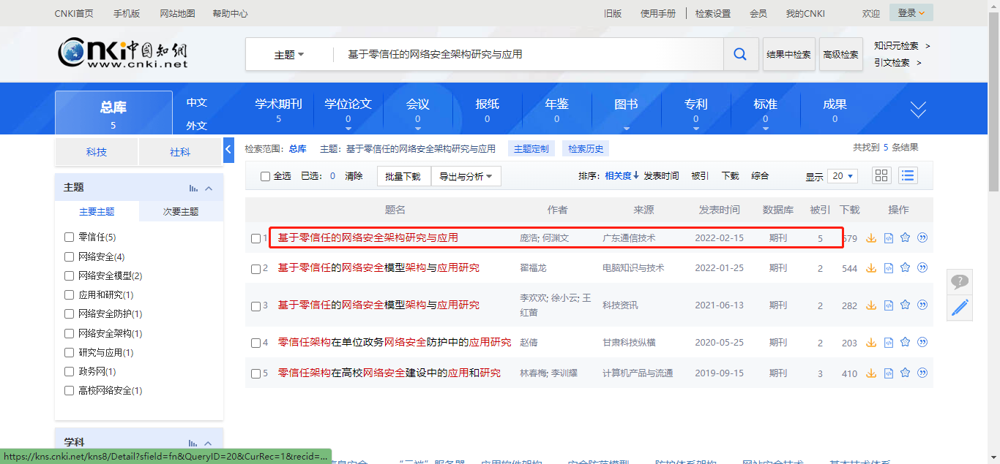
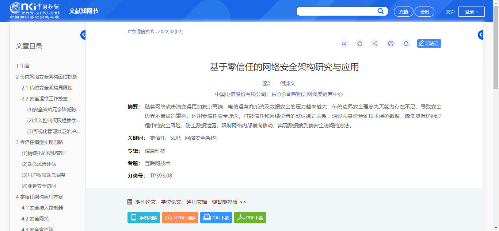
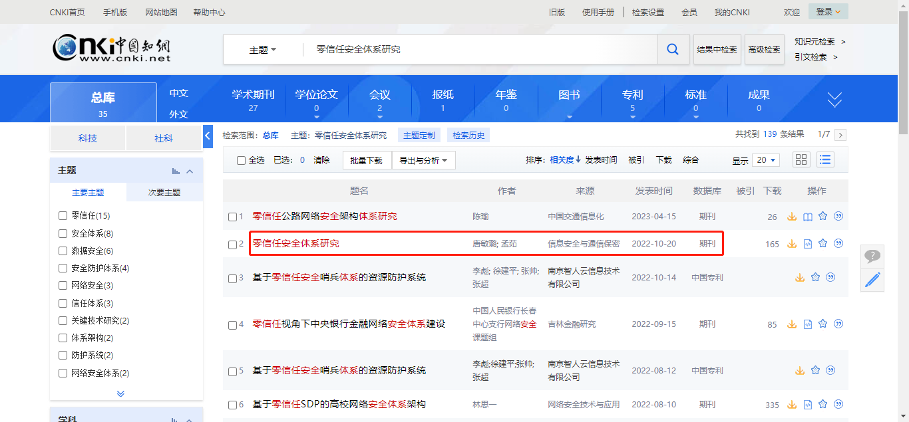
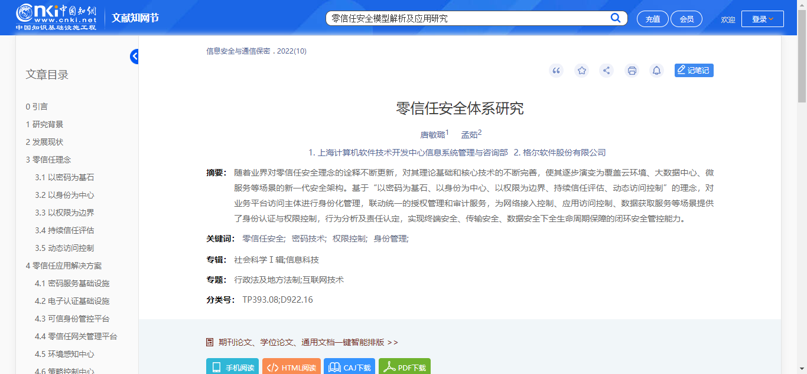
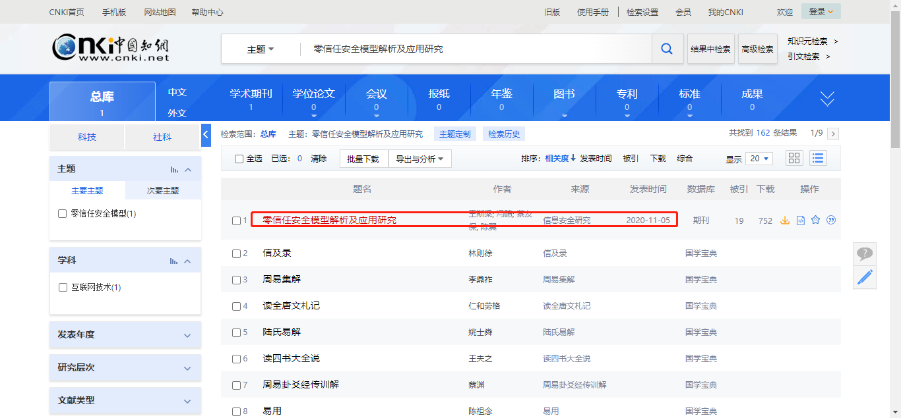
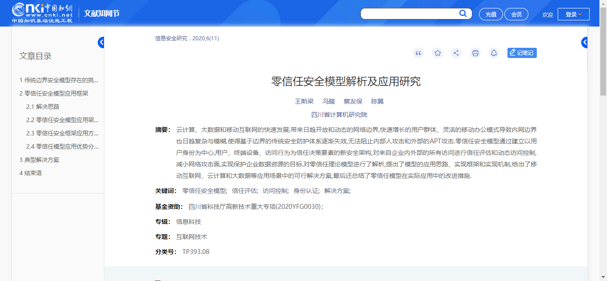
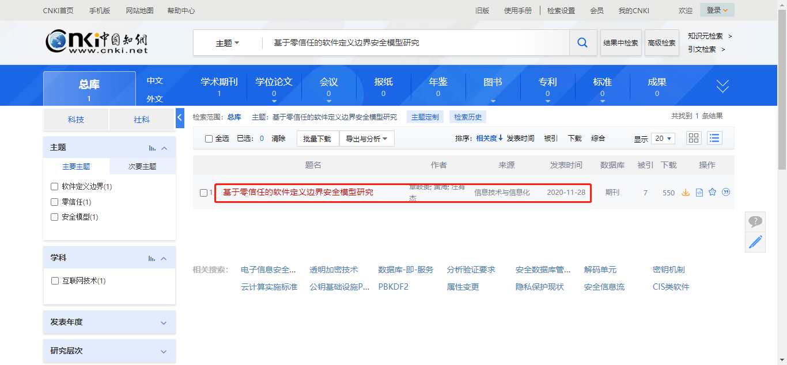
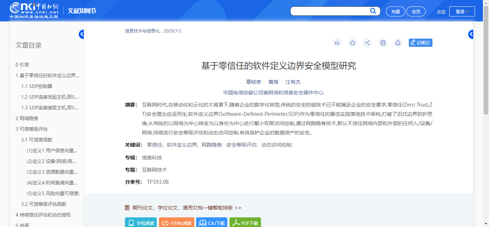

## 关于中国政务信息系统零信任安全体系建设的研究现状，以下是一些相关的观点和趋势：

1. 零信任概念引入：零信任安全理念在中国政务信息系统中逐渐引起关注和应用。政府机构和企事业单位开始认识到传统边界防御模式存在局限性，并开始探索基于零信任原则的安全体系建设。

2. 实施案例：一些政府机构和企事业单位已经开始实施零信任安全体系建设，并取得了一定的成果。例如，在政务云、政务网络和关键信息系统中，采用了零信任的访问控制和身份认证机制，提升了安全性和保护隐私的能力。

3. 技术探索：在中国，零信任安全体系建设涉及多个技术领域和措施。这包括身份认证与访问控制技术、多因素身份验证、网络分段和微隔离、行为分析和威胁检测等。政府和企业正在积极探索和应用这些技术，以实现零信任安全的目标。

4. 政策和标准指导：中国政府出台了一系列政策和标准，鼓励和引导政务信息系统的零信任安全体系建设。例如，加强个人信息保护的法律法规，以及关于政务信息系统安全等级保护的技术标准和指南。

5. 挑战和难点：在零信任安全体系建设过程中，仍然存在一些挑战和难点。包括技术复杂性、用户体验、成本投入、组织文化转变等方面。解决这些问题需要政府和企业共同努力，并进行合适的规划和实施。

需要注意的是，由于政务信息系统的复杂性和保密性要求，相关研究和实践案例可能不太公开和透明。因此，详细的研究现状可能需要深入调研和专业研究领域的参考资料。建议您参考政府出版物、行业报告、学术论文以及与政府和企事业单位相关的技术会议和研讨会等资源，以获取更具体和详尽的研究现状信息。

## 中国政务信息系统零信任安全体系建设研究目的及意义是什么？

ChatGPT
中国政务信息系统零信任安全体系建设的研究目的和意义如下：
提升信息系统安全性：

政务信息系统中的数据和应用涉及大量敏感信息，包括个人隐私、国家机密等。零信任安全体系建设的目的是提升信息系统的安全性，防止未经授权的访问和数据泄露。通过采用零信任原则，确保只有经过身份验证和授权的用户才能访问系统和资源。
保障政务信息安全：政务信息对国家安全和社会稳定至关重要。政务信息系统零信任安全体系建设的研究目的是为了保障政务信息的安全，防止数据被篡改、窃取或破坏。通过严格的访问控制、身份认证和加密等安全措施，确保政务信息在传输和存储过程中得到有效保护。
响应网络威胁的挑战：随着网络威胁的不断演变和复杂化，传统的边界防御模式已经无法满足安全需求。零信任安全体系建设旨在应对网络威胁的挑战，通过以用户为中心的安全模型，对每个访问请求进行验证和授权，无论其来自何处或其访问环境如何。
适应移动和云计算环境：政务信息系统越来越多地借助移动设备和云计算平台进行访问和处理。零信任安全体系建设的研究意义在于适应这种移动和云计算环境，确保用户在任何地点、任何设备上都能安全地访问政务系统，并保护敏感数据免受风险。
推动信息化建设：政府机构的信息化建设是现代化治理的重要组成部分。零信任安全体系建设的研究目的在于推动政府机构的信息化建设，为其提供安全可靠的信息系统基础，提升政务办公效率和服务质量。
总之，中国政务信息系统零信任安全体系建设的研究目的和意义在于提升信息系统安全性，保障政务信息安全，应对网络威胁挑战，适应移动和云计算环境，并推动政府机构的信息化建设。这将有助于保护国家重要信息资产，维护社会稳定，提高政

## 中国政务信息系统零信任建设的现状如下：

零信任概念引入和认知提升：近年来，中国政府和企事业单位对零信任安全理念的认知逐渐提升。政府文件和政策文件中开始提及零信任安全的重要性，并鼓励在政务信息系统中采用零信任原则。
部分政府机构的实践探索：一些政府机构已经开始在政务信息系统中实施零信任安全体系建设，并取得了一定的成果。这些机构采用了零信任的访问控制、身份认证和数据保护机制，提高了系统的安全性和可靠性。
技术措施的应用：政务信息系统零信任建设涉及多个技术领域的应用。包括身份认证与访问控制技术、多因素身份验证、网络分段和微隔离、行为分析和威胁检测等。一些政府机构和企事业单位正在积极探索和应用这些技术措施。
安全标准和规范制定：为促进政务信息系统零信任建设，中国政府相关部门和标准化机构制定了一系列安全标准和规范。这些标准和规范包括政务信息系统安全等级保护标准、个人信息保护法律法规等，为政务信息系统的零信任安全体系建设提供指导和规范。
挑战和问题：政务信息系统零信任建设仍面临一些挑战和问题。其中包括技术复杂性、组织文化转变、资源投入等方面。解决这些挑战需要政府和企事业单位持续关注和投入，并制定适合的策略和计划。
需要注意的是，政务信息系统的零信任建设是一个复杂的过程，涉及多个政府部门、机构和企事业单位的协作和配合。当前的现状是在逐步推进和实施中，各个领域和地区的进展可能存在差异。因此，具体的现状可能需要进一步深入调研和了解相关实施情况。

## 文献

[1] 刘小康,陆诚.政务信息系统网络安全防护体系建设探讨[J].中国信息化,2021(11):64-65+61.

[2] 庞浩,何渊文.基于零信任的网络安全架构研究与应用[J].广东通信技术,2022,42(02):63-67.

[3] 唐敏璐,孟茹.零信任安全体系研究[J].信息安全与通信保密,2022(10):124-132. 

[4] 王斯梁,冯暄,蔡友保,陈翼.零信任安全模型解析及应用研究[J].信息安全研究,2020,6(11):966-971.

[5] 章岐贵,黄海,汪有杰.基于零信任的软件定义边界安全模型研究[J].信息技术与信息化,2020(11):92-94.

## 一、目的意义

合规要求、满足合规要求（一道墙）、关键基础设施

数字政府安全体系

结合体系要求

建立更好的安全保障体系，提升防入侵、防dos、一体化体系

## 二、现状

数字政府安全现状

零信任政务安全

温州市大数据发展管理局一直来在以大数据赋能智慧城市、 智慧国企、 智慧健康等方面走在前列， 已建成的一体化智能化公共数据平台为该市下属的委办单位、 企业、 公众提供良好的大数据业务支撑服务， 以数据智能赋能数字经济和民生。随着数据开放面逐渐扩大、 数据访问量不断增加， 温州市大数据发展管理局预见到了开放共享过程中潜在的数据安全防护及溯源问题， 例如数据访问无法追溯到最终用户、 API 自身脆弱性带来的安全配置错误及注入风险、 API 异常高频访问带来的数据暴露风险等， 为此温州市大数据局于2021年建设了一体化智能化公共数据平台零信任安全防护体系，保障大数据局的数据资产安全。  

当前全国政务信息系统零信任建设还处于起步阶段，真正将零信任建设落地实施的单位屈指可数。少部分单位虽然建立起了零信任防护体系，但仍面临着软件定义边界（SDP）模糊，身份管理（IAM）权限混乱、微隔离（MSG）范围不清等问题。

全国---某些已经  --差距不足（边界问题、微隔离）-》引出

**处于xx情况**（具体化）

业务资源之间的调用和交换问题，这个过程中会涉及到企业各个业务、客户的身份认证系统的对接，不仅认证接口和协议非常繁杂，用户很难厘清零信任与内部已有的多种安全能力以及大量业务的关系，同时对终端与数据的安全防护也带来了极大挑战。

## 三、参考依据

暂无修改

## 四、研究内容

引出技术核心

小标题1、2、3、

河南某区视频专网安全防护体系尚未建立，各区域间没有建立起统一的安全防护 ，应市公共视频监控数字改革要求，对区视频专网基础设施如终端、网络、跨网交换措施、通信链路进行合规保障的基础上，并结合区视频专网业务应用特点进行视频专网安全保障建设。

目前区视频专网安全防护体系尚未建立，各区域间没有建立起统一的安全防护；另一方面，市公安局在公安部《公安视频图像信息系统安全技术要求》（征求意见稿）的基础上，结合河南省公共视频监控数字改革要求制定了视频安全建设标准，对区县分局提出建立视频专网安全防护的要求，要求各区县分局针对视频专网的各个安全域建立起安全防范体系，降低视频专网内安全事故发生的可能性  

