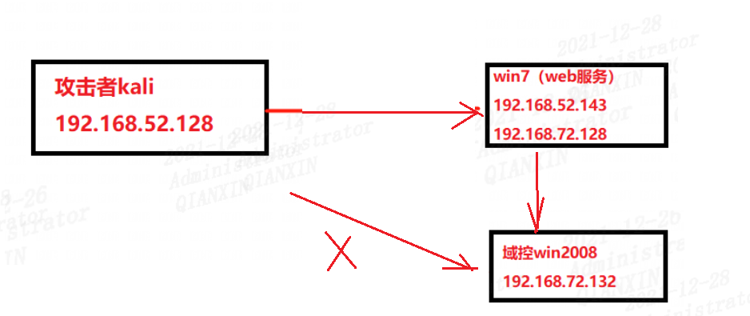
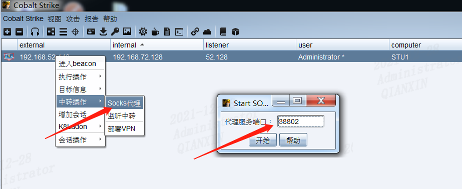
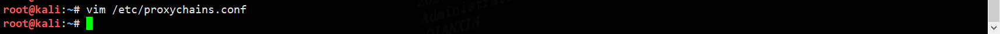
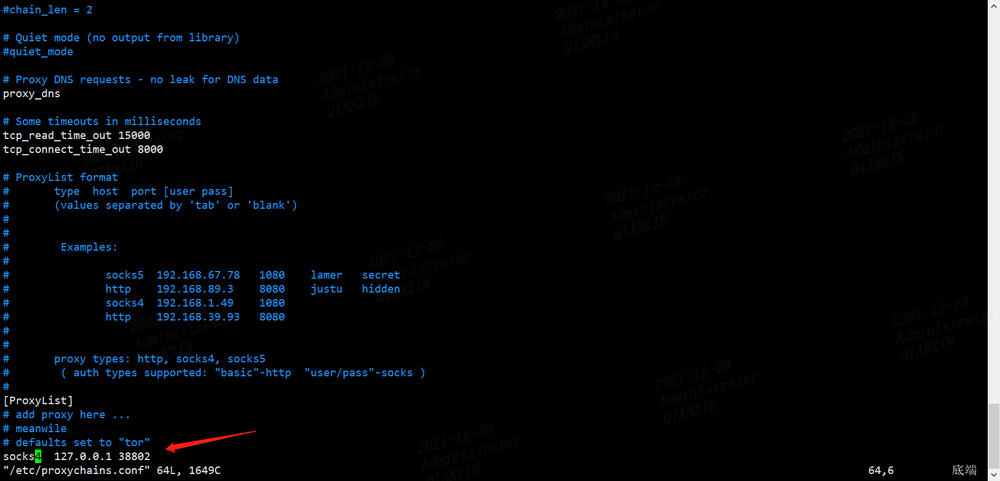
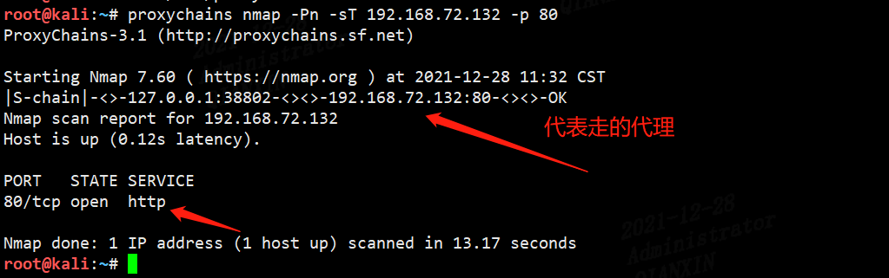
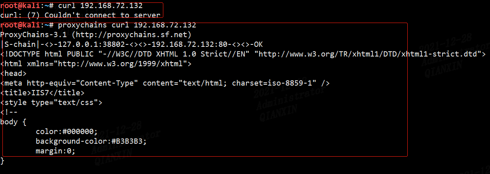
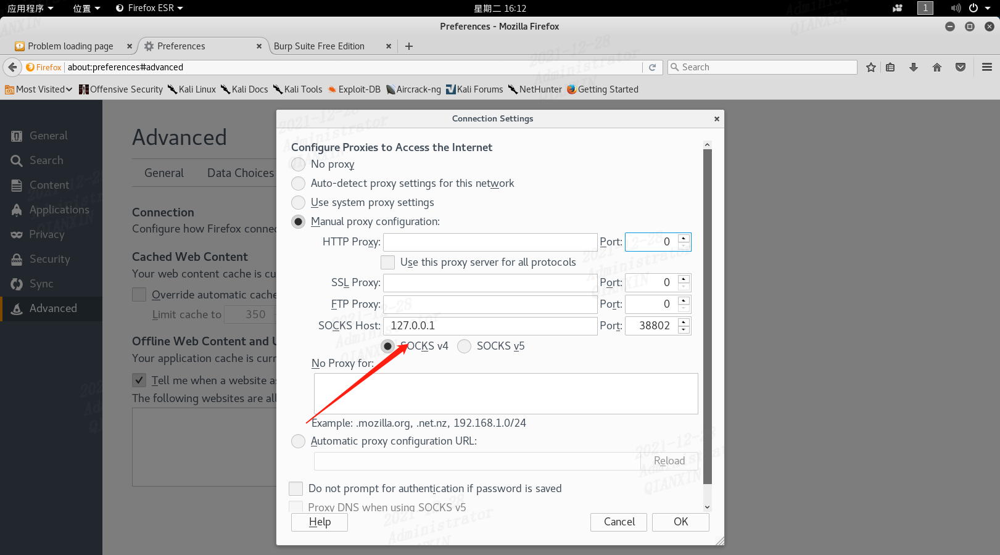
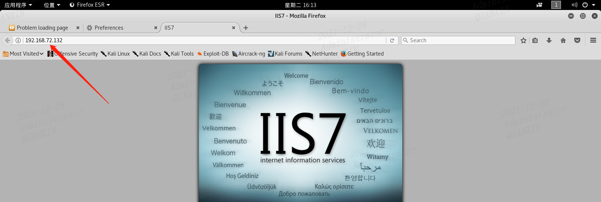

## 0x01实验环境

攻击者kali可以直接win7，但是不能访问win2008

通过拿下win7权限，在win上开启socks4代理，访问win2008




## 0x02实验过程

先使win7上线，然后配置socks代理



编辑proxychains.conf文件





```bash
proxychains nmap -Pn -sT 192.168.72.132 -p 80
```



另外用curl命令测试下



同样在浏览器配置socks4代理后，也能正常访问目标服务器web网站






在windows下配合工具==Proxifier==也可以利用。

