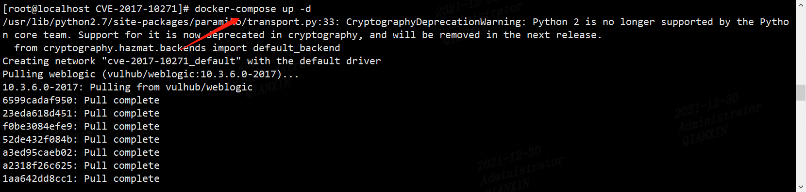
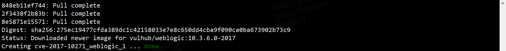
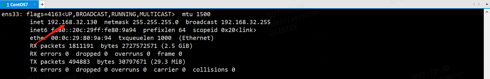
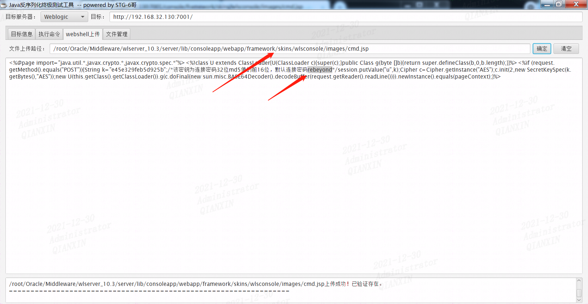
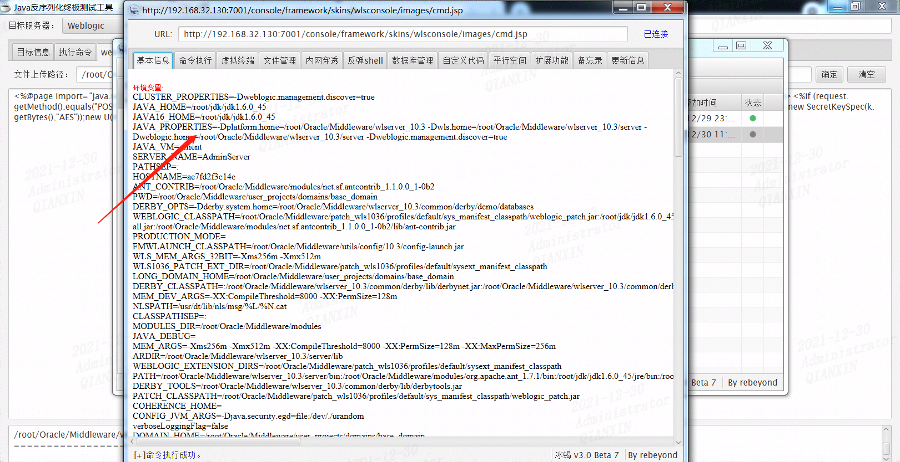

centos开启weblogic服务

```bash
docker-compose up -d
```







利用Java反序列化漏洞，上传木马，路径如下

/root/Oracle/Middleware/wlserver_10.3/server/lib/consoleapp/webapp/framework/skins/wlsconsole/images/cmd.jsp



冰蝎连接木马

http://192.168.32.130:7001/console/framework/skins/wlsconsole/images/cmd.jsp




