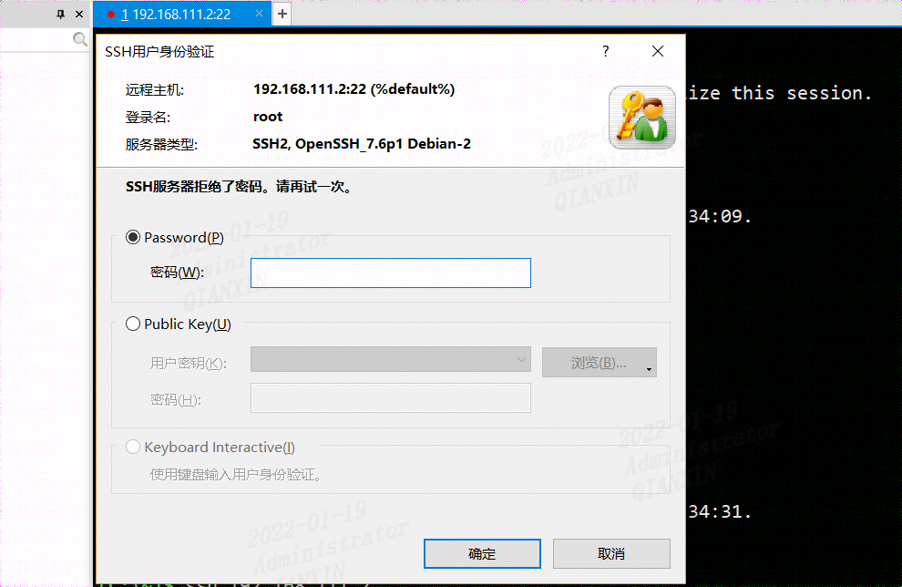
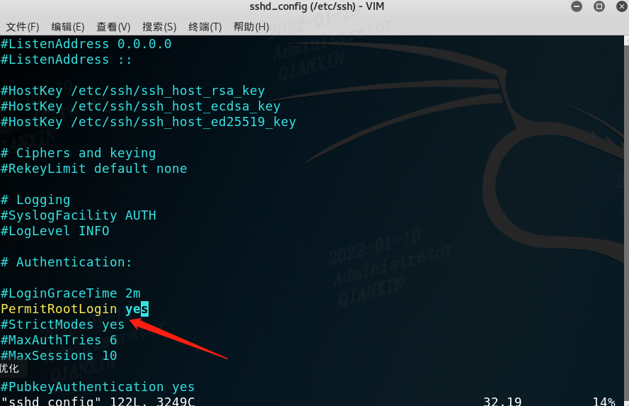
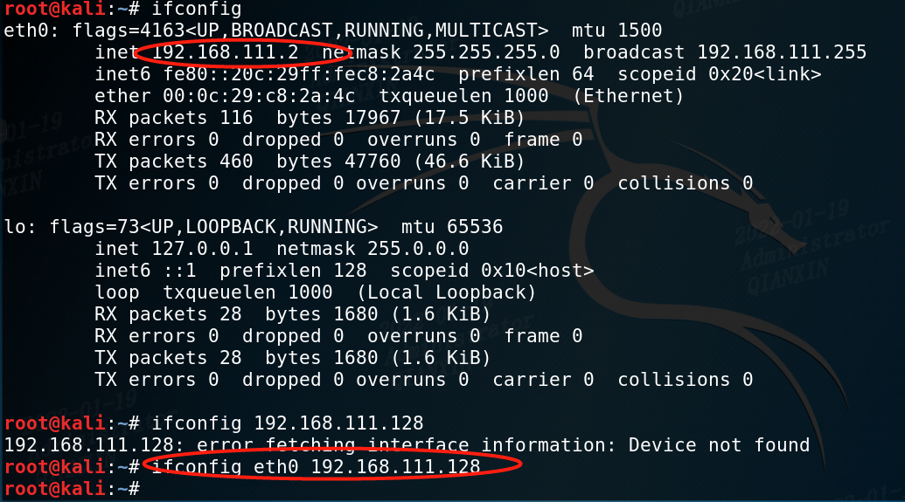
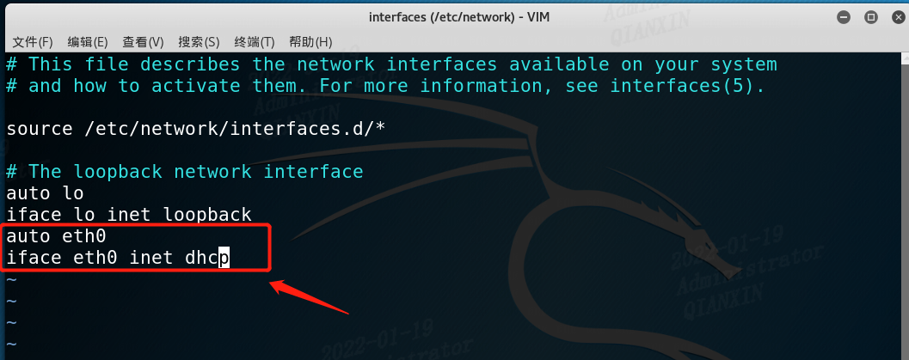

## 配置kali允许root远程登录

将kali恢复了快照，发现失活登录不了ssh了，如下，在输入正确root，及其密码仍旧提示拒绝




查了原因，原来sshd的设置不允许root用户远程登录，接着修改配置文件

执行命令 vim /etc/ssh/sshd_config



再重启ssh

```
systemctl restart ssh
```

即可成功连接


## 配置kali自动自动获取IP

**另外记录一下kali自动获取IP**

自动获取ip --> dhclient
如果smbd.service服务未开启，这时则需先启动该服务  -->service smbd start
这时如果提示 File exists，则需先关闭进程  -->dhclient -r 
此时，则自动获取ip即可  -->dhclient

如果想修改IP，则有




如果想重新变为自动获取IP，使用如下命令不用重启系统即可实现

```bash
root@kali:~#dhclient eth0
```

如果报错RTNETLINK answers: File exists

输入命令：

```
ip addr flush dev eth0
```

再次执行dhclient eth0即可


## 配置eth0自动启动获取dhcp

上面重启后会失效

这里说一下重启自动开启eth0并配置dhcp的方法

```bash
root@kali:~# vim /etc/network/interfaces
```

添加如下：

```bash
auto eth0
iface eth0 inet dhcp
```



重启即可