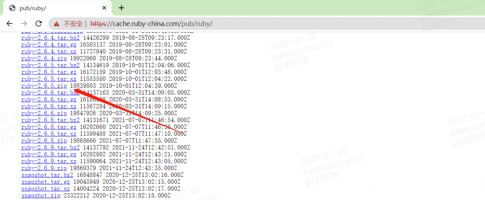
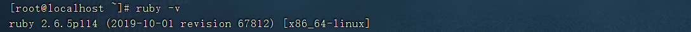
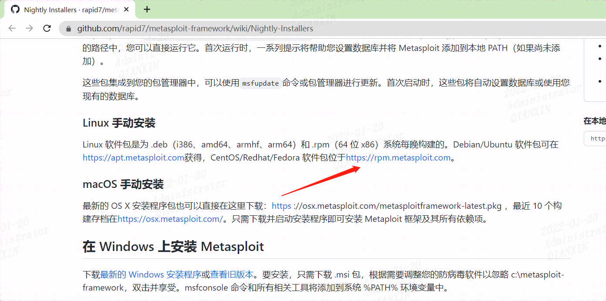
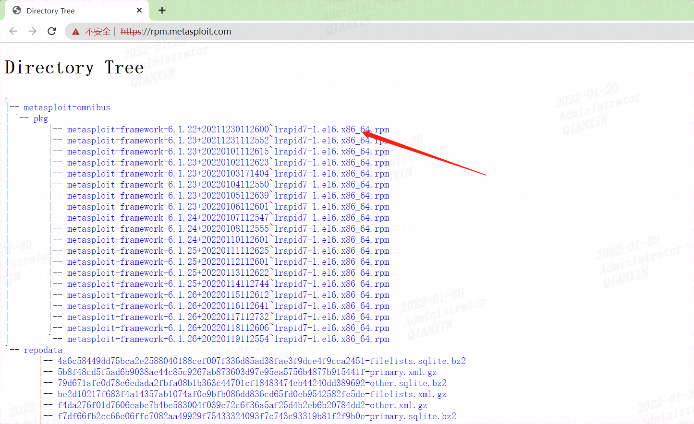
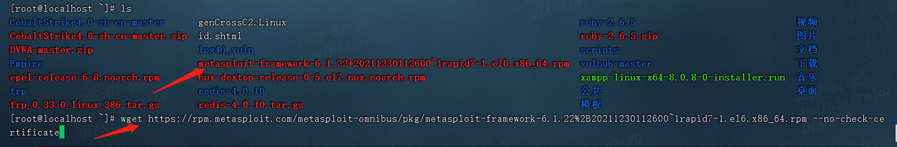
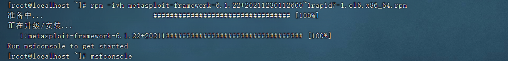
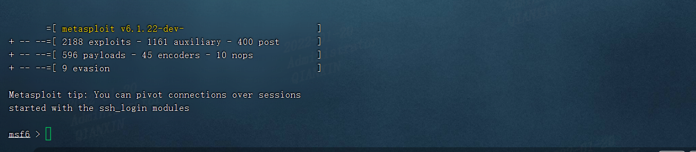

## 0x01安装ruby环境

metasploit需要ruby环境，centos默认未安装ruby环境，这里安装下ruby2.6.5

下载地址 https://cache.ruby-china.com/pub/ruby/，下载列表如下：



在centos下载压缩包

```bash
wget https://cache.ruby-china.com/pub/ruby/ruby-2.6.5.zip
```

解压

unzip ruby-2.6.5.zip 

```bash
[root@localhost ~]# cd /home/joyce/soft/ruby-2.6.5     进入目录
[root@localhost ~]# ./configure                        执行配置。或者：   ./configure  --with-openssl-dir=/usr/local/ssl  可以解决报错：Unable to require openssl, install OpenSSL and rebuild ruby (preferred) or use non-HTTPS sources
[root@localhost ~]# sudo make install                  安装
[root@localhost ~]# ruby -v                            验证
```

安装成功



参考：https://my.oschina.net/u/4256916/blog/3311868


## 0x02下载安装msf

查看GitHub上的下载地址

https://github.com/rapid7/metasploit-framework/wiki/Nightly-Installers



下载地址 https://rpm.metasploit.com/



### 01下载rmp包

```
wget https://rpm.metasploit.com/metasploit-omnibus/pkg/metasploit-framework-6.1.22%2B20211230112600~1rapid7-1.el6.x86_64.rpm --no-check-certificate
```



### 02安装msf

rpm -ivh 包名	//安装并在安装过程中显示正在安装的文件信息及安装进度

```bash
[root@localhost ~]# rpm -ivh metasploit-framework-6.1.22+20211230112600~1rapid7-1.el6.x86_64.rpm
```



### 03启动msf

```bash
[root@localhost ~]# msfconsole
```



### 04卸载msf

另外记下卸载方法

rpm -e 包名

```bash
[root@localhost ~]# rpm -e metasploit-framework 
```


参考：

https://github.com/rapid7/metasploit-framework/wiki/Nightly-Installers

https://blog.csdn.net/wangjingqi930330/article/details/100988882