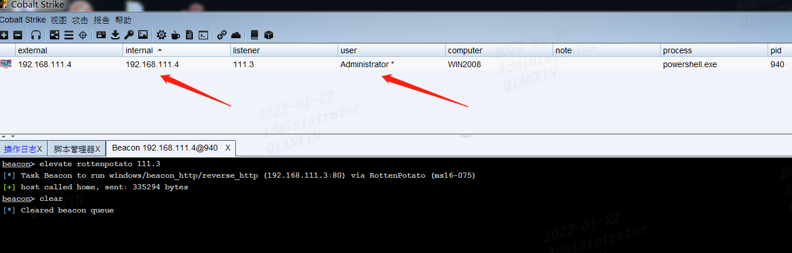
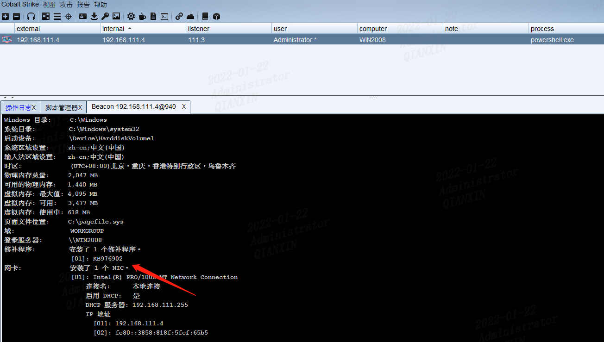
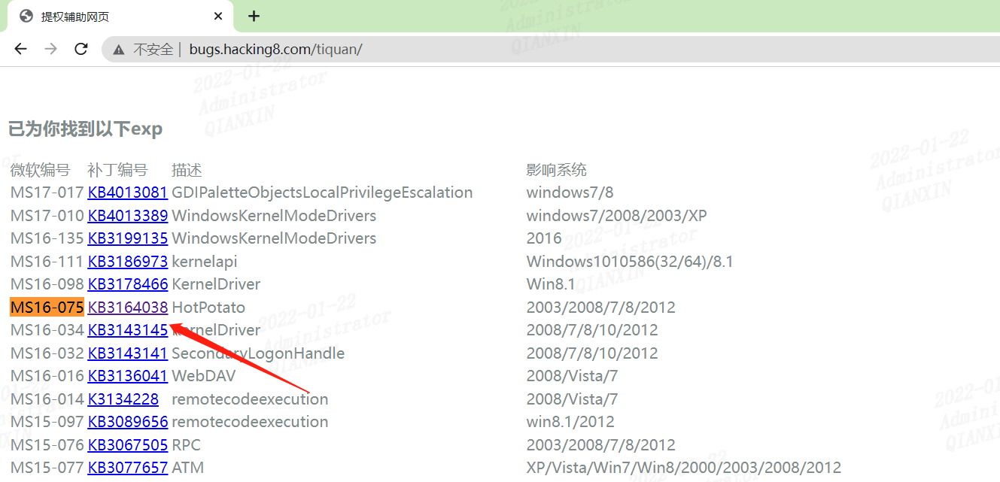
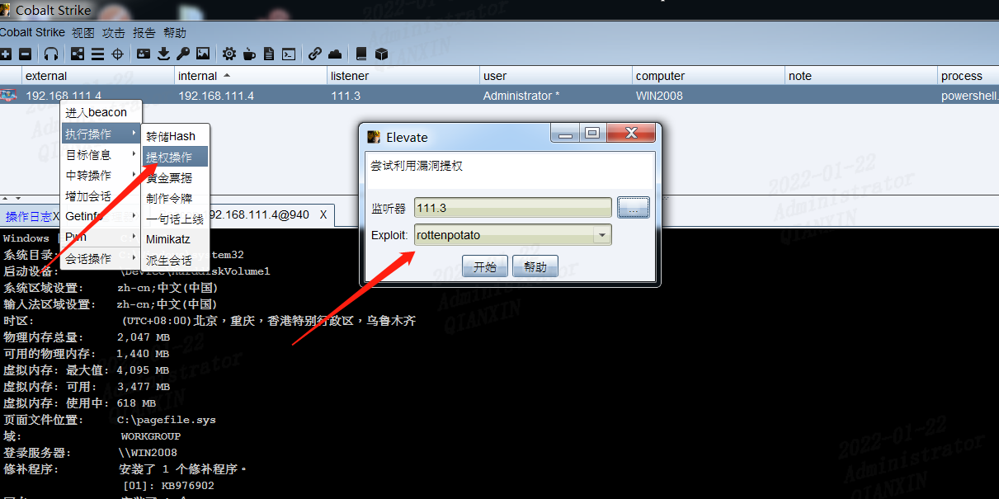
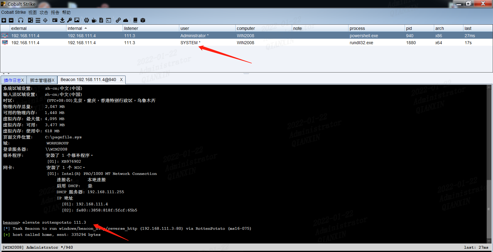

## 环境信息

> 目标机：
> server2008		192.168.111.4
>
> 攻击机：
> kali					 192.168.111.3

## 目标上线

首先通过制作html后门使目标机上线

可以发现当前目标机用户为administrator

通过当前会话框执行`shell systeminfo`查看当前系统信息，打补丁情况

把该信息粘贴到`http://bugs.hacking8.com/tiquan/`查看可以利用的漏洞

在GitHub上查找对应cs里烂土豆的插件，加载到cs中

https://github.com/johnjohnsp1/reflectivepotato

## 提权

选择该模块，提权

一会儿得到一个system权限的会话

