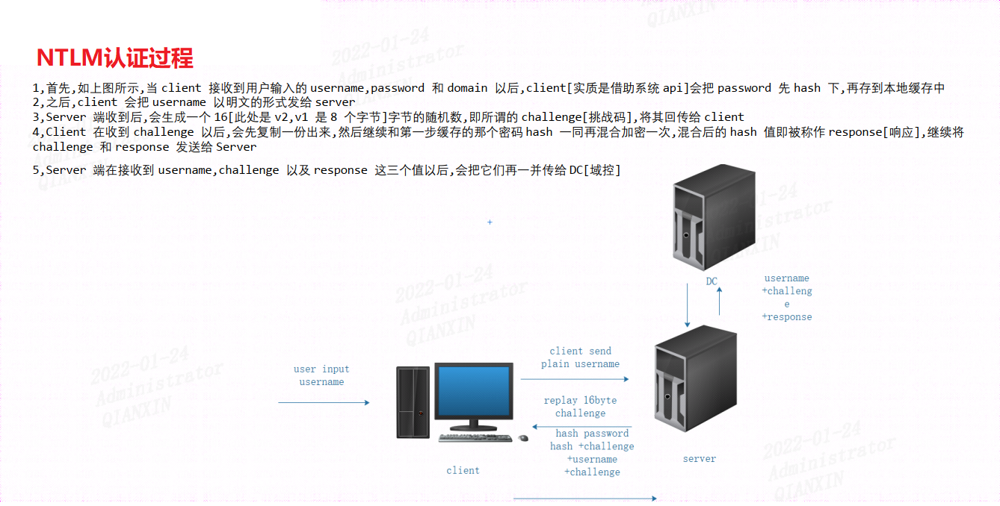
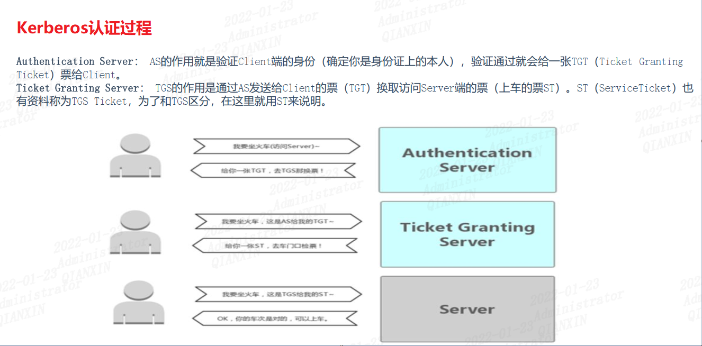
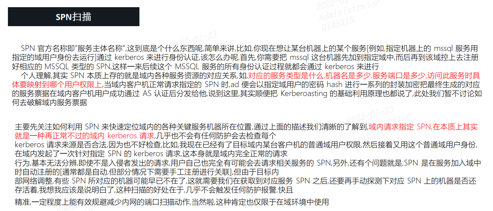
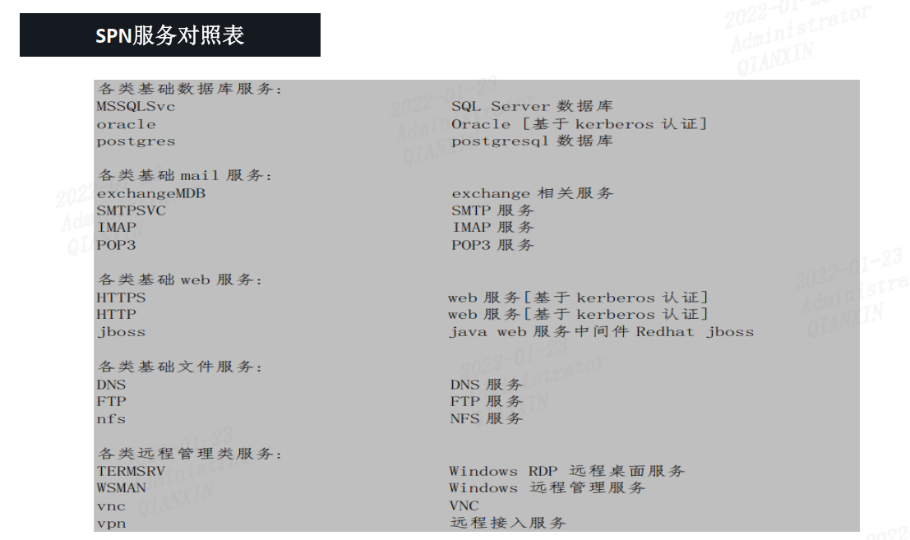
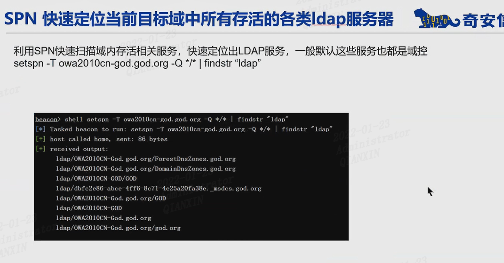
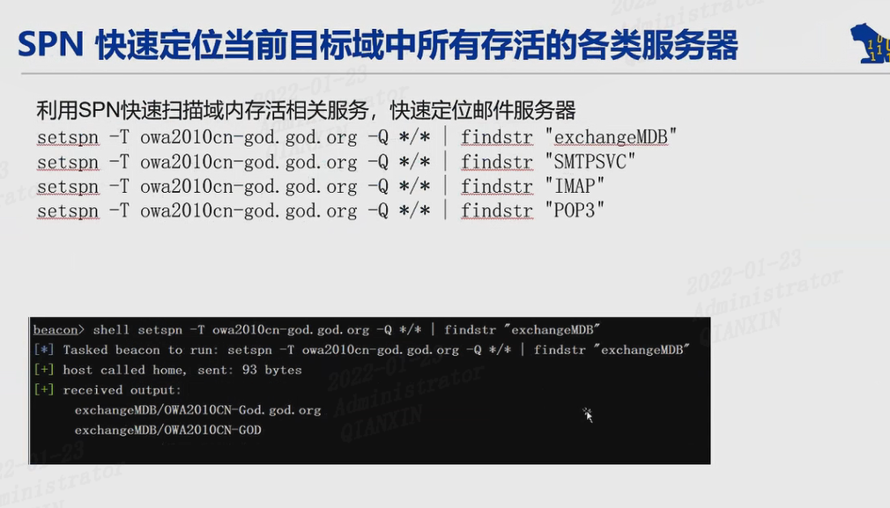

Windows下的两种身份验证方式

## NTLM

## Kerberos

## SPN

## PTH

**内网渗透 | 哈希传递攻击(Pass-the-Hash,PtH)**

​	哈希传递攻击是基于NTLM认证的一种攻击方式。哈希传递攻击的利用前提是我们获得了某个用户的密码哈希值，但是解不开明文。这时我们可以利用NTLM认证的一种缺陷，利用用户的密码哈希值来进行NTLM认证。在域环境中，大量计算机在安装时会使用相同的本地管理员账号和密码。因此，如果计算机的本地管理员账号密码相同，攻击者就能使用哈希传递攻击登录内网中的其他机器。

**哈希传递攻击适用情况：**

**在工作组环境中：**

- Windows Vista 之前的机器，可以使用本地管理员组内用户进行攻击。
- Windows Vista 之后的机器，只能是administrator用户的哈希值才能进行哈希传递攻击，其他用户(包括管理员用户但是非administrator)也不能使用哈希传递攻击，会提示拒绝访问。

**在域环境中：**

- 只能是域管理员组内用户(可以是域管理员组内非administrator用户)的哈希值才能进行哈希传递攻击，攻击成功后，可以访问域内任何一台机器。

参考：http://cn-sec.com/archives/228409.html

