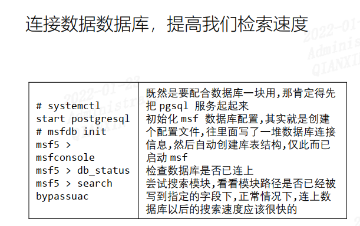
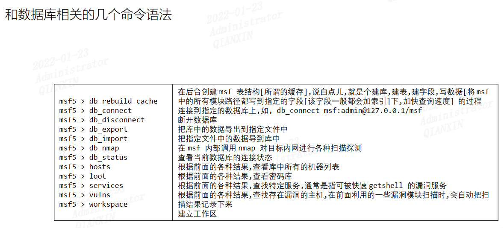

连接数据库，是检索更快捷

```
# systemctl start postgresql	//开启数据库
# msfdb init			       //建立连接
# msfconsole
# msf5 > db_status
# msf5 > search ms17_010
```

如果确定开启数据库，也建立连接后，打开msfconsole还是提示`[!] Module database cache not built yet, using slow search`，则这时候需要考虑重新执行msfdb init 建立连接，再次重新进入msfconsole



