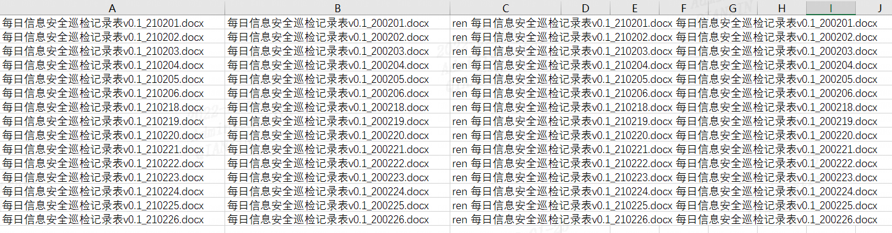

找到文件所在的目录，dos下执行

dir *.docx /b >rename.xls

打开rename.xls，在B列写下如果替换后的文件名，然后在C列写下**="ren "&A1&" "&B1**




把C列内容放到需要重命名的文件下，命名为rename.bat，执行即可

另外

可以在开头和结尾添加`@echo off`和`pause`，如

```powershell
@echo off
ren 每日信息安全巡检记录表v0.1_200302.docx 每日信息安全巡检记录表v0.1_200302.docx
ren 每日信息安全巡检记录表v0.1_200303.docx 每日信息安全巡检记录表v0.1_200303.docx
ren 每日信息安全巡检记录表v0.1_200304.docx 每日信息安全巡检记录表v0.1_200304.docx
pause
```

