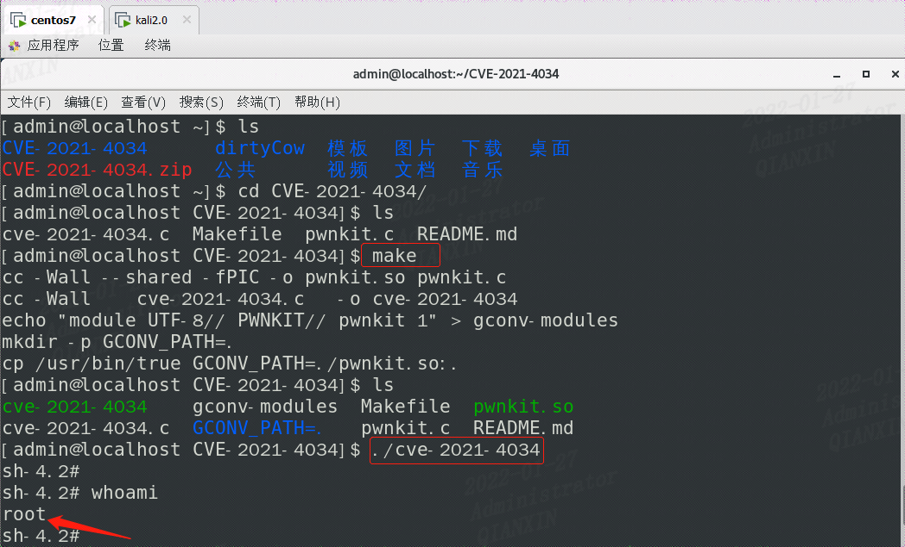

## 0x00 漏洞详情

Polkit（PolicyKit）是一个用于控制类Unix系统中控制系统范围权限的组件，它为非特权进程与特权进程的通信提供了一种有组织的方式。pkexec是Polkit开源应用框架的一部分，它负责协商特权进程和非特权进程之间的互动，允许授权用户以另一个用户的身份执行命令，是sudo的替代方案。


1月25日，研究人员公开披露了在 polkit 的 pkexec 中发现的一个权限提升漏洞（CVE-2021-4034 ，也称PwnKit)，它存在于所有主流的 Linux 发行版的默认配置中。受影响版本的 pkexec 无法正确处理调用参数计数，最终尝试将环境变量作为命令执行，攻击者可以通过修改环境变量来利用此漏洞，诱使 pkexec 执行任意代码，从而导致将本地权限提升为root。堪比Windows下的烂土豆，好用。


## 0x01 复现环境

CentOS7


## 0x02 复现过程

1、下载exp

https://github.com/berdav/CVE-2021-4034

2、执行过程

```bash
[admin@localhost ~]$ cd CVE-2021-4034/
[admin@localhost CVE-2021-4034]$ make
[admin@localhost CVE-2021-4034]$ ./cve-2021-4034 
sh-4.2# whoami
root
```




## 0x03 影响范围

Linux各大主流操作系统，如：Ubuntu、Debian、Fedora 、CentOS 等


## 0x04 修复建议

目前各 Linux 发行版官方均已给出安全补丁，建议用户尽快升级至安全版本，或参照官方说明措施进行缓解。