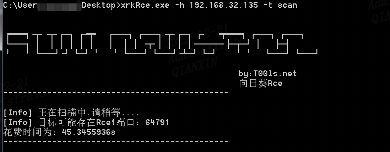
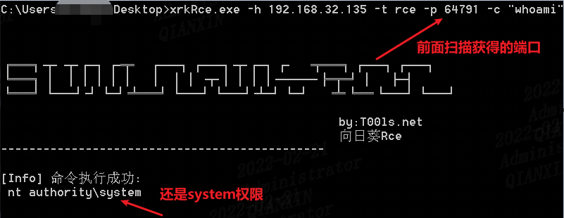

## 漏洞描述

向日葵远程控制软件是一款免费的集远程控制电脑手机、远程桌面连接、远程开机、远程管理、支持内网穿透的一体化远程控制管理工具软件。监测到其存在远程命令执行漏洞。攻击者可构造特殊请求执行任意系统命令，获取服务器权限。

## 影响范围

向日葵 11.x 、10.x

## 漏洞复现

> exp下载
>
> https://github.com/Mr-xn/sunlogin_rce/releases/tag/new
>
> 向日葵版本10.3.0.27372
>
> 链接：https://pan.baidu.com/s/1QMOaytWbkoBd8bh92ed0EA 
> 提取码：spwd

1、漏洞扫描

2、命令执行

## 漏洞修复方案

厂商最新版本已经修复了漏洞，及时更新至漏洞修复版本：

https://sunlogin.oray.com/download