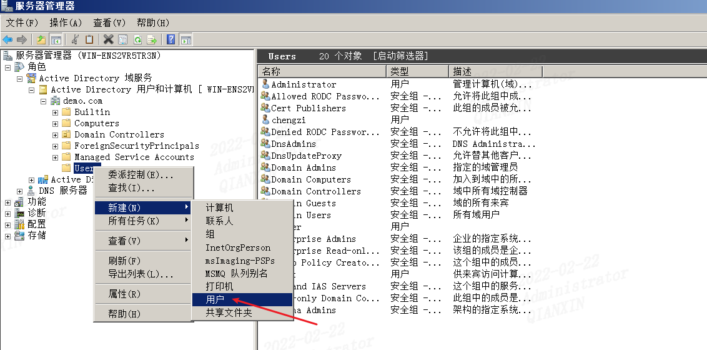
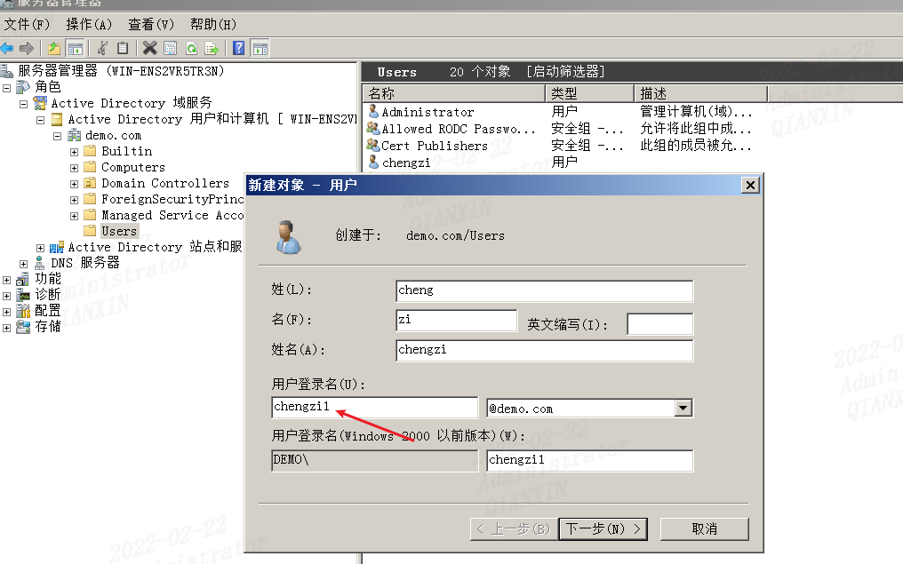
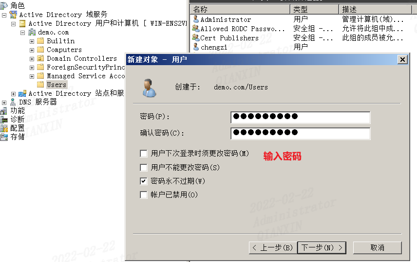
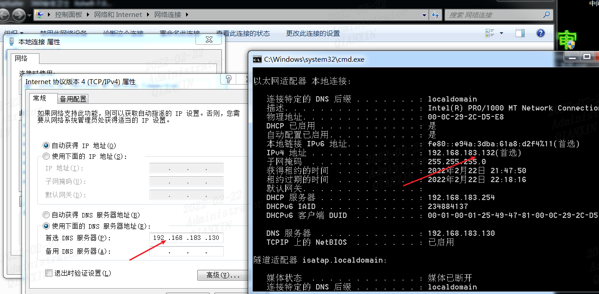
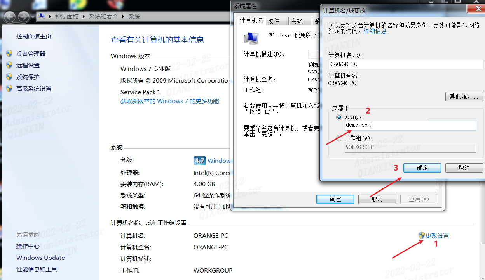
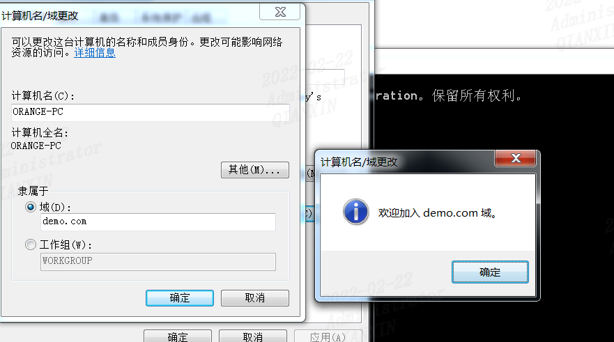
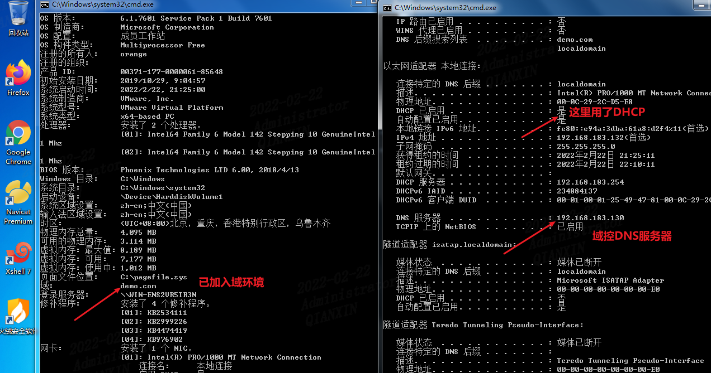

记录一下普通用户添加到域环境的过程

## 环境信息

> 域控DC
> 192.168.183.130
>
> 域成员win7
> 192.168.183.132

## 实验过程

### 1、新建域用户

在域控中新建一个用户chengzi，以备登录

这里我添加了用户名chengzi1

### 2、添加到域环境

把win7的DNS服务器地址设置成域控的DNS服务器，**IP地址可以自动获取，也可以配置成静态，另外说一点在配置域控服务器时候，必须使用静态IP**

输入密码加入到域

这里使用域用户chengzi1登录后，查看

