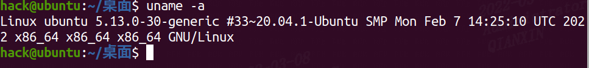
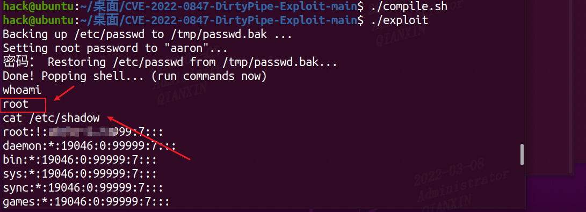

# 漏洞描述

CVE-2022-0847 是存在于 Linux内核 5.8 及之后版本中的本地提权漏洞。攻击者通过利用此漏洞，可覆盖重写任意可读文件中的数据，从而可将普通权限的用户提升到特权 root。

CVE-2022-0847 的漏洞原理类似于 CVE-2016-5195 脏牛漏洞（Dirty Cow），但它更容易被利用。漏洞作者将此漏洞命名为“Dirty Pipe”。

 

# 影响范围

5.8 <= Linux 内核版本 < 5.16.11 / 5.15.25 / 5.10.102


# 复现过程

## 环境信息

Ubuntu版本信息



## 漏洞利用

1、下载exp

https://github.com/Arinerron/CVE-2022-0847-DirtyPipe-Exploit

2、执行过程

```bash
hack@ubuntu:~/桌面/CVE-2022-0847-DirtyPipe-Exploit-main$ ./compile.sh 
hack@ubuntu:~/桌面/CVE-2022-0847-DirtyPipe-Exploit-main$ ./exploit 
whoami
```




# 解决方案

更新升级 Linux 内核到以下安全版本：

- Linux 内核 >= 5.16.11
- Linux 内核 >= 5.15.25
- Linux 内核 >= 5.10.102