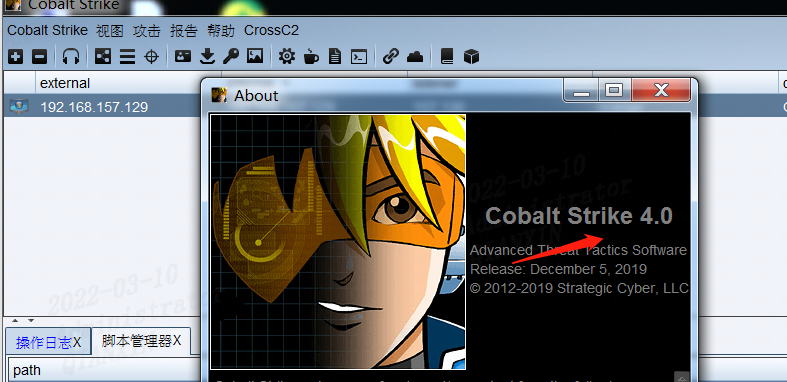
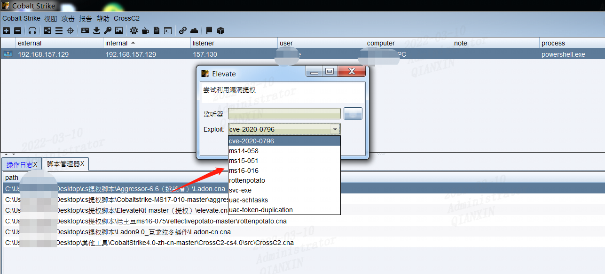
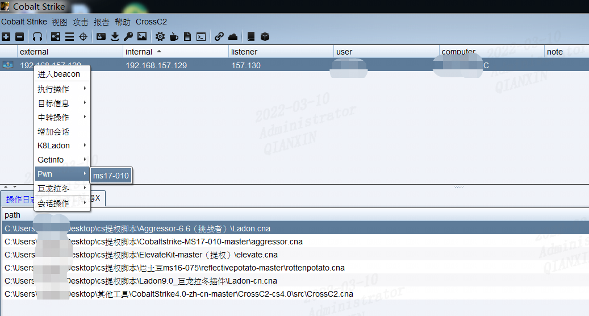
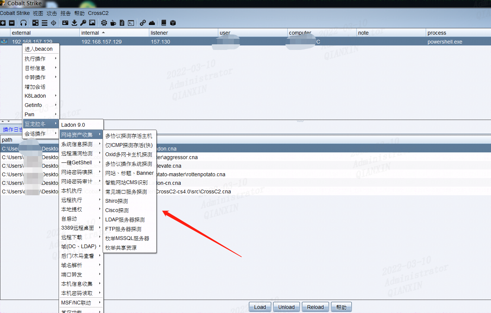

正所谓"**工欲善其事必先利其器**"，这里记录下自己平常用的一些CobaltStrike脚本，用于内网渗透、提权、永恒之蓝漏洞利用等。至于cs的使用等细节网上教程大堆，这里不再赘述。

这里说下我的cs是4.0版本的

因为一些脚本对于不同版本的cs可能会存在不兼容的情况，下面是具体效果图

特别是k8gege的这个Ladon插件，真的厉害

CrossC2不是太好用，就不写了

脚本地址如下：

链接：https://pan.baidu.com/s/1ocli8qMRf4Zbc-_Pu_cTvw 
提取码：5q9p