## 前言

平常在做渗透的过程中，经常会用到代理，比如用burp抓包或者挂代理翻墙等。一直有个疑问，就是能不能，一边挂着代理是出口IP为代理IP，然后再在浏览器上挂一个burp的代理，这样在做渗透时候，是不是对方日志里记录的就是我的代理国外IP，而非我的真实IP呢？

说干就干，在腾讯云上开一个tomcat服务，然后去访问，看日志里记录的访问日志，到底是哪个IP，如下：

访问tomcat站点，显示正常

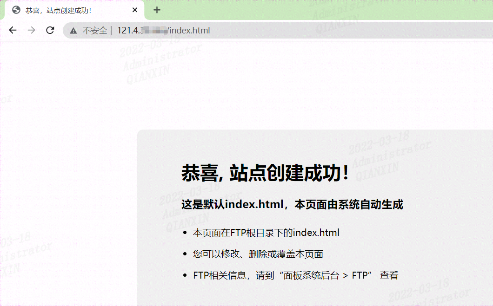

这里有以下几种情况，我分别做了记录：

## 1、不挂代理

不挂代理访问，显示是本地真实IP

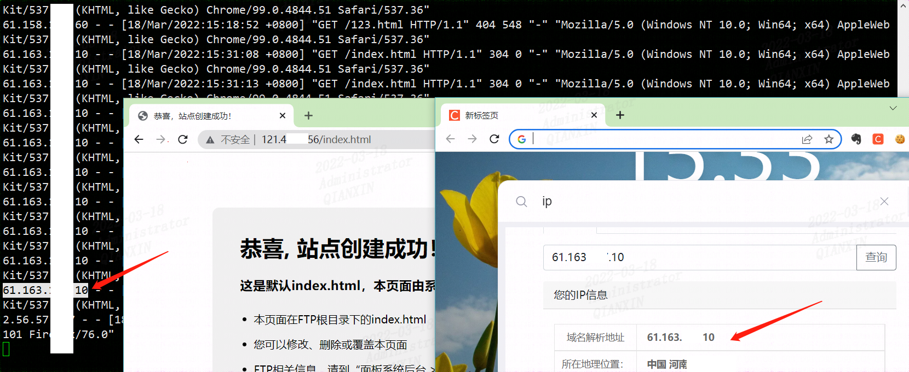

## 2、启用代理

开启v2代理，记录的是代理IP

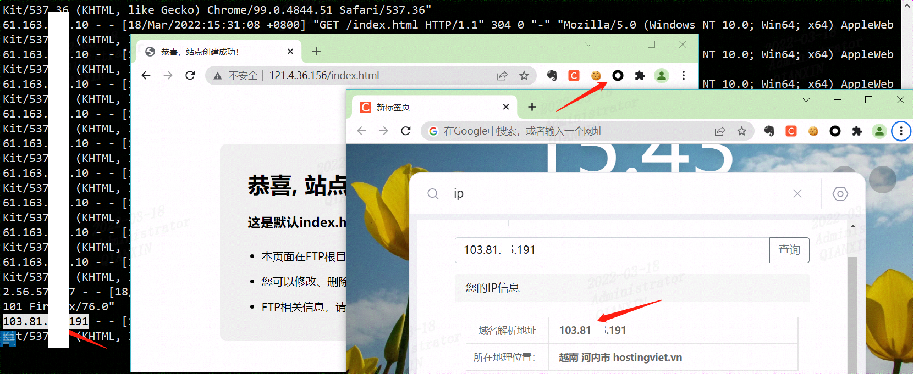

## 3、同时开启代理

开启v2，同时利用插件开启burp，监听本地回环地址8080，同样记录本地IP

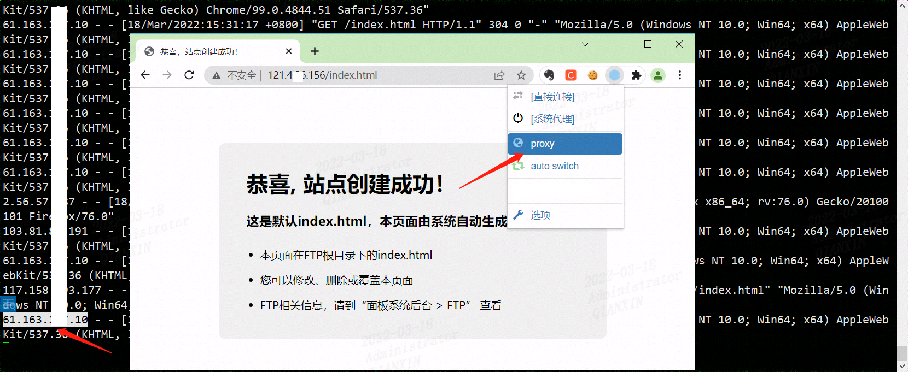

## 4、开启代理，sqlmap扫描

sqlmap扫描站点，在开启v2的情况下，同样会被记录真实IP（下图两个都是本地IP）

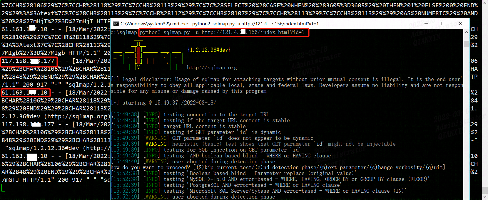

## 5、开启代理，强制sqlmap走代理

可以强制对sqlmap挂v2的代理，这样被记录到的就是代理IP了，不过缺点是扫描很慢

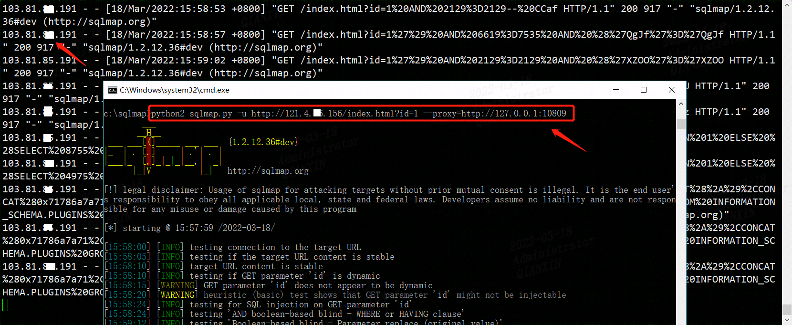

同理，在本地开启代理情况，默认其它扫描器在扫描时候不启用代理的，会被记录真实IP，除非如上面强制走代理，才会生效。

那么应该如何实现既通过burp，又走代理，防止“查水表”呢，需要做如下配置

## 6、在burp上设置走代理

在burp配置代理服务器，意为着burp抓到的包都会从代理服务器127.0.0.1的10809端口出去

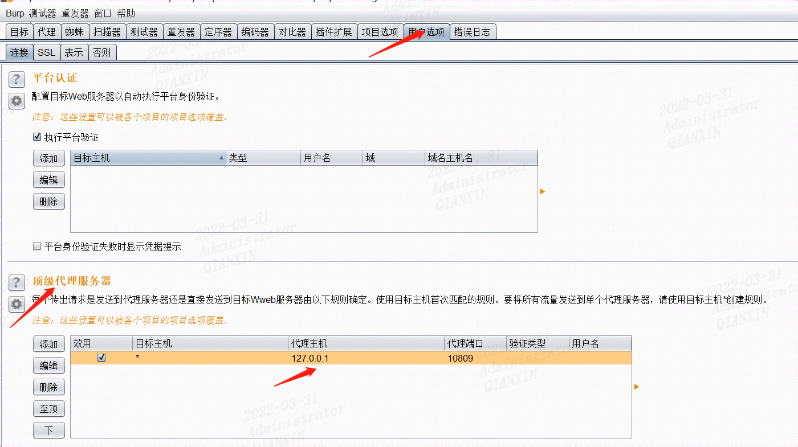

然后同样是在Google浏览器配置burp的代理127.0.0.1:8080

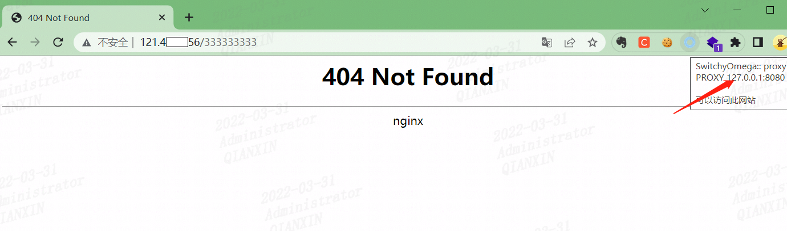

这时候访问http://121.xx.xx.156/333333333，然后在服务器日志看下访问IP，已经是国外代理IP，而非真实的IP地址了

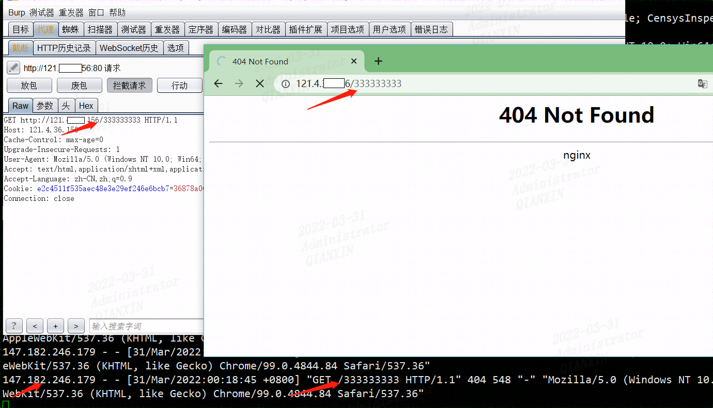

同理其它工具，比如awvs等，配置走代理也能实现同burp一样效果。

以上，是自己研究的一点体会，如果有大佬有不同见解，请不吝赐教

## 其它

挂burp代理8080端口，访问https://world.taobao.com/111111111，返回404

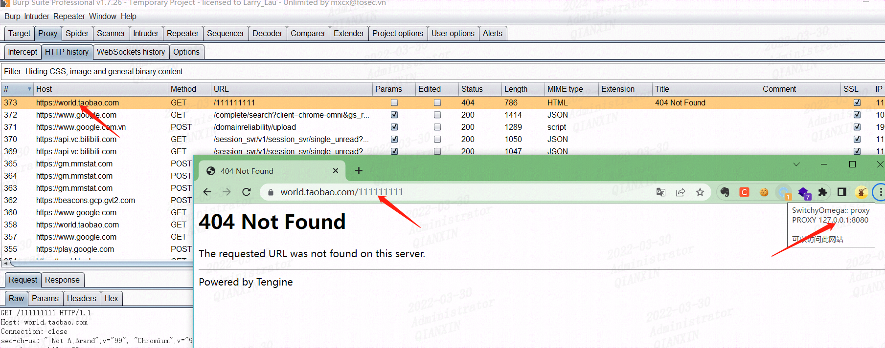

如果在User options 选项里如下配置，将burp流量都从本地代理10809出去

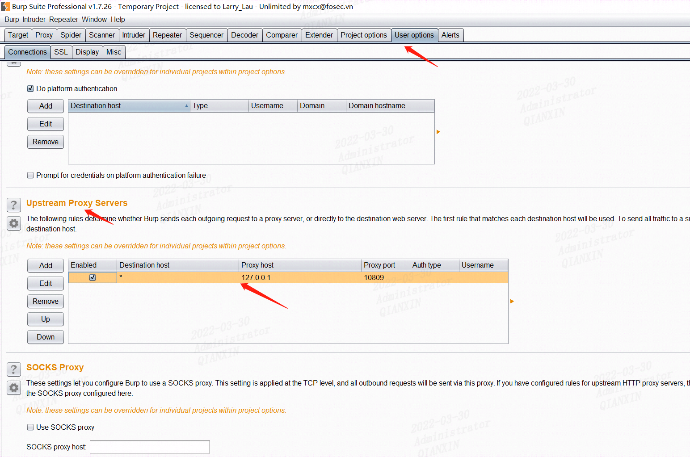

这里v2rayN开启本地10809的代理

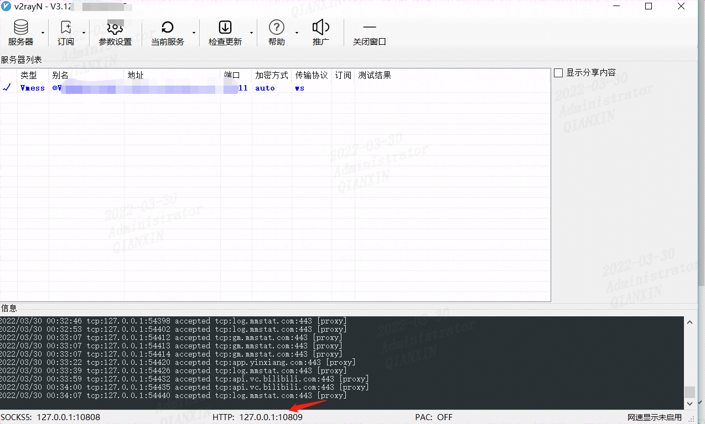

这里访问https://world.taobao.com/2222222，试下，同样有返回状态码404

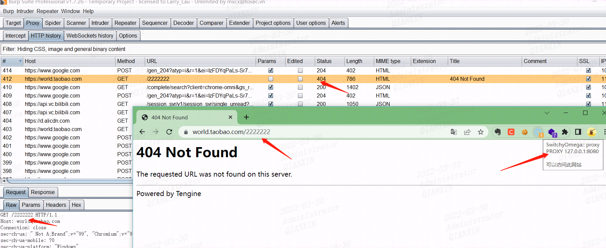

那如果修改为其它端口呢，比如10000，试试

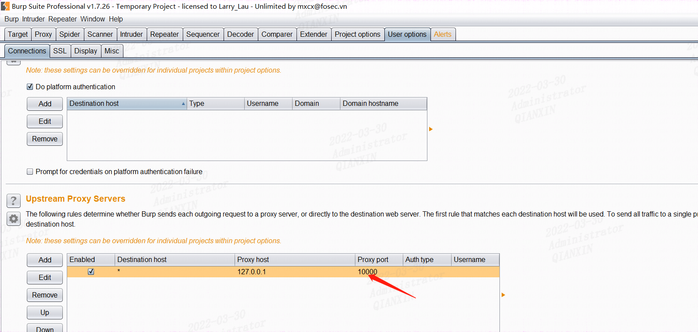

因为我本地没有10000端口的代理，所以burp的包就不能从该端口出去，就会报错

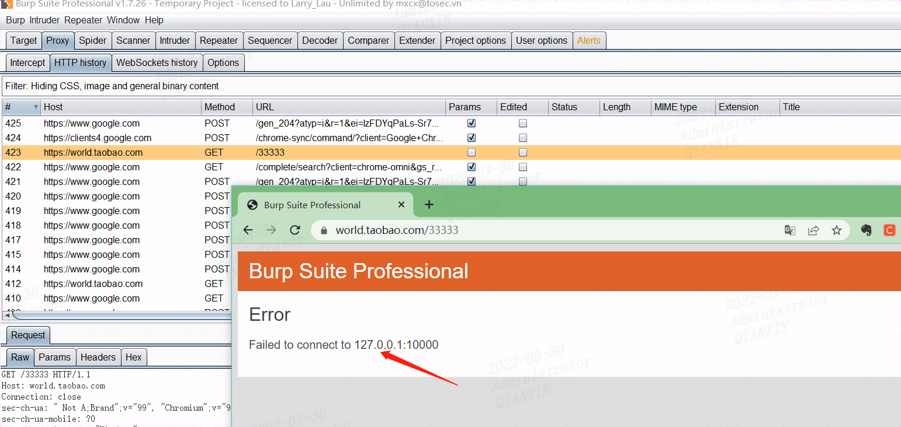

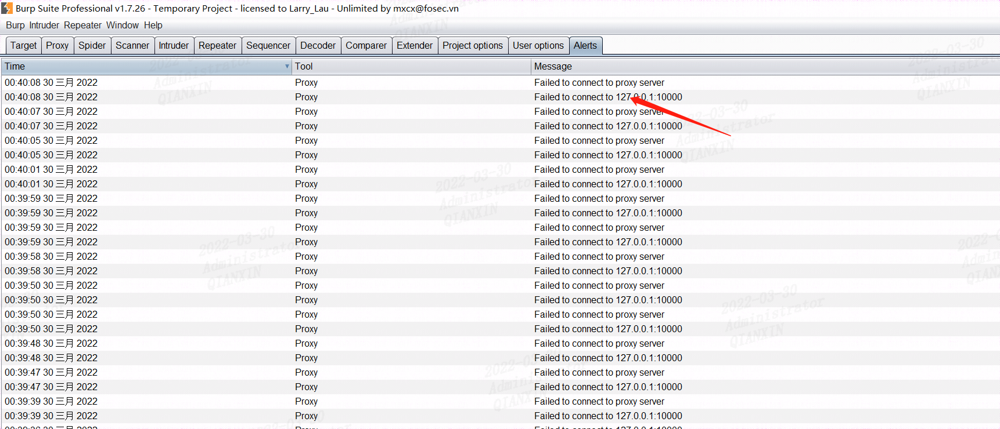

根据前面的推测，只要burp配置出口代理服务器信息，那么目标端记录的就是代理的服务器了