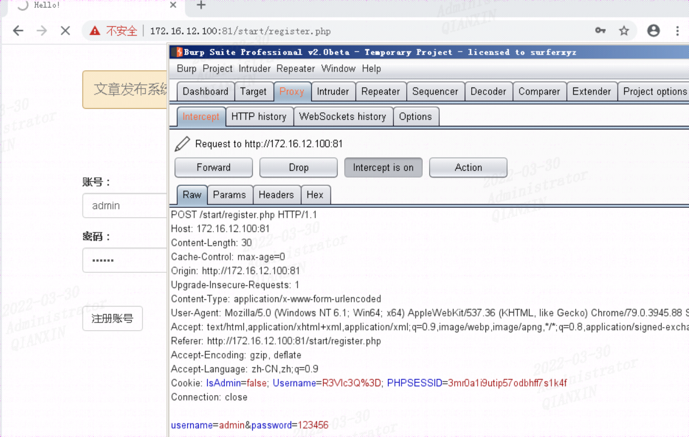
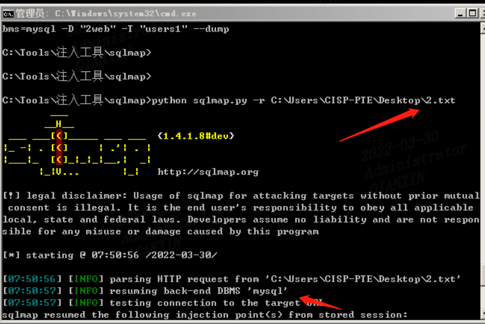
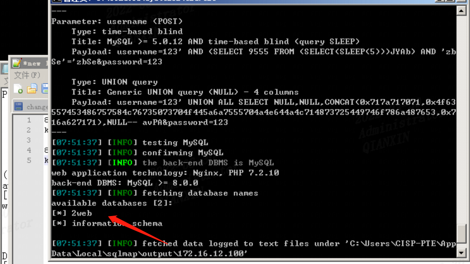
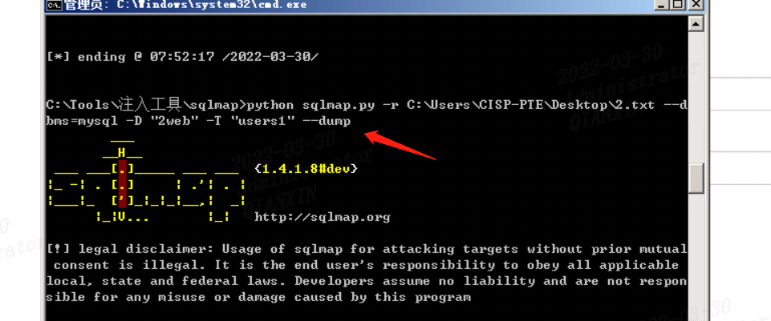
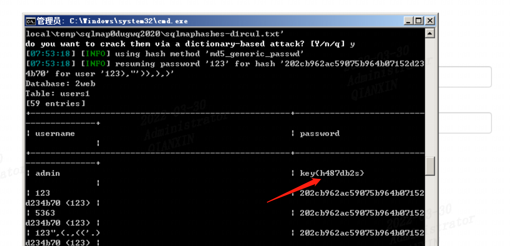
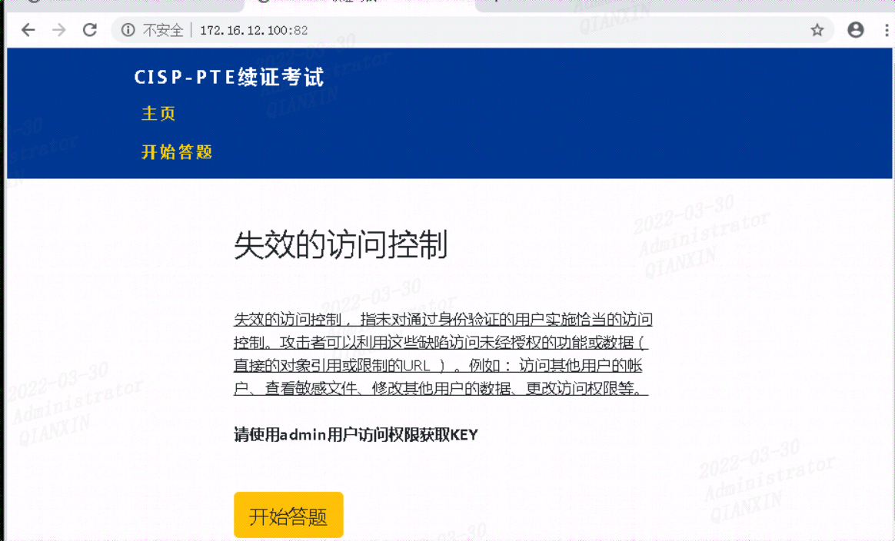
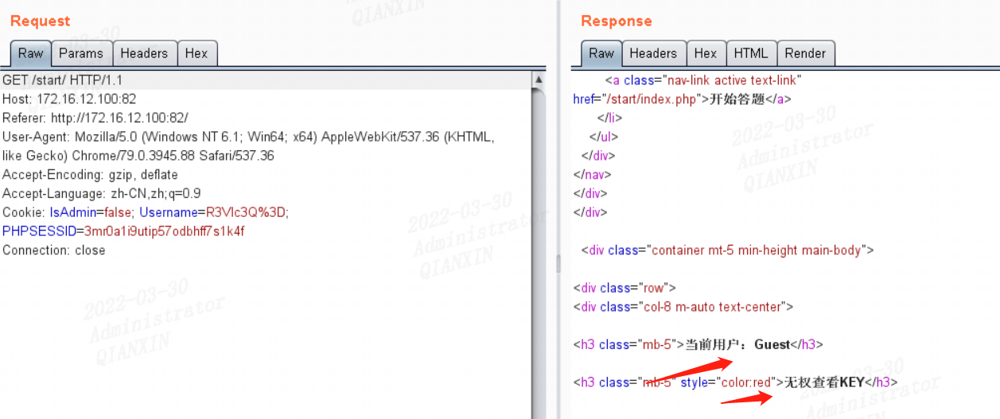
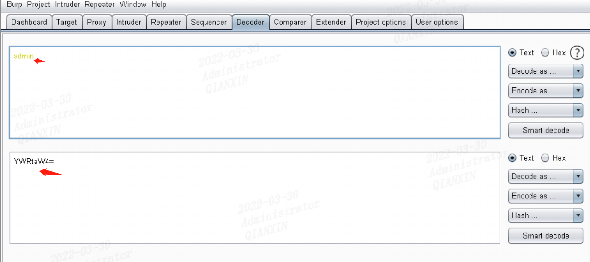
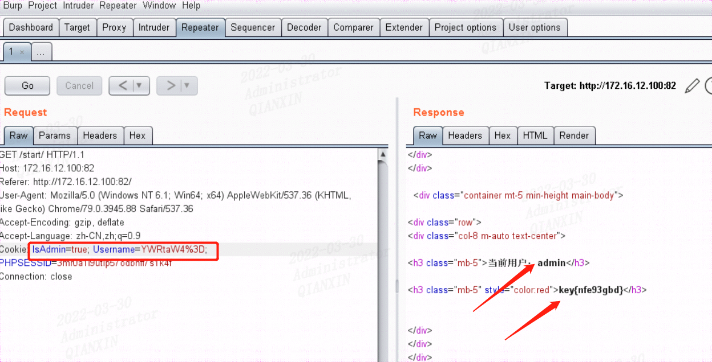

## CISP-PTE认证考试2019-08-21(网友)

**1. (本题 1 分)XXE漏洞可以做什么**
A.获取用户浏览器信息
B.网络钓鱼
C.盗取用户cookie
==D.读取服务器文件==

**2. (本题 1 分)以下哪些是WebLogic安装后的默认帐户名、口令使用的字符串**
A.system
B.admin
C.login
==D.weblogic==

**3. (本题 1 分)Apache的配置文件中，哪个字段定义了访问日志的路径**
A.HttpLog
==B.AccessLog==
C.HttpdLog
D.CustomLog

**4. (本题 1 分)默认情况下，windows的哪个版本可以抓取到LM hash**（A还是B？）
A.windows XP
==B.windows server 2008==
C.windows 7
D.windows Vista

**5. (本题 1 分)在拿到一个windows服务器下的webshell之后，我想看看当前在线的用户，下面这些命令可以做到的是**
==A.net user==
B.dir c:users
C.net localgroup administrators
D.tasklist /v

**6. (本题 1 分)高层的协议将数据传递到网络层，形成__，然后传递到数据链路层**
==A.数据包==
B.数据帧
C.信元
D.数据段

**7. (本题 1 分)设计国家秘密的计算机信息系统，必须？**
A.实行单向隔离
B.实行逻辑隔离
C.以上都不是
==D.实行物理隔离==

**8. (本题 1 分)设置IP地址MAC绑定的目的？**
==A.防止非法接入==
B.加强认证
C.防止DOS攻击
D.防止泄漏网络拓扑

**9. (本题 1 分)UNIX中，可以使用下面哪一个代替Telnet，能完成同样的事情并且更安全？**
A.FTP
B.RHOST
C.RLOGON
==D.SSH==

**10. (本题 1 分)网络攻击的种类？**
A.物理攻击、黑客攻击、病毒攻击
B.黑客攻击、病毒攻击
C.硬件攻击、软件攻击
==D.物理攻击、语法攻击、语义攻击==

**11. (本题 1 分)当今IT的发展与安全投入，安全意识和安全手段之间形成？**
A.管理方式的缺口
B.安全风险屏障
C.管理方式的变革
==D.安全风险缺口==

**12. (本题 1 分)手机发送的短信人被人截获，破坏了信息的？**
A.真实性
B.可用性
==C.机密性==
D.完整性

**13. (本题 1 分)Hash函数的输入长度是？**
A.任意长度
==B.128bit==
C.512bit
D.160bit

**14. (本题 1 分)如果你向一台远程主机发送特定的数据包，却不想远程主机响应你的数据包，这时你使用哪一种类型的进攻手段？**
==A.地址欺骗==
B.拒绝服务
C.缓冲区溢出
D.暴力攻击

**15. (本题 1 分)计算机网络通信时，利用（）协议获得对方的MAC地址**
==A.ARP==
B.RARP
C.TCP
D.UDP

**16. (本题 1 分)RSA算法基于的数学难题时？**
==A.大质数分解的困难性==
B.椭圆曲线问题
C.费马大定理
D.离散对数问题

**17. (本题 1 分)当web服务器访问人数超过了设计访问人数上限，将可能出现的HTTP状态码是？**
==A.503==
B.200
C.403
D.302

**18. (本题 1 分)防火墙技术是什么安全模型**
A.以上都不是
B.混合式
C.主动式
==D.被动式==

**19. (本题 1 分)针对数据包过滤和应用网关技术存在的缺点而引入的防火墙技术，这是（？）防火墙的特点**
==A.复合型防火墙==
B.应用级网关型
C.包过滤型
D.代理服务型

**20. (本题 1 分)属于第二层的VPN隧道协议有**
A.GRE
B.IPSec
==C.PPTP==
D.以上都不是

## 天融信网络安全基础知识1

1 哪些措施可以保护个人信息（）A
==A. 定期修改密码或采用强密码==
B. 从不清理系统日志或各种软件使用痕迹
C. 随意连接wifi
D. 使用记住密码

2 Burp Suite 是用于攻击（）的集成平台。A
==A. web 应用程序==
B. 客户机
C. 服务器
D. 浏览器

3 使用nmap进行ping扫描时使用的参数（）A
==A. -sP==
B. -p
C. -p0
D. -A

4 nmap的-sV是什么操作（）C
A. TCP全连接扫描
B. FIN扫描
==C. 版本扫描==
D. 全面扫描

5 在HTTP 状态码中表示重定向的是（）B
A. 200
==B. 302==
C. 403
D. 500

6 以下哪个是常用WEB漏洞扫描工具（）A
==A. Acunetix WVS 8.0==
B. hydra
C. 中国菜刀
D. NMAP

7 扫描器之王NMAP中，全面扫描的命令是什么（）D
A. -O
B. -sV
C. -sP
==D. -A==

8 Hydra 工具中的 -L 参数的含义是（）D
A. 指定单个密码
B. 指定一个密码字典
C. 指定一个用户名
==D. 指定一个用户名字典==

9 在远程管理Linux服务器时，以下（ ）方式采用加密的数据传输。C
A. rsh
B. telnet
==C. ssh==
D. rlogin

10下列工具中可以对Web表单进行暴力破解的是？（ ）A
==A. Burp suite==
B. Nmap
C. Sqlmap
D. Appscan

11 下列选项中不是Hydra 工具中的 -e 参数的值是（）A
==A. o==
B. n
C. s
D. r

12 aspx 的网站配置文件一般存放在哪个文件里（）C
A. conn.asp
B. config.php
==C. web.config==
D. index.aspx

13在Google Hacking 中，下面哪一个是搜索指定文件类型的语句（）D
A. intext
B. intitle
C. site
==D. filetype==

14 在网上填写个人信息时，应注意（）B
A. 全部填写真实信息
==B. 选择性填写真实信息==
C. 全部填写虚假信息
D. 不填

15 SQL 注入出password 的字段值为“YWRtaW44ODg=”，这是采用了哪种加密方式（）B
A. md5
==B. base64==
C. AES
D. DES

16当发觉自己个人信息泄漏时，正确的处理方式（）D
A. 无所谓，不予理会
B. 心有芥蒂，但无行动
C. 在网络上进行抱怨
==D．向有关部门或企业进行投诉==

17.如果个人信息泄漏会导致一下那些麻烦（）多选ABC
==A．骚扰短信或骚扰电话==
==B．被冒充熟人进行诈骗==
==C．身份被冒用，以至个人名誉及财产受损==
D．没有影响

18 关于木马植入的方法，正确的是（）多选ACD
==A．邮件植入==
B．系统生成
==C. 文件下载==
==D. im植入==

19 下列关于特洛伊木马的特点，下列说法正确的是：（）多选AC
==A. 欺骗性的隐蔽下载==
B. 手动激活里应外合
==C. 远控攻击系统==
D. 以上说法均正确

20 下列木马入侵步骤中顺序正确的是（）C
A. 信息泄漏-建立连接-运行木马
B. 传播木马-远程控制-信息泄漏
==C. 配置木马-传播木马-运行木马==
D. 信息泄漏-建立连接-传播木马

## 天融信网络安全基础知识2

1. 以下关于vpn说法正确的是： B
    A. vpn不能做到信息认证和身份认证
    ==B. VPN指的是用户通过公用网络建立的临时的，安全的连接==
    C. 进入QQVPN只能提供身份认证，不能提供加密数据的功能
    D. VPN指的用户自己租用线路，和公共网络物理上完全隔离的安全的线路
2. 以下哪工具不可以抓取http数据包 C
    A. fiddler
    B. wireshark
    ==C. nmap==
    D. burpsuite
3. 以下哪个数据库不是关系型数据库 A
    ==A. redis==
    B. mssql
    C. mysql
    D. oracle
4. 以下命令可以用来获取dns记录的是 C
    A. ping
    B. traceroute
    ==C. dig==
    D. who
5. 拿到一个windows下的webshell，我想看一下主机的名字，如下命令做不到的是： B
    A. hostname
    ==B. set==
    C. systeminfo
    D. ipconfig /all
6. 如何防护存储型xss漏洞 A
    ==A. 对html标签进行转义处理==
    B. 使用安全的浏览器
    C. 使用cookie存储身份信息
    D. 使用Ajax技术
7. 攻击者截获并记录了从A到B的数据，然后从早些时候所截获的数据中提取信息重放发往B称为 C
    A. 口令猜测和字典攻击
    B. 强力攻击
    ==C. 回放攻击==
    D. 中间人攻击
8. XXe漏洞可以做什么 B
    A. 获取用户浏览器信息
    ==B. 读取服务器文件==
    C. 网络钓鱼
    D. 盗取用户cookie
9. mysql数据库若使用load_file()函数读取操作文件时需要的权限是 C
    A. read
    B. write
    ==C. file==
    D. loadfile
10. sqlserver数据库身份验证支持模式错误是 A
    ==A. radius身份验证==
    B. windows和sql混合验证模式
    C. sql身份验证
    D. windows身份验证
11. CSRF攻击不能做什么 D
    A. 修改用户权限
    B. 删除用户信息
    C. 取消订单
    ==D. 盗用户凭证==
12. 语义攻击利用的是 A
    ==A. 信息内容的含义==
    B. 黑客和病毒的攻击
    C. 黑客对系统的攻击
    D. 病毒对软件攻击
13. TCP会话劫持出了syn flood攻击还需要D
    A. syn扫描
    B. 扫描syn/ack
    C. 扫描TCP
    ==D. 序列号预测==
14. 张三将微信个人的头像换成微群中某好友头像，并将昵称改为该好友的昵称，然后向该好友的其它好友发送一些欺骗消息，该攻击行为是： D
    A. 口令攻击
    B. 拒绝服务攻击
    C. 暴力破解
    ==D. 社会工程学==
15. 以下只能通过字典枚举的数据库是：B
    A. oracle
    ==B. mysql<5.0==
    C. mssql
    D. mysql>5.0 informatin_shcema.tables
16. 第一次出hacker这个词是在：C
    A. bell实验室
    B. AT&T实验室
    ==C. 麻省理工ai实验室==
    D. 以上都没有
17. 之前版本的中间件未出现过解析漏洞的是 B
    A. apache
    ==B. tomcat==
    C. iis
    D. ngnix
18. 在google hacking语法中，下面哪一个是搜索指定类型文件 D
    A. site
    B. intitle
    C. intext
    ==D. filetype==
19. windows操作系统中可显示或修改任意访问控制列表的命令是 C
    A. systeminfo
    B. tasklist
    ==C. cacls==
    D. ipconfig
20. 以下关于cc攻击方法错误的是： A
    ==A. cc攻击利用的是tcp协议的缺陷==
    B. CC攻击难以获取目标机器的控制权
    C. CC攻击最早在国外大面积流行
    D. Cc攻击需要借助代理进行

## 天融信网络安全基础知识3

1、如果一个网站存在CSRF漏洞，可以通过CSRF漏洞做什么？ D

A获取网站用户注册的个人资料信息
B修改网站用户注册的个人资料信息
C冒用网站用户的身份发布信息
==D以上都可以==

2、Firefox浏览器插件Hackbar提供的功能没有什么？C

A.修改浏览器访问referer
B.BASE64编码和解码
==C.代理修改WEB页面的内容==
D.POST方式提交数据

3、以下哪个服务器未曾被发现文件解析漏洞? B

A.nginx
==B.squid==
A.pache
D.IIS

4、以下哪个工具不可以抓取HTTP数据包? D

A.Fiddler
B.Wireshark
C.Burpsuite
==D.Nmap==

5、攻击者通过XSS漏洞获取到QQ用户的cookie后，可以进行一下操作? D

A.劫持微信用户
B.偷取Q币
C.控制用户摄像头
==D.进入QQ空间==

6、以下哪种工具可以进行sql注入攻击？B

A.msf
==B.sqlmap==
C.w3af
D.nmap

7、apache默认解析的后缀中不包括? A

==A.pht==
B.php3
C.php5
D.phtml

8、之前版本的中间件未出现过解析漏洞的是? A

==A.tomcat==
B.apache
C.iis
D.ngnix

9、以下数据库只能通过字典枚举数据表的是 A

==A.mysql < 5.0==
B.mysql > 5.0
C.oracle
D.mssql

10、以下哪个数据库不是关系型数据库 C

A.mysql
B.mssql
==C.redis==
D.oracle

11、以下命令可以用来获取DNS记录的是 A

==A.dig==
B.ping
C.who
D.traceroute

12、linux 环境下，查询日志文件最后100行数据，正确的方式是 C

A.grep -100 log
B.mv -100 log
==C.tail -100 log==
D.cat -100 log

13、一个网站存在命令执行漏洞，由于服务器不能连外网，这时我们可以利用什么样的方式将文件上传到服务器 D

A.vbs
B.powershell
C.echo
==D.ftp==

14、下面的哪个命令可以打印linux下的所有进程信息 C

A.su
B.ls -l
==C.ps -ef==
D.ls –d

15、下面哪个是administrator用户的SID C

A.S-1-5-21-3698344474-843673033-3679835876-100
B.S-1-5-21-3698344474-843673033-3679835876-1001
==C.S-1-5-21-3698344474-843673033-3679835876-500==
D.S-1-5-21-3698344474-843673033-3679835876-1000

16、默认情况下，windows的哪个版本可以抓取到LM hash B

A.windows XP
==B.windows server 2008==
C.windows Vista
D.windows 7

17、在测试sql注入时，以下哪种方式不可取 D

A.?id=1 or 1=1
B.?id=2-1
C.?id=1+1
==D.?id=1 and 1=1==

18、在编写目录扫描工具时哪种请求方式可以增加扫描速度 C

A.GET
B.PUT
==C.HEAD==
D.POST

19、没权限访问某个页面，服务器会返回哪个状态码 D

A.401
B.200
C.500
==D.403==

20、在web页面中增加验证码功能后，下面说法正确的是 C

A.可以防止注入攻击
B.可以防止文件上传漏洞
==C.可以防止数据重复提交正确答案==
D.可以防止文件包含漏洞

## PTE测试题_问卷星

地址：https://www.wjx.cn/xz/89665850.aspx

**注：后面答案不保证全对，全是自己整理**

1. 以下关于cc攻击方法错误的是？
    ==A. cc攻击利用的是tcp协议的缺陷==B. CC攻击难以获取目标机器的控制权C. CC攻击最早在国外大面积流行D. Cc攻击需要借助代理进行

2. 如果一个网站存在CSRF漏洞，可以通过CSRF漏洞做什么？
    A. 获取网站用户注册的个人资料B. 修改网站用户注册信息C. 冒用网站用户的身份==D. 以上都可以==

3. Firefox浏览器插件Hacbar提供的功能没有什么？
    A. 修改浏览器访问refererB. BASE64编码和解码==C. 代理修改WEB页面==D. POST方式提交数据

4. 以下哪个服务器未曾被发现文件解析漏洞?
    A. nginx==B. squid==C. ApacheD. IIS

5. 以下哪个工具不可以抓取HTTP数据包?
    A. FiddlerB. WiresharkC. Burpsuite==D. Nmap==

6. 攻击者通过XSS漏洞获取到QQ用户的cookie后，可以进行一下操作?
    A. 劫持微信用户B. 偷取Q币C. 控制用户摄像头==D. 进入QQ空间==

7. 以下哪种工具可以进行sql注入攻击？
    A. msf==B. sqlmap==C. w3afD. nmap

8. apache默认解析的后缀中不包括
    A. phtB. php3C. php5D. phtml

9. 之前版本的中间件未出现过解析漏洞的是
    ==A. tomcat==B. apacheC. iisD. ngnix

10. 以下数据库只能通过字典枚举数据表的是
    ==A. mysql < 5.0==B. mysql > 5.0C. oracleD. mssql

11. 以下哪个数据库不是关系型数据库
    A. mysqlB. mssql==C. redis==D. oracle

12. 以下命令可以用来获取DNS记录的是
    ==A. dig==B. pingC. whoD. traceroute

13. linux 环境下，查询日志文件最后100行数据，正确的方式是
    A. grep -100 logB. mv -100 log==C. tail -100 log==D. cat -100 log

14. 一个网站存在命令执行漏洞，由于服务器不能连外网，这时我们可以利用什么样的方式将文件上传到服务器
    A. vbsB. powershellC. echo==D. ftp==

15. 下面的哪个命令可以打印linux下的所有进程信息
    A. suB. ls -l==C. ps -ef==D. ls -d

16. 下面哪个是administrator用户的SID
    A. S-1-5-21-3698344474-843673033-3679835876-100B. S-1-5-21-3698344474-843673033-3679835876-1001==C. S-1-5-21-3698344474-843673033-3679835876-500==D. S-1-5-21-3698344474-843673033-3679835876-1000

17. 默认情况下，windows的哪个版本可以抓取到LM hash（A和B存在争议）
    A. windows XP==B. windows server 2008==C. windows VistaD. windows 7

18. 在测试sql注入时，以下哪种方式不可取
    A. ?id=1 or 1=1B. ?id=2-1C. ?id=1+1==D. ?id=1 and 1=1==

19. 在编写目录扫描工具时哪种请求方式可以增加扫描速度
    A. GETB. PUT==C. HEAD==D. POST

20. 没权限访问某个页面，服务器会返回哪个状态码
    A. 401B. 200C. 500==D. 403==

21. 在web页面中增加验证码功能后，下面说法正确的是
    A. 可以防止注入攻击B. 可以防止文件上传漏洞==C. 可以防止数据重复提交正确答案==D. 可以防止文件包含漏洞

22. SQL Sever中可以使用哪个存储过程调用操作系统命令，添加系统账号？
    A.xp_dirtreeB.xp_xshell==C.xp_cmdshell==D.xpdeletekey

23. Oracle默认情况下，口令的传输方式是？
    A.DES加密传输==B.明文传输==C.3DES加密传输D.MD5加密传输

24. 不属于数据库加密方式的是？
    A.硬件/软件加密B.库内加密==C.专用中间件加密==D.库外加密

25. IPSecVPN安全技术没有用到？
    A.端口映射技术B.隧道技术C.加密技术==D.入侵检测技术==

26. 小斌正在对小明的网站进行渗透测试，经过一段时间的探测后，小斌发现小明的网站存在一个sql注入漏洞： http://i.xiaoming.com/user/says.php?uid=1845%20skey=2014 该地址是用于搜索用户曾经的发言的页面,会返回一些留言信息，小斌简单测试后发现http://i.xiaoming.com/user/says.php?uid=1845%20skey=2014’%20or%202-1%20--%20 返回错误信息http://i.xiaoming.com/user/says.php？uid=1845%20skey=2014’%20)%20or%201-1%20--%20却返回空白信息则小明网站该处逻辑可能的sql语句是？
    A.select * from user_says where deleted=0 and uid=skey%”B.select * from user_says where deleted=0 and (uid=skey%’)==C.select * from user_says where deleted=0 and (uid=key’)==D.select * from user_says where deleted=0 and uid=key’

27. 张三将微信个人头像换成微信群中某好友头像，并将昵称改为该好友的昵称，然后向该好友的其他好友发送一些欺骗消息。该攻击行为属于以下哪类攻击？
    A.口令攻击B.拒绝服务攻击==C.社会工程学攻击==D.暴力破解

28. 数据完整性指的是?
    ==A.防止非法实体对用户的主动攻击，保证数据接收方收到的信息与发送方发送的信息完全一致==B.保护网络中个系统之间交换的数据，防止因数据被截获而造成泄密C.确保数据是由合法实体发出的D.提供连接实体身份的鉴别

29. 以下算法中属于非对称算法的是?
    A.DES==B.RSA算法==C.IDEAD.三重DES

30. 信息安全中PDR模型的关键因素是?
    A.模型B.客体C.技术==D.人==

31. 数据保密性安全服务的基础是？
    A.数字签名机制==B.加密机制==C.访问控制机制D.数据完整性机制

32. 什么是数据库安全的第一道保障？
    A.操作系统的安全B.数据库管理系统层次==C.网络系统的安全==D.数据库管理员

33. 在以下认证方式中，最常用的认证方式是？
    ==A.基于帐户名/口令认证==B.基于PKI认证C.基于摘要算法认证D.基于数据库认证

34. 主要用于加密机制的协议是 ？
    ==A.SSL==B.TELNETC.HTTPD.FTP

35. 向有限的空间输入超长的字符串是哪一种攻击手段？
    ==A.缓冲区溢出==B.IP欺骗C.拒绝服务D.网络监听

36. 常规端口扫描和半开放式扫描的区别是？
    A.半开式采用UDP方式扫描B.没区别C.扫描准确性不一样==D.没有完成三次握手，缺少ACK过程==

37. 下列哪类工具是日常用来扫描web漏洞的工具？
    A.NMAP==B.IBM APPSCAN==C.X-SCAND.Nessus

38. 许多黑客攻击都是利用软件实现中的缓冲区溢出的漏洞，对此最可靠的解决方案是什么？
    A.安装防病毒软件B.安装防火墙==C.给系统安装最新的补丁==D.安装入侵检测系统

39. 当访问web网站的某个页面资源不存在时，将会出现的HTTP状态码是？
    A.200==B.404==C.401D.302

40. 黑客通过以下哪种攻击方式，可能大批量获取网站注册用户的身份信息？
    ==A.越权==B.XSSC.CSRFD.以上都可以

41. 在Google Hacking语法中，下面哪一个是搜索指定类型的文件？
    A.intitleB.intext==C.filetype==D.site

42. 以下关于vpn说法正确的是?
    A. VPN不能做到信息认证和身份认证==B. VPN指的是用户通过公用网络建立的临时的，安全的连接==C. 进入QQVPN只能提供身份认证，不能提供加密数据的功能D. VPN指的用户自己租用线路，和公共网络物理上完全隔离的安全的线路

43. 以下哪工具不可以抓取http数据包？
    A. fiddlerB. wireshark==C. nmap==D. burpsuite

44. 以下哪个数据库不是关系型数据库？
    ==A. redis==B. mssqlC. mysqlD. oracle

45. 以下命令可以用来获取dns记录的是？
    A. pingB. traceroute==C. dig==D. who

46. 拿到一个windows下的webshell，我想看一下主机的名字，如下命令做不到的是？
    A. hostname==B. set==C. systeminfoD. ipconfig /all

47. 如何防护存储型xss漏洞？
    ==A. 对html标签进行转义处理==B. 使用安全的浏览器C. 使用cookie存储身份信息D. 使用Ajax技术

48. 攻击者截获并记录了从A到B的数据，然后从早些时候所截获的数据中提取信息重放发往B称为？
    A. 口令猜测和字典攻击B. 强力攻击==C. 回放攻击==D. 中间人攻击

49. XXe漏洞可以做什么？
    A. 获取用户浏览器信息==B. 读取服务器文件==C. 网络钓鱼D. 盗取用户cookie

50. mysql数据库若使用load_file()函数读取操作文件时需要的权限是？
    A. readB. write==C. file==D. loadfile

51. sqlserver数据库身份验证支持模式错误是？
    ==A. radius身份验==证B. windows和sql混合验证模式C. sql身份验证D. windows身份验证

52. CSRF攻击不能做什么？
    A. 修改用户权限B. 删除用户信息C. 取消订单==D. 盗用户凭证==

53. 语义攻击利用的是？
    ==A. 信息内容的含义==B. 黑客和病毒的攻击C. 黑客对系统的攻击D. 病毒对软件攻击

54. TCP会话劫持出了syn flood攻击还需要？
    A. syn扫描B. 扫描syn/ackC. 扫描TCP==D. 序列号预测==

55. 张三将微信个人的头像换成微群中某好头像，并将昵称改为该好友的昵称，然后向该好友的其它好友发送一些欺骗消息，该攻击行为是？
    A. 口令攻击B. 拒绝服务攻击C. 暴力破解==D. 社会工程学==

56. 以下只能通过字典枚举的数据库是？
    A. oracle==B. mysql<5.0==C. mssqlD. mysql>5.0 informatin_shcema.tables

57. 第一次出hacker这个词是在？
    A. bell实验室B. AT&T实验室==C. 麻省理工ai实验室==D. 以上都没有

58. 之前版本的中间件未出现过解析漏洞的是？
    A. apache==B. tomcat==C. iisD. ngnix

59. 在google hacking语法中，下面哪一个是搜索指定类型文件？
    A. siteB. intitleC. intext==D. filetype==

60. windows操作系统中可显示或修改任意访问控制列表的命令是？
    A. systeminfoB. tasklist==C. cacls==D. ipconfig

    

## CISP-PTE维持（2022-03-30）

### 0x00前言

初考CIST-PTE是在2019年，今天做了下维持，对其中的一些题目做下记录。其实这些题目基本上都是在网上可以找到的，其中标注的答案部分有极个别可能有误，请慎重！

这里说下题型分布，选择题40个，80分；实操题2个，20分。总分100，>=70即可拿证。下面开始吧

### 0x01选择题

1、（）是最常用的公钥密码算法 （2分） 

A 量子密码B DSA==C RSA==D 椭圆曲线

2、通过修改HTTP Headers 中的哪个键值可以伪造来源网址（） （2分） 

A User-AgentB Accept==C Referer==D X-Forwarded-For

3、在使用Sqlmap进行SQL注入时，我们会使用什么参数来爆所有的数据库名（） （2分） 

==A dbs==B tablesC columnsD current-db

4、SQL Sever中可以使用哪个存储过程调用操作系统命令，添加系统账号（） （2分） 

A xpdeletekey==B xp_cmdshell==C xp_shellD xp_dirtree

5、下列哪个方法不是HTTP协议的请求方法（） （2分） 

==A SELECT==B HEADC OPTIONSD PUT

6、Metasploit Framework中，可以使用（）来枚举本地局域网中的所有活跃主机 （2分） 

A dir_scanner==B arp_sweep==C empty_udpD arp_neighbo

7、哪一项不是命令执行漏洞的危害（） （2分） 

A 继承WEB服务程序的权限，读写文件==B 对服务器造成大流量攻击==C 控制整个网站D 反弹SHELL

8、永恒之蓝漏洞利用以下哪个端口（） （2分） 

A 3306B 21C 3389==D 445==

9、MSSQL的默认端口是（） （2分） 

A 1521==B 1433==C 3306D 3389

10、下列（）不是常见系统命令函数 （2分） 

A shell_exec()==B assert()==C system()D exec()

11、Unix系统中存放每个用户信息的文件是（） （2分） 

A /sys/passwdB /sys/passwordC /etc/password==D /etc/passwd==

12、Hydra工具中的-L参数的含义是（） （2分） 

A 指定单个密码==B 指定一个用户名字典==C 指定一个密码字典D 指定一个用户名

13、关于命令执行漏洞的利用描述错误的是（） （2分） 

A System函数可以用来执行一个外部的应用程序，并将相应的执行结果输出==B Eval函数会将参数字符串作为系统程序代码来执行==C Exec函数可以用来执行一个外部的应用程序D Shell_exec：执行shell命令并返回输出的字符串

14、XXE漏洞可以做什么（） （2分） 

A 网络钓鱼==B 读取服务器文件==C 盗取用户CookieD 获取用户浏览器信息

15、PHP提供以下哪些函数来避免SQL注入（） （2分） 

A htmlentities==B mysql_real_escape_string==C escapeshellargD htmlspecialchars

16、当成功通过msf黑进对方系统并获得system权限后，不能做什么操作（） （2分） 

==A 开关机==B 屏幕截图C 读写文件D 键盘记录

17、下列那个选项不是上传功能常用安全监测机制（） （2分） 

==A URL中是否包含一些特殊标签==B 服务端文件扩展名检查验证机制C 客户端检查机制JavaScript验证D 服务的MIME检查验证

18、拒绝服务不包括以下哪一项（） （2分） 

A DDoSB Land攻击==C ARP攻击==D 畸形报文攻击

19、下列工具中可以对WEB表单进行暴力破解的是（） （2分） 

A SqlmapB Nmap==C BurpSuite==D Appscan

20、RDP的端口号为（） （2分） 

A 443==B 3389==C 1433D 3306

21、SQL注入时使用into uotfile进行写木马的操作，必须满足下列哪个选项最为准确（） （2分） 

A 必须知道网站的绝对路径B 不需要条件，可以随便写==C 支持联合查询并且知道网站的绝对路径==D 支持联合查询

22、（）属于Web中使用的安全协议 （2分） 

A PEM、SSLB S/MIME、SSLC S-HTTP、S/MIME==D SSL、S-HTTP==

23、以下哪种方法不能找到CDN的网站的真实IP（） （2分） 

==A 使用Wireshark对本地网络请求进行抓包分析==B 利用SSL证书寻找真实IPC 使用世界各地服务器对域名进行PING检测D 查询历史DNS记录

24、文件包含中伪协议 使用（）进行写入一句话木马 （2分） 

A php://filterB http://C phar://==D php://input==

25、在Linux系统中，一个文件的访问权限是755，其含义是什么（） （2分） 

A 可读==B 可读，可执行，可写入==C 可写入D 可读，可执行

26、“Q0lTUC1QVEU=”此段密文采用了那种加密方式（） （2分） 

A DESB AESC MD5==D Base64==

27、ASPX的网站配置文件一般存放在哪个文件里（） （2分） 

A index.aspxB config.phpC conn.asp==D web.config==

28、以下哪项不是绕过XSS过滤的办法（） （2分） 

A 利用单引号双引号B ==利用空字符==C 利用HTML标签的属性值D 扰乱过滤规则

29、对网络系统进行渗透测试，通常是按什么顺序来进行的（） （2分） 

A 侦查阶段、控制阶段、入侵阶段==B 侦查阶段、入侵阶段、控制阶段==C 控制阶段、侦查阶段、入侵阶段D 入侵阶段、侦查阶段、控制阶段

30、以下查看linux系统内核版本是（） （2分） 

A cat /release -aB cat /etc/passwdC cat /porc/version==D uname –a==

31、存储型XSS一般会出现在网站的哪个位置（） （2分） 

A 搜索栏==B 网站的留言板==C URL位置D 登陆框

32、文件包含中%00截断，对PHP版本有什么要求（） （2分） 

==A PHP版本<5.3.4==B PHP版本<5.5.4C PHP版本<5.1.4D PHP版本>5.5.4

33、以下哪项不属于针对数据库的攻击（） （2分） 

A 特权提升B SQL注入==C 利用XSS漏洞攻击==D 强力破解弱口令或默认的用户名及口令

34、下列哪项不属于同源策略的要求（） （2分） 

A 同域名==B 同IP==C 同端口D 同协议

35、防火墙最主要被部署在（）位置 （2分） 

A 骨干线路==B 网络边界==C 重要服务器D 桌面终端

36、一个网站存在命令执行漏洞，由于服务器不能连外网，这时我们可以利用（）方式将文件上传到服务器 （2分） 

A vbs==B FTP==C PowerShellD echo

37、SQL注入中 = 被过滤可以使用（）来代替 （2分） 

==A LIKE==B VSC &D AND

38、口令机制通常用于（） （2分） 

A 标识B 授权C 注册==D 认证==

39、用户收到了一封可疑的电子邮件，要求用户提供银行账户及密码，这是属于何种攻击手段（） （2分） 

A 缓冲区溢出攻击==B 钓鱼攻击==C 暗门攻击D DDos攻击

40、CSRF攻击不能做什么（） （2分） 

==A 盗取用户凭证==B 修改用户权限C 删除用户信息D 取消订单

### 0x02实操题

#### 1-sql注入

**请访问：172.16.12.100:81进入答题，请输入你获得的KEY： （10分）** *进入环境*

key：key{h487db2s}

解题过程如下：

首先找到注册位置，抓包

将包的内容保存到本地，使用sqlmap注入

使用参数 --dbs爆出所有数据库

紧接着爆表出表users1，导出users1表内容，如下：

得到key的值

#### 2-越权

**请访问：172.16.12.100:82进入答题，请输入你获得的KEY： （10分）** *进入环境*

key：key{nfe93gbd}

解题过程如下：

访问目标主机82端口

点击开始答题抓包

发现是Guest用户，考虑到是越权，将请求包里的Cookie信息修改为对应admin用户

分别修改IsAdmin和Username字段为true，YMRtaW4%3D（ps：注意IsAdmin字段不能是yes，Username字段不能是Admin的base64编码，别问我是怎么知道的。。。）

