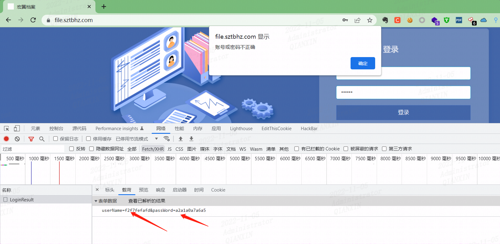
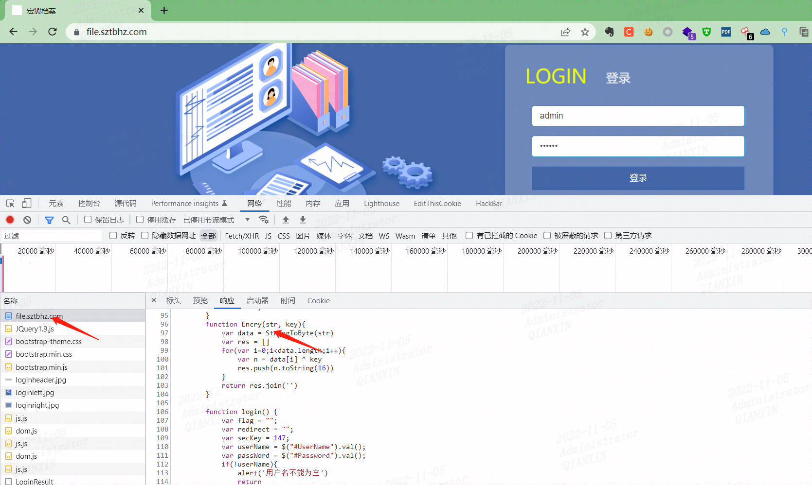
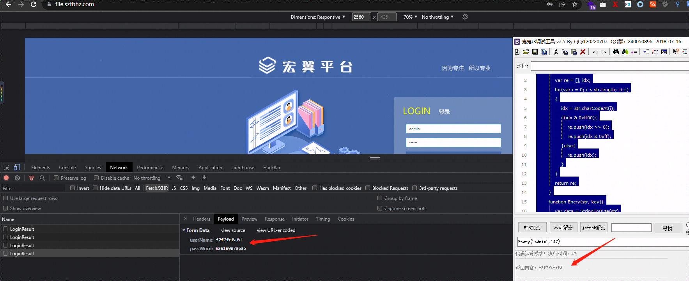
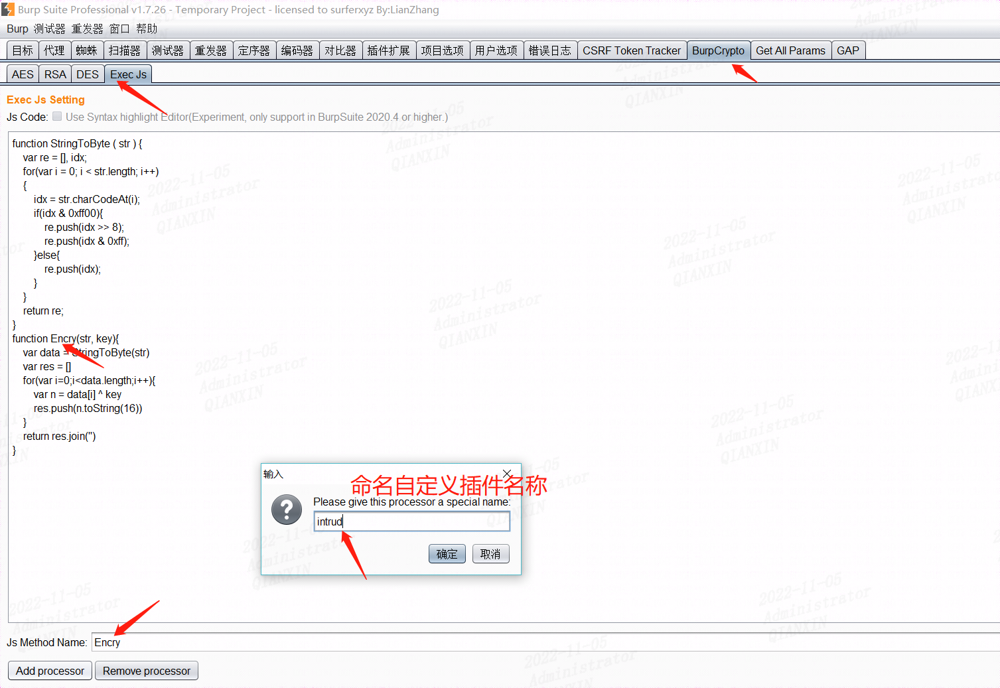
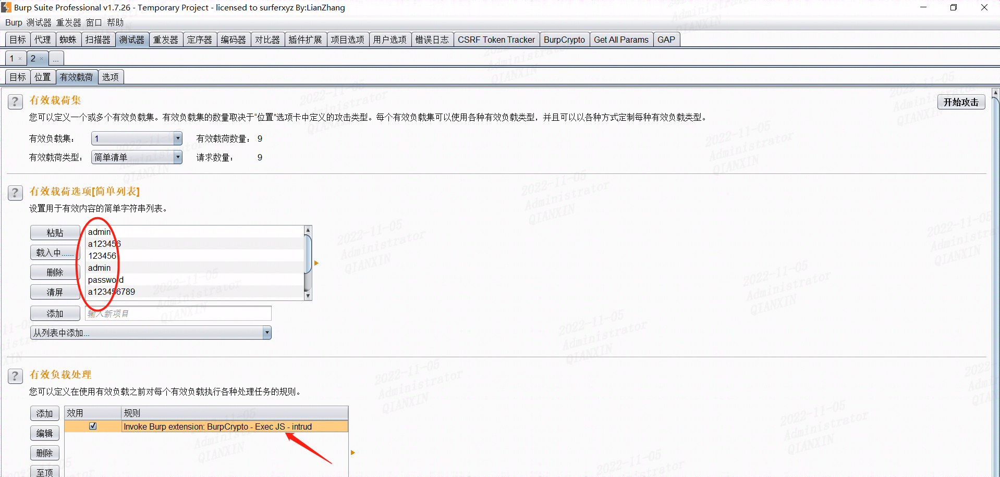
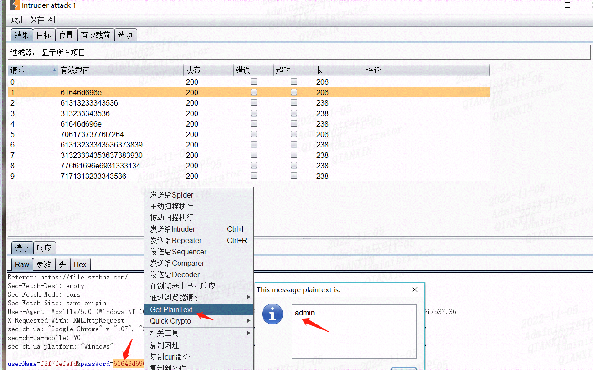
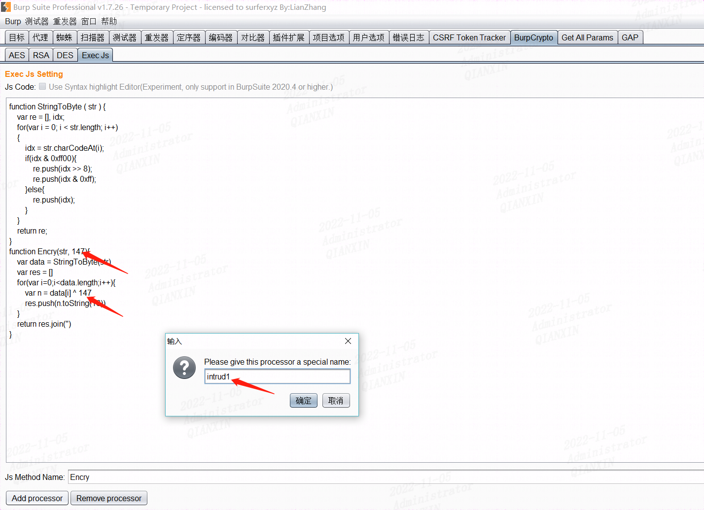
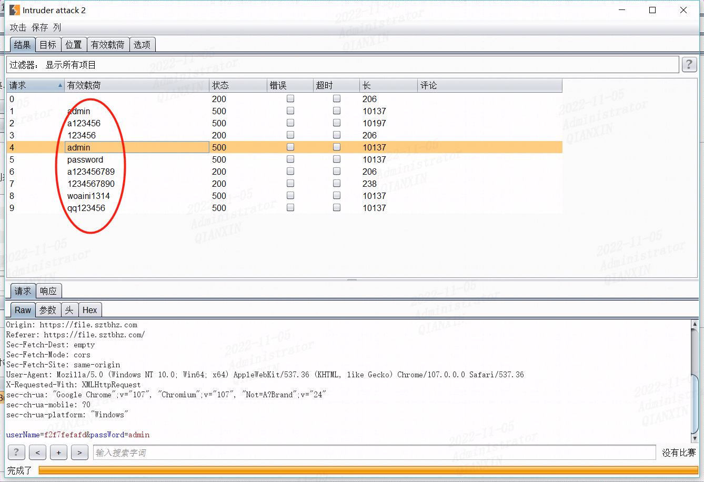
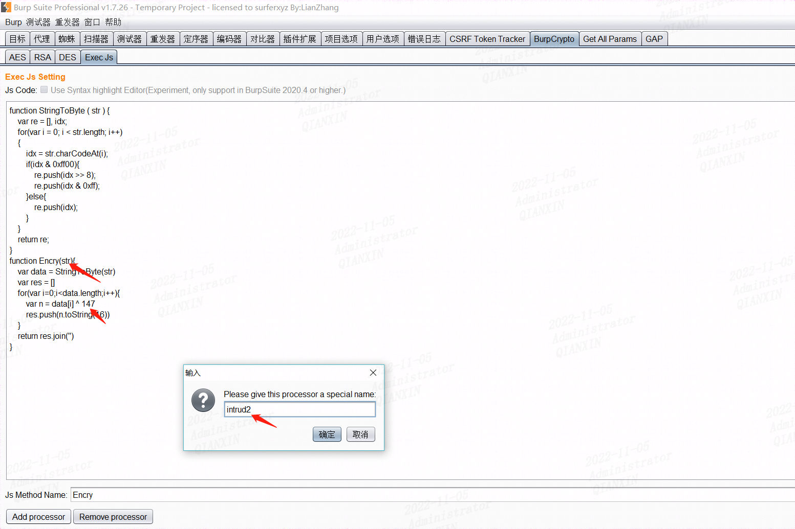
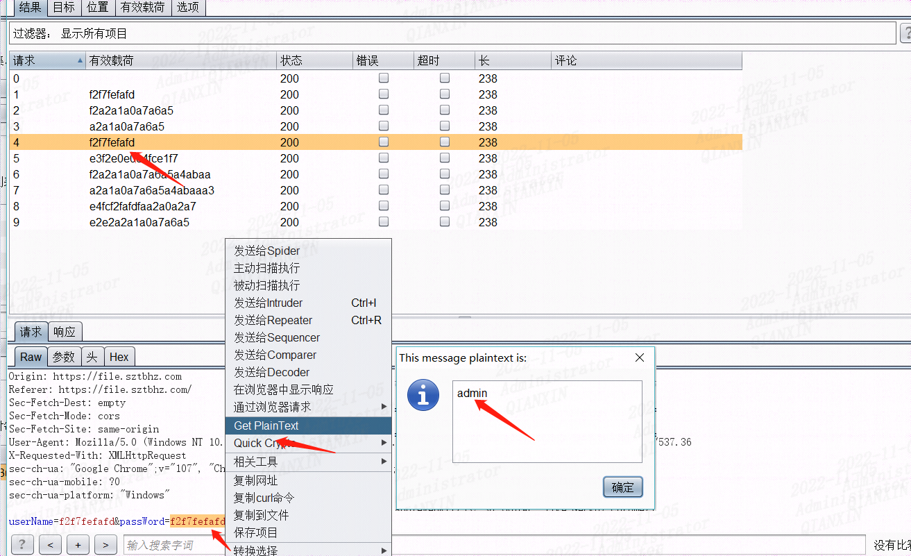

## 前言

在实战中做的一个js逆向案例，和[前面一篇](https://blog.csdn.net/m0_65244586/article/details/124347429)有雷同之处，不过也有些不一样，这里主要记录下不一样的地方

目标地址https://file.sztbhz.com/

输入用户名密码

admin/123456

发现进行了加密，初步判断是进行了自定义的加密

## 过程分析

查看源码，尝试找到加密函数

找到加密函数，同样提取出来，在js调试工具进行调试

没有问题，在使用burp插件爆破时候出现了问题

调用

爆破

发现加密结果和使用js工具加密结果不一致

分析应该还是脚本的问题，源码脚本里面有个147的key值，但是这里没有调用

把147加上

本次发现没有加密，更不对了

最后想到需要一个参数，把Encry函数里面的key值去掉，下面直接引用就行了

如下：

完美实现

## 总结

对于不同的情况需要特殊分析，特别是提取自定义函数时候，把所需要调用的函数全部附上去，确保调试正确