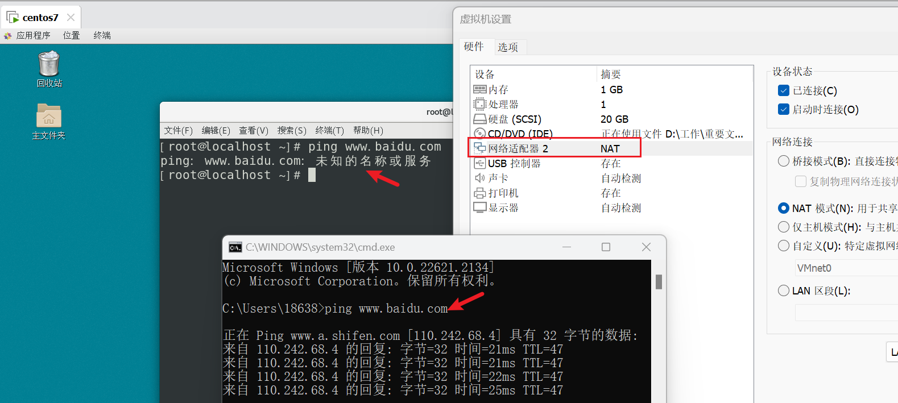
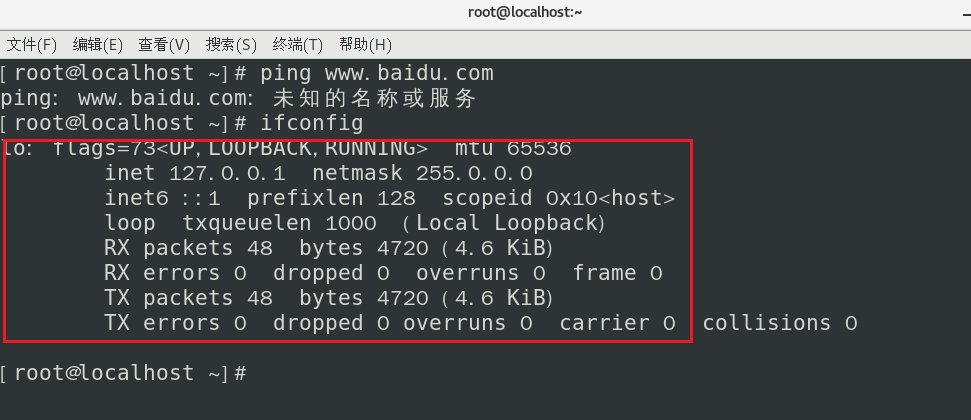
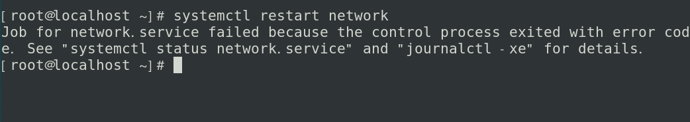
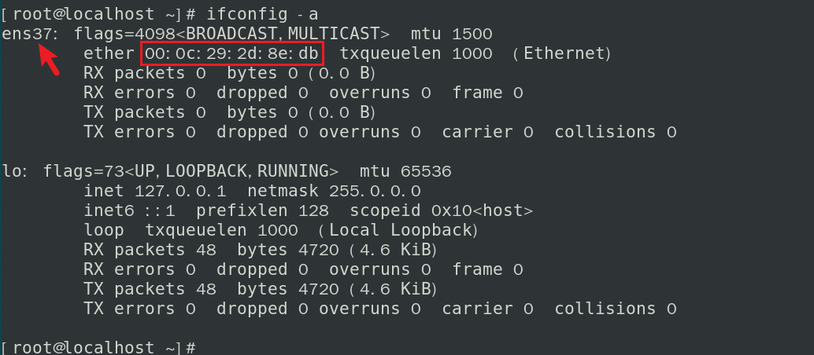
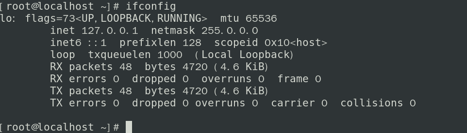
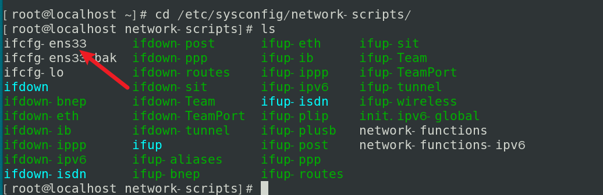
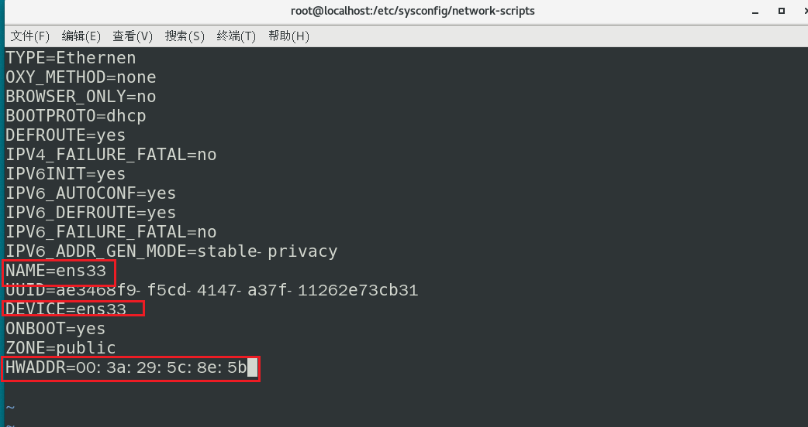
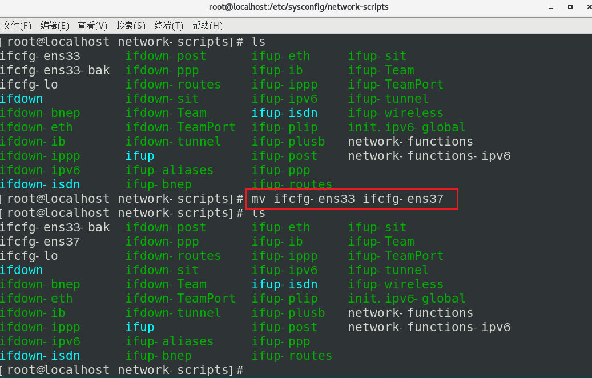
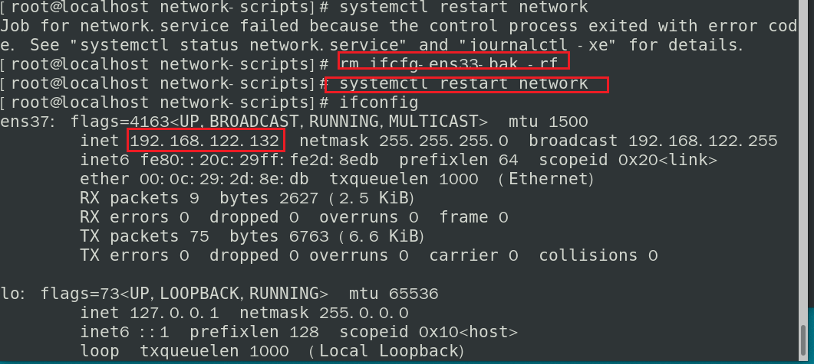
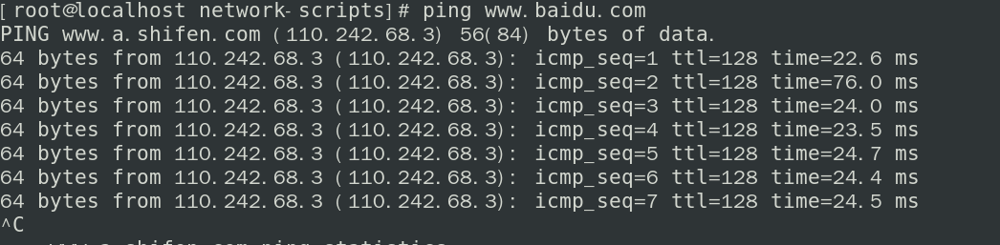

# 发现问题

物理机可以上网，同时给centos7配置的NAT模式，发现不能上网

使用ifconfig命令，发现没有网卡信息，只有一个回环地址

# 分析问题

这时候常规思路，先重启一波网卡再说，很不幸，报错了

报错信息为：Job for network.service failed because the control process exited with error code. See "systemctl status network.service" and "journalctl -xe" for details.

这时候在网上找了很多相关的，都说是mac地址不一致的问题，尝试修改后还不行，另外修改为静态IP还是不行

# 解决过程

就在陷入困境的时候，在油管上找到了启发，下面是解决过程：

查看网卡mac地址，下面有两种方式：

1、cat /sys/class/net/ens37/address	#注意这里根据实际情况，可能是ens`xx`或者其他

2、使用ifconfig -a

注意：如果使用ifconfig，则不显示网卡信息

查看本地加载网卡信息

`ls /etc/sysconfig/network-scripts/`

注意：这里是网卡名称是ens33

惊奇的发现，和前面的`ls /sys/class/net/`下的网卡名称不一致，问题找到了

下面就是修改配置的过程：

1、`vim ifcfg-ens33`

把这几个地方，分别修改为ens37和相应的mac地址，保存即可

2、`mv ifcfg-ens33 ifcfg-ens37`

删除其他的ifcfg-ens`xx`文件

重启网卡即可，发现已经获取到IP地址了

此时，已经可以上网了

