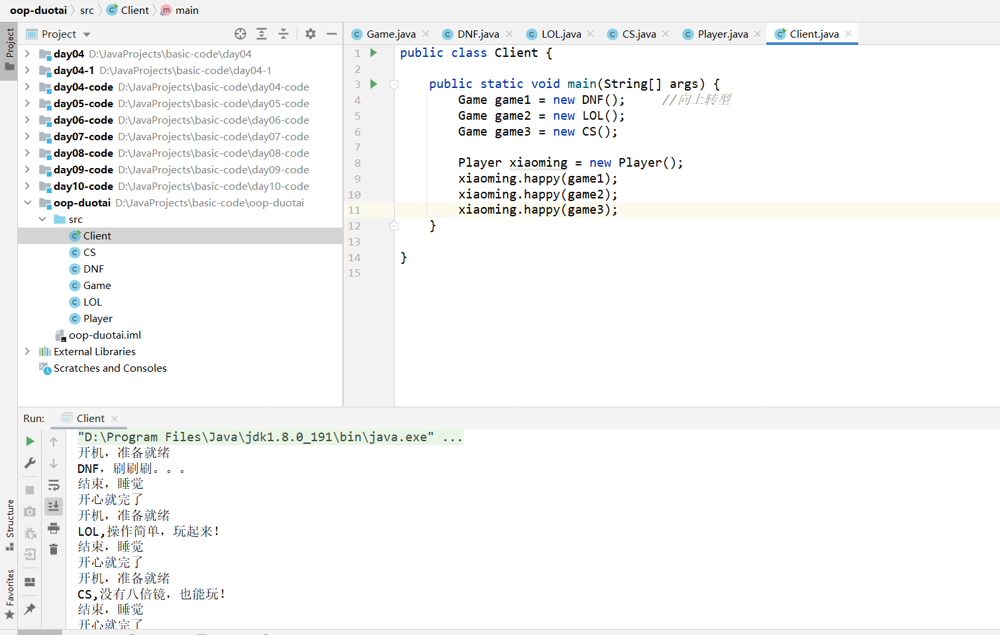

## 16、面向对象联系2


1、Game类

```java
public class Game {

    public void start(){
        System.out.println("开机，准备就绪");
    }

    public void play(){
        System.out.println("我要打游戏");
    }

    public void end(){
        System.out.println("结束，睡觉");
    }

}
```

2、DNF类

```java
public class DNF extends Game {

    public void play(){
        System.out.println("DNF，刷刷刷。。。");
    }

}
```

3、LOL类

```java
public class LOL extends Game{

    public void play(){
        System.out.println("LOL,操作简单，玩起来！");

    }
}
```

4、CS类

```java
public class CS extends Game {

    public void play(){
        System.out.println("CS,没有八倍镜，也能玩！");
    }
}
```

5、Player类

```java
public class Player {

    public void happy(Game game){
        game.start();
        game.play();
        game.end();
        System.out.println("开心就完了");
    }
}
```

6、Client类

```java
public class Client {

    public static void main(String[] args) {
        Game game1 = new DNF();     //向上转型
        Game game2 = new LOL();
        Game game3 = new CS();

        Player xiaoming = new Player();
        xiaoming.happy(game1);
        xiaoming.happy(game2);
        xiaoming.happy(game3);
    }

}
```

