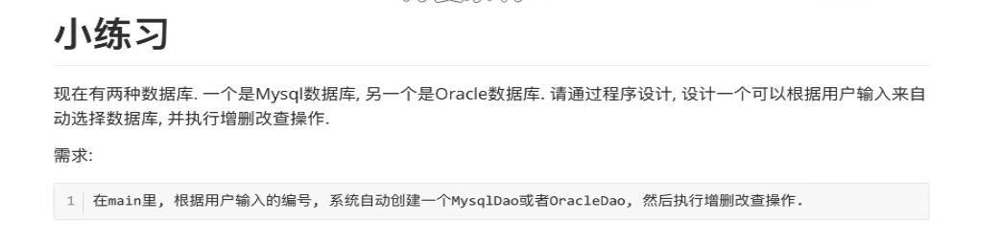
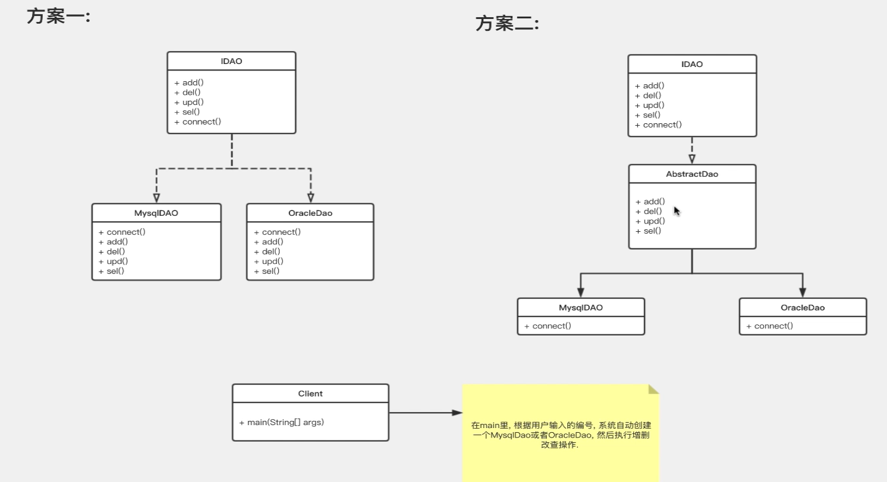
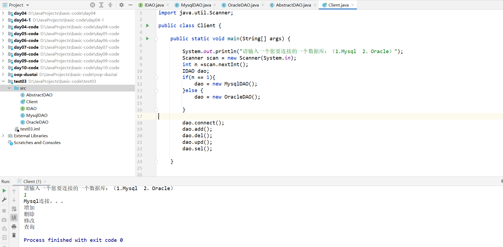

## 面向对象练习3





代码如下：

IDAO.java

```java
public interface IDAO {
    void connect();
    void add();
    void del();
    void upd();
    void sel();
}
```

MysqlIDAO.java

```java
public class MysqlDAO extends AbstractDAO {


    @Override
    public void connect() {
        System.out.println("Mysql连接。。。");
    }
}
```

OracleDAO.java

```java
public class OracleDAO extends AbstractDAO{
    @Override
    public void connect() {
        System.out.println("Oracle连接");
    }
}
```

AbstractDAO.java

```java
public abstract class AbstractDAO implements IDAO{

    @Override
    public void add() {
        System.out.println("增加");

    }

    @Override
    public void del() {
        System.out.println("删除");

    }

    @Override
    public void upd() {
        System.out.println("修改");

    }

    @Override
    public void sel() {
        System.out.println("查询");
    }
}
```

Client.java

```java
import java.util.Scanner;

public class Client {

    public static void main(String[] args) {

        System.out.println("请输入一个您要连接的一个数据库：（1.Mysql  2、Oracle）");
        Scanner scan = new Scanner(System.in);
        int n =scan.nextInt();
        IDAO dao;	
        if(n == 1){
            dao = new MysqlDAO();	//注意，如果直接写 IDAO dao = new MysqlDAO()，在if条件表达式内部，将不能执行后面dao.方法() 操作，所以需要写 IDAO dao 在if条件表达式前面
        }else {
            dao = new OracleDAO();
        }

        dao.connect();	//调用接口里面的方法
        dao.add();
        dao.del();
        dao.upd();
        dao.sel();
    }
}
```





什么时候适合用接口，什么时候适合用抽象类？


1、接口就是定义功能，任何场景都适合，实现类必须实现接口里面的功能

2、抽象类可以先实现接口中的一部分功能，剩下具体细微的功能，可以通过继承类**(子类)**去实现（本题采用该方法）。