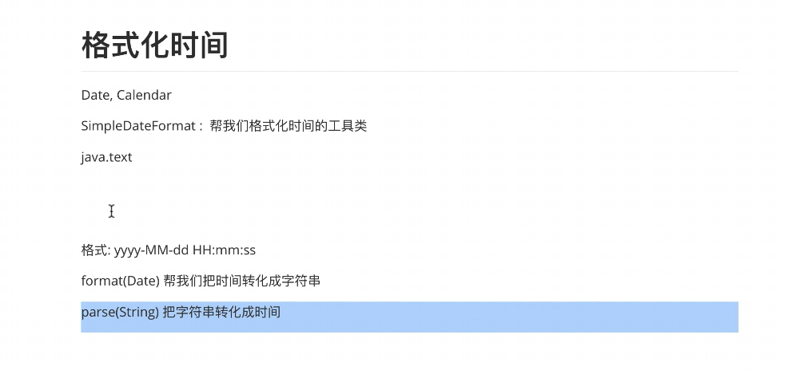

### Date	日期

​		new Date()	可以获取到系统时间

​		getTime()	能获取时间的long的表达形式（时间戳），可以用来计算时间差


```java
import javax.sound.midi.Soundbank;
import java.util.Date;

public class test_data {
    public static void main(String[] args) {
//        Date dat = new Date();
//        System.out.println(dat);

        System.out.println(new Date().getTime());
    }
}
```


### Calendar	日历

​		get()	获取时间的某一部分

​		set()	设置时间-> 计算时间

```java
import java.util.Calendar;

public class test_Calendar {


    public static void main(String[] args) {
        Calendar cal = Calendar.getInstance();
        System.out.println(cal);
        System.out.println(cal.getTime());

//        2021
//        12
//        5
        cal.set(Calendar.DATE,cal.get(Calendar.DATE)+100);  //计算时间

        System.out.println(cal.get(Calendar.YEAR));
        System.out.println(cal.get(Calendar.MONTH) + 1);    //月份从0开始
        System.out.println(cal.get(Calendar.DATE));
//        System.out.println(cal.get(Calendar.HOUR_OF_DAY));
//        System.out.println(cal.get(Calendar.MINUTE));
//        System.out.println(cal.get(Calendar.SECOND));
        
    }
}
```

## 格式化时间

