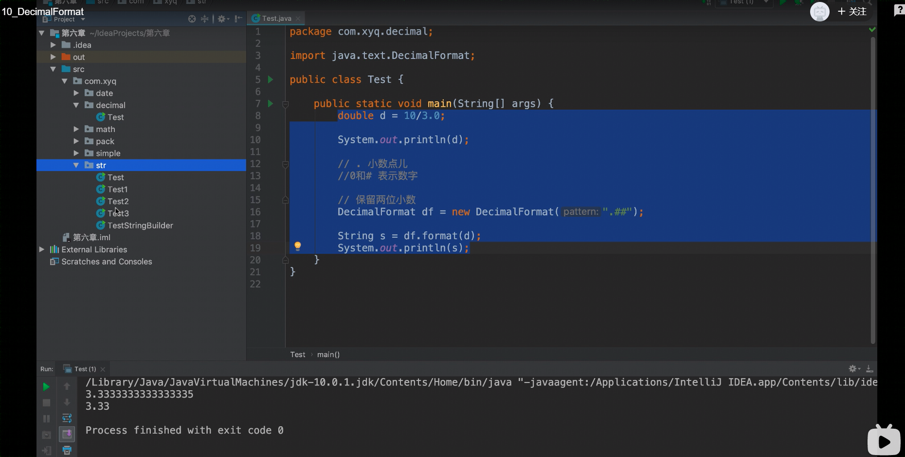
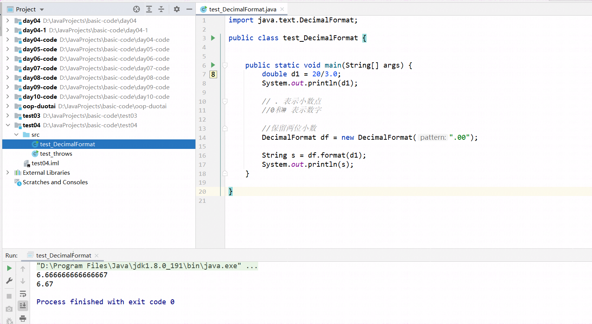

## DecimalFormat小数格式化





保留的结果会默认四舍五入

```java
import java.text.DecimalFormat;

public class test_DecimalFormat {


    public static void main(String[] args) {
        double d1 = 20/3.0;
        System.out.println(d1);

        // . 表示小数点
        //0和# 表示数字

        //保留两位小数
        DecimalFormat df = new DecimalFormat(".00");

        String s = df.format(d1);
        System.out.println(s);
    }

}
```

