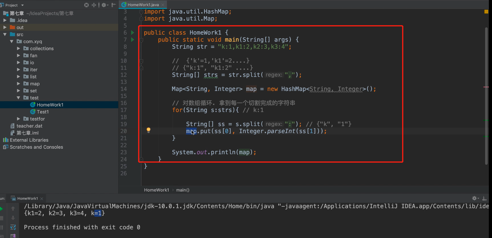
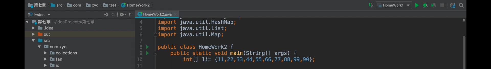
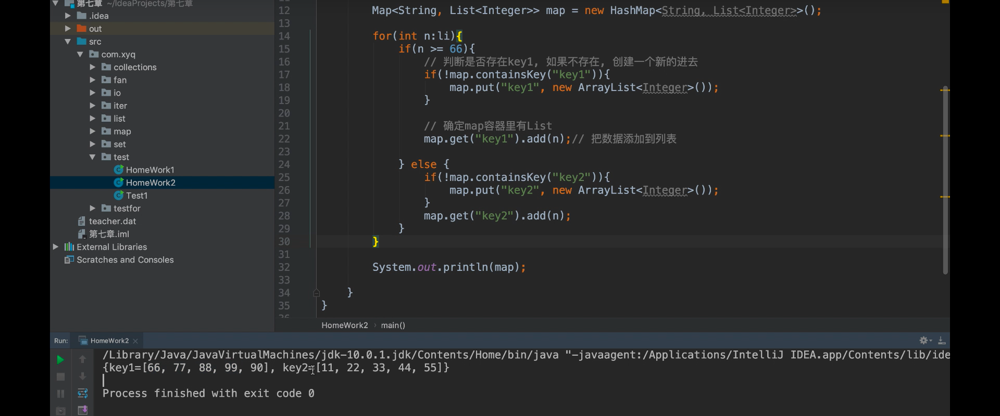

## 作业题

1、有字符串"k:1,k1:2,k2:3,k3:4"处理成 Map: {'k'=1,'k1'=2...}

2、元素分类，有如下值int[] li = {11,22,33,44,55,66,77,88,99,90}，将所有大于等于66的值保存至Map的第一个key中，将小于66的值保存至第二个key的值中。

​		即： {'k1':大于66的所有值列表，'k2':小于66的所有值列表}

