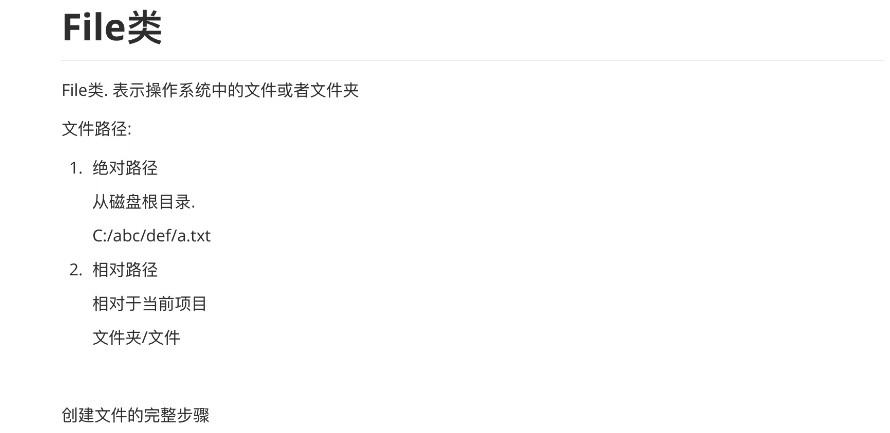
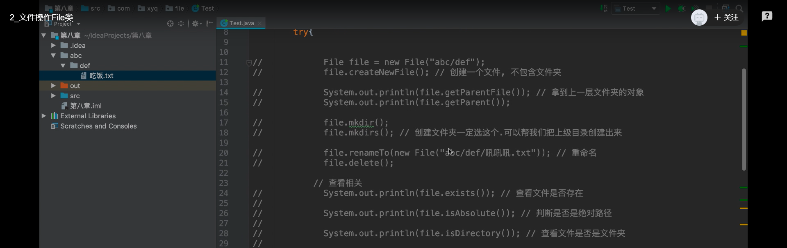
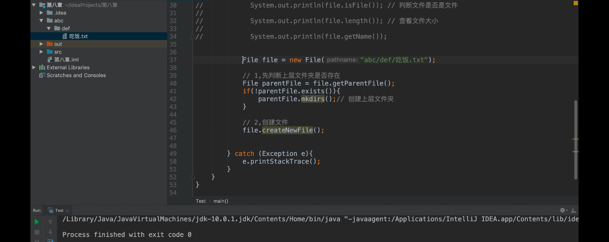

## File类




**重点看，最后创建文件的完整步骤**





```java
import java.io.File;
import java.io.IOException;

public class test {

    public static void main(String[] args) {


        try {
//            File file = new File("aaa/123.txt");
//            file.createNewFile(); //  创建一个文件，不包含文件夹


//            System.out.println(file.getParentFile());   //拿到上一层文件夹的对象
//            System.out.println(file.getParent());

//            file.mkdir();
//            file.mkdirs();  //创建文件夹一定选这个，可以帮我们把上级目录创建出来

//            file.renameTo(new File("aaa/abc/abc.txt")); //重命名
//            file.delete();
//
//            //查看相关
//            System.out.println(file.exists());  //查看文件是否存在
//            System.out.println(file.isAbsolute());  //判断是否是绝对路径
//            System.out.println(file.isDirectory()); //判断文件是否是文件夹
//            System.out.println(file.isFile());  //判断文件是否是文件
//            System.out.println(file.length());  //查看文件大小
//            System.out.println(file.getName()); //获取文件名


            File file = new File("abc/def/吃饭.txt");

            //先判断上层文件夹是否存在
            File parentFile = file.getParentFile();
            if(!parentFile.exists()){
                parentFile.mkdirs();    //创建上层文件夹
            }

            //创建文件
            file.createNewFile();


        } catch (Exception e) {
            e.printStackTrace();
        }
    }
}
```

