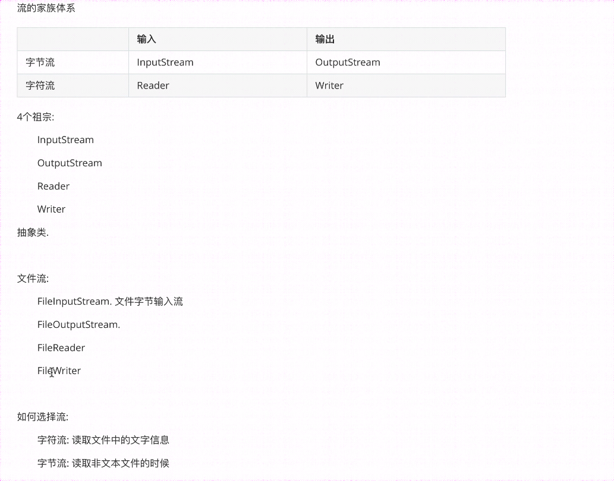
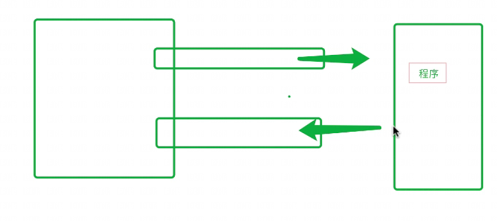
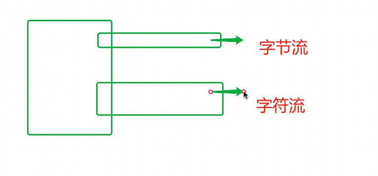
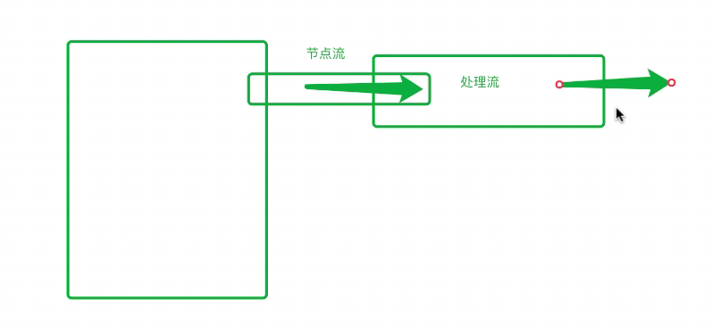
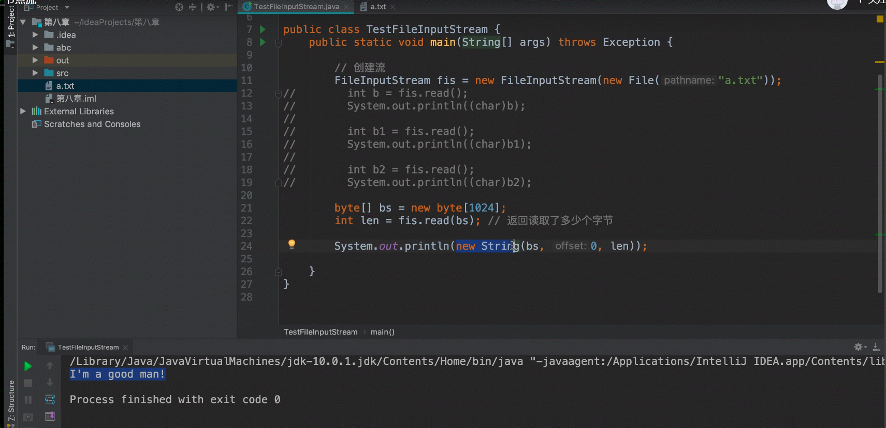
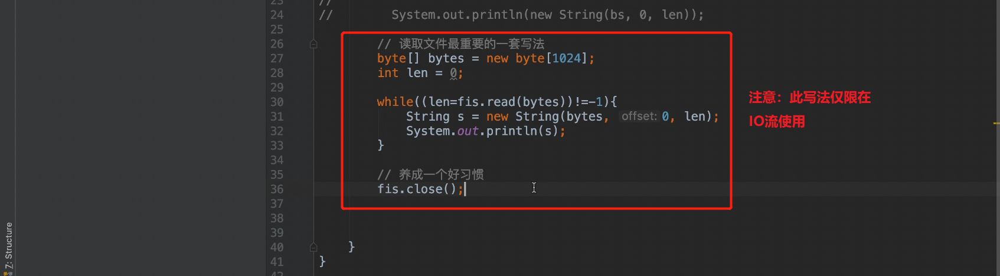
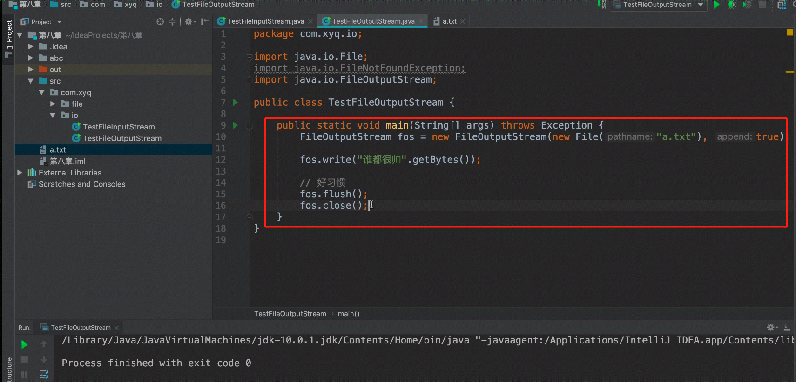
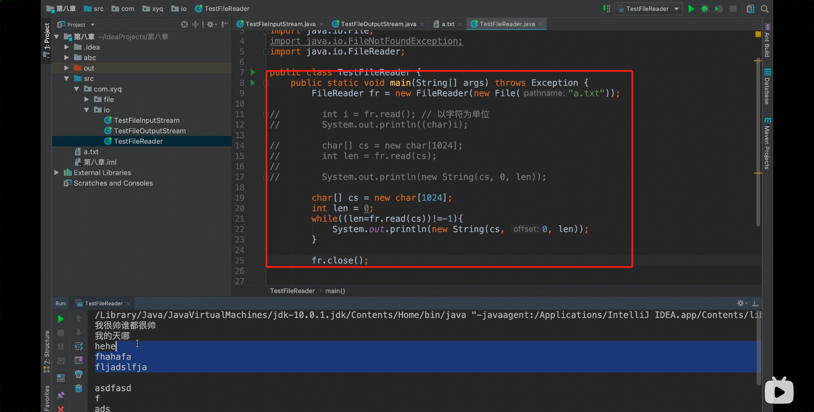
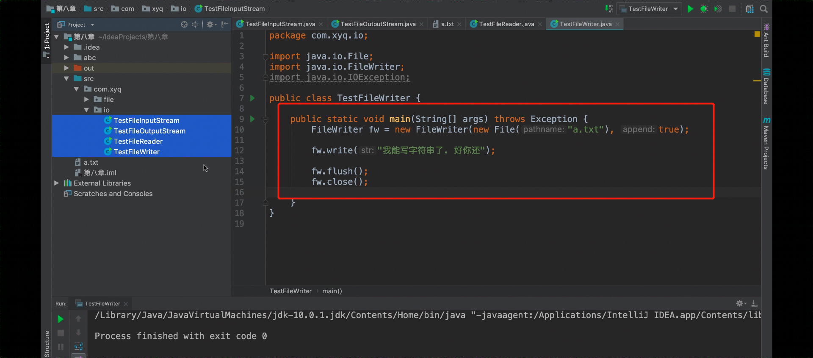

## IO流-节点流




### 流的分类












```java
package IOStream_zijieliu;

import java.io.File;
import java.io.FileInputStream;

public class TestFileInputStream {


    public static void main(String[] args) throws Exception {   //FileNotFoundException

        //创建流
        FileInputStream fis = new FileInputStream(new File("123.txt"));

/*
        int b= fis.read();
        System.out.println((char)b);    //这里只读一个字节，碰见中文（2个字节），读一个字节时，只读一半，肯定不行，所以需要用下面bate[] 数组去存放每次读到的字节

        int b1= fis.read();
        System.out.println((char)b1);

        //读取文件的第一种方法
        byte[] bs = new byte[1024];     //创建一个数组，用于接收每次读到的一个字节，设置字节长度为1024
        int len = fis.read(bs); //返回读取了多少字节

        System.out.println(new String(bs,0,len));   //打印出bs字节数组中，从第一个字符到第len个字符。
*/

        //读取文件的第二种方法，【最重要的一种写法】，因为文件字节长度超过1024时候，比较消耗内存      //这种写法仅限在IO流使用
        byte[] bytes = new byte[1024];
        int len =0;

        while ((len=fis.read(bytes))!=-1){
            String s = new String(bytes,0,len);
            System.out.println(s);
        }

        //养成一个好习惯
        fis.close();


    }

}
```




```java
package IOStream_zijieliu;

import java.io.File;
import java.io.FileNotFoundException;
import java.io.FileOutputStream;
import java.nio.charset.StandardCharsets;

public class TestFileOutputStream {

    public static void main(String[] args) throws Exception {

        FileOutputStream fos = new FileOutputStream(new File("123.txt"),true);  

        fos.write("这是通过FileOutputStream测试写入的数据2".getBytes());   //写入的字符串转化为字节数组，存放到写入的文件中

        //好习惯
        fos.flush();
        fos.close();
    }
}
```




```java
package IOStream_zijieliu;

import java.io.File;
import java.io.FileNotFoundException;
import java.io.FileReader;

public class TestFileReader {
    public static void main(String[] args) throws Exception {

        FileReader fr = new FileReader(new File("123.txt"));
//
//        int i = fr.read(); //以字符为单位
//        System.out.println((char)i);
//
//        char[] cs = new char[1024];
//        int len = fr.read(cs);
//
//        System.out.println(new String(cs,0,len));

        char[] cs = new char[1024];
        int len = 0;
        while ((len=fr.read(cs))!=-1){
            System.out.println(new String(cs,0, len));
        }

        fr.close();

    }

}
```





```java
package IOStream_zijieliu;

import java.io.File;
import java.io.FileWriter;
import java.io.IOException;

public class TestFileWriter {

    public static void main(String[] args) throws Exception {

        FileWriter fw = new FileWriter(new File("123.txt"), true);

        fw.write("尝试写字符串了，。。。。");

        fw.flush();
        fw.close();
    }
}
```

