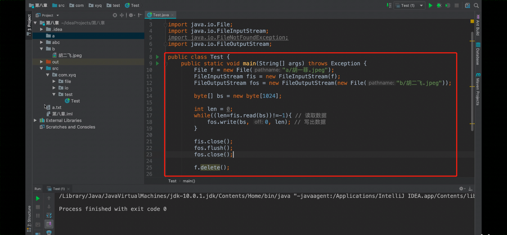

## IO流小练习

使用IO流，把一张图片从C盘复制到D盘。（附加思考：如果剪切呢？）




```java
package TestHomework;

import java.io.*;

public class test {

    public static void main(String[] args) throws Exception {
        File f1 = new File("风景.jpg");
        FileInputStream fis = new FileInputStream(f1);
        FileOutputStream fos = new FileOutputStream(new File("E:/副本_风景.jpg"));

        byte[] bs = new byte[1024];

        int len =0 ;
        while ((len= fis.read(bs))!=-1){
            fos.write(bs, 0, len);
        }

        fis.close();
        fos.flush();
        fos.close();
        
        f1.delete();//删除，剪切的效果

    }
}
```

