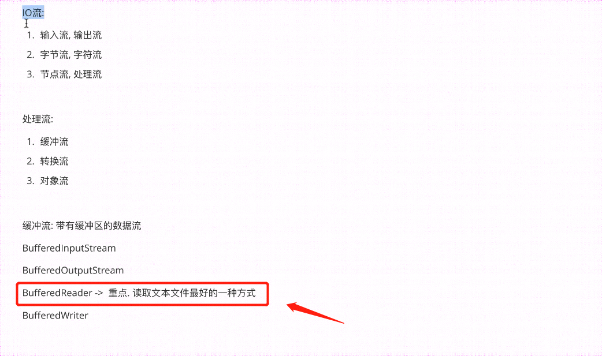
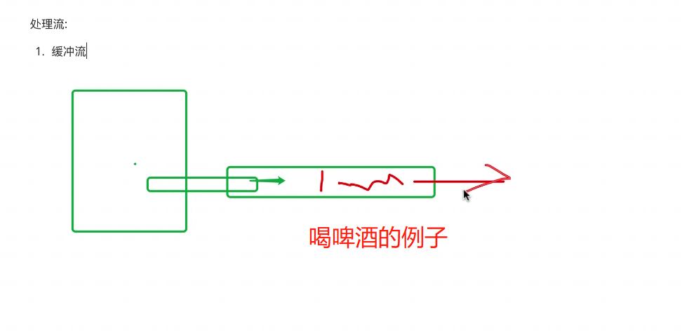
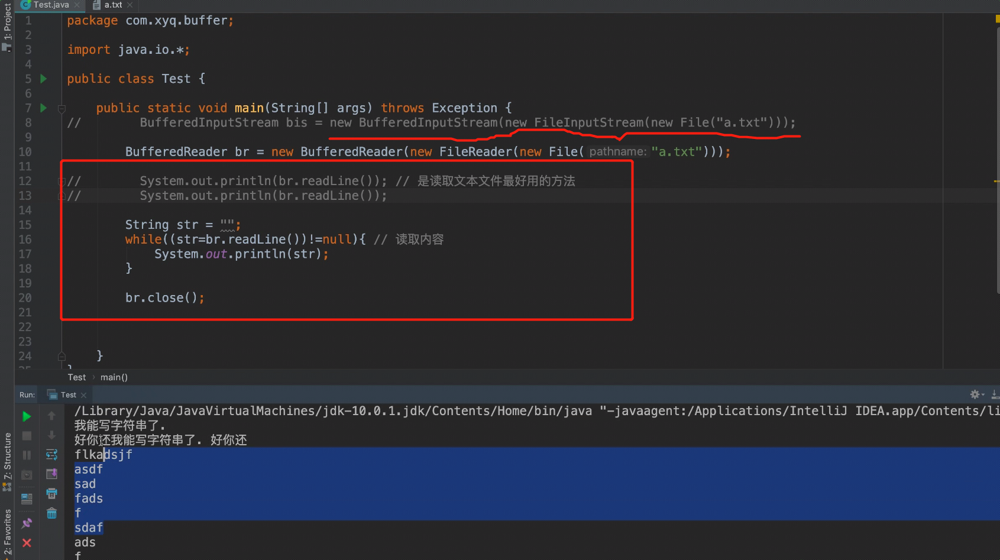

## 缓冲流









```java
package Buffer;

import java.io.*;

public class test1 {

    public static void main(String[] args) throws Exception {

//        BufferedInputStream br = new BufferedInputStream(new FileInputStream(new File("123.txt")));
//        Buffered里面三个类和前面讲到的类似，不再赘述
//       1、BufferedInputStream
//       2、BufferedOutputStream
//       3、BufferedWriter


        //重点看下BufferedReader
        BufferedReader br = new BufferedReader(new FileReader(new File("123.txt")));
//        System.out.println(br.readLine()); //读取文本文件最好的方法，一次读一行

        String str = "";
        while ((str=br.readLine())!=null){   //读取内容
            System.out.println(str);
        }

    }

}
```

