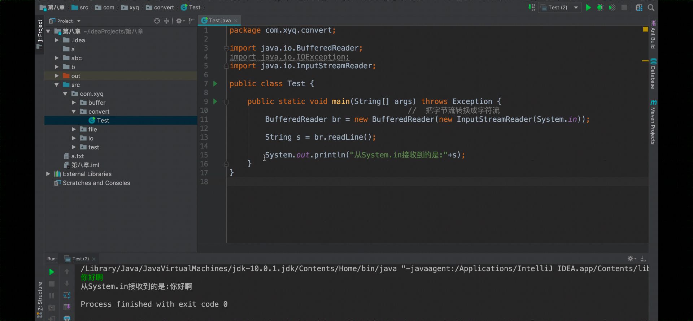
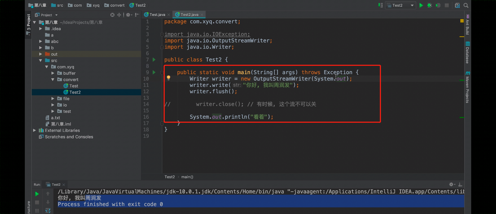

## 转换流

变压器的例子


**字节流->字符流**

不能逆向成 字符流->字节流


InputStreamReader

OutputStreamWriter



```java
package Convert;

import javax.xml.bind.SchemaOutputResolver;
import java.io.*;

public class test {
    public static void main(String[] args) throws Exception {
        BufferedReader br = new BufferedReader(new InputStreamReader(System.in));

        String s = br.readLine();

        System.out.println("从system.in输入的是"+s);

    }
    
}
```




```java
package Convert;

import java.io.OutputStreamWriter;
import java.io.Writer;


public class test2 {

    public static void main(String[] args) throws Exception {


        Writer writer =new OutputStreamWriter(System.out);
        writer.write("测试123123123");

        writer.flush();
        writer.close();

    }
}
```


