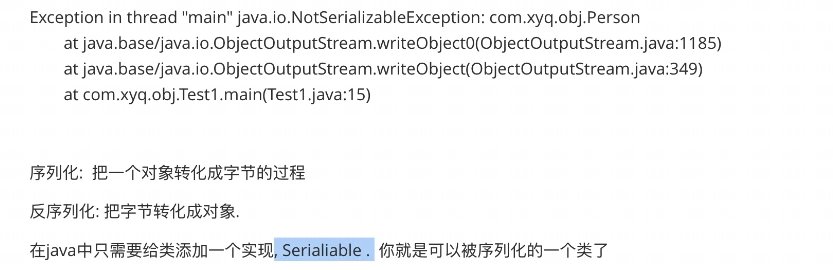
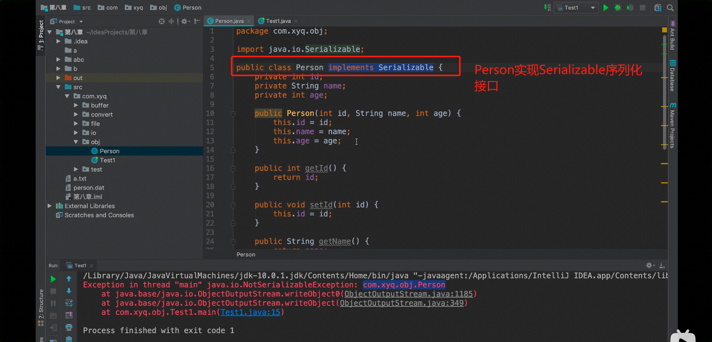
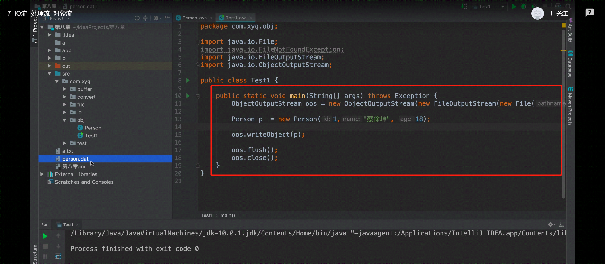
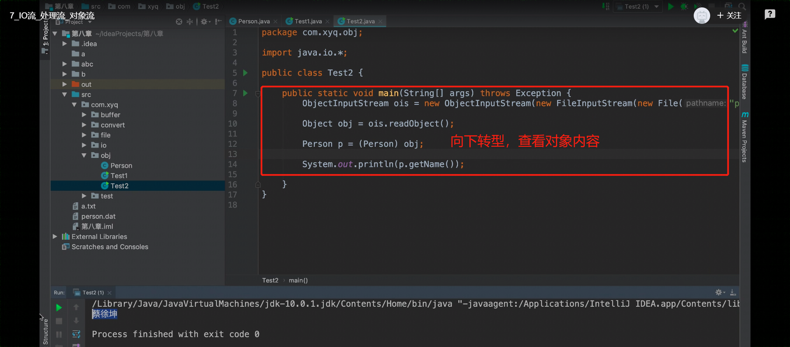

## 对象流


**ObjectInputStream**

**ObjectOutputStream**






Serialiable是一个标志性的接口，理解为一面旗帜，一旦类实现这个接口，就代表可以序列化。




person类

```java
package obj;

import java.io.Serializable;

public class person implements Serializable {
    private int id;
    private String name;
    private int age;

    public person(int id, String name, int age) {
        this.id = id;
        this.name = name;
        this.age = age;
    }

    public int getId() {
        return id;
    }

    public void setId(int id) {
        this.id = id;
    }

    public String getName() {
        return name;
    }

    public void setName(String name) {
        this.name = name;
    }

    public int getAge() {
        return age;
    }

    public void setAge(int age) {
        this.age = age;
    }
}

```

test类

```java
package obj;

import java.io.*;

public class test {


    public static void main(String[] args) throws Exception {

        ObjectOutputStream oos = new ObjectOutputStream(new FileOutputStream(new File("person.dat")));

        person p = new person(1,"小明",18);

        oos.writeObject(p);

        oos.flush();
        oos.close();

    }

}
```





```java
package obj;

import java.io.*;

public class test2 {

    public static void main(String[] args) throws Exception {
        ObjectInputStream ois = new ObjectInputStream(new FileInputStream(new File("person.dat")));

        Object obj = ois.readObject();  //readObject读取结果默认都是object类型

        person p = (person) obj;    //向下转型，由object类转化为person类

        System.out.println(p.getName());

    }

}
```

