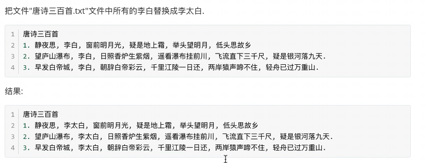
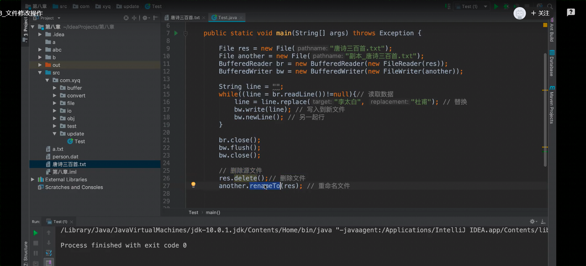

## 文件修改操作



修改文件的思路：逐行读取文件中的内容。根据内容进行替换，把替换的结果记录在一个新文件里，直到数据写入完毕。把源文件删除，把新文件的名字改成源文件的名字。



```java
唐诗三百首
1. 静夜思，李白，床前明月光，疑似地上霜，举头望明月，低头思故乡
2. 忘庐山瀑布，李白，日照香炉生紫烟，遥看瀑布挂前川，飞流之下三千尺，疑是银河落九天
3. 早发白帝城，李白，朝辞白帝彩云间，千里江陵一日还，两岸猿声啼不住，轻舟已过万重山
```


```java
package FileTest;

import java.io.*;

public class FileUpdate {
    public static void main(String[] args) throws Exception {   //FileNotFoundException
        File res= new File("D:\\JavaProjects\\basic-code\\test04\\src\\唐诗三百首.txt");
        File another = new File("D:\\JavaProjects\\basic-code\\test04\\src\\副本_唐诗三百首.txt");
        BufferedReader br = new BufferedReader(new FileReader(res));
        BufferedWriter bw = new BufferedWriter(new FileWriter(another));

        String line = "";
        while ((line = br.readLine())!=null){   //读取数据
            line = line.replace("李白", "李太白");   //替换
            bw.write(line); //写入到新文件
            bw.newLine();   //另起一行
        }

        br.close();
        bw.flush();
        bw.close();


        //删除源文件
        res.delete();
        another.renameTo(res);

    }

}
```

