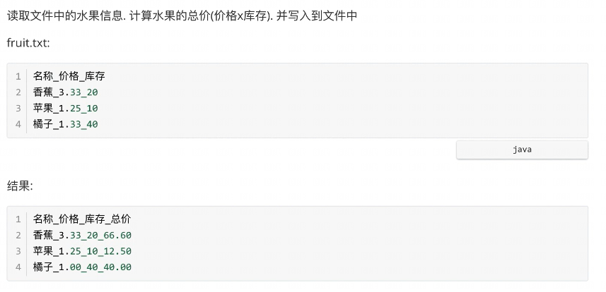
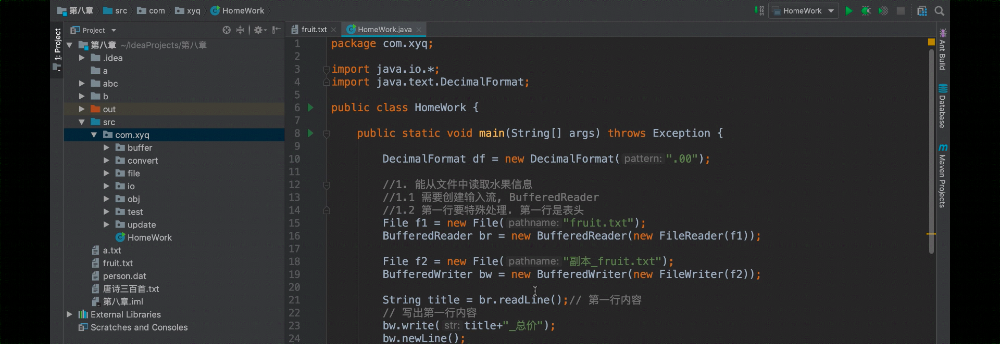
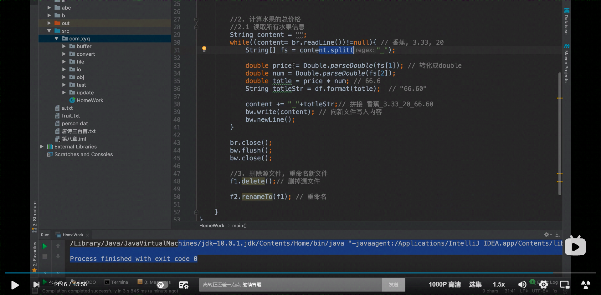

## 作业题



```
名称_价格_库存
香蕉_3.33_20
苹果_1.25_10
橘子_1.33_40
```






```java
package FileTest;

import java.io.*;
import java.text.DecimalFormat;

public class Homeword {

    public static void main(String[] args) throws Exception {   //FileNotFoundException

        DecimalFormat df = new DecimalFormat(".00");

        //1.能从文件中读取水果信息
        //1.1 需要创建输入流，BufferedReader
        //1.2 第一行需要特殊处理，第一行是表头

        File f1 = new File("D:\\JavaProjects\\basic-code\\test04\\fruit.txt");
        BufferedReader br = new BufferedReader(new FileReader(f1));

        File f2 = new File("副本_fruit.txt");
        BufferedWriter bw = new BufferedWriter(new FileWriter(f2));

        String title = br.readLine();   //第一行内容
        // 写出第一行内容
        bw.write(title + "_总价");
        bw.newLine();

        //2. 计算水果的总价格
        //2.1 读取所有水果的信息
        String content = "";
        while ((content = br.readLine())!=null){    //香蕉，3.33，20
            String[] fs = content.split("_");

            double price = Double.parseDouble(fs[1]);   //字符串转化成double
            double num = Double.parseDouble(fs[2]);
            double totle = price*num;   //66.6
            String totleStr = df.format(totle); //"66.60"

            content += "_"+totleStr;    //拼接 香蕉_3.33_20_66.60
            bw.write(content);
            bw.newLine();

        }


        br.close();
        bw.flush();
        bw.close();

        //3. 删除源文件，重命名文件
        f1.delete();    //删除源文件
        f2.renameTo(f1);

    }

}

```

