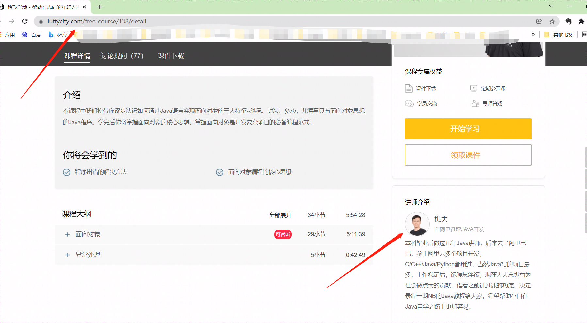

主讲：樵夫老师

b站地址：https://www.bilibili.com/video/BV1uE411r7ij?p=27&spm_id_from=pageDriver

缺少的**内存分析**课程：https://www.bilibili.com/video/BV1pJ411y7UK?p=27

## **java**学习课程

1、这个是学习面向对象的【强烈推荐】
https://www.bilibili.com/video/BV1uE411r7ij?spm_id_from=333.999.0.0

这个是前面的补充【java基础的全套课程，包括前面】
https://www.bilibili.com/video/BV1bZ4y1V7Ft?spm_id_from=333.999.0.0
