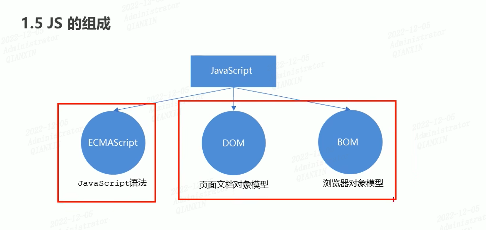
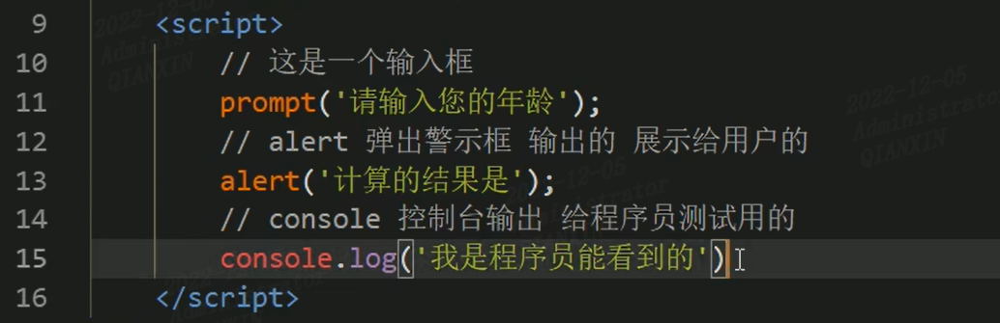
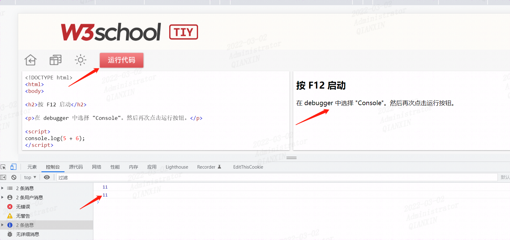
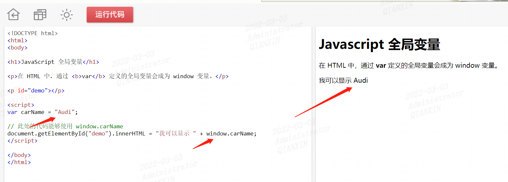
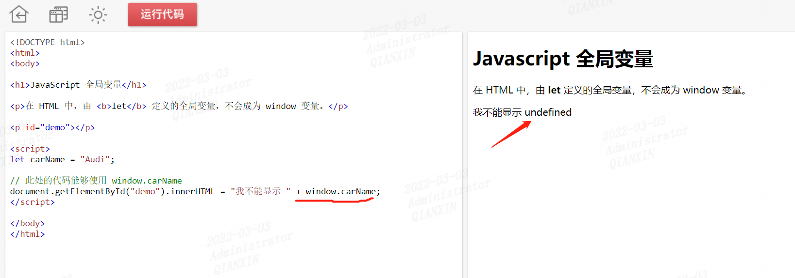

https://www.w3school.com.cn/js/index.asp

https://www.bilibili.com/video/BV1ux411d75J/

## 基础部分

### 浏览器执行js过程

浏览器由两部分组成：

渲染引擎->html/css

js引擎-> JavaScript

### js组成



### js三种书写位置

1. 内嵌式
2. 行内式
3. 外部js文件

### js注释

单行注释	//

多行注释	/*  这是多行注释  */

### js输出输出语句

- prompt()
- alert()
- console.log()



# js简介

## JavaScript 能够改变 HTML 内容

getElementById() 是多个 JavaScript HTML 方法之一。

本例使用该方法来“查找” id="demo" 的 HTML 元素，并把元素内容（innerHTML）更改为 "Hello JavaScript"：

### 实例

```html
<!DOCTYPE html>
<html>
<body>

<h1>JavaScript 能做什么？</h1>

<p id="demo">JavaScript 可以更改 HTML 内容。</p>

<button type="button" onclick='document.getElementById("demo").innerHTML = "Hello JavaScript!"'>单击这里</button>

</body>
</html>
```

## JavaScript 能够改变 HTML 属性

## JavaScript 能够改变 HTML 样式 (CSS)

## JavaScript 能够隐藏 HTML 元素

## JavaScript 能够显示 HTML 元素


# js使用

## `<script>` 标签

在 HTML 中，JavaScript 代码必须位于 `<script>`与 `</script>` 标签之间。

## JavaScript 函数和事件

JavaScript *函数*是一种 JavaScript 代码块，它可以在调用时被执行。

例如，当发生*事件*时调用函数，比如当用户点击按钮时。

## JavaScript可以放在`<head>` 或 `<body>` 

## js外部脚本

脚本可放置与外部文件中（绝对路径、相对路径）


# js输出

JavaScript 不提供任何内建的打印或显示函数。

## JavaScript 显示方案

JavaScript 能够以不同方式“显示”数据：

- 使用 `window.alert()` 写入警告框
- 使用 `document.write()` 写入 HTML 输出
- 使用 `innerHTML` 写入 HTML 元素
- 使用 `console.log()` 写入浏览器控制台

### 1、使用 window.alert()

```js
<script>window.alert(1);</script>
```

实际中多应用

```javascript
<script>alert(1)</script>
```

### 2、使用 document.write()

**注意：**在 HTML 文档完全加载后使用 **document.write()** 将*删除所有已有的 HTML* ，该方法仅用于测试。

```html
<!DOCTYPE html>
<html>
<body>

<h1>我的第一张网页</h1>

<p>我的第一个段落</p>

<button onclick="document.write(5 + 6)">试一试</button>

</body>
</html>
```

### 3、使用 innerHTML

如需访问 HTML 元素，JavaScript 可使用 document.getElementById(id) 方法。

id 属性定义 HTML 元素。innerHTML 属性定义 HTML 内容：

```html
<!DOCTYPE html>
<html>
<body>

<h1>我的第一张网页</h1>

<p>我的第一个段落</p>

<p id="demo"></p>

<script>
 document.getElementById("demo").innerHTML = 5 + 6;
</script>

</body>
</html> 
```

### 4、使用 console.log()

在浏览器中，您可使用 console.log() 方法来显示数据。

请通过 F12 来激活浏览器控制台，并在菜单中选择“控制台”。

```html
<!DOCTYPE html>
<html>
<body>

<h1>我的第一张网页</h1>

<p>我的第一个段落</p>

<script>
console.log(5 + 6);
</script>

</body>
</html>
```




# js语句

**在 HTML 中，JavaScript 语句是由 web 浏览器“执行”的“指令”。**

## JavaScript 语句

JavaScript 语句由以下构成：

值、运算符、表达式、关键词和注释。

这条语句告诉浏览器在 id="demo" 的 HTML 元素中输出 "Hello Kitty."：

```html
<!DOCTYPE html>
<html>
<body>

<h2>JavaScript 语句</h2>

<p>在 HTML 中，JavaScript 语句由浏览器执行。</p>

<p id="demo"></p>

<script>
document.getElementById("demo").innerHTML = "Hello Kitty.";
</script>

</body>
</html>
```

## 分号 ;

分号分隔 JavaScript 语句。

请在每条可执行的语句之后添加分号`；`

## JavaScript 空白字符

JavaScript 会忽略多个空格。您可以向脚本添加空格，以增强可读性。

下面这两行是相等的：

```js
var person = "Bill";
var person="Bill"; 
```

在运算符旁边（ = + - * / ）添加空格是个好习惯：

```js
var x = y + z;
```

## JavaScript 代码块

JavaScript 语句可以用花括号（{...}）组合在代码块中。

代码块的作用是定义一同执行的语句。

您会在 JavaScript 中看到成块组合在一起的语句：

```js
function myFunction() {
    document.getElementById("demo").innerHTML = "Hello Kitty.";
    document.getElementById("myDIV").innerHTML = "How are you?";
}
```


## JavaScript 关键词

JavaScript 语句常常通过某个关键词来标识需要执行的 JavaScript 动作。

下面的表格列出了一部分将在教程中学到的关键词：

| 关键词        | 描述                                              |
| :------------ | :------------------------------------------------ |
| break         | 终止 switch 或循环。                              |
| continue      | 跳出循环并在顶端开始。                            |
| debugger      | 停止执行 JavaScript，并调用调试函数（如果可用）。 |
| do ... while  | 执行语句块，并在条件为真时重复代码块。            |
| for           | 标记需被执行的语句块，只要条件为真。              |
| function      | 声明函数。                                        |
| if ... else   | 标记需被执行的语句块，根据某个条件。              |
| return        | 退出函数。                                        |
| switch        | 标记需被执行的语句块，根据不同的情况。            |
| try ... catch | 对语句块实现错误处理。                            |
| var           | 声明变量。                                        |


# js语法


## JavaScript 值

JavaScript 语句定义两种类型的值：==混合值==和==变量值==。

混合值被称为***字面量（literal）***。变量值被称为*变量*。

## JavaScript 字面量

书写混合值最重要的规则是：

1. 写***数值***有无小数点均可。
2. *字符串*是文本，由双引号或单引号包围。

## JavaScript 变量

 

## JavaScript 变量

在编程语言中，*变量*用于*存储*数据值。

JavaScript 使用 var 关键词来*声明*变量。

= 号用于为变量*赋值*。

在本例中，x 被定义为变量。然后，x 被赋的值是 7：

```js
var x;
x = 7;
```

## JavaScript 运算符

JavaScript 使用*算数运算符*（+ - * /）来*计算值*：


## JavaScript 注释

并非所有 JavaScript 语句都被“执行”。

双斜杠 `//` 或 `/*` 与 `*/` 之间的代码被视为*注释*。

## JavaScript 标识符

标识符是名称。

在 JavaScript 中，标识符用于命名变量（以及关键词、函数和标签）。

在大多数编程语言中，合法名称的规则大多相同。

在 JavaScript 中，首字符必须是字母、下划线（-）或美元符号（$）。

连串的字符可以是字母、数字、下划线或美元符号。

**提示：**    **数值不可以作为首字符**。这样，JavaScript 就能轻松区分标识符和数值。

## JavaScript 对大小写敏感

## JavaScript 与驼峰式大小写

历史上，程序员曾使用三种把多个单词连接为一个变量名的方法：

### 连字符：

```
first-name, last-name, master-card, inter-city.
```

**注释：**JavaScript 中不能使用连字符。它是为减法预留的。

### 下划线：

```
first_name, last_name, master_card, inter_city.
```

### 驼峰式大小写（Camel Case）：

```
FirstName, LastName, MasterCard, InterCity.
```

JavaScript 程序员倾向于使用以小写字母开头的驼峰大小写：

```html
firstName, lastName, masterCard, interCity
```


# js变量

在计算机程序中，被声明的变量经常是不带值的。值可以是需被计算的内容，或是之后被提供的数据，比如数据输入。

不带有值的变量，它的值将是 undefined。

变量 carName 在这条语句执行后的值是 undefined：

```js
var carName;
```

注意区分局部变量和全局变量，和python、Java大同小异


# js作用域

## 01 js let

### JavaScript 块作用域

通过 var 关键词声明的变量没有块*作用域*。

在块 *{}* 内声明的变量可以从块之外进行访问。

#### 实例

```js
{ 
  var x = 10; 
}
// 此处可以使用 x
```

在 ES2015 之前，JavaScript 是没有块作用域的。

可以使用 let 关键词声明拥有块作用域的变量。

在块 *{}* 内声明的变量无法从块外访问：

#### 实例

```js
{ 
  let x = 10;
}
// 此处不可以使用 x
```

### 重新声明变量

使用 var 关键字重新声明变量会带来问题。

在块中重新声明变量也将重新声明块外的变量：

#### 实例

```js
var x = 10;
// 此处 x 为 10
{ 
  var x = 6;
  // 此处 x 为 6
}
// 此处 x 为 6
```

使用 let 关键字重新声明变量可以解决这个问题。

在块中重新声明变量不会重新声明块外的变量：

#### 实例

```js
var x = 10;
// 此处 x 为 10
{ 
  let x = 6;
  // 此处 x 为 6
}
// 此处 x 为 10
```

### 循环作用域

在循环中使用 var：

#### 实例

```js
var i = 7;
for (var i = 0; i < 10; i++) {
  // 一些语句
}
// 此处，i 为 10
```

在循环中使用 let：

#### 实例

```js
let i = 7;
for (let i = 0; i < 10; i++) {
  // 一些语句
}
// 此处 i 为 7
```

在第一个例子中，在循环中使用的变量使用 var 重新声明了循环之外的变量。

在第二个例子中，在循环中使用的变量使用 let 并没有重新声明循环外的变量。

如果在循环中用 let 声明了变量 i，那么只有在循环内，变量 i 才是可见的。

### HTML 中的全局变量

使用 JavaScript 的情况下，全局作用域是 JavaScript 环境。

在 HTML 中，全局作用域是 window 对象。

通过 var 关键词定义的全局变量属于 window 对象：

#### 实例

```js
var carName = "porsche";
// 此处的代码可使用 window.carName
```



通过 let 关键词定义的全局变量不属于 window 对象：

#### 实例

```js
let carName = "porsche";
// 此处的代码不可使用 window.carName
```




这一讲详细见： https://www.w3school.com.cn/js/js_let.asp


## 02 js const

### ECMAScript 2015

ES2015 引入了两个重要的 JavaScript 新关键词：let 和 const。

通过 const 定义的变量与 let 变量类似，但不能重新赋值：

#### 实例

```js
const PI = 3.141592653589793;
PI = 3.14;      // 会出错
PI = PI + 10;   // 也会出错
```

### 块作用域

在*块作用域*内使用 const 声明的变量与 let 变量相似。

在本例中，x 在块中声明，不同于在块之外声明的 x：

#### 实例

```js
var x = 10;
// 此处，x 为 10
{ 
  const x = 6;
  // 此处，x 为 6
}
// 此处，x 为 10
```

### 在声明时赋值

JavaScript const 变量必须在声明时赋值：

#### 不正确

```js
const PI;
PI = 3.14159265359;
```

#### 正确

```js
const PI = 3.14159265359;
```

### 常量对象可以更改

您可以更改常量对象的属性：

### 常量数组可以更改

您可以更改常量数组的元素：

### 重新声明

在程序中的任何位置都允许重新声明 JavaScript var 变量：

#### 实例

```js
var x = 2;    //  允许
var x = 3;    //  允许
x = 4;        //  允许
```

在同一作用域或块中，不允许将已有的 var 或 let 变量重新声明或重新赋值给 const：

#### 实例

```js
var x = 2;         // 允许
const x = 2;       // 不允许
{
  let x = 2;     // 允许
  const x = 2;   // 不允许
}
```

在同一作用域或块中，为已有的 const 变量重新声明声明或赋值是不允许的：

#### 实例

```js
const x = 2;       // 允许
const x = 3;       // 不允许
x = 3;             // 不允许
var x = 3;         // 不允许
let x = 3;         // 不允许

{
  const x = 2;   // 允许
  const x = 3;   // 不允许
  x = 3;         // 不允许
  var x = 3;     // 不允许
  let x = 3;     // 不允许
}
```

在另外的作用域或块中重新声明 const 是允许的：

#### 实例

```js
const x = 2;       // 允许

{
  const x = 3;   // 允许
}

{
  const x = 4;   // 允许
}
```

### 提升

通过 var 定义的变量会被*提升*到顶端。如果您不了解什么是提升（Hoisting），请学习提升这一章。

您可以在声明 var 变量之前就使用它：

#### 实例

```js
carName = "Volvo";    // 您可以在此处使用 carName
var carName;
```

通过 const 定义的变量不会被提升到顶端。

const 变量不能在声明之前使用：

#### 实例

```js
carName = "Volvo";    // 您不可以在此处使用 carName
const carName = "Volvo";
```


# js运算符

同其它python、java等编程语言


# js数据类型

JavaScript 变量能够保存多种*数据类型*：数值、字符串值、数组、对象等等：

```js
var length = 7;                             // 数字
var lastName = "Gates";                      // 字符串
var cars = ["Porsche", "Volvo", "BMW"];         // 数组
var x = {firstName:"Bill", lastName:"Gates"};    // 对象
```

## JavaScript 布尔值

布尔值只有两个值：true 或 false。

### 实例

```js
var x = true;
var y = false;
```

## JavaScript 数组

JavaScript 数组用方括号书写。

数组的项目由逗号分隔。

下面的代码声明（创建）了名为 cars 的数组，包含三个项目（汽车品牌）：

### 实例

```js
var cars = ["Porsche", "Volvo", "BMW"];
```

数组索引基于零，这意味着第一个项目是 [0]，第二个项目是 [1]，以此类推。

## JavaScript 对象

JavaScript 对象用花括号来书写。

对象属性是 *name*:*value* 对，由逗号分隔。

### 实例

```js
var person = {firstName:"Bill", lastName:"Gates", age:62, eyeColor:"blue"};
```

上例中的对象（person）有四个属性：firstName、lastName、age 以及 eyeColor。

## typeof 运算符

您可使用 JavaScript 的 typeof 来确定 JavaScript 变量的类型：

typeof 运算符返回变量或表达式的类型：

### 实例

```js
typeof ""                  // 返回 "string"
typeof "Bill"              // 返回 "string"
typeof "Bill Gates"          // 返回 "string"
typeof 3.14                // 返回 "number"
typeof (7)                 // 返回 "number"
```

typeof 运算符对数组返回 "object"，因为在 JavaScript 中数组属于对象。

## Undefined

在 JavaScript 中，没有值的变量，其值是 undefined。typeof 也返回 undefined。

### 实例

```js
var person;                  // 值是 undefined，类型是 undefined。
```

任何变量均可通过设置值为 undefined 进行清空。其类型也将是 undefined。

### 实例

```js
person = undefined;          // 值是 undefined，类型是 undefined。
```

## 空值

空值与 undefined 不是一回事。

空的字符串变量既有值也有类型。

### 实例

```js
var car = "";                // 值是 ""，类型是 "string"
```

## Null

在 JavaScript 中，null 是 "nothing"。它被看做不存在的事物。

不幸的是，在 JavaScript 中，null 的数据类型是对象。

您可以把 null 在 JavaScript 中是对象理解为一个 bug。它本应是 null。

您可以通过设置值为 null 清空对象：

### 实例

```js
var person = null;           // 值是 null，但是类型仍然是对象
```

您也可以通过设置值为 undefined 清空对象：

### 实例

```js
var person = undefined;           // 值是 undefined，类型是 undefined。
```

## Undefined 与 Null 的区别

Undefined 与 null 的值相等，但类型不相等：

```js
typeof undefined              // undefined
typeof null                   // object
null === undefined            // false
null == undefined             // true
```

## 原始数据

原始数据值是一种没有额外属性和方法的单一简单数据值。

typeof 运算符可返回以下原始类型之一：

- string
- number
- boolean
- undefined

### 实例

```js
typeof "Bill"              // 返回 "string"
typeof 3.14                // 返回 "number"
typeof true                // 返回 "boolean"
typeof false               // 返回 "boolean"
typeof x                   // 返回 "undefined" (假如 x 没有值)
```

## 复杂数据

typeof 运算符可返回以下两种类型之一：

- function
- object

typeof 运算符把对象、数组或 null 返回 object。

typeof 运算符不会把函数返回 object。

### 实例

```js
typeof {name:'Bill', age:62} // 返回 "object"
typeof [1,2,3,4]             // 返回 "object" (并非 "array"，参见下面的注释)
typeof null                  // 返回 "object"
typeof function myFunc(){}   // 返回 "function"
```

typeof 运算符把数组返回为 "object"，因为在 JavaScript 中数组即对象。


# js函数

**JavaScript 函数是被设计为执行特定任务的代码块。**

**JavaScript 函数会在某代码调用它时被执行。**


使用与其它编程语言大同小异

这里看一个函数返回

## 函数返回

当 JavaScript 到达 `return` 语句，函数将停止执行。

如果函数被某条语句调用，JavaScript 将在调用语句之后“返回”执行代码。

函数通常会计算出*返回值*。这个返回值会返回给调用者：

### 实例

计算两个数的乘积，并返回结果：

```js
var x = myFunction(7, 8);        // 调用函数，返回值被赋值给 x

function myFunction(a, b) {
    return a * b;                // 函数返回 a 和 b 的乘积
}
```

x 的结果将是：56


# js对象

## 真实生活中的对象、属性和方法

在真实生活中，汽车是一个*对象*。

汽车有诸如车重和颜色等*属性*，也有诸如启动和停止的*方法*：

| 对象 | 属性                                                         | 方法                                                         |
| :--- | :----------------------------------------------------------- | :----------------------------------------------------------- |
| 汽车 | car.name = porsche<br />car.model = 911<br />car.length = 4499mm<br />car.color = white | car.start()<br />car.drive()<br />car.brake()<br />car.stop() |

所有汽车都拥有同样的*属性*，但属性值因车而异。

所有汽车都拥有相同的*方法*，但是方法会在不同时间被执行。


## 访问对象属性

您能够以两种方式访问属性：

1、`objectName.propertyName`

```js
<script>
// 创建对象：
var person = {
    firstName: "Bill",
    lastName : "Gates",
    id       :  12345
};

// 显示对象中的数据：
document.getElementById("demo").innerHTML =
person["firstName"] + " " + person["lastName"];
</script>
```

2、`person["lastName"]`

```js
<script>
// 创建对象：
var person = {
    firstName: "Bill",
    lastName : "Gates",
    id       :  12345
};

// 显示对象中的数据：
document.getElementById("demo").innerHTML =
person["firstName"] + " " + person["lastName"];
</script>
```

## 访问对象方法

您能够通过如下语法访问对象方法：

```
objectName.methodName()
```

### 实例

```
name = person.fullName();
```

如果您*不使用 ()* 访问 fullName 方法，则将返回*函数定义*：

### 实例

```
name = person.fullName;
```

方法实际上是以属性值的形式存储的函数定义。


# js事件

**HTML 事件是发生在 HTML 元素上的“事情”。**

**当在 HTML 页面中使用 JavaScript 时，JavaScript 能够“应对”这些事件。**


JavaScript 代码通常有很多行。事件属性调用函数更为常见：

```html
<!DOCTYPE html>
<html>
<body>

<h1>JavaScript 事件</h1>

<p>点击按钮来显示日期。</p>

<button onclick="displayDate()">时间是？</button>

<script>
function displayDate() {
    document.getElementById("demo").innerHTML = Date();
}
</script>

<p id="demo"></p>

</body>
</html>
```

## 常见的 HTML 事件

下面是一些常见的 HTML 事件：

| 事件        | 描述                         |
| :---------- | :--------------------------- |
| onchange    | HTML 元素已被改变            |
| onclick     | 用户点击了 HTML 元素         |
| onmouseover | 用户把鼠标移动到 HTML 元素上 |
| onmouseout  | 用户把鼠标移开 HTML 元素     |
| onkeydown   | 用户按下键盘按键             |
| onload      | 浏览器已经完成页面加载       |


# js字符串

对应字符串里的特殊字符需要转义，转义字符（\）也可用于在字符串中插入其他特殊字符。

其他六个 JavaScript 中有效的转义序列：

| 代码 | 结果       |
| :--- | :--------- |
| \b   | 退格键     |
| \f   | 换页       |
| \n   | 新行       |
| \r   | 回车       |
| \t   | 水平制表符 |
| \v   | 垂直制表符 |

这六个转义字符最初设计用于控制打字机、电传打字机和传真机。它们在 HTML 中没有任何意义。

## 长代码行换行

为了最佳可读性， 程序员们通常会避免每行代码超过 80 个字符串。

如果某条 JavaScript 语句不适合一整行，那么最佳换行位置是某个运算符之后：

```js
document.getElementById("demo").innerHTML =
"Hello Kitty.";
```

也可以*在字符串中*换行，通过一个反斜杠即可：

```js
document.getElementById("demo").innerHTML = "Hello \
Kitty!";
```

\ 方法并不是 ECMAScript (JavaScript) 标准。

某些浏览器也不允许 \ 字符之后的空格。

对长字符串换行的最安全做法（但是有点慢）是使用字符串加法：

```js
document.getElementById("demo").innerHTML = "Hello" + 
"Kitty!";
```

您**不能**通过反斜杠对代码行进行换行：

```js
document.getElementById("demo").innerHTML = \ 
"Hello Kitty!";
```


注意请注意 (x\==y)  与  (x===y) 的区别。

```
x == y	判断x 和 y 的值是否相等
x === y 判断类型和值是否同时相等。
```


# js字符串方法

**字符串方法帮助您处理字符串**


## 字符串长度

length 属性返回字符串的长度：

### 实例

```js
var txt = "ABCDEFGHIJKLMNOPQRSTUVWXYZ";
var sln = txt.length;
```

## 查找字符串中的字符串

indexOf() 方法返回字符串中指定文本*首次*出现的索引（位置）：

### 实例

```js
var str = "The full name of China is the People's Republic of China.";
var pos = str.indexOf("China");
```

lastIndexOf() 方法返回指定文本在字符串中*最后*一次出现的索引：

### 实例

```js
var str = "The full name of China is the People's Republic of China.";
var pos = str.lastIndexOf("China");
```

如果未找到文本， indexOf() 和 lastIndexOf() 均返回 -1。


两种方法都接受作为检索起始位置的第二个参数。

### 实例

```js
var str = "The full name of China is the People's Republic of China.";
var pos = str.indexOf("China", 18);
```

lastIndexOf() 方法向后进行检索（从尾到头），这意味着：假如第二个参数是 50，则从位置 50 开始检索，直到字符串的起点。

### 实例

```js
var str = "The full name of China is the People's Republic of China.";
var pos = str.lastIndexOf("China", 50);
```

## 检索字符串中的字符串

search() 方法搜索特定值的字符串，并返回匹配的位置：

### 实例

```js
var str = "The full name of China is the People's Republic of China.";
var pos = str.search("locate");
```

## 您注意到了吗？

两种方法，indexOf() 与 search()，是*相等的*。

这两种方法是不相等的。区别在于：

- search() 方法无法设置第二个开始位置参数。
- indexOf() 方法无法设置更强大的搜索值（正则表达式）。

## 提取部分字符串

有三种提取部分字符串的方法：

- slice(*start*, *end*)
- substring(*start*, *end*)
- substr(*start*, *length*)

几个函数大同小异，需要注意区分。

## 替换字符串内容

replace() 方法用另一个值替换在字符串中指定的值：

replace() 方法不会改变调用它的字符串。它返回的是新字符串。

默认地，replace() *只替换首个匹配*

另外replace() 对大小写敏感。

如需执行大小写不敏感的替换，请使用正则表达式 /i（大小写不敏感）：


## String.trim()

trim() 方法删除字符串两端的空白符：


另外还有其它方法不再一一列出，详细看

https://www.w3school.com.cn/js/js_string_methods.asp

https://www.w3school.com.cn/js/js_string_search.asp


# js数字

## NaN - 非数值

NaN 属于 JavaScript 保留词，指示某个数不是合法数。

尝试用一个非数字字符串进行除法会得到 NaN（Not a Number）：

### 实例

```js
var x = 100 / "Apple";  // x 将是 NaN（Not a Number）
```


在所有数字运算中，JavaScript 会尝试将字符串转换为数字：

该例如此运行：

```js
var x = "100";
var y = "10";
var z = x / y;       // z 将是 10
```

## Infinity

Infinity （或 -Infinity）是 JavaScript 在计算数时超出最大可能数范围时返回的值。

### 实例

```js
var myNumber = 2;

while (myNumber != Infinity) {          // 执行直到 Infinity
    myNumber = myNumber * myNumber;
}
```

除以 0（零）也会生成 Infinity：

### 实例

```js
var x =  2 / 0;          // x 将是 Infinity
var y = -2 / 0;          // y 将是 -Infinity
```

Infinity 是数：typeOf Infinity 返回 number。

### 实例

```js
typeof Infinity;        // 返回 "number"
```


## 十六进制

JavaScript 会把前缀为 0x 的数值常量解释为十六进制。

### 实例

```js
var x = 0xFF;             // x 将是 255
```

## 数值可以是对象

通常 JavaScript 数值是通过字面量创建的原始值：var x = 123

但是也可以通过关键词 new 定义为对象：var y = new Number(123)

### 实例

```JS
var x = 123;
var y = new Number(123);

// typeof x 返回 number
// typeof y 返回 object
```

请不要创建数值对象。这样会拖慢执行速度。

new 关键词使代码复杂化，并产生某些无法预料的结果：

当使用 == 相等运算符时，相等的数看上去相等：


当使用 \=== 相等运算符后，相等的数变为不相等，因为 === 运算符需要类型和值同时相等。

甚至更糟。对象无法进行对比


# js数字方法

## toString() 方法

toString() 以字符串返回数值。

所有数字方法可用于任意类型的数字（字面量、变量或表达式）：

### 实例

```js
var x = 123;
x.toString();            // 从变量 x 返回 123
(123).toString();        // 从文本 123 返回 123
(100 + 23).toString();   // 从表达式 100 + 23 返回 123
```


## toExponential() 方法

toExponential() 返回字符串值，它包含已被四舍五入并使用指数计数法的数字。

参数定义小数点后的字符数：

### 实例

```js
var x = 9.656;
x.toExponential(2);     // 返回 9.66e+0
x.toExponential(4);     // 返回 9.6560e+0
x.toExponential(6);     // 返回 9.656000e+0
```


## toFixed() 方法

toFixed() 返回字符串值，它包含了指定位数小数的数字：

### 实例

```js
var x = 9.656;
x.toFixed(0);           // 返回 10
x.toFixed(2);           // 返回 9.66
x.toFixed(4);           // 返回 9.6560
x.toFixed(6);           // 返回 9.656000
```

toFixed(2) 非常适合处理金钱


# JavaScript 数组

## 创建数组

```js
var cars = ["Saab", "Volvo", "BMW"];
```

## 使用 JavaScript 关键词 new

下面的例子也会创建数组，并为其赋值：

### 实例

```js
var cars = new Array("Saab", "Volvo", "BMW");
```

## 访问数组

### 实例

```js
var cars = ["Saab", "Volvo", "BMW"];
document.getElementById("demo").innerHTML = cars[0]; 

//访问完整数组
document.getElementById("demo").innerHTML = cars; 
```

## 修改数组元素

```js
cars[0] = "Opel";
```

## 数组是对象

对象使用*名称*来访问其“成员”。在本例中，person.firstName 返回 Bill：

### 对象：

```js
<script>
var person = {firstName:"Bill", lastName:"Gates", age:62};
document.getElementById("demo").innerHTML = person.firstName;
document.getElementById("demo").innerHTML = person["firstName"];	//同perrson.firstName
</script>

```

## length 属性

length 属性返回数组的长度（数组元素的数目）。

## 遍历数组元素

遍历数组的最安全方法是使用 "for" 循环：

### 实例

```js
var fruits, text, fLen, i;

fruits = ["Banana", "Orange", "Apple", "Mango"];
fLen = fruits.length;
text = "<ul>";
for (i = 0; i < fLen; i++) {
     text += "<li>" + fruits[i] + "</li>";
} 
```

您也可以使用 Array.foreach() 函数：

### 实例

```js
var fruits, text;
fruits = ["Banana", "Orange", "Apple", "Mango"];

text = "<ul>";
fruits.forEach(myFunction);
text += "</ul>";

function myFunction(value) {
  text += "<li>" + value + "</li>";
}
```


==这里注意区分js和json的区别==

JSON 名称需要双引号。而 JavaScript 名称不需要。

JSON – 求值为 JavaScript 对象

JSON 格式几乎等同于 JavaScript 对象。

在 JSON 中，键必须是字符串，由双引号包围：

### JSON

```json
{ "name":"Bill Gates" }
```

在 JavaScript 中，键可以是字符串、数字或标识符名称：

### JavaScript

```js
{ name:"Bill Gates" }
```


https://www.w3school.com.cn/js/js_arrays.asp