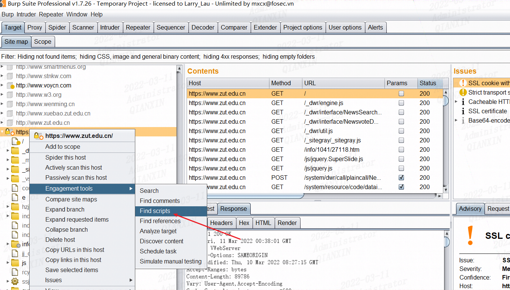
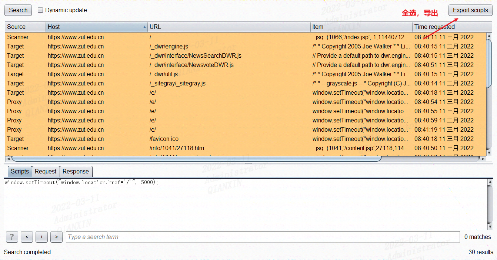
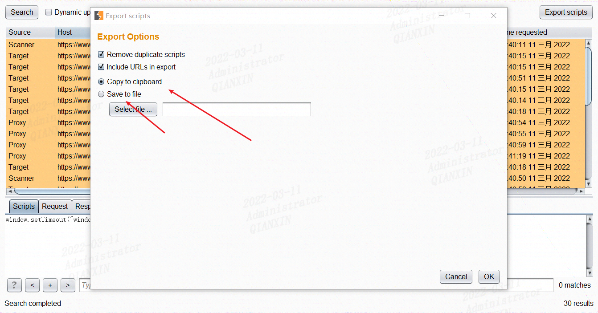
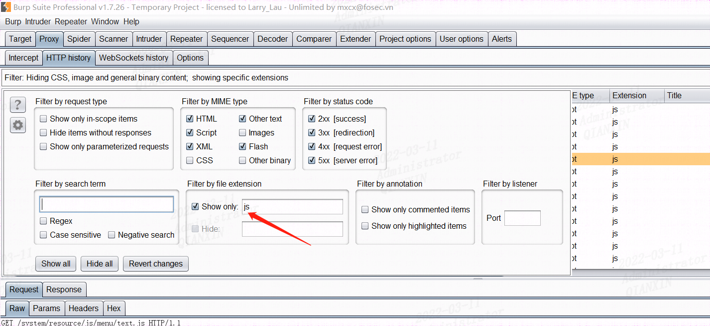
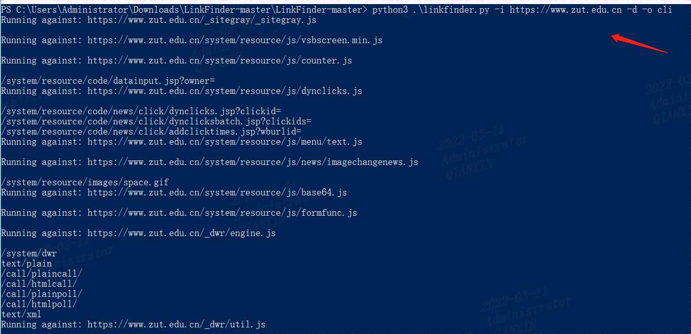
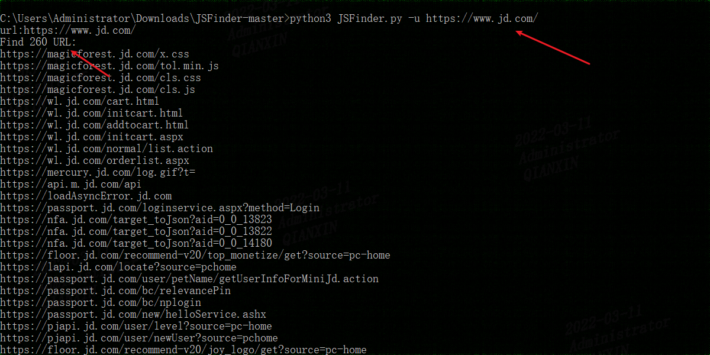
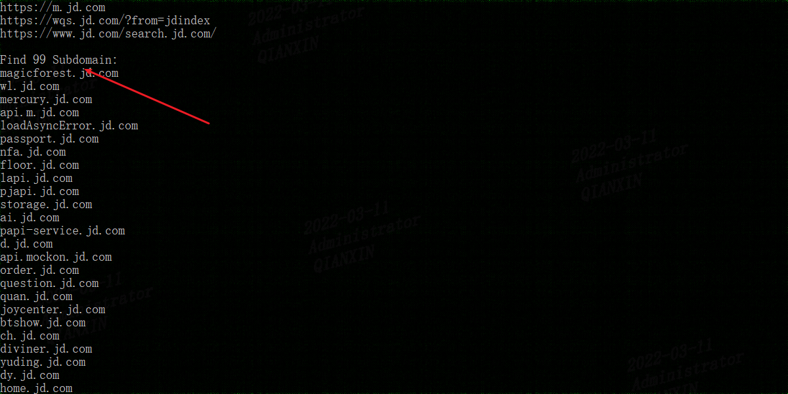
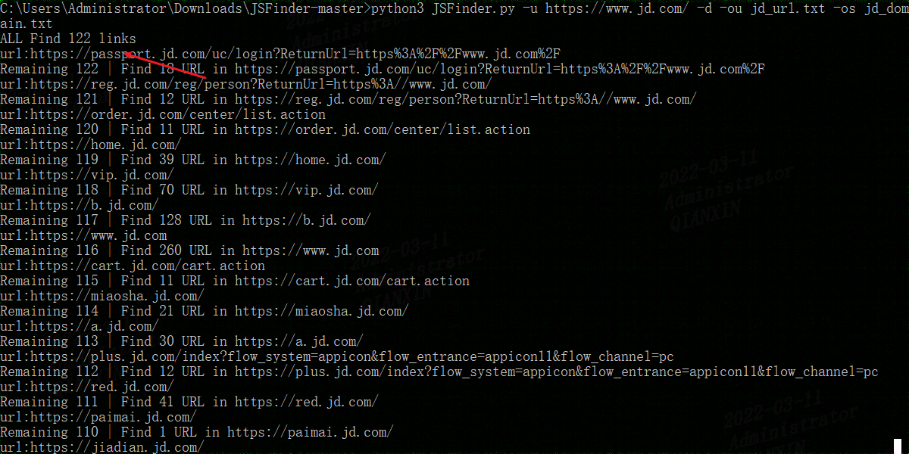

# js漏洞挖掘技巧


https://forum.butian.net/share/1441

第二点就是如何找接口，通过ctrl+F搜索path: '，就能看到他的路由配置或者直接搜routes或者home以及url,ajax,path等。

还有就是有的js下面会配置POST包或者GET包参数，如果POST就是data，GET就是params，不像这次这么简单直接访问就把参数补齐了


# 一些工具

## burpsuite

使用bp专业版可以对目标做脚本探针





可以复制，也可以将所有js导出到本地文本




另外对主页或者功能点等浏览过后，在HTTP history这里也可以过滤js文件



## LinkFinder

https://github.com/GerbenJavado/LinkFinder

python3环境

```bash
python3 linkfinder.py -i https://www.zut.edu.cn -d -o cli
```




## JsFinder

https://github.com/Threezh1/JSFinder

python3环境

简单爬取：

```
python3 JSFinder.py -u https://www.jd.com/
```





深度爬取：

```
python3 JSFinder.py -u https://www.jd.com/ -d -ou jd_url.txt -os jd_domain.txt
```

结果保存到本地



