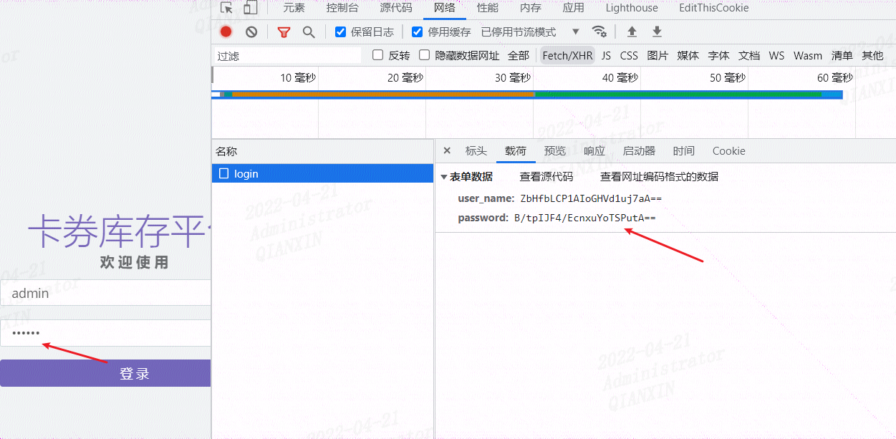
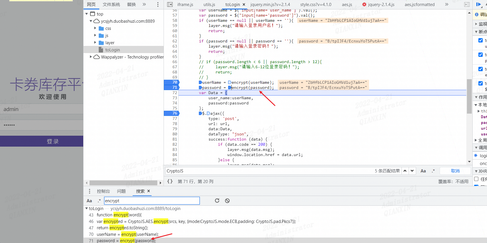
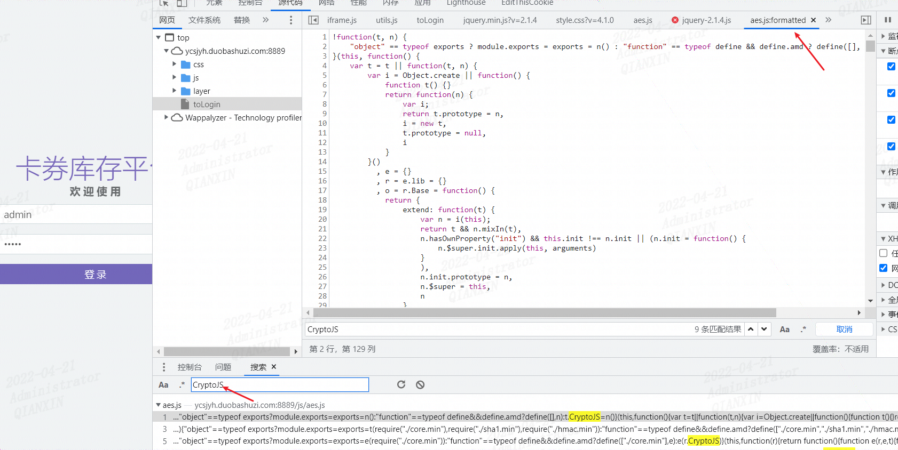
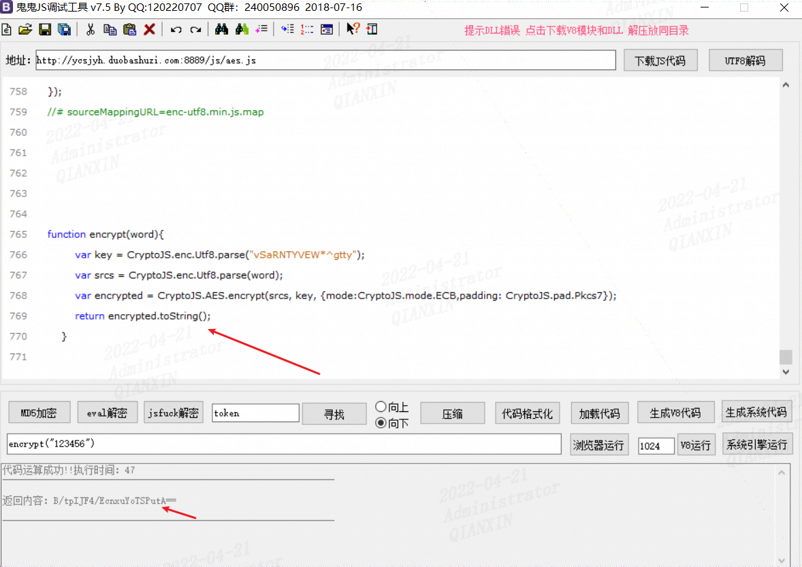
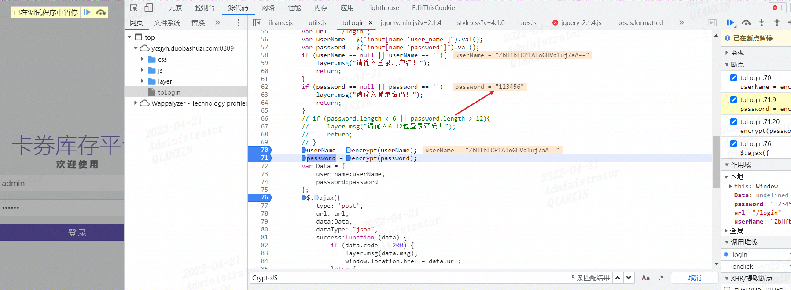
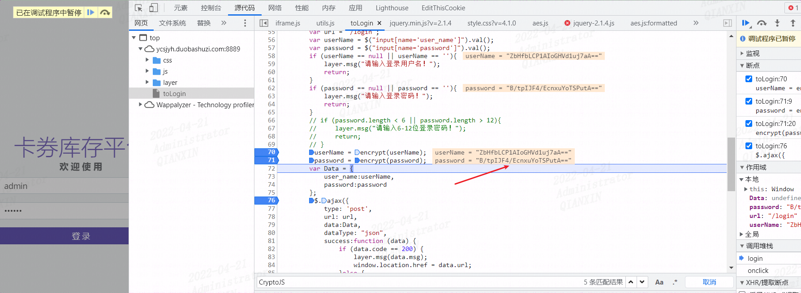
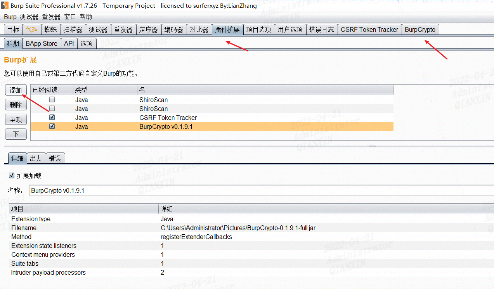
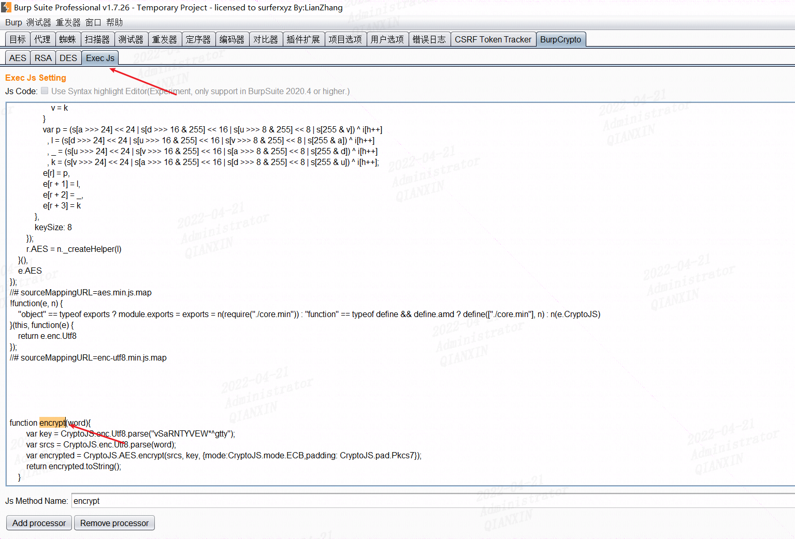
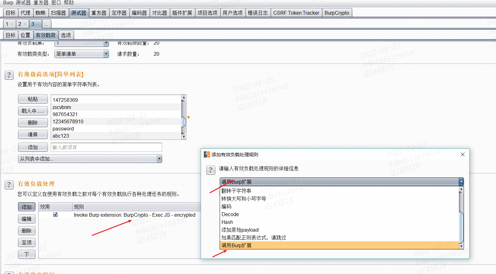
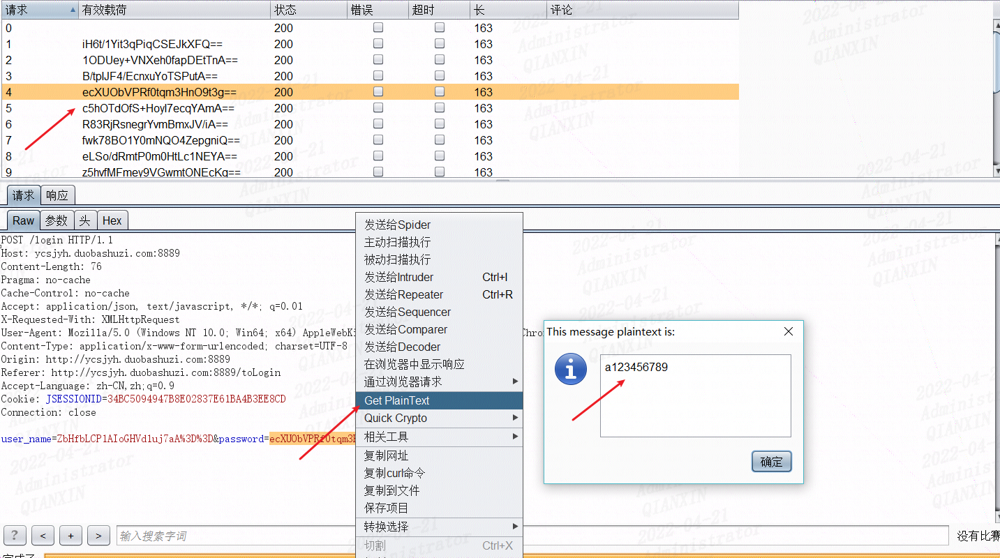

# 前言

当我们在做渗透测试时候，有时候经常会遇到登录位置进行了加密，通过普通的md5解密等是没办法解密的，开发者为了保护传输数据不被窃取，通常会自定义一些加密算法进行加密传输，如下：

访问系统http://ycsjyh.duobashuzi.com:8889/toLogin

发现用户名和密码都进行了加密，通过普通的base64解码是无法解码的

# js逆向分析

需要定位到加密函数，打断点

Crtl+Shift+F定位到加密函数encrypt

搜索CryptoJS，定位到aes.js文件（直接在本地执行encrypt函数，会提示缺少CryptoJS）

将aes.js代码加载到js调试工具，然后再添加调用函数，调试执行没问题

同加密函数结果一致

# BurpCrypto

借助一下burpSuite的插件BurpCrypto进行爆破，地址https://github.com/whwlsfb/BurpCrypto

参考https://mp.weixin.qq.com/s/gqB5pHS1t3L8mtyqOQBZBA

先在burpSuite添加一下插件

将前面js工具里的js内容复制到Exec Js

添加即可

然后爆破模块里加载该加密规则即可

爆破即可，当爆破出密码时候，可以找到对应的明文

