# 1、类和对象基础

```php
<?php
	header("Content-Type:text/html;charset=utf-8");
	
	//类
	class Person{
		//属性
		public $name="人";
		public $age= 20;
		public $food = "食物";

		//方法
		public function eat(){
			echo $this->name."吃".$this->food;
		}
		public function sleep(){
			echo "睡觉";
		}
		public function add($a,$b){
			echo $a+$b;
		}
	}	

	$xiaoming = new Person();

	$xiaoming->name = "小明";
	$xiaoming->food = "鸡肉";
	$xiaoming->eat();
	echo "<br/>";
	$xiaoming->sleep();
```

# 2、static和const关键词

static静态，修饰符，可以修饰属性和方法

==static属于类==，不再属于具体的某个对象

静态方法只能调用静态属性，不能调用普通属性

const 属性不能修改

```php
<?php
	header("Content-Type:text/html;charset=utf-8");

	class Person{
		//属性
		//public	protected 	private 
		const PI = 3.1415926;
		public $name ="人";
		public $food ="肉";
		static public $location = "地球";

		//方法
		public function eat(){
			echo $this->name."吃".$this->food;
		}
		static public function sport(){
			echo "运动";
			echo Person::$location;
		}
		public function testConst(){
			echo Person::PI;
		}
	}

	//对象	类实例化为对象
	Person::$location ="火星";
	echo Person::$location;

	$x = new Person();
	echo $x::$location;

	//Person::$location调用和$x::location效果一样，推荐使用类::属性调用。

	$y =new Person();
	echo $y::$location;

	Person::sport();
	echo "<br/>";

	$a = new Person();
	echo $a->testConst();

?>
```

# 3、类的继承

## 构造函数&析构函数

==构造函数__construct()==

只要实例化对象，就会调用构造方法（实例化一次，调用一次）

主要是为了属性初始化赋值

==析构函数__destruct()==

构造函数相反，当对象结束其生命周期，如对象所在的函数已调用完毕时，系统自动执行析构函数（实例化一次，调用一次）。

```php
<?php
	header("Content-Type:text/html;charset=utf-8");

	class Human{
		public $name;
		public $food;

		//构造方法
		public function __construct(){
			echo "这是构造方法<br/>";
		}

		public function eat(){
			echo $this->name."吃".$this->food."<br/>";
		}

		//析构方法
		public function __destruct(){
			echo "这是析构方法<br/>";

		}

	}

	$Batman = new Human();
	$Batman->name = "蝙蝠侠";
	$Batman->food = "牛排";
	$Batman->eat();


	$x = new Human();
	$Batman->name = "关羽";
	$Batman->food = "牛肉";
	$Batman->eat();
```

## 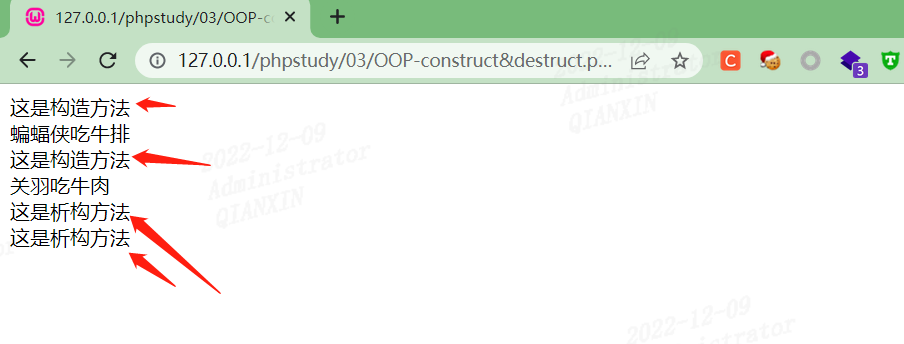继承

```php
<?php
	header("Content-Type:text/html;charset=utf-8");

	//继承
	// extends

	class Father{
		public function Money(){	
			echo "父亲有100000元";
		}
	}


	class Son extends Father{
		public function useMoney(){		//子类中重新定义方法
			echo "-1000元";
		}

		public function Money(){		//子类重写父类方法
			echo "5000元";
		}
	}

	$xiaoming = new Son();
	$xiaoming->useMoney();
	$xiaoming->Money();
```

访问修饰符

> public
>
> protected
>
> privite

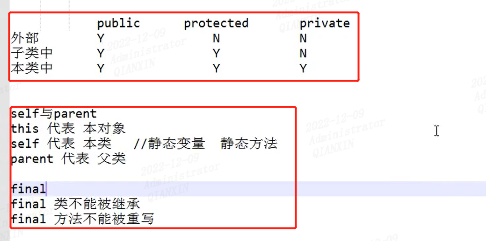

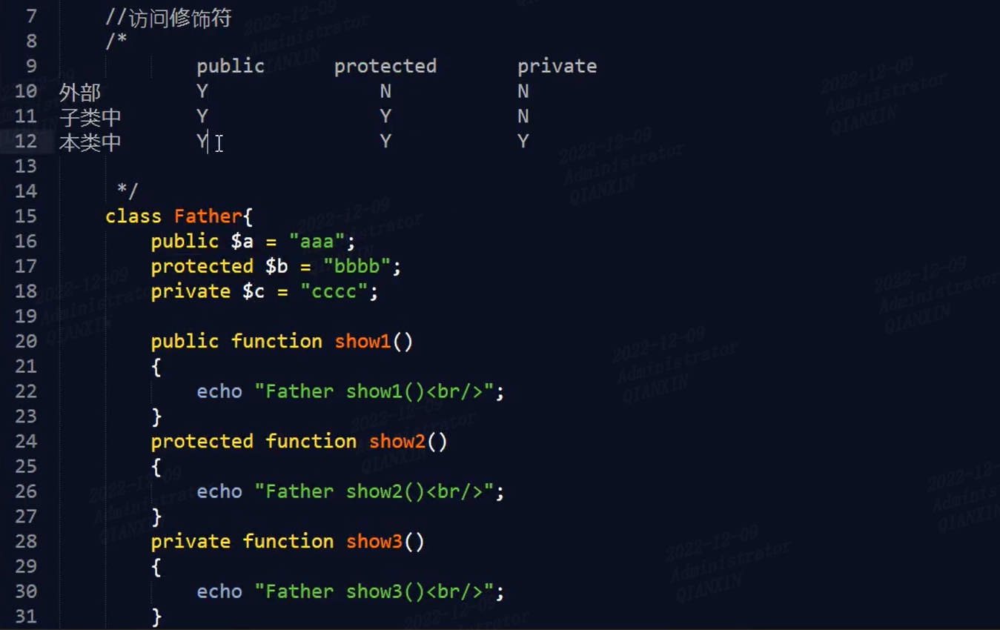

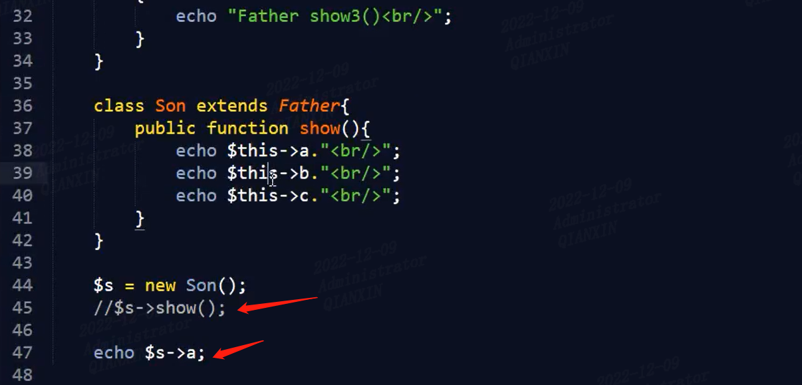

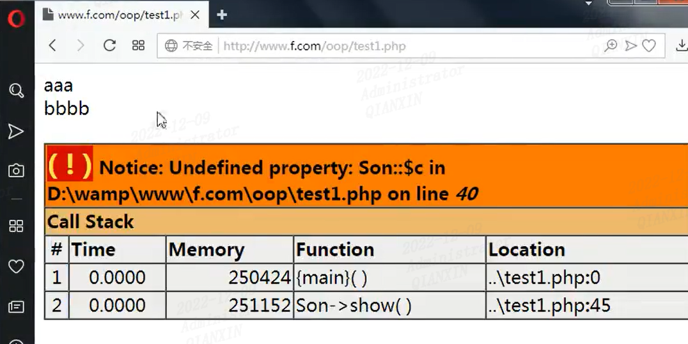


# 4、抽象类和接口

## 抽象类

抽象类语法：

> 类前要加abstract，则为抽象类
>
> 方法前也可以加abstract，则为抽象方法

> ==抽象方法没有方法体==
>
> 抽象类中也可以有已经实现的方法，但只要有一个方法为抽象，则类仍为抽象的
>
> ==抽象类不能实例化==


以下自己理解：

> 1、因为类比较抽象，所以没办法实例化（联想到樵夫讲java抽象图）
>
> 2、但是抽象类可以通过继承来实现
>
> 3、接口类似于抽象类，同样接口也可以实现，可以理解为固定一个标准，专门让调用实现的


这是网上找的一些细节：

https://www.jb51.net/article/249266.htm

> - 抽象类不能被实例化
> - 抽象类不一定要包含abstract方法。也就是说,抽象类可以没有abstract方法
> - 一旦类包含了abstract方法,则这个类必须声明为abstract
> - 抽象方法不能有函数体
> - 如果一个类继承了某个抽象类，则它必须实现该抽象类的所有抽象方法.(除非它自己也声明为抽象类)

应用场景：

> 在实际开发中，我们可能有这样一种类,是其它类的父类，但是它本身并不需要实例化,主要用途是用于让子类来继承(规定子类)，这样可以到达代码复用. 同时利于项目设计者来设计类。

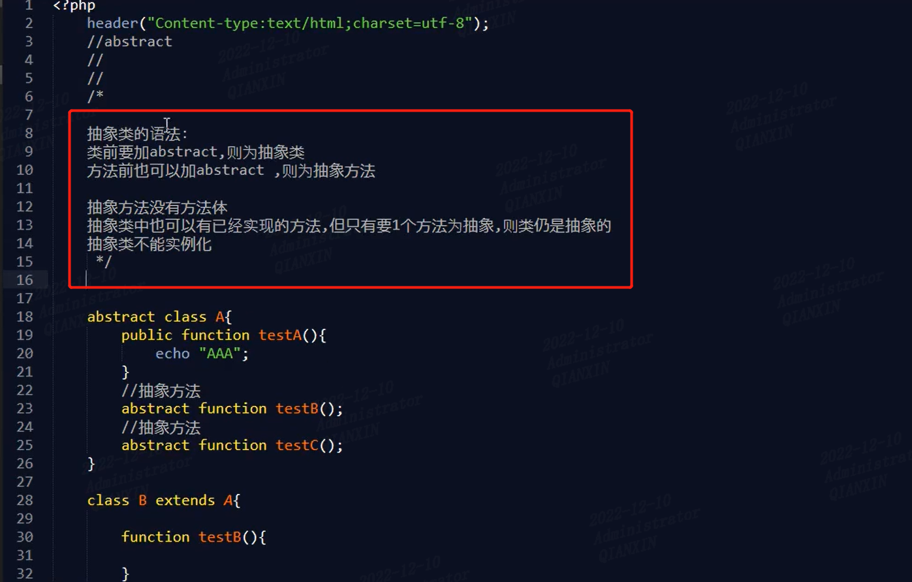

```php
<?php
	header("Content-Type:text/html;charset=utf-8");

	abstract class A{

	 	//普通方法
		public function testA(){
			echo "AAA";
		}

		// //抽象方法，抽象方法没有方法体
		// abstract public function testB();
	}

	class B extends A{
		function testB(){
			echo "testB打印";
		}
	}

	// $a = new A();   //本行会报错，因为抽象类不能被实例化

	//所以通过定义一个子类，把抽象类具体化，来实现抽象类（这里是把子类实例化）
	$b =new B();
	echo "<br/>";
	$b->testA();
	echo "<br/>";
	$b->testB();

```

## 接口

> 接口本身就是抽象的，方法前不用加abstract
> 接口里的方法，只能是public
> 类可以同时实现多个接口


总结：
==抽象类：相当于一类事物的规范。==
==接口：相当于组成事物零件的规范。==

```php
<?php
	header("Content-Type:text/html;charset=utf-8");
	//interface

	interface testA{
		public function A($number1,$number2);
	}
	interface testB{
		public function B();
	}

	class C implements testA,testB{
		public function A($number1,$number2){
			return $number1+$number2;
		}

		public function B(){}
	}

	$d =new C;
	echo $d->A(1,2);

```


# 5、单例模式

单例模式

> 1、只用一个对象
> 2、类不允许继承

常见用于调用MySQL数据库时

```php
<?php
	header("Content-Type:text/html;charset=utf-8");
	//单例模式
	// 只用一个对象
	// 类不允许继承

	final class Mysql{
		public $rand;
		static public $single;
		private function __construct(){
			$this->rand = rand(1000,9999);
			echo $this->rand."<br/>";
		}

		static public function getInstance(){
			if (is_null(self::$single)) {
				self::$single = new Mysql();
			}
			return self::$single;
		}
	}

	$A =Mysql::getInstance();
	$B =Mysql::getInstance();

	var_dump($A);
	var_dump($B);
```

额外记一下this和self关键字的区别

> 1、==self代表类==，==\$this代表对象==
> 2、能用\$this的地方一定使用self，能用self的地方不一定能用\$this
> 3、静态的方法中不能使用\$this，静态方法给类访问的


# 6、OOP实现mysqlDB类

学习之前复习一下前面基础

这里没有用==mysqli_connect()函数==，而是使用通过==mysqli类==创建实例化对象

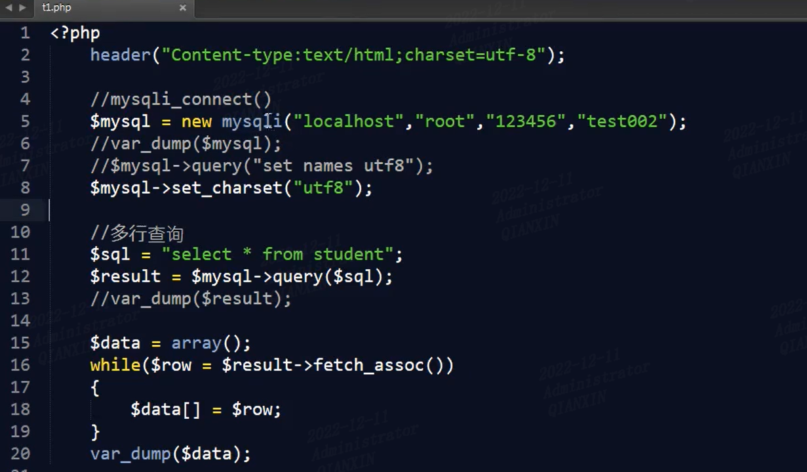

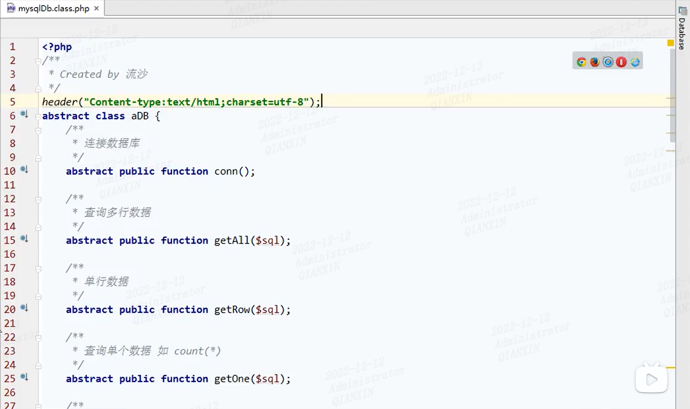

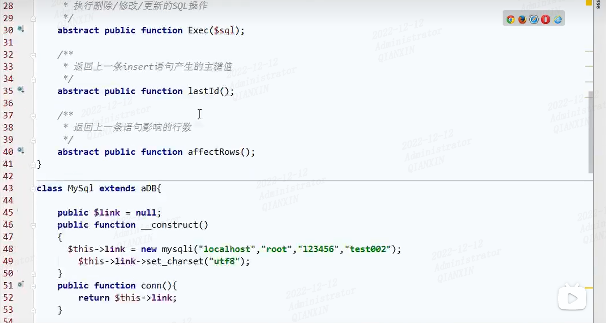

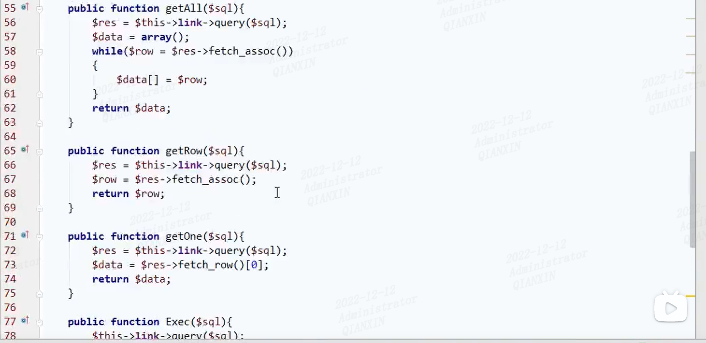

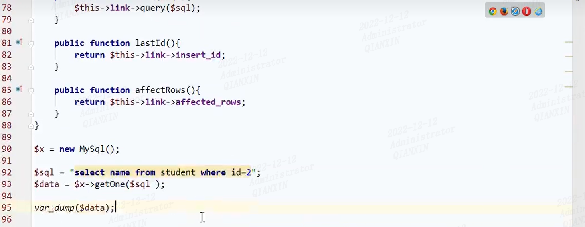

# 7、PDO详解

主要是为了防止sql注入，最强大的预处理功能

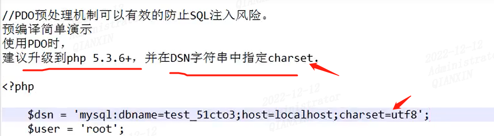

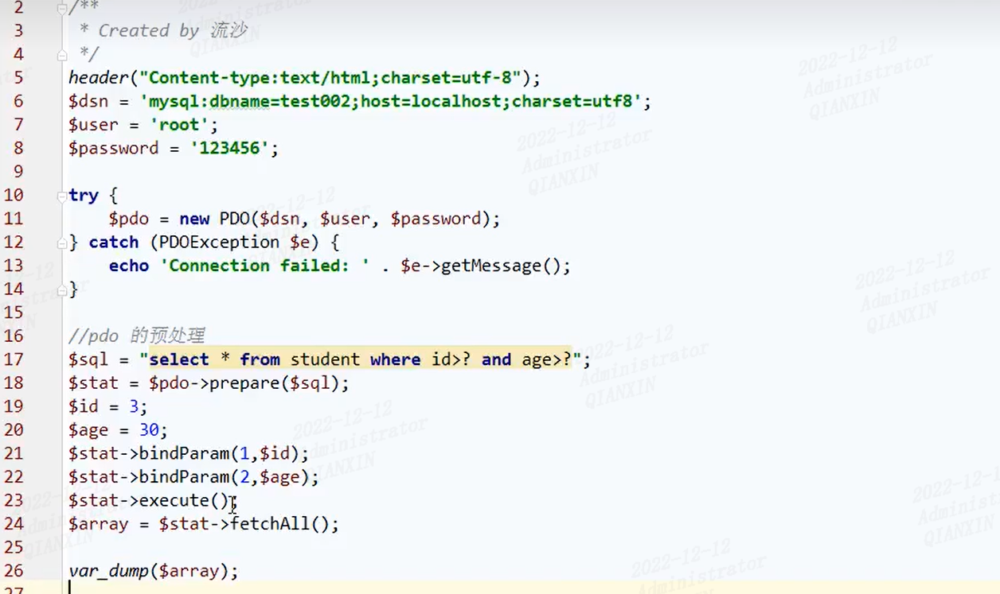