一些代码审计心得：

## sql注入

​	addslashes()
​	使用反斜线引用字符串，防注入
​	

​	mysql_real_escape_string()
​	在以下字符前添加反斜杠: `\x00`, `\n`, `\r`, `\`, `'`, `"` 和 `\x1a`.

==宽字节注入==

应用条件：

1、开启魔术引号，使用了转义函数，将、POGETST、cookie传递的参数进行过滤，将单引号、双引号、null等敏感字符用转义符 \ 进行转义

2、数据库采用gbk编码格式

我们发现反斜线“\”的编码是%5c，然后我们会想到传参一个字符想办法凑成一个gbk字符，例如：“運”字是%df%5c

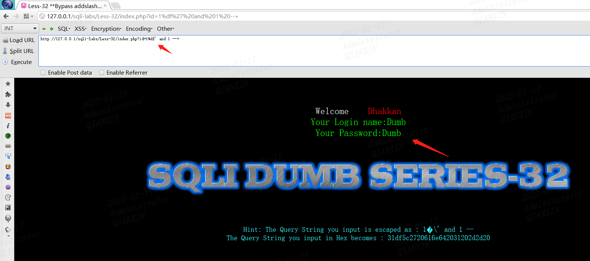

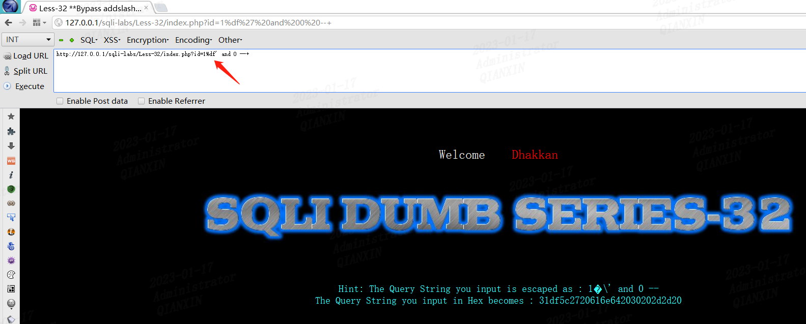

## xss

​	htmlspecialchars()
​	将特殊字符转换为 HTML 实体，防xss

## 文件包含

​	一般是查找include关键字，查看是否有include()或者include_once()函数
​	需要注意，当查到对应函数时，该函数前需要有动态变量传参才行

### 介绍5种拿webshell的方法

#### 本地文件包含

1、上传图片一句话马，通过文件包含拿webshell

如：头像上传处

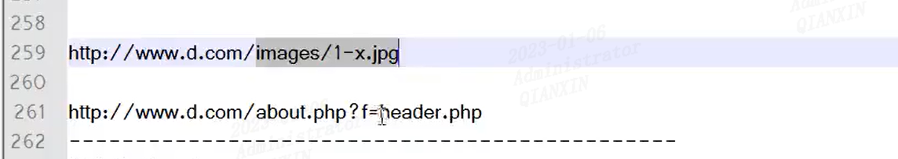

2、包含访问日志写入一句话拿webshell

首先爆出错误绝对路径，通过分析服务器文件目录，猜测日志路径

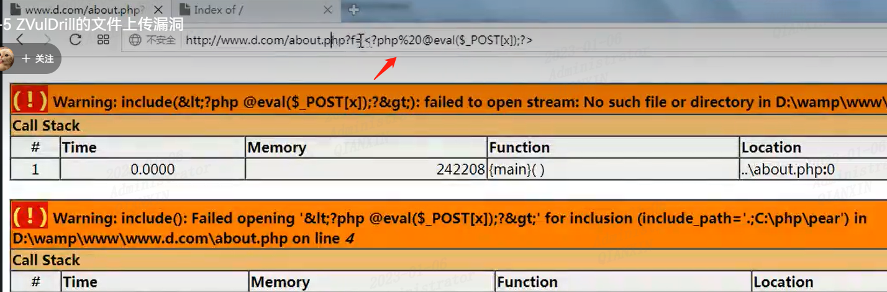

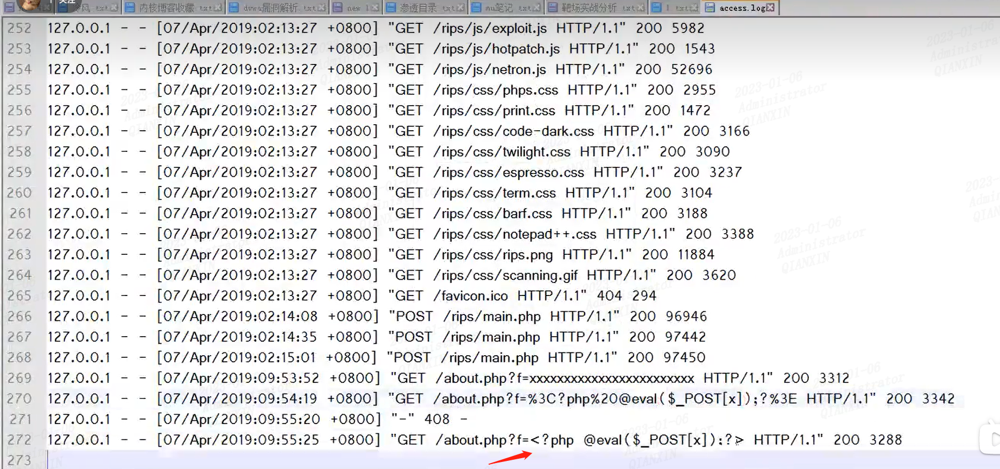

如果浏览器转码的话，可能需要抓包，修改为原始的，如果是服务器端过滤尖角号之类的，可以尝试加`绕过

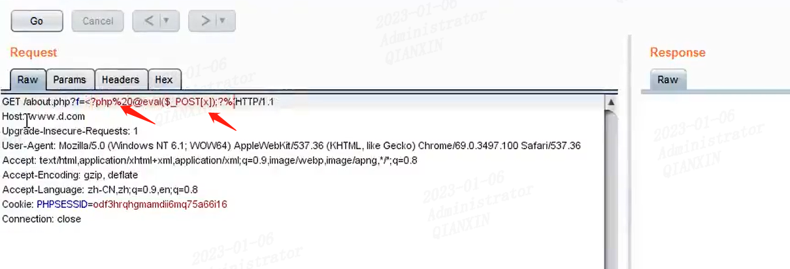

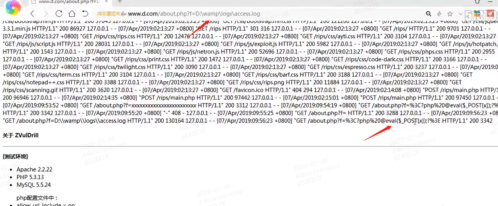

3、通过伪协议拿webshell

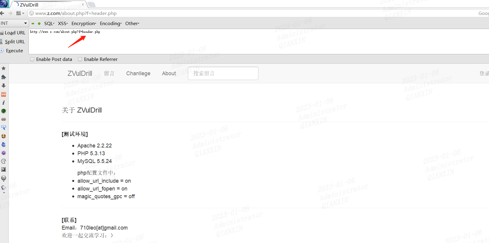

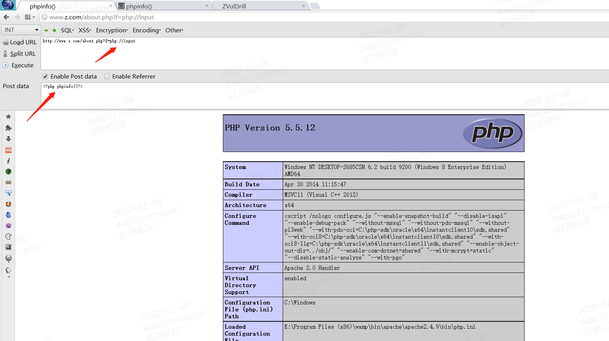

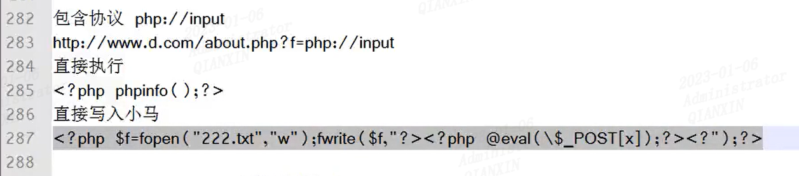

#### 远程文件包含

条件：需要allow_url_fopen=On 并且 allow_url_include=On

4、直接远程包含自己vps的一句话

5、如果后面默认添加.php后缀，可以尝试使用%23 #等截断

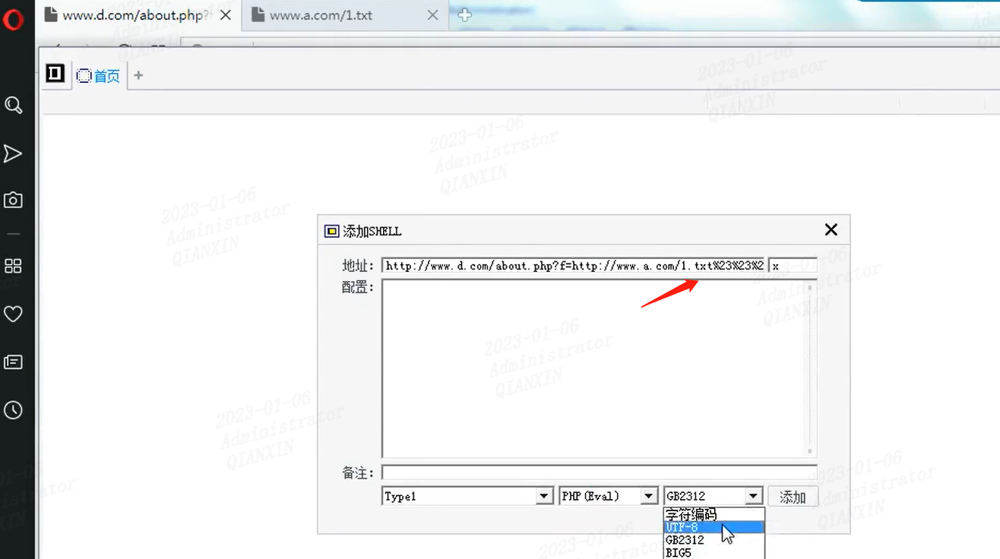

php伪协议

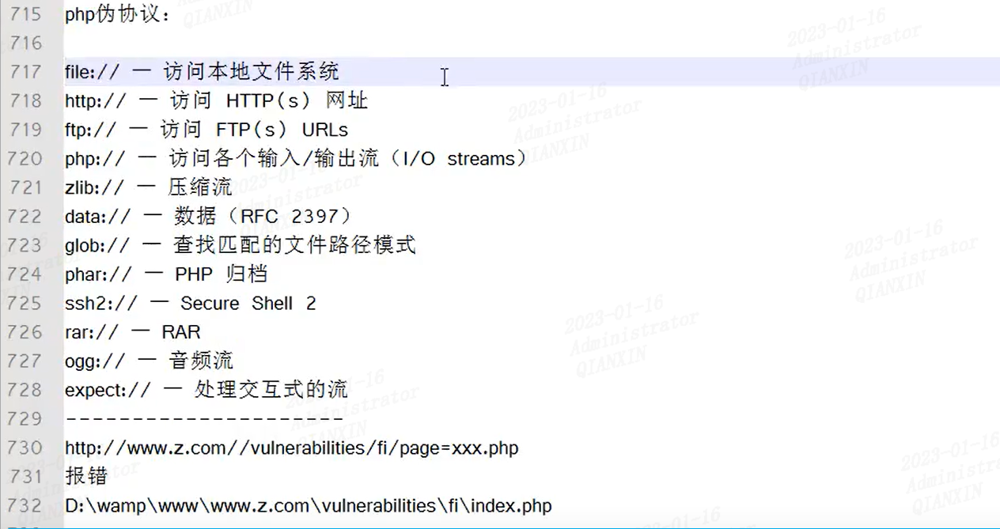

dvwa高等级，可以通过报错日志，猜测日志存放路径，然后通过访问路径一句话木马（需要抓包修改url编码问题），然后文件包含access日志拿webshell

如：

> http://www.d.com/vulnerabilities/fi/? &page=file://D:/wamp/logs/access.log

