## 0x01环境

- xhcms_v1.0源码

- windows 10

- phpstudy2016（php 5.2）

- seay源代码审计系统

      

## 0x02漏洞列表

### 1、文件包含

使用seay源代码审计到index.php可能存在文件包含漏洞

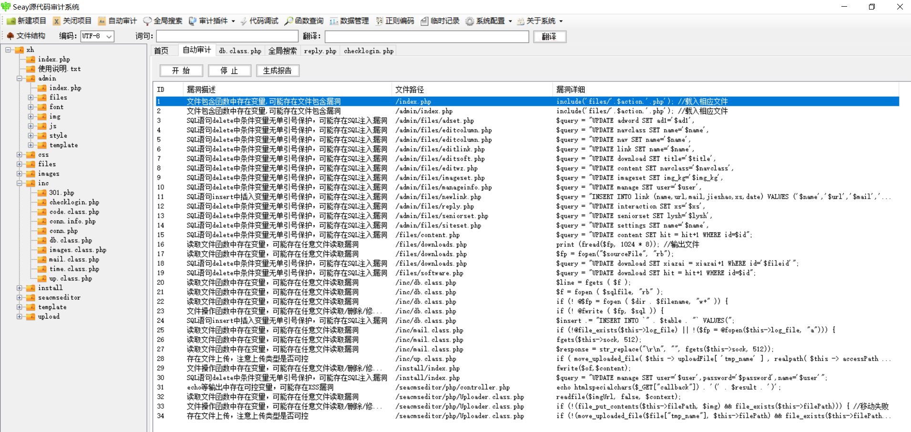

分析index.php文件，传递r变量

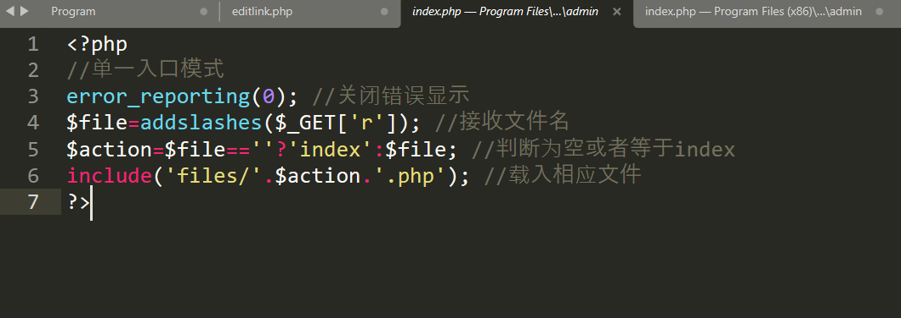

这里顺带说一下**三目运算符**

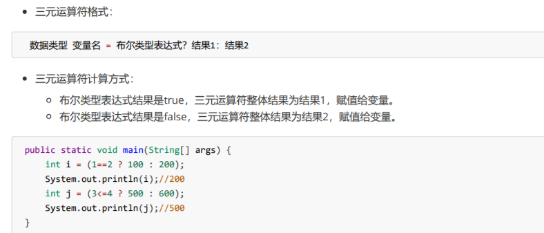

> **绕过方法1：%00 截断**
>
> 条件：magic_quotes_gpc = Off，PHP版本<5.3.4
>
> **绕过方法2：路径长度截断**
>
> 条件：windows 下目录路径最大长度为256字节，超出部分将丢弃；linux 下目录最大长度为4096字节，超出长度将丢弃；PHP版本<5.2.8

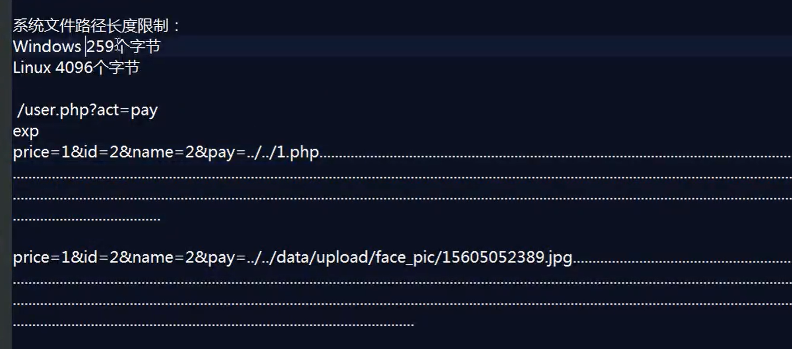

在网站根目录写一个1.php的文件，打印echo 111;

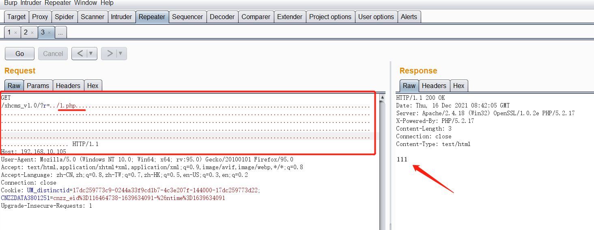

由于这里拼接后缀名是php，此处页可以不加后罪名php，也可以实现

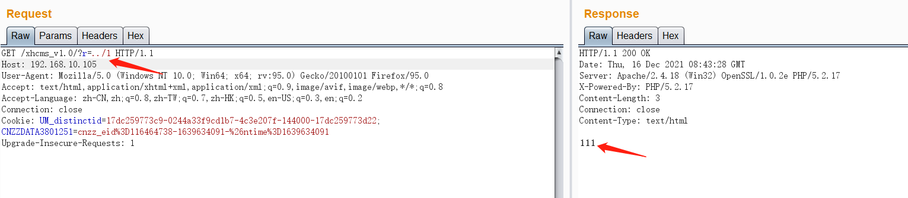

### 2、XSS跨站

如果是前端js验证，首先输入正确的文件类型或者格式，再通过burpsuite抓包修改成需要的xss

一般是注册位置或者修改资料等，这里在留言处抓包

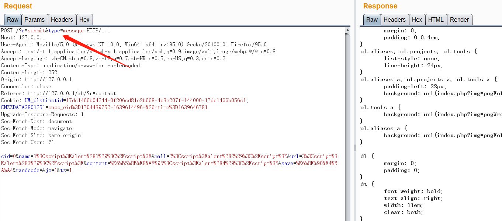

通过post提交数据，定位提交到files/submit.php文件，再次定位到message参数

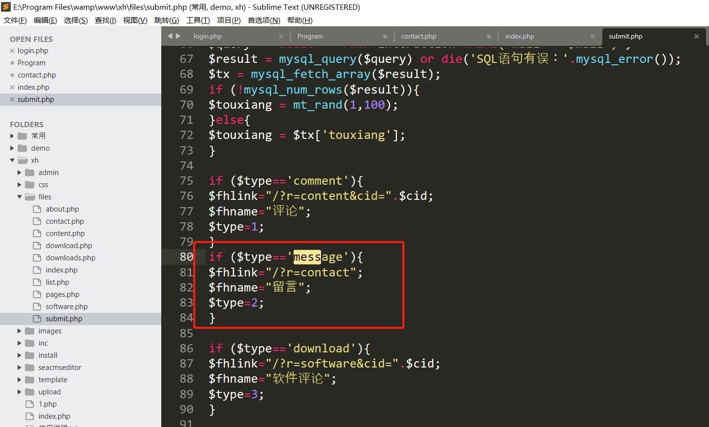

通过一番查看，未发现过滤，进行xss测试

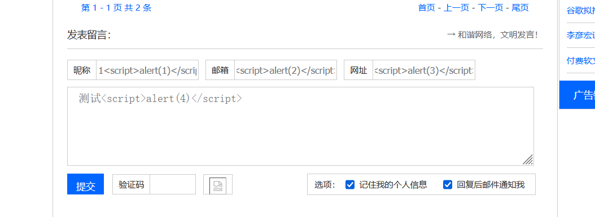

环境问题这里未实现弹窗，正常是可以弹窗的。。。

### 3、越权漏洞

通过审计发现checklogin.php存在一个垂直越权漏洞：

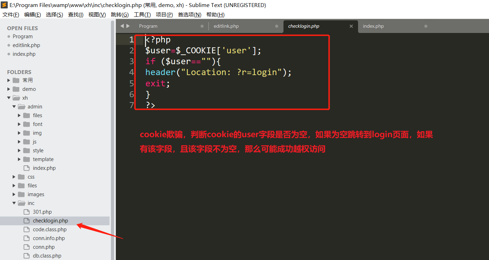

使用firebar新建一个user字段你的cookie

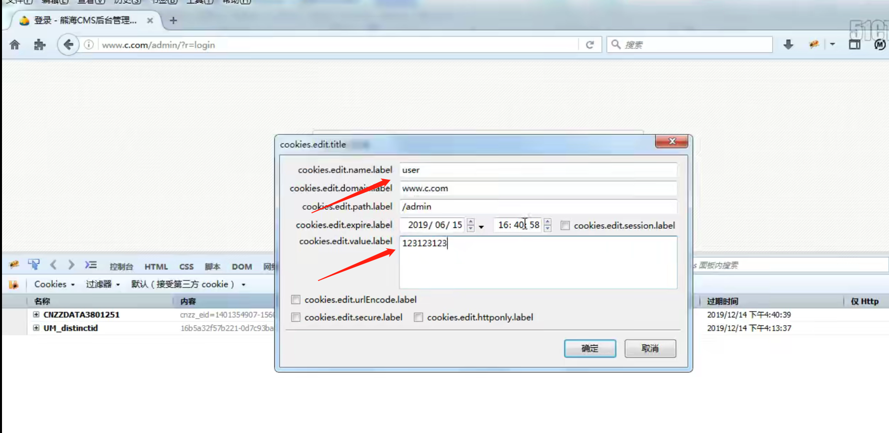

如访问http://127.0.0.1/xh/admin/?r=newwz ，该页面是登录才可以访问的页面，此时通过添加cookie的user字段，即成功越权登录

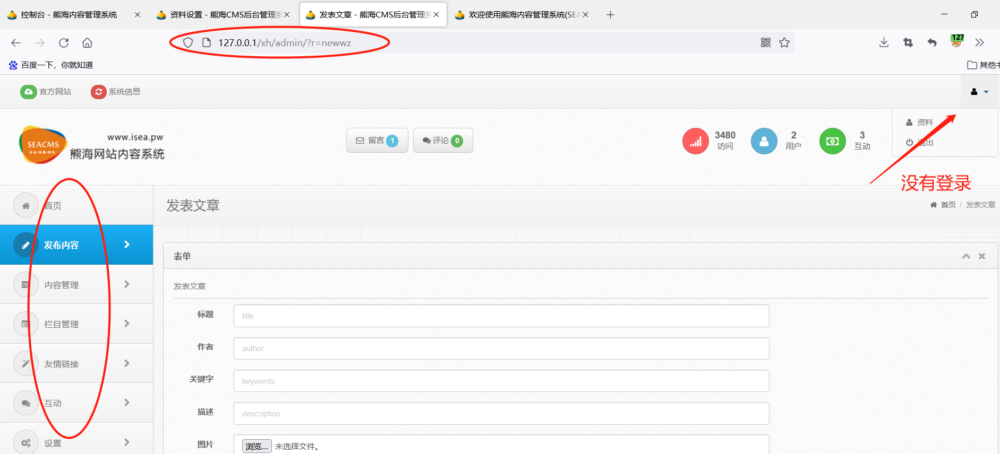

### 4、报错注入

登录位置存在报错注入

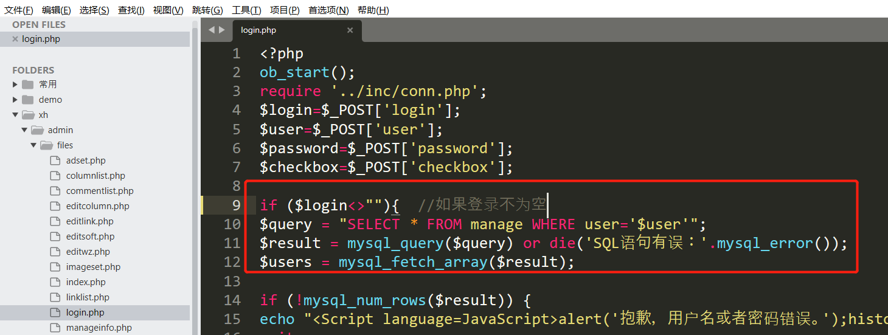

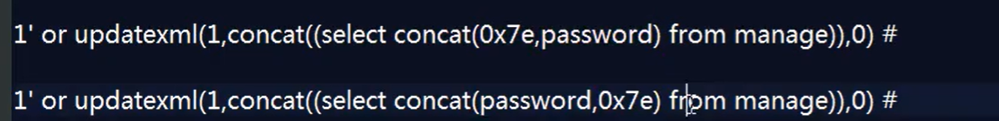

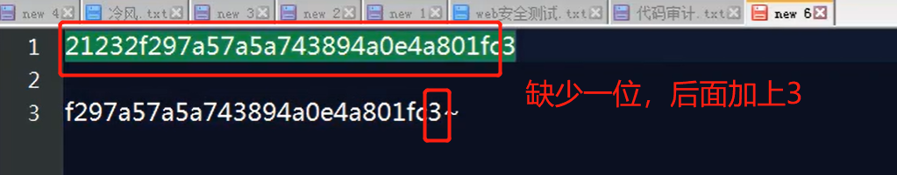

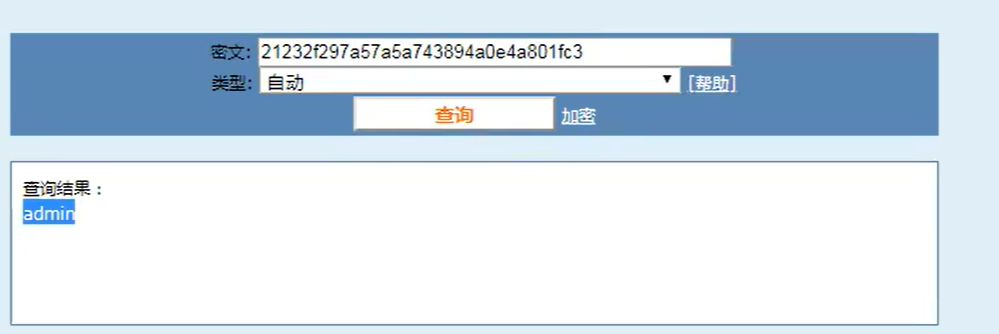

参考：

https://www.cnblogs.com/wkzb/p/12805100.html

https://www.cnblogs.com/richardlee97/p/10600103.html