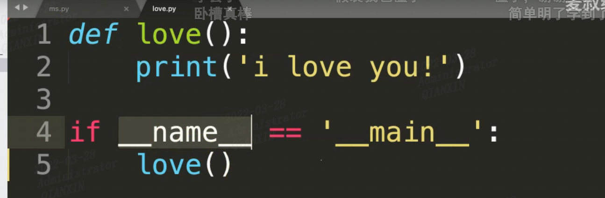
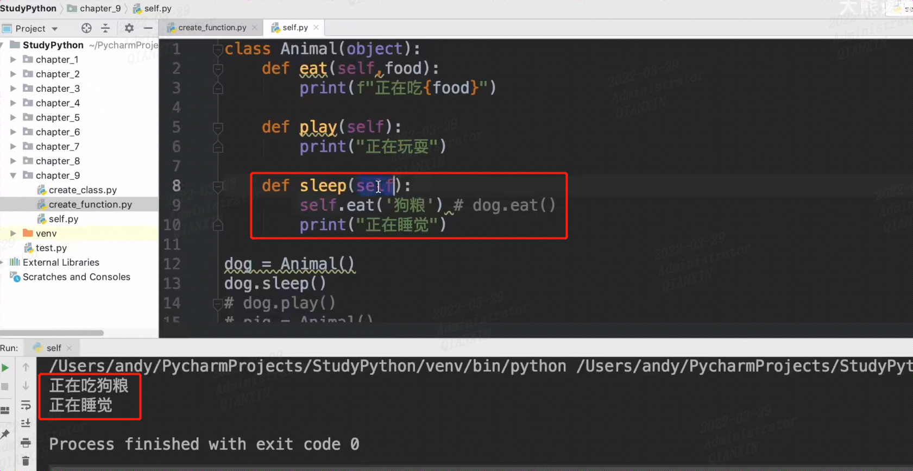
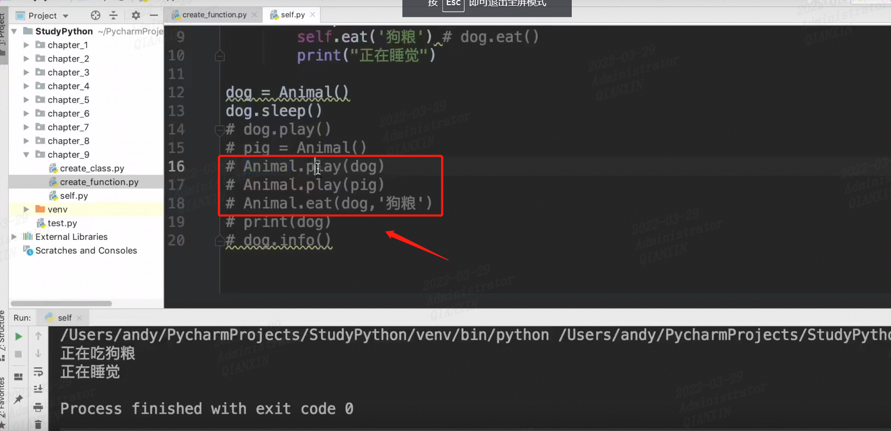
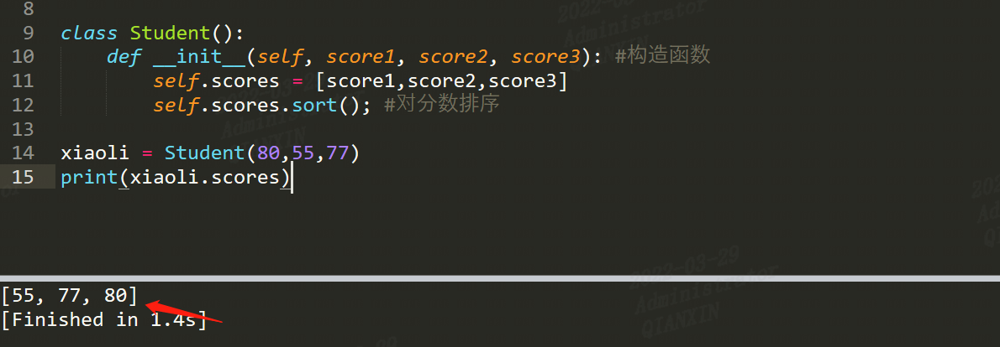
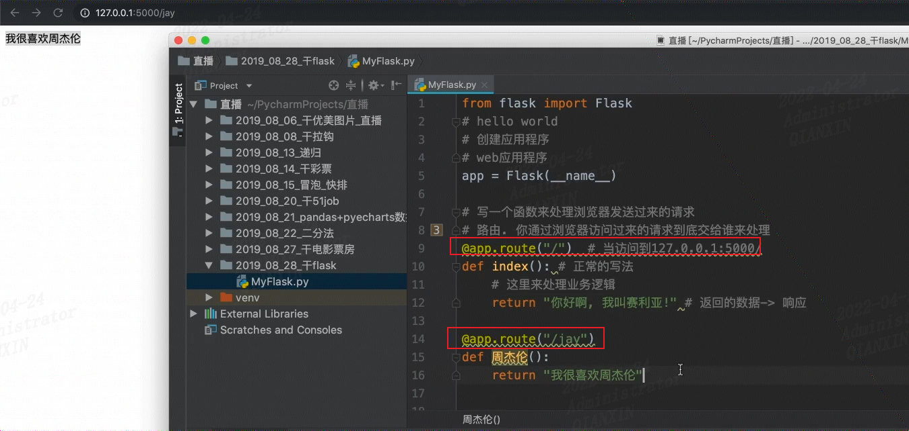

# \__name__ == '\_\_main__'

https://www.bilibili.com/video/BV1T7411v7n8/

其中第4行，if后面的内容，当在该文件中执行，当其它文件调用该文件的时候，则不执行if后面的内容

# self用法

https://www.bilibili.com/video/BV1rB4y1u7mT

类的方法里必须有self，不然会报错；==self代表的是当前类实例化后对应的对象==。

这里通过类的实例对象进行调用方法

另外也可以直接使用类来调用，不过方法中需要有创建的对象。这种比较麻烦，一般不这样调用。

# 魔法函数

所谓魔法函数（Magic Methods），是Python的一种高级语法，允许你在类中自定义函数（函数名格式一般为__xx__），并绑定到类的特殊方法中。比如在类A中自定义__str__()函数，则在调用str(A())时，会自动调用__str__()函数，并返回相应的结果。在我们平时的使用中，可能经常使用**`__init__函数`（构造函数）**和**`__del__函数`（析构函数）**，其实这也是魔法函数的一种。

- Python中以双下划线(__xx__)开始和结束的函数（不可自己定义）为魔法函数。

说到最后，`__init__`还是有个特殊之处，那就是它**不允许有返回值**。如果你的`__init__`过于复杂有可能要提前结束的话，使用**单独的`return`**就好，不要带返回值。

# 路由route

